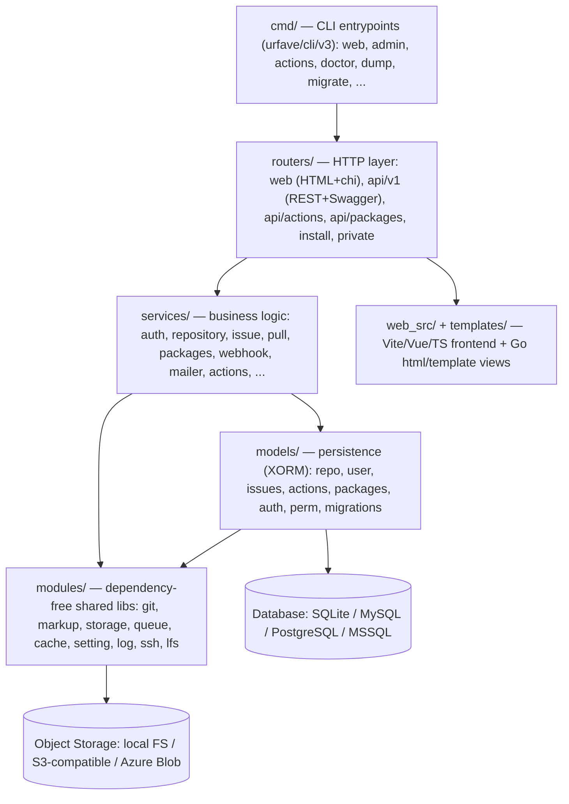
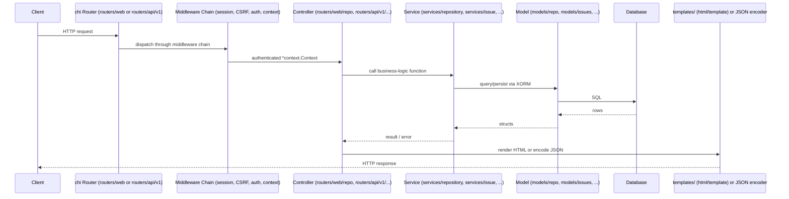
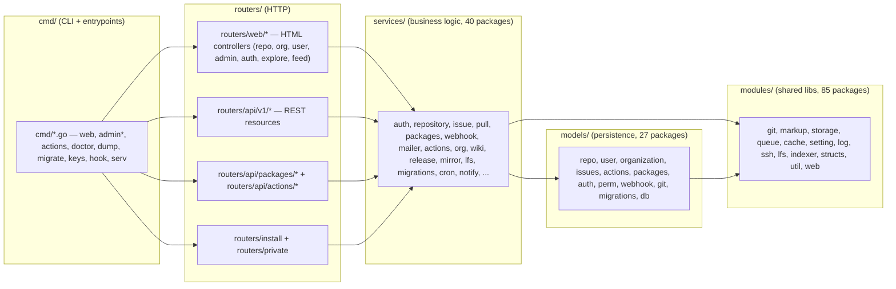

# Gitea — Technical Documentation Plan

## Executive Summary

Gitea is a lightweight, self-hosted, all-in-one software development platform written in Go
(module `gitea.dev`, `go 1.26.4`). It bundles Git hosting, code review (pull requests), issue
tracking, project boards (kanban), a wiki, organizations/teams, a multi-ecosystem package
registry, CI/CD (Gitea Actions — GitHub-Actions-workflow-syntax compatible), webhooks, and a
REST/Swagger API into a single self-contained binary that can run against SQLite, MySQL,
PostgreSQL, or MSSQL. The backend follows a `cmd → routers → services → models → modules`
layering (Go), while the frontend is a hybrid of server-rendered Go `html/template` views
progressively enhanced with TypeScript, Vue 3, and Vite-bundled assets (`web_src/`), styled with
Tailwind + Fomantic UI.

This documentation effort produces (and, where already begun, extends/hardens) a Markdown-based
technical wiki under `docs/`, auto-converted to a searchable HTML wiki with sidebar navigation.
Exploration confirmed that a substantial amount of scaffolding and content already exists under
`docs/01-introduction/` through `docs/22-contributing-development/` plus `docs/build-cicd-deployment/`
and nine supplementary root-level pages (`docs/build-setup.md`, `build-source.md`,
`community-governance.md`, `development.md`, `guidelines-backend.md`, `guidelines-frontend.md`,
`guidelines-refactoring.md`, `release-management.md`, `testing.md`). However, five sections are
currently **thin pointer pages with only a `README.md` stub and no substantive sub-pages**:
`10-git-integration/`, `16-webhooks-integrations/`, `17-notifications/`, `18-admin-guide/`, and
`19-cli-commands/`. This plan's execution phases (a) verify and, where needed, deepen every
existing section with any gaps discovered against the current source tree, (b) fully build out
the five thin sections into real, substantive documentation instead of pointer-only stubs, (c)
adds explicit coverage for areas not previously called out individually — the `routers/api/*`
subtree (`v1`, `packages`, `actions`), the `web_src/js/components|features|modules|render|utils`
frontend subtree, and a full catalog of the 85 `modules/*` and 40 `services/*` packages — and
(d) rebuilds the top-level wiki index/navigation once everything is confirmed present on disk.
All deliverables are Markdown (`.md`) files under `docs/`, using GitHub-flavored Markdown
(headings, fenced code blocks, tables, and ```mermaid diagram blocks); these are automatically
converted to a styled, searchable HTML wiki in post-processing — authors do not need to write
HTML directly.

## Project Overview — Investigation Results

### System Metrics

- **Total repository footprint (pre-scan):** 445 files sampled at depth-3, 285 directories,
  ~14 MB of tracked source in the scanned slice (full repo is much larger — Go backend alone
  spans `cmd/` (~55 files), `models/` (27 subpackages), `modules/` (85 subpackages),
  `routers/` (6 subtrees: `api`, `common`, `install`, `private`, `utils`, `web`),
  `services/` (40 subpackages), plus `templates/`, `web_src/`, `public/`, `options/`, `tests/`).
- **Languages:** Go 65 sampled files (backend, ~1M+ LOC across the full tree in reality),
  TypeScript 13 sampled files (`web_src/js`), plus Vue SFCs under `web_src/js/components`,
  YAML/YML 28+9 files (CI workflows, actions), Markdown 135 files (existing docs + root docs),
  HTML 120 files (already-rendered wiki pages — generated artifacts, not source), Shell 7,
  Jsonnet/Libsonnet 7 (Grafana monitoring mixin under `contrib/grafana-monitoring-mixin/`).
- **Module count:** `go.mod` module name `gitea.dev`, Go **1.26.4**; ~85 first-party packages
  under `modules/`, ~40 under `services/`, 27 under `models/`.
- **Frontend package manager:** `pnpm@11.9.0` (see `package.json`, `pnpm-workspace.yaml`,
  `pnpm-lock.yaml` — 304 KB lockfile), Node engine `>= 22.18.0`.
- **CI/CD surface:** `.github/workflows/` contains 15+ workflow files (`pull-db-tests.yml`,
  `pull-e2e-tests.yml`, `pull-docker-dryrun.yml`, `release-nightly.yml`,
  `release-nightly-snapcraft.yml`, `release-tag-rc.yml`, `cron-licenses.yml`,
  `cron-renovate.yml`, `cron-translations.yml`, `giteabot.yml`, `giteabot-backport.yml`,
  `files-changed.yml`, `pull-compliance.yml`, `pull-labeler.yml`, `cache-seeder.yml`, etc.) plus
  6 composite actions under `.github/actions/` (`docker-dryrun`, `free-disk-space`, `go-cache`,
  `go-setup`, `node-setup`, `pgsql-shard`).
- **Existing documentation state (as of exploration):** `docs/` already contains 22 numbered
  sections + `build-cicd-deployment/` + 9 supplementary root pages = ~445 md/html pairs total.
  Five sections are stub-only (`README.md` with a one-line pointer, no sub-pages):
  `10-git-integration`, `16-webhooks-integrations`, `17-notifications`, `18-admin-guide`,
  `19-cli-commands`. A separate, already-complete security-focused mini-wiki exists at
  `derived-docs/` (01-overview through 07-vulnerability-disclosure) — out of scope for this plan
  (different deliverable), but should be cross-linked, not duplicated.

### Technology Inventory

**Backend (Go):**
- Go **1.26.4** (`go.mod` module `gitea.dev`), `GOEXPERIMENT=jsonv2` for the JSON v2 library.
- HTTP routing: `github.com/go-chi/chi/v5`, `github.com/go-chi/cors`, `github.com/chi-middleware/proxy`.
- ORM/DB: XORM-family stack (models under `models/db`, `models/migrations`), drivers for SQLite
  (`github.com/mattn/go-sqlite3`), MySQL (`github.com/go-sql-driver/mysql`), PostgreSQL
  (`github.com/lib/pq`), MSSQL (`github.com/microsoft/go-mssqldb`).
- Git plumbing: `github.com/go-git/go-git/v5`, `github.com/go-git/go-billy/v5`,
  `github.com/42wim/sshsig`, `github.com/gliderlabs/ssh`, `github.com/charmbracelet/git-lfs-transfer`.
- Auth: `github.com/go-ldap/ldap/v3`, `github.com/markbates/goth` (OAuth2/social), `golang-jwt/jwt/v5`,
  `github.com/go-webauthn/webauthn` (WebAuthn/Passkeys), `github.com/pquerna/otp` (TOTP 2FA),
  `github.com/quasoft/websspi`/`Azure/go-ntlmssp` (Windows SSPI/NTLM), `github.com/msteinert/pam/v2` (PAM).
- Search/index: `github.com/blevesearch/bleve/v2`, `github.com/meilisearch/meilisearch-go`.
- Actions/CI: `gitea.com/gitea/runner`, `gitea.dev/actions-proto-go`, `connectrpc.com/connect`.
- Object storage: `github.com/minio/minio-go/v7`, `github.com/Azure/azure-sdk-for-go/sdk/storage/azblob`.
- Queues/cache: `gitea.com/go-chi/cache`, `github.com/redis/go-redis/v9`, `github.com/go-redsync/redsync/v4`,
  `gitea.com/lunny/levelqueue`.
- Markup rendering: built-in `modules/markup` + doc-type plugins registered in `main.go`
  (`markup/console`, `markup/csv`, `markup/jupyter`, `markup/markdown`, `markup/orgmode`).
- CLI framework: `github.com/urfave/cli/v3` (see `cmd/` — `admin.go`, `actions.go`, and 39+ more
  subcommand files) and `github.com/urfave/cli-docs/v3`.
- Metrics: `github.com/prometheus/client_golang`; profiling: `github.com/felixge/fgprof`,
  `github.com/google/pprof`.
- Package registry ecosystem clients: many format-specific libs (`sassoftware/go-rpmutils`,
  `blakesmith/ar`, `mholt/archives`, etc.) supporting `models/packages` + `services/packages`.

**Frontend (TypeScript/Vue):**
- Build: **Vite 8.1.3** (`vite.config.ts`, 30KB+ config using `esbuild`, `rolldown-license-plugin`,
  `vite-string-plugin`, Tailwind), `@vitejs/plugin-vue`.
- UI framework: **Vue 3.5.39** SFCs under `web_src/js/components`; state/interactivity in
  `web_src/js/features/*` (progressive-enhancement pattern) and `web_src/js/modules/*`.
- Editor: CodeMirror 6 (`@codemirror/*` packages) + EasyMDE for Markdown editing.
- Styling: Tailwind CSS 3.4.19 + Fomantic UI (`web_src/fomantic/`) + custom CSS (`web_src/css/`).
- Diagrams/rendering: `mermaid` 11.16.0, `chart.js`/`vue-chartjs`, `katex`, `asciinema-player`,
  `online-3d-viewer`, `swagger-ui-dist` (API docs UI).
- Testing: Vitest (`vitest.config.ts`), Playwright (`playwright.config.ts`, `@playwright/test`).
- Linting: ESLint 10 (`eslint.config.ts`, 52 KB config), Stylelint, djlint (Go template linting
  per `pyproject.toml`), yamllint, zizmor (GH Actions security linter).

**Infra/Deployment:**
- Docker: `Dockerfile` (rootful) + `Dockerfile.rootless`, multi-stage (`frontend-build` →
  `build-env` → `gitea` runtime on Alpine 3.24), s6-overlay supervision (`docker/root/etc/s6`).
- Packaging: Snapcraft (`snap/`), FHS-compliant script (`contrib/fhs-compliant-script/`), init
  scripts for systemd/sysvinit/OpenRC/FreeBSD/OpenBSD/launchd/SunOS/Supervisor
  (`contrib/service/*`).
- Monitoring: Grafana mixin (`contrib/grafana-monitoring-mixin/`, Jsonnet-based dashboards/alerts).
- Nix flake (`flake.nix`, `flake.lock`) and devcontainer (`.devcontainer/devcontainer.json`) for
  reproducible dev environments.
- Build orchestration: root `Makefile` (25 KB — `make backend`, `make frontend`, lint/test
  targets, cross-compilation via `xgo`), `BSDmakefile` wrapper.

### Architecture Overview

Gitea's backend follows a strict, enforced (via `guidelines-backend.md`/import-linting) layered
architecture. Presentation is split between the HTML web UI and the JSON REST API, both funneled
through `chi` routers registered in `routers/init.go`. Business logic lives in `services/*`,
which orchestrates persistence in `models/*` (XORM-backed) and cross-cutting, dependency-free
utilities in `modules/*`. The CLI (`cmd/*`) is a thin adapter that also boots the same
`routers`/`services` stack for `gitea web`, or drives standalone admin/CLI logic for others.



Request handling in the web UI layer flows through a middleware chain (session, CSRF, auth
context, i18n, per-repo context) before reaching a controller in `routers/web/*`, which calls
into `services/*`, which reads/writes via `models/*`, and finally renders a Go `html/template`
from `templates/` (progressively enhanced by `web_src/js`) or returns JSON for API routes.



Module dependency direction is one-way and enforced by convention/lint: `modules` depend on
nothing else in-repo; `models` may depend on `modules`; `services` may depend on `models` and
`modules`; `routers`/`cmd` may depend on everything below them. This is documented already in
`docs/02-architecture/module-dependency-map.md` and is the basis for the component map below.



### Key Modules and Components

| Area | Path | Responsibility |
|---|---|---|
| CLI entrypoints | `cmd/` (56 files: `actions.go`, `admin*.go`, `doctor.go`, `dump.go`, `hook.go`, `keys.go`, `migrate*.go`, `serv.go`, `web.go` implied by `routers/init.go`) | urfave/cli/v3 subcommands; `cmdtest/` holds CLI integration tests |
| HTTP entry | `routers/init.go`, `routers/web/`, `routers/api/{v1,packages,actions}/`, `routers/install/`, `routers/private/`, `routers/common/`, `routers/utils/` | Router registration, middleware wiring, install wizard, internal (`private`) API for git hooks/serv |
| Business logic | `services/` (40 subpackages: `actions`, `agit`, `asymkey`, `attachment`, `auth`, `automerge`, `context`, `convert`, `cron`, `doctor`, `feed`, `forms`, `git`, `gitdiff`, `indexer`, `issue`, `lfs`, `mailer`, `markup`, `migrations`, `mirror`, `notify`, `oauth2_provider`, `org`, `packages`, `projects`, `pull`, `release`, `repository`, `secrets`, `task`, `uinotification`, `user`, `webhook`, `webtheme`, `wiki`) | Orchestrates models+modules to implement all product features |
| Persistence | `models/` (27 subpackages: `actions`, `activities`, `admin`, `asymkey`, `auth`, `avatars`, `db`, `dbfs`, `git`, `gituser`, `issues`, `migrations`, `organization`, `packages`, `perm`, `project`, `pull`, `renderhelper`, `repo`, `secret`, `shared`, `system`, `unit`, `unittest`, `user`, `webhook`), plus root `models/repo.go` | XORM entities, queries, DB migrations, test fixtures (`models/fixtures`) |
| Shared libraries | `modules/` (85 subpackages incl. `git`, `gitrepo`, `markup`, `storage`, `queue`, `cache`, `cachegroup`, `setting`, `log`, `ssh`, `lfs`, `lfstransfer`, `indexer`, `structs`, `util`, `web`, `webhook`, `auth`, `actions`, `packages`, `private`, `process`, `proxy`, `graceful`, `metrics`, `translation`) | Cross-cutting, dependency-minimal building blocks used across all upper layers |
| Frontend | `web_src/{js,css,fomantic,svg}/`, `templates/` (Go `html/template`), `public/` | Vite/TS/Vue build producing `public/assets`; server-rendered templates progressively enhanced |
| Config/build | `Makefile`, `Dockerfile[.rootless]`, `docker/`, `contrib/service/*`, `contrib/grafana-monitoring-mixin/`, `.github/workflows/*`, `.github/actions/*` | Build, containerize, package, monitor, and CI/CD for Gitea itself |
| Existing docs | `docs/01-introduction` … `docs/22-contributing-development`, `docs/build-cicd-deployment`, 9 root supplementary pages | Prior documentation pass — largely complete except 5 thin sections |
| Security mini-wiki | `derived-docs/01-overview` … `07-vulnerability-disclosure` | Separate, already-complete security posture wiki — cross-link only |

## Documentation Structure

```
docs/
├── index.md                                   [EXISTS — refresh nav in final phase]
├── build-setup.md                             [EXISTS]
├── build-source.md                            [EXISTS]
├── community-governance.md                    [EXISTS]
├── development.md                              [EXISTS]
├── guidelines-backend.md                       [EXISTS]
├── guidelines-frontend.md                      [EXISTS]
├── guidelines-refactoring.md                   [EXISTS]
├── release-management.md                       [EXISTS]
├── testing.md                                   [EXISTS]
├── 01-introduction/README.md                    [EXISTS — verify/refresh]
├── 02-architecture/
│   ├── README.md, system-architecture.md, request-lifecycle.md,
│   │   module-dependency-map.md, deployment-topologies.md          [EXISTS — verify/refresh]
├── 03-getting-started/ (overview, installation-and-build, configuration-app-ini,
│   development-workflow, running-gitea, README)                    [EXISTS — verify/refresh]
├── 04-configuration/ (settings-catalog, environment-variables, config-provider,
│   subsystem-cross-reference, README)                              [EXISTS — verify/refresh]
├── 05-database-models/ (db-engine-and-drivers, migrations, repository-model,
│   permissions-model, issues-and-pulls-model, user-organization-model,
│   supplementary-models, testing-fixtures, README)                 [EXISTS — verify/refresh]
├── 06-web-routers/ (route-organization, middleware-chain, web-routes,
│   install-and-private, events-and-healthcheck, README)            [EXISTS — verify/refresh]
├── 07-rest-api/ (api-v1-overview, api-conventions-and-swagger, README)
│   + NEW: packages-and-actions-api.md                              [EXTEND]
├── 08-services/ (auth-providers, authentication-providers, README)
│   + NEW: services-catalog-full.md (all 40 services enumerated)    [EXTEND]
├── 09-core-modules/ (git-module, indexers, lfs-and-hooks, markup-engines,
│   notify-mailer-webhook, storage-queue-cache, frontend-build,
│   frontend-features, README)  + NEW: modules-catalog-full.md      [EXTEND]
├── 10-git-integration/          [THIN — BUILD OUT]
│   ├── README.md (refresh)
│   ├── git-backends-and-catfile.md                [NEW]
│   ├── git-operations-and-hooks.md                 [NEW]
│   └── gitrepo-and-repository-access.md            [NEW]
├── 11-authentication/ (auth-sources, authorization-model, tokens-and-oauth-apps,
│   two-factor-and-recovery, README)                                [EXISTS — verify/refresh]
├── 12-repository-management/ (repository-lifecycle, releases-wiki-projects, README)
│   [EXISTS — verify/refresh]
├── 13-issues-pullrequests/ (branch-protection-and-merge, README)
│   + NEW: issue-tracking-workflow.md, code-review-and-comments.md  [EXTEND]
├── 14-actions-ci/ (actions-architecture, README)                   [EXISTS — verify/refresh]
├── 15-packages-registry/ (database-schema, package-flow, protocol-adapters,
│   shared-infrastructure, supported-ecosystems, README)            [EXISTS — verify/refresh]
├── 16-cli-admin/ (cli-commands, service-management, README)        [EXISTS — verify/refresh]
├── 16-webhooks-integrations/    [THIN — BUILD OUT]
│   ├── README.md (refresh)
│   ├── webhook-delivery-pipeline.md                [NEW]
│   ├── webhook-event-types-and-payloads.md          [NEW]
│   └── third-party-integrations.md                  [NEW]
├── 17-notifications/            [THIN — BUILD OUT]
│   ├── README.md (refresh)
│   ├── notification-delivery-and-uinotification.md  [NEW]
│   └── email-notification-templates.md              [NEW]
├── 18-admin-guide/              [THIN — BUILD OUT]
│   ├── README.md (refresh)
│   ├── admin-panel-and-operations.md                [NEW]
│   ├── backup-restore-and-doctor.md                  [NEW]
│   └── monitoring-and-observability.md               [NEW]
├── 19-cli-commands/             [THIN — BUILD OUT]
│   ├── README.md (refresh)
│   └── cli-command-reference-index.md               [NEW — cross-links 16-cli-admin/cli-commands.md]
├── 20-frontend-ui/ (build-pipeline, feature-modules, go-templates,
│   markup-processing, progressive-enhancement, svg-icon-system,
│   vue-components, README) + NEW: web_src-directory-map.md         [EXTEND]
├── 21-testing-quality/ (unit-integration-e2e-fuzz, README)         [EXISTS — verify/refresh]
├── 22-contributing-development/ (ai-assisted-contributions,
│   backend-coding-conventions, contribution-workflow,
│   frontend-coding-conventions, governance-and-security,
│   issue-pr-templates-and-automation, README)                      [EXISTS — verify/refresh]
└── build-cicd-deployment/ (docker-and-packaging, github-workflows,
    makefile-and-build, README)                                     [EXISTS — verify/refresh]
```

---

## Execution Plan

### Phase 1: Foundation, Audit & Directory Setup
**Estimated effort:** 3 hours
**Dependencies:** None

Audit the existing `docs/` tree against the source tree confirmed during exploration, and
prepare the minimal skeleton for every NEW file identified above. Do not write substantive
content in this phase — only create/confirm directories and minimal stubs for genuinely new
files (the five thin sections' new sub-pages, plus the "catalog-full"/"directory-map"
extension files). Existing, already-substantive files are left untouched pending their
respective phase's refresh.

#### Tasks:
- [ ] Run `find docs -type d` and `find docs -name "README.md"` to enumerate every existing
      section and confirm the 22 numbered sections + `build-cicd-deployment/` + 9 root pages
      are present and non-empty.
- [ ] Create stub files (title + one-line description only) for the NEW files listed in the
      Documentation Structure tree under `10-git-integration/`, `16-webhooks-integrations/`,
      `17-notifications/`, `18-admin-guide/`, `19-cli-commands/`, plus
      `07-rest-api/packages-and-actions-api.md`, `08-services/services-catalog-full.md`,
      `09-core-modules/modules-catalog-full.md`, `13-issues-pullrequests/issue-tracking-workflow.md`,
      `13-issues-pullrequests/code-review-and-comments.md`, `20-frontend-ui/web_src-directory-map.md`.
- [ ] Leave `docs/index.md` untouched for now (it exists and is nearly complete); it will be
      fully reconciled in the final phase.
- [ ] Record, in a short internal checklist (not published), which existing files are
      confirmed present so later phases know what "refresh" means vs. "create new".

#### Deliverables:
- Confirmed directory structure for `docs/` (all 24 section directories + root supplementary docs)
- New stub files listed above (title + one-line description only)

---

### Phase 2: Introduction & Project Overview Refresh
**Estimated effort:** 2 hours
**Dependencies:** Phase 1

Review and refresh `docs/01-introduction/README.md` against current root docs
(`README.md`, `SECURITY.md`, `MAINTAINERS`, `CODE_OF_CONDUCT.md`, `LICENSE`) and `go.mod`
version (`gitea.dev`, Go 1.26.4) to ensure feature list, licensing, and governance summary are
accurate and current.

#### Tasks:
- [ ] Diff current `README.md`/`SECURITY.md`/`MAINTAINERS` content against
      `docs/01-introduction/README.md`; update feature list, license (MIT), and history
      (Gogs fork lineage) if stale.
- [ ] Include a Mermaid diagram summarizing Gitea's feature domains (Git hosting, Issues/PRs,
      Actions, Packages, Wiki, Projects, Webhooks) as a mind-map or graph.
- [ ] Cross-link to `derived-docs/01-overview/security-posture-overview.md` for security posture
      instead of duplicating content.

#### Deliverables:
- `docs/01-introduction/README.md` (refreshed)

---

### Phase 3: Architecture Deep-Dive Refresh
**Estimated effort:** 4 hours
**Dependencies:** Phase 1

Verify and extend `docs/02-architecture/*` against `routers/init.go`, `main.go`, and the
layering rules referenced in `docs/guidelines-backend.md`. Confirm the module dependency map
matches the current `modules/` (85 subpackages) and `services/` (40 subpackages) counts.

#### Tasks:
- [ ] Re-verify `system-architecture.md` layer diagram against `cmd/`, `routers/`, `services/`,
      `models/`, `modules/` directory listings gathered during exploration.
- [ ] Re-verify `request-lifecycle.md` against `routers/web/web.go` (78 KB route table) and
      `routers/init.go` (middleware wiring).
- [ ] Re-verify `module-dependency-map.md` package counts (85 `modules/*`, 27 `models/*`,
      40 `services/*`) and update any stale counts.
- [ ] Include Mermaid diagrams: (1) layered architecture graph, (2) request lifecycle sequence
      diagram, (3) module dependency direction graph — reuse/refresh the three diagrams
      identified in this plan's Architecture Overview section as a baseline.
- [ ] Re-verify `deployment-topologies.md` against `Dockerfile`, `Dockerfile.rootless`,
      `docker/root`, `contrib/service/*` init scripts.

#### Deliverables:
- `docs/02-architecture/system-architecture.md` (refreshed)
- `docs/02-architecture/request-lifecycle.md` (refreshed)
- `docs/02-architecture/module-dependency-map.md` (refreshed)
- `docs/02-architecture/deployment-topologies.md` (refreshed)
- `docs/02-architecture/README.md` (refreshed)

---

### Phase 4: Getting Started & Configuration Refresh
**Estimated effort:** 3 hours
**Dependencies:** Phase 1

Verify build/run instructions against `Makefile`, `Dockerfile`, `custom/conf/app.example.ini`,
`flake.nix`, and `.devcontainer/devcontainer.json`; verify configuration catalog against
`modules/setting/*` and `custom/conf/app.example.ini`.

#### Tasks:
- [ ] Re-verify `docs/03-getting-started/installation-and-build.md` and
      `development-workflow.md` against `Makefile` targets (`make backend`, `make frontend`,
      `make test`) and `.devcontainer/devcontainer.json`.
- [ ] Re-verify `docs/04-configuration/settings-catalog.md` and `environment-variables.md`
      against `custom/conf/app.example.ini` and `modules/setting/` package structure.
- [ ] Re-verify `config-provider.md` against the `ConfigProvider` abstraction implementation
      location (`modules/setting` / ini-parsing helpers).
- [ ] Confirm `subsystem-cross-reference.md` links resolve to real sections after Phase 1's
      new stubs are filled by later phases (do not finalize links yet — final phase handles it).

#### Deliverables:
- `docs/03-getting-started/*.md` (5 files, refreshed)
- `docs/04-configuration/*.md` (4 files, refreshed)

---

### Phase 5: Database & Models Refresh
**Estimated effort:** 4 hours
**Dependencies:** Phase 1

Verify model documentation against the 27 `models/` subpackages discovered during exploration
(`actions`, `activities`, `admin`, `asymkey`, `auth`, `avatars`, `db`, `dbfs`, `fixtures`, `git`,
`gituser`, `issues`, `migrations`, `organization`, `packages`, `perm`, `project`, `pull`,
`renderhelper`, `repo`, `secret`, `shared`, `system`, `unit`, `unittest`, `user`, `webhook`).

#### Tasks:
- [ ] Re-verify `db-engine-and-drivers.md` against XORM driver dependencies in `go.mod`
      (`mattn/go-sqlite3`, `go-sql-driver/mysql`, `lib/pq`, `microsoft/go-mssqldb`).
- [ ] Re-verify `migrations.md` against `models/migrations/` structure.
- [ ] Re-verify `repository-model.md`, `permissions-model.md`, `issues-and-pulls-model.md`,
      `user-organization-model.md` against `models/repo`, `models/perm`, `models/issues`,
      `models/user`, `models/organization`.
- [ ] Re-verify `supplementary-models.md` covers remaining packages not yet named individually:
      `models/asymkey`, `models/avatars`, `models/dbfs`, `models/gituser`, `models/project`,
      `models/pull`, `models/renderhelper`, `models/secret`, `models/shared`, `models/system`,
      `models/unit`, `models/webhook`, `models/admin`, `models/activities`, `models/actions`,
      `models/packages`, `models/git`.
- [ ] Re-verify `testing-fixtures.md` against `models/fixtures/` and `models/unittest/`.
- [ ] Include a Mermaid ER-style diagram showing core entity relationships (User ↔ Repository
      ↔ Issue ↔ PullRequest ↔ Organization ↔ Team ↔ Permission).

#### Deliverables:
- `docs/05-database-models/*.md` (9 files, refreshed)

---

### Phase 6: Web Routers Refresh
**Estimated effort:** 3 hours
**Dependencies:** Phase 1

Verify against `routers/web/*` (base.go, githttp.go, goget.go, home.go, metrics.go,
nodeinfo.go, passkey.go, swagger_json.go, web.go [78KB route table], webfinger.go) and the 12
subpackages (`admin`, `auth`, `devtest`, `events`, `explore`, `feed`, `healthcheck`, `misc`,
`org`, `repo`, `shared`, `user`).

#### Tasks:
- [ ] Re-verify `route-organization.md` and `web-routes.md` against the actual route groups
      registered in `routers/web/web.go` and subpackages listed above.
- [ ] Re-verify `middleware-chain.md` against session/CSRF/auth-context middleware wiring.
- [ ] Re-verify `install-and-private.md` against `routers/install/` and `routers/private/`.
- [ ] Re-verify `events-and-healthcheck.md` against `routers/web/events/` and
      `routers/web/healthcheck/`.
- [ ] Include a Mermaid diagram of the route-group tree (`/`, `/user`, `/org`, `/{owner}/{repo}`,
      `/admin`, `/api/v1`, `/-/`).

#### Deliverables:
- `docs/06-web-routers/*.md` (6 files, refreshed)

---

### Phase 7: REST API Refresh & Extension
**Estimated effort:** 4 hours
**Dependencies:** Phase 1

Verify existing API docs and add coverage for `routers/api/packages/` and
`routers/api/actions/`, which are not yet individually documented (only `routers/api/v1/` is
covered by `api-v1-overview.md`).

#### Tasks:
- [ ] Re-verify `api-v1-overview.md` and `api-conventions-and-swagger.md` against
      `routers/api/v1/` structure and Swagger generation tooling (`go-swagger` per Makefile).
- [ ] Write NEW `packages-and-actions-api.md` documenting `routers/api/packages/*` (package
      registry REST endpoints) and `routers/api/actions/*` (runner registration/task protocol,
      backed by `connectrpc.com/connect` and `gitea.dev/actions-proto-go`).
- [ ] Include a Mermaid diagram showing the three API surfaces (`/api/v1`, `/api/packages/*`,
      `/api/actions/*`) and their relationship to `services/packages` and `services/actions`.

#### Deliverables:
- `docs/07-rest-api/api-v1-overview.md` (refreshed)
- `docs/07-rest-api/api-conventions-and-swagger.md` (refreshed)
- `docs/07-rest-api/packages-and-actions-api.md` (NEW)
- `docs/07-rest-api/README.md` (refreshed)

---

### Phase 8: Services Layer Refresh & Full Catalog
**Estimated effort:** 4 hours
**Dependencies:** Phase 1

Verify `auth-providers.md`/`authentication-providers.md` and add a full catalog covering all
40 `services/*` subpackages discovered during exploration, most of which are not yet
individually named in existing docs (`agit`, `asymkey`, `attachment`, `automerge`,
`automergequeue`, `context`, `contexttest`, `convert`, `cron`, `doctor`, `externalaccount`,
`feed`, `forms`, `git`, `gitdiff`, `indexer`, `issue`, `lfs`, `mailer`, `markup`, `migrations`,
`mirror`, `notify`, `oauth2_provider`, `org`, `packages`, `projects`, `pull`, `release`,
`repository`, `secrets`, `task`, `uinotification`, `user`, `versioned_migration`, `webhook`,
`webtheme`, `wiki`).

#### Tasks:
- [ ] Re-verify `auth-providers.md` and `authentication-providers.md` for overlap/duplication;
      consolidate cross-references if they cover the same ground.
- [ ] Write NEW `services-catalog-full.md`: one table row per `services/*` subpackage with
      one-line responsibility and pointer to the domain section that covers it in depth
      (e.g., `services/pull` → section 13, `services/packages` → section 15,
      `services/webhook` → section 16-webhooks-integrations, `services/notify` → section 17).
- [ ] Include a Mermaid graph grouping the 40 services into functional clusters (Auth & Identity,
      Git & Repository, Issues & PRs, CI/Actions, Packages, Notifications/Webhooks/Mailer,
      Admin/Doctor/Cron, Migrations).

#### Deliverables:
- `docs/08-services/auth-providers.md` (refreshed)
- `docs/08-services/authentication-providers.md` (refreshed)
- `docs/08-services/services-catalog-full.md` (NEW)
- `docs/08-services/README.md` (refreshed)

---

### Phase 9: Core Modules Refresh & Full Catalog
**Estimated effort:** 4 hours
**Dependencies:** Phase 1

Verify existing core-module docs and add a full catalog of the 85 `modules/*` subpackages,
grouping the many not yet individually named (`analyze`, `assetfs`, `auth`, `avatar`, `badge`,
`base`, `cachegroup`, `charset`, `commitstatus`, `consts`, `container`, `csv`, `dump`, `emoji`,
`eventsource`, `fileicon`, `generate`, `glob`, `globallock`, `graceful`, `gtprof`, `hcaptcha`,
`highlight`, `hostmatcher`, `htmlutil`, `httpcache`, `httplib`, `json`, `label`, `mcaptcha`,
`metrics`, `migration`, `nosql`, `optional`, `options`, `paginator`, `pprof`, `private`,
`process`, `proxy`, `proxyprotocol`, `public`, `queue`, `recaptcha`, `references`, `regexplru`,
`repository`, `reqctx`, `secret`, `session`, `setting`, `sitemap`, `ssh`, `svg`, `system`,
`tailmsg`, `tempdir`, `templates`, `test`, `testlogger`, `timeutil`, `translation`, `turnstile`,
`typesniffer`, `updatechecker`, `uri`, `user`, `util`, `validation`, `web`, `webhook`, `zstd`).

#### Tasks:
- [ ] Re-verify `git-module.md`, `indexers.md`, `lfs-and-hooks.md`, `markup-engines.md`,
      `notify-mailer-webhook.md`, `storage-queue-cache.md`, `frontend-build.md`,
      `frontend-features.md` for staleness against current `modules/` subpackage list.
- [ ] Write NEW `modules-catalog-full.md`: table of all 85 `modules/*` packages grouped into
      categories (Git/Repository plumbing, Security/Auth primitives, Storage/Queue/Cache,
      Rendering/Markup, HTTP/Web plumbing, Observability/Process, Misc utilities), each with
      one-line purpose and pointer to any deep-dive doc that already covers it.
- [ ] Include a Mermaid diagram categorizing the 85 modules into the groups above.

#### Deliverables:
- `docs/09-core-modules/*.md` (8 existing files, refreshed)
- `docs/09-core-modules/modules-catalog-full.md` (NEW)
- `docs/09-core-modules/README.md` (refreshed)

---

### Phase 10: Git Integration — Full Build-Out
**Estimated effort:** 5 hours
**Dependencies:** Phase 1

Currently a pointer-only stub. Build out real, substantive documentation of Gitea's Git
plumbing layer: `modules/git`, `modules/gitrepo`, `modules/lfs`, `modules/lfstransfer`,
`modules/ssh`, and the git-hook/serv command flow (`cmd/hook.go`, `cmd/serv.go` if present,
`routers/private` internal API used by hooks).

#### Tasks:
- [ ] Document `modules/git`'s backend abstraction (native git CLI vs. any gogit backend),
      commit/tree/blob access patterns, and the catfile-batch protocol used for performance.
- [ ] Document `modules/gitrepo` as the repository-path/access abstraction used by services.
- [ ] Document the git hook lifecycle: pre-receive/update/post-receive hooks installed by Gitea,
      how `git push` over HTTP/SSH is authenticated (`routers/web/githttp.go`,
      `modules/ssh`), and how hooks call back into `routers/private` for permission checks.
- [ ] Include a Mermaid sequence diagram of a `git push` over SSH: client → `modules/ssh` →
      git-shell → hook → `routers/private` callback → `services/repository` → DB.
- [ ] Cross-link to `09-core-modules/git-module.md` and `09-core-modules/lfs-and-hooks.md`
      rather than duplicating; this section should focus on the git-protocol/backend angle those
      pages don't already cover in depth.

#### Deliverables:
- `docs/10-git-integration/README.md` (refreshed)
- `docs/10-git-integration/git-backends-and-catfile.md` (NEW)
- `docs/10-git-integration/git-operations-and-hooks.md` (NEW)
- `docs/10-git-integration/gitrepo-and-repository-access.md` (NEW)

---

### Phase 11: Authentication & Authorization Refresh
**Estimated effort:** 3 hours
**Dependencies:** Phase 1

Verify against `services/auth`, `modules/auth`, `models/auth`, and the identity-provider
dependencies (`go-ldap`, `markbates/goth`, `go-webauthn/webauthn`, `pquerna/otp`,
`msteinert/pam`, `quasoft/websspi`, `codeberg.org/gusted/mcaptcha`, `modules/recaptcha`,
`modules/hcaptcha`, `modules/turnstile`).

#### Tasks:
- [ ] Re-verify `auth-sources.md` covers all identity providers found in `go.mod` (LDAP, SMTP,
      OAuth2/goth, PAM, SSPI/NTLM, WebAuthn/Passkeys).
- [ ] Re-verify `authorization-model.md` against `models/perm` and `models/unit` (permission
      units per repository).
- [ ] Re-verify `tokens-and-oauth-apps.md` against `services/oauth2_provider`.
- [ ] Re-verify `two-factor-and-recovery.md` against `pquerna/otp` (TOTP) and WebAuthn flows.
- [ ] Include a Mermaid diagram of the auth-source resolution chain (session cookie → API
      token → basic auth → OAuth2 → SSPI → reverse-proxy header, in priority order).

#### Deliverables:
- `docs/11-authentication/*.md` (5 files, refreshed)

---

### Phase 12: Repository Management Refresh
**Estimated effort:** 3 hours
**Dependencies:** Phase 1

Verify against `services/repository`, `services/release`, `services/wiki`,
`services/projects`, `services/mirror`, `services/migrations`.

#### Tasks:
- [ ] Re-verify `repository-lifecycle.md` (create/fork/mirror/migrate/archive/delete) against
      `services/repository` and `services/migrations`.
- [ ] Re-verify `releases-wiki-projects.md` against `services/release`, `services/wiki`,
      `services/projects`.
- [ ] Add a short subsection (append, not a new file) documenting `services/mirror` (pull/push
      mirroring) if not already present.
- [ ] Include a Mermaid state diagram of repository lifecycle states (Created → Active →
      Archived / Mirror → Deleted).

#### Deliverables:
- `docs/12-repository-management/repository-lifecycle.md` (refreshed)
- `docs/12-repository-management/releases-wiki-projects.md` (refreshed)
- `docs/12-repository-management/README.md` (refreshed)

---

### Phase 13: Issues & Pull Requests — Refresh & Extension
**Estimated effort:** 4 hours
**Dependencies:** Phase 1

Verify `branch-protection-and-merge.md` and add two new files covering issue tracking and code
review, backed by `services/issue`, `services/pull`, `services/automerge`,
`services/automergequeue`, `models/issues`.

#### Tasks:
- [ ] Re-verify `branch-protection-and-merge.md` against `services/pull`, `services/automerge`,
      `services/automergequeue`.
- [ ] Write NEW `issue-tracking-workflow.md`: issue creation, labels (`modules/label`),
      milestones, assignees, cross-references (`modules/references`), and time tracking.
- [ ] Write NEW `code-review-and-comments.md`: PR diff review (`services/gitdiff`), review
      comments, code owners, suggested changes, and merge-box states.
- [ ] Include a Mermaid state diagram of the PR review/merge state machine (Open → Review →
      Approved/Changes-Requested → Mergeable → Merged/Closed).

#### Deliverables:
- `docs/13-issues-pullrequests/branch-protection-and-merge.md` (refreshed)
- `docs/13-issues-pullrequests/issue-tracking-workflow.md` (NEW)
- `docs/13-issues-pullrequests/code-review-and-comments.md` (NEW)
- `docs/13-issues-pullrequests/README.md` (refreshed)

---

### Phase 14: Actions/CI Refresh
**Estimated effort:** 3 hours
**Dependencies:** Phase 1

Verify `actions-architecture.md` against `services/actions`, `models/actions`,
`modules/actions`, `routers/api/actions`, and the runner protocol
(`gitea.com/gitea/runner`, `gitea.dev/actions-proto-go`, `connectrpc.com/connect`).

#### Tasks:
- [ ] Re-verify workflow-file detection, runner registration/task-dispatch protocol, artifact
      storage, and commit-status reporting sections against current source layout.
- [ ] Verify secrets scoping (org/repo/env level) documentation against `services/secrets`
      and `models/secret`.
- [ ] Include a Mermaid sequence diagram: workflow trigger → task queued → runner picks up task
      (Connect RPC) → logs streamed → artifact uploaded → commit status updated.

#### Deliverables:
- `docs/14-actions-ci/actions-architecture.md` (refreshed)
- `docs/14-actions-ci/README.md` (refreshed)

---

### Phase 15: Packages & Registry Refresh
**Estimated effort:** 3 hours
**Dependencies:** Phase 1

Verify against `services/packages`, `models/packages`, `modules/packages`,
`routers/api/packages`.

#### Tasks:
- [ ] Re-verify `database-schema.md`, `package-flow.md`, `protocol-adapters.md`,
      `shared-infrastructure.md`, `supported-ecosystems.md` against current ecosystem-specific
      Go dependencies (npm, Maven, NuGet, PyPI, RubyGems, Cargo, Conda, Composer, Debian, RPM,
      Alpine, Chef, Conan, CRAN, Helm, Go, container/OCI, generic).
- [ ] Cross-link to the NEW `07-rest-api/packages-and-actions-api.md` from Phase 7 rather than
      duplicating the REST endpoint list.

#### Deliverables:
- `docs/15-packages-registry/*.md` (6 files, refreshed)

---

### Phase 16: CLI & Admin Operations Refresh
**Estimated effort:** 3 hours
**Dependencies:** Phase 1

Verify `cli-commands.md` and `service-management.md` against the 55+ files in `cmd/` and the
init scripts in `contrib/service/*`.

#### Tasks:
- [ ] Re-verify `cli-commands.md` covers every subcommand implied by `cmd/*.go` (`admin*.go`
      family — auth ldap/oauth/smtp, user create/change-password, `actions.go`, `doctor`,
      `dump`, `migrate*`, `hook`, `keys`, `serv`, `web`).
- [ ] Re-verify `service-management.md` against `contrib/service/{systemd,sysvinit,openrc,
      freebsd,openbsd,launchd,sunos,supervisor,openwrt}`.

#### Deliverables:
- `docs/16-cli-admin/cli-commands.md` (refreshed)
- `docs/16-cli-admin/service-management.md` (refreshed)
- `docs/16-cli-admin/README.md` (refreshed)

---

### Phase 17: Webhooks & Integrations — Full Build-Out
**Estimated effort:** 4 hours
**Dependencies:** Phase 1

Currently a pointer-only stub. Build out real documentation of outbound webhook delivery
(`services/webhook`, `models/webhook`, `modules/webhook`) separately from the brief mention in
`09-core-modules/notify-mailer-webhook.md`.

#### Tasks:
- [ ] Document the webhook delivery pipeline: event trigger → payload construction
      (`modules/webhook`) → HTTP delivery with retry (`services/webhook`) → delivery history UI.
- [ ] Document supported webhook types (Gitea, Slack, Discord, Dingtalk, Telegram, MSTeams,
      Feishu, Matrix, Wechatwork, generic JSON) referencing
      `gitea.com/lunny/dingtalk_webhook` and similar deps in `go.mod`.
- [ ] Document event payload schemas (push, PR, issue, release events) referencing
      `modules/structs` webhook payload types.
- [ ] Write `third-party-integrations.md` covering OAuth2 app registration for third parties,
      and outbound SSRF protections (`modules/hostmatcher`, `modules/proxy`).
- [ ] Include a Mermaid sequence diagram of the webhook delivery pipeline with retry/backoff.

#### Deliverables:
- `docs/16-webhooks-integrations/README.md` (refreshed)
- `docs/16-webhooks-integrations/webhook-delivery-pipeline.md` (NEW)
- `docs/16-webhooks-integrations/webhook-event-types-and-payloads.md` (NEW)
- `docs/16-webhooks-integrations/third-party-integrations.md` (NEW)

---

### Phase 18: Notifications — Full Build-Out
**Estimated effort:** 3 hours
**Dependencies:** Phase 1

Currently a pointer-only stub. Build out documentation of in-app and email notification
delivery: `services/notify`, `services/uinotification`, `services/mailer`,
`modules/eventsource` (SSE for live UI updates).

#### Tasks:
- [ ] Document the notification fan-out: a domain event (new issue comment, PR review, mention)
      → `services/notify` dispatch → `services/uinotification` (in-app bell) and
      `services/mailer` (email) consumers, plus live SSE push via `modules/eventsource` and
      `web_src/js/eventsource.sharedworker.ts`.
- [ ] Document email templates location (`templates/mail/` if present) and `services/mailer`
      configuration (SMTP settings from `modules/setting`).
- [ ] Include a Mermaid diagram of the notification fan-out from a single triggering event to
      its three delivery channels (in-app, email, SSE).

#### Deliverables:
- `docs/17-notifications/README.md` (refreshed)
- `docs/17-notifications/notification-delivery-and-uinotification.md` (NEW)
- `docs/17-notifications/email-notification-templates.md` (NEW)

---

### Phase 19: Admin Guide — Full Build-Out
**Estimated effort:** 4 hours
**Dependencies:** Phase 1

Currently a pointer-only stub. Build out an operator-focused admin guide consolidating
information that is otherwise scattered across CLI docs, config docs, and Grafana mixin.

#### Tasks:
- [ ] Write `admin-panel-and-operations.md`: the `/admin` web UI (`routers/web/admin`) —
      user management, site administration, system notices, repository/org management from the
      admin panel.
- [ ] Write `backup-restore-and-doctor.md`: `cmd dump`/`cmd doctor` command flows, backup file
      contents, restore procedure, and common doctor checks.
- [ ] Write `monitoring-and-observability.md`: `/metrics` endpoint (`routers/web/metrics.go`,
      `modules/metrics`, `github.com/prometheus/client_golang`), the Grafana monitoring mixin
      (`contrib/grafana-monitoring-mixin/`), profiling endpoints (`modules/pprof`, `fgprof`),
      and structured logging (`modules/log`).
- [ ] Include a Mermaid diagram showing the operator's toolkit (CLI, `/admin` UI, `/metrics`,
      Grafana dashboards, doctor checks) around the running Gitea instance.

#### Deliverables:
- `docs/18-admin-guide/README.md` (refreshed)
- `docs/18-admin-guide/admin-panel-and-operations.md` (NEW)
- `docs/18-admin-guide/backup-restore-and-doctor.md` (NEW)
- `docs/18-admin-guide/monitoring-and-observability.md` (NEW)

---

### Phase 20: CLI Commands Reference Index — Full Build-Out
**Estimated effort:** 2 hours
**Dependencies:** Phase 1

Currently a pointer-only stub duplicating `16-cli-admin/cli-commands.md`'s scope. Convert it
into a genuinely useful quick-reference index rather than removing it, since the wiki's own
index.md already references it as a distinct section.

#### Tasks:
- [ ] Write `cli-command-reference-index.md`: a condensed, alphabetically sorted table of every
      `gitea <subcommand>` with a one-line description and a link into the full explanation in
      `16-cli-admin/cli-commands.md`, so this section serves as a fast lookup/cheat-sheet rather
      than a duplicate deep-dive.
- [ ] Cross-check the table against `cmd/*.go` file names enumerated during exploration to
      ensure no subcommand is missing.

#### Deliverables:
- `docs/19-cli-commands/README.md` (refreshed)
- `docs/19-cli-commands/cli-command-reference-index.md` (NEW)

---

### Phase 21: Frontend & UI Refresh & Directory Map
**Estimated effort:** 4 hours
**Dependencies:** Phase 1

Verify existing frontend docs and add a directory map of `web_src/js/{components,features,
markup,modules,render,utils,vendor,webcomponents}` which is not yet enumerated as a standalone
reference.

#### Tasks:
- [ ] Re-verify `build-pipeline.md` against `vite.config.ts`, `package.json`, `pnpm-workspace.yaml`.
- [ ] Re-verify `feature-modules.md`, `progressive-enhancement.md` against
      `web_src/js/features/*` and the bootstrap pattern in `web_src/js/bootstrap.ts` /
      `web_src/js/index.ts`.
- [ ] Re-verify `vue-components.md` against `web_src/js/components/*.vue`.
- [ ] Re-verify `go-templates.md` against `templates/` structure and `modules/templates`.
- [ ] Re-verify `svg-icon-system.md` against `web_src/svg/` and `modules/svg`.
- [ ] Re-verify `markup-processing.md` against `web_src/js/markup/` and `services/markup`.
- [ ] Write NEW `web_src-directory-map.md`: a full map of `web_src/js/{components, features,
      modules, render, utils, vendor, webcomponents}` plus `web_src/{css,fomantic,svg}`, listing
      representative files (`utils.ts`, `svg.ts`, `swagger.ts`, `globals.ts`, `types.ts`,
      `eventsource.sharedworker.ts`, `external-render-frontend.ts`) and their role.
- [ ] Include a Mermaid diagram of the frontend build pipeline (TS/Vue sources → Vite/esbuild →
      `public/assets` → served by Go, loaded by `templates/`).

#### Deliverables:
- `docs/20-frontend-ui/*.md` (7 existing files, refreshed)
- `docs/20-frontend-ui/web_src-directory-map.md` (NEW)
- `docs/20-frontend-ui/README.md` (refreshed)

---

### Phase 22: Testing & Quality Refresh
**Estimated effort:** 3 hours
**Dependencies:** Phase 1

Verify against `vitest.config.ts`, `playwright.config.ts`, `tests/` directory, `Makefile` test
targets, and `.github/workflows/pull-db-tests.yml` / `pull-e2e-tests.yml`.

#### Tasks:
- [ ] Re-verify `unit-integration-e2e-fuzz.md` covers: Go unit tests (`*_test.go` across
      `models/`, `modules/`, `services/`), Go integration tests (`tests/integration` if present),
      frontend unit tests (Vitest, `*.test.ts` files like `svg.test.ts`, `utils.test.ts`,
      `external-render-helper.test.ts`), E2E tests (Playwright, `tests/e2e`), and fuzz tests.
- [ ] Re-verify CI test matrix description against `pull-db-tests.yml` (multi-DB shard testing
      via `.github/actions/pgsql-shard`) and `pull-e2e-tests.yml`.
- [ ] Include a Mermaid diagram of the testing pyramid (unit → integration → e2e) mapped to
      the tools used at each level.

#### Deliverables:
- `docs/21-testing-quality/unit-integration-e2e-fuzz.md` (refreshed)
- `docs/21-testing-quality/README.md` (refreshed)

---

### Phase 23: Contributing & Development Refresh
**Estimated effort:** 3 hours
**Dependencies:** Phase 1

Verify against `CONTRIBUTING.md`, `CODE_OF_CONDUCT.md`, `MAINTAINERS`, `.github/ISSUE_TEMPLATE/*`,
`.github/pull_request_template.md`, `.github/labeler.yml`, `AGENTS.md`, `CLAUDE.md`.

#### Tasks:
- [ ] Re-verify `contribution-workflow.md` against `CONTRIBUTING.md` and PR/issue templates.
- [ ] Re-verify `ai-assisted-contributions.md` against `AGENTS.md`/`CLAUDE.md` root files.
- [ ] Re-verify `backend-coding-conventions.md` / `frontend-coding-conventions.md` against
      `docs/guidelines-backend.md` / `docs/guidelines-frontend.md` (root supplementary docs) —
      ensure no drift between the two copies; prefer cross-linking over duplication.
- [ ] Re-verify `governance-and-security.md` against `docs/community-governance.md` and
      `SECURITY.md`; cross-link to `derived-docs/07-vulnerability-disclosure/reporting-process.md`.
- [ ] Re-verify `issue-pr-templates-and-automation.md` against `.github/ISSUE_TEMPLATE/*`,
      `.github/labeler.yml`, `.github/workflows/pull-labeler.yml`, `giteabot.yml`.

#### Deliverables:
- `docs/22-contributing-development/*.md` (6 files, refreshed)

---

### Phase 24: Build, CI/CD & Deployment Refresh
**Estimated effort:** 3 hours
**Dependencies:** Phase 1

Verify against `Makefile`, `Dockerfile`/`Dockerfile.rootless`, `docker/`, `snap/`,
`.github/workflows/*` (15+ files), `.github/actions/*` (6 composite actions).

#### Tasks:
- [ ] Re-verify `makefile-and-build.md` against current `Makefile` targets and tool-version
      pins (`AIR_PACKAGE`, `GOLANGCI_LINT_PACKAGE`, `SWAGGER_PACKAGE`, `XGO_PACKAGE`, etc.).
- [ ] Re-verify `docker-and-packaging.md` against `Dockerfile`, `Dockerfile.rootless`,
      `docker/root`, `docker/rootless`, `snap/`.
- [ ] Re-verify `github-workflows.md` enumerates all workflow files found
      (`cache-seeder.yml`, `cron-licenses.yml`, `cron-renovate.yml`, `cron-translations.yml`,
      `files-changed.yml`, `giteabot-backport.yml`, `giteabot.yml`, `pull-compliance.yml`,
      `pull-db-tests.yml`, `pull-docker-dryrun.yml`, `pull-e2e-tests.yml`, `pull-labeler.yml`,
      `release-nightly-snapcraft.yml`, `release-nightly.yml`, `release-tag-rc.yml`) and the 6
      composite actions (`docker-dryrun`, `free-disk-space`, `go-cache`, `go-setup`,
      `node-setup`, `pgsql-shard`).
- [ ] Include a Mermaid diagram of the release pipeline (tag push → CI build/test →
      Docker/Snapcraft/binary artifacts → GitHub Release / registry publish).

#### Deliverables:
- `docs/build-cicd-deployment/*.md` (3 files, refreshed)
- `docs/build-cicd-deployment/README.md` (refreshed)

---

### Phase 25: Wiki Index & Navigation (FINAL)
**Estimated effort:** 3 hours
**Dependencies:** ALL previous phases (2–24)

Rebuild the top-level `docs/index.md` and every section `README.md` strictly from files
verified to exist on disk after all prior phases complete — eliminating any risk of dangling
links to the newly created files, and confirming the five previously-thin sections now have
real content linked from the index.

#### Tasks:
- [ ] Run `find docs -name "*.md" -not -name "index.md"` to enumerate every real page,
      including all NEW files created in Phases 7, 8, 9, 10, 13, 17, 18, 19, 20.
- [ ] Update `docs/index.md`'s Section Index table and Documentation Map Mermaid diagram to
      reflect that sections 10, 16-webhooks-integrations, 17, 18, and 19 are now full sections
      (not "pointer pages") — update their one-line descriptions accordingly.
- [ ] Update every section `README.md`'s page list/table (`01-introduction` through
      `22-contributing-development`, `build-cicd-deployment`) to link only to files confirmed
      present by the `find` output from step 1.
- [ ] Verify every link in `docs/index.md` and each `README.md` resolves to a file confirmed to
      exist; fix or remove any link that does not.
- [ ] Confirm cross-links between related sections remain intact after content changes (e.g.,
      `07-rest-api` ↔ `15-packages-registry` ↔ `16-webhooks-integrations`, `09-core-modules` ↔
      `10-git-integration`, `08-services` ↔ every domain section, `22-contributing-development`
      ↔ root supplementary docs).
- [ ] Spot-check that Mermaid diagrams added in Phases 3, 7, 8, 9, 10, 13, 14, 17, 18, 19, 20,
      21, 24 use valid Mermaid syntax (fenced ```mermaid blocks).

#### Deliverables:
- `docs/index.md` (fully reconciled navigation)
- All 24 section `README.md` files (verified links, updated descriptions for the 5 built-out
  sections)
- A fully navigable documentation wiki with zero broken internal links
