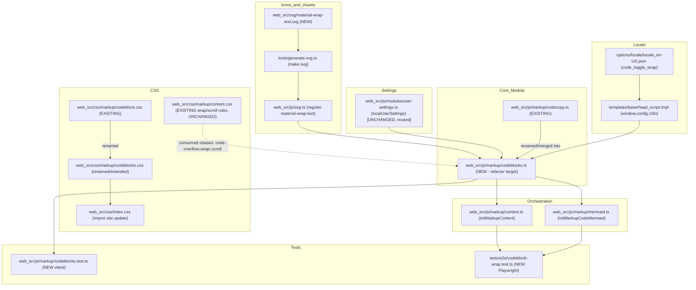
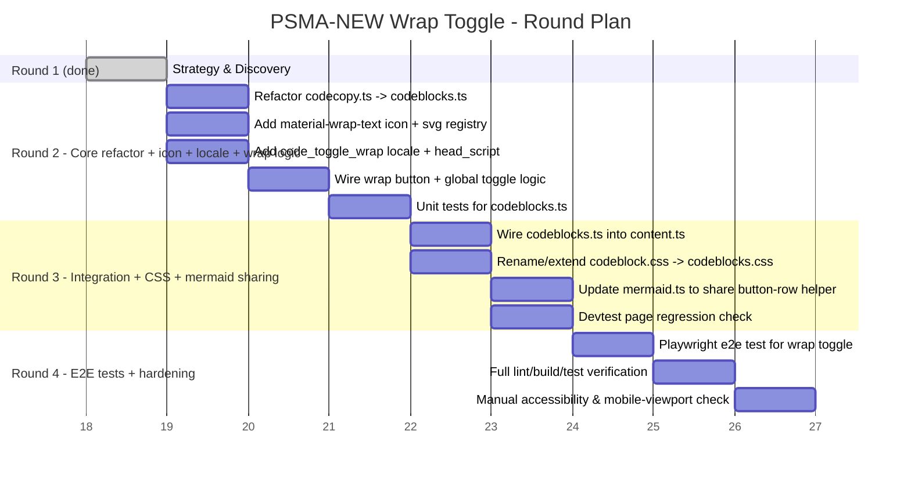
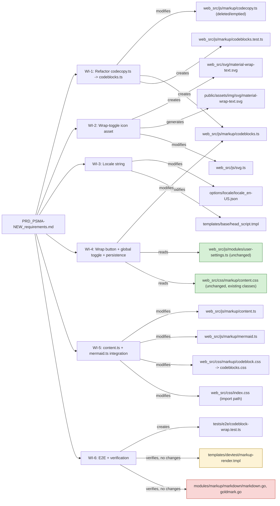

# WORK STRATEGY — PSMA-NEW: Wrap-Text Toggle for Markdown Code Blocks

Strategic Execution ID: `strat_1784413062253`
Task: Review and implement `sasva-prd/PRD_PSMA-NEW_requirements.md`
Type: **Brownfield frontend feature** (pure client-side, no backend/DB changes)

---

## 1. Executive Summary

Gitea's rendered Markdown code blocks (issues, PRs, comments, wiki, README)
have a "copy code" button (`web_src/js/markup/codecopy.ts`) but no way to
toggle line-wrapping. This PRD adds a **global wrap-toggle button** next to
the copy button on every rendered code block, backed by CSS classes that
already exist (`code-overflow-wrap` / `code-overflow-scroll` in
`web_src/css/markup/content.css`), persisted via `localUserSettings`
(not raw `localStorage`), with a new Material `wrap-text` icon, a new
locale string `code_toggle_wrap`, and a minimal refactor of
`codecopy.ts` → `codeblocks.ts` (preserving existing exported names,
adding new ones). `mermaid.ts` is updated to share the button-row
container/styling only (not wrap behavior). Out of scope: per-block wrap
memory, the package-registry container-digest block, and the code-editor
line-wrap preference — all strictly deferred per user decision.

This is a **medium-complexity, single-vertical-slice feature**: all work
(refactor + new button + CSS + icon + locale + mermaid integration + tests)
ships together in one functioning increment, split across 3 execution
rounds for manageable batch size, each independently buildable/testable.

---

## 2. Current State Analysis

| Area | Current Implementation | Notes |
|---|---|---|
| Copy button | `web_src/js/markup/codecopy.ts` exports `makeCodeCopyButton()`, `initMarkupCodeCopy()`. Appends `<button class="ui compact icon button code-copy auto-hide-control">` with `octicon-copy` svg to `.code-block-container` (or `.code-block` fallback). | Must preserve both exported names per user decision (minimal refactor). |
| Orchestrator | `web_src/js/markup/content.ts` → `initMarkupContent()` calls `initMarkupCodeCopy(el)`, `initMarkupTasklist`, `initMarkupCodeMermaid`, `initMarkupCodeMermaid`, `initMarkupCodeMath` inside `registerGlobalSelectorFunc('.markup', ...)`. | New wrap-init call must be added here; must respect the `.truncated-markup` early-return. |
| CSS wrap/scroll rules | `web_src/css/markup/content.css` lines 377–392 already define `.code-block-container.code-overflow-wrap` and `.code-overflow-scroll` rules (verified exact line numbers). Hover-reveal `.auto-hide-control` rules at lines 520–553. | **No new CSS selectors needed** — only a new class-toggle trigger. |
| Button CSS | Real file is `web_src/css/markup/codeblock.css` (imported at `web_src/css/index.css:53`) — PRD's referenced `codecopy.css` does not exist. Contains `.markup .ui.button.code-copy { top: 8px; right: 6px; margin: 0; }` and mermaid `.view-controller` positioning. | Extend/rename this file to `codeblocks.css`, update the one import site. |
| Icon registry | `web_src/js/svg.ts` — `svgs` object (~line 92) with `octicon-copy` registered at line 114. Material icons already coexist here in principle; confirmed 4 `material-*.svg` files exist under `web_src/svg/` and `public/assets/img/svg/`, generated via `node tools/generate-svg.ts` (`make svg`). | New `material-wrap-text.svg` must be added to `web_src/svg/`, then `make svg` regenerates `public/assets/img/svg/` + registers via the generator — **do not hand-edit** `public/assets/img/svg/*.svg` directly; add source under `web_src/svg/` and run the generator, then import+register in `svg.ts` following the `octicon-copy` pattern. |
| User settings | `web_src/js/modules/user-settings.ts` — typed `localUserSettings.getBoolean/setBoolean` (and getString/setString/getJsonObject), auto-prefixes keys with `gitea:setting:`, handles legacy-key migration. Exposed on `window.localUserSettings`. | Use `localUserSettings.getBoolean('wrap-markup-code')` / `setBoolean(...)` — this is the ESLint-sanctioned wrapper (`no-restricted-globals` forbids raw `localStorage`). |
| i18n | `options/locale/locale_en-US.json` has `"copy_success": "Copied!"` at line 104; exposed via `templates/base/head_script.tmpl:27` (`copy_success: {{ctx.Locale.Tr "copy_success"}},`) into `window.config.i18n`. Consumed pattern seen in `web_src/js/modules/clipboard.ts:7` (`const {copy_success, copy_error} = window.config.i18n;`). | Add `code_toggle_wrap` key next to `copy_success`; add matching line in `head_script.tmpl`; consume via `window.config.i18n.code_toggle_wrap`. |
| Mermaid controls | `web_src/js/markup/mermaid.ts` renders its own `.view-controller.auto-hide-control.flex-text-block` button row (zoom-in/reset/zoom-out) inline via template literal (~lines 187–193), independent of the copy-button code. | FR-7 requires only that the **button-row container/styling** becomes shared with the new module; Mermaid's own zoom/pan logic (`initMermaidViewController`) is untouched. |
| Server renderers | `modules/markup/markdown/markdown.go:91`, `modules/markup/markdown/goldmark.go:132` unconditionally emit `code-block-container code-overflow-scroll`. Golden-string test `modules/markup/markdown/markdown_test.go:611` asserts this exact HTML. | **No Go changes** — PRD explicitly forbids backend renderer changes; this file/test must remain untouched, and Round work must not touch `modules/markup/**`. |
| Devtest page | `templates/devtest/markup-render.tmpl` statically demonstrates both wrap states. | Must continue to render correctly post CSS/JS rename — verify visually/structurally, no functional change needed since it only uses static classes. |
| Tests (unit) | No existing tests for `codecopy.ts`. Sibling pattern: `web_src/js/markup/tasklist.test.ts`, `mermaid.test.ts` — plain `vitest` `test()`/`expect()` blocks, testing pure exported functions. | New `codeblocks.test.ts` follows this exact pattern; DOM-dependent parts tested via `happy-dom` (already a devDependency, used by vitest config). |
| Tests (e2e) | Playwright specs in `tests/e2e/*.test.ts`, e.g. `tests/e2e/readme.test.ts`, `tests/e2e/mermaid.test.ts` — use `test/expect` from `@playwright/test`, helper `apiCreateRepo`/`randomString` from `tests/e2e/utils.ts`. | New `tests/e2e/codeblock-wrap.test.ts` (or similar) follows same helper pattern: create repo/issue with a long-line fenced code block, assert toggle button + class change + persistence across reload. |
| Build tooling | `make svg` regenerates SVG bindata from `web_src/svg/*.svg` via `tools/generate-svg.ts`; `make lint-frontend` = `lint-js` (ESLint) + `lint-css` (Stylelint); `make test-frontend` runs vitest; Playwright via `make test-e2e` (not required for automated CI gate per manifest, but included as project capability). | Build manifest wraps these Makefile targets. |

---

## 3. Component Dependency Graph

---

## 4. Work Round Plan (Gantt)

---

## 5. Change Impact Diagram

*Red = must remain byte-identical (golden test). Yellow = verify-only (regression check). Green = read-only dependency, no modification.*

---

## 6. Work Item Inventory

| # | Work Item | Files to Modify | Files to Create | Complexity | Dependencies | Round | Acceptance Criteria |
|---|---|---|---|---|---|---|---|
| 1 | Refactor `codecopy.ts` → `codeblocks.ts` (minimal refactor: keep `makeCodeCopyButton`/`initMarkupCodeCopy` exported names & signatures, add new `makeCodeBlockButton`/wrap-related exports) | `web_src/js/markup/codecopy.ts` (content moved out, file removed) | `web_src/js/markup/codeblocks.ts` | medium | none | 2 | 1) `makeCodeCopyButton` and `initMarkupCodeCopy` remain exported with identical signatures from the new module. 2) `codecopy.ts` no longer exists; no dangling imports reference it (verified via grep). 3) All pre-existing tests pass. 4) Build succeeds. |
| 2 | Add Material `wrap-text` SVG icon and register it in the icon pipeline | `web_src/js/svg.ts` | `web_src/svg/material-wrap-text.svg` | simple | none | 2 | 1) `svg('material-wrap-text')` returns valid inline SVG markup. 2) Icon generated into `public/assets/img/svg/material-wrap-text.svg` via `make svg` without altering unrelated existing icons. 3) All pre-existing tests pass. 4) Build succeeds. |
| 3 | Add `code_toggle_wrap` locale key and expose via `window.config.i18n` | `options/locale/locale_en-US.json`, `templates/base/head_script.tmpl` | none | simple | none | 2 | 1) `options/locale/locale_en-US.json` contains a `code_toggle_wrap` key with descriptive English text, placed near `copy_success`. 2) `head_script.tmpl` exposes it as `window.config.i18n.code_toggle_wrap`. 3) No other locale files are hand-edited. 4) All pre-existing tests pass. 5) Build succeeds. |
| 4 | Implement wrap-toggle button creation, click handling (toggle `.code-overflow-wrap`/`.code-overflow-scroll` on `.code-block-container`), global persisted preference via `localUserSettings.getBoolean/setBoolean`, and `data-active` state styling, inside `codeblocks.ts` | `web_src/js/markup/codeblocks.ts` | none | medium | 1, 2, 3 | 2 | 1) Clicking the wrap button toggles the code block's wrap/scroll class immediately with no reload. 2) The chosen state is written to `localUserSettings` under a dedicated key (e.g. `wrap-markup-code`) and is read back correctly on the next init call within the same session (simulated reload). 3) No raw `localStorage` calls are introduced (grep-verifiable). 4) All pre-existing tests pass. 5) Build succeeds. |
| 5 | Unit tests (vitest) for `codeblocks.ts`: button creation, class toggling, `data-active` attribute, `localUserSettings` read/write integration | `web_src/js/markup/codeblocks.test.ts` (new, counted here) | `web_src/js/markup/codeblocks.test.ts` | medium | 4 | 2 | 1) New vitest suite covers: initial class applied from stored preference, click toggles class + persists new preference, copy button behavior is unchanged (regression). 2) `pnpm exec vitest run web_src/js/markup/codeblocks.test.ts` passes locally in the round's test gate. 3) All pre-existing tests pass. 4) Build succeeds. |
| 6 | Wire `codeblocks.ts` into `content.ts` orchestrator (replace `initMarkupCodeCopy` call with combined copy+wrap init, respecting the `.truncated-markup` early return and applying stored preference before/at render to avoid flash of wrong state) | `web_src/js/markup/content.ts` | none | medium | 1, 4 | 3 | 1) Every `.markup` code block (issue/PR/comment/wiki/README) renders both copy and wrap buttons after this change, verified via a manual/dev-server smoke check or existing markup rendering tests. 2) Truncated markup content still skips all code-block feature init exactly as before (no regression). 3) All pre-existing tests pass. 4) Build succeeds. |
| 7 | Update `mermaid.ts` to consume the shared button-row helper/styling from `codeblocks.ts` for its zoom-in/reset/zoom-out controls, without altering pan/zoom/reset behavior or introducing a wrap button on Mermaid diagrams | `web_src/js/markup/mermaid.ts` | none | medium | 1, 6 | 3 | 1) Mermaid diagrams continue to render zoom-in/reset/zoom-out controls with identical behavior (verified against `web_src/js/markup/mermaid.test.ts` passing unchanged). 2) The button-row container/class styling is now sourced from the shared module (no duplicated CSS/class definitions). 3) No wrap-toggle button appears on Mermaid diagram canvases (out of scope). 4) All pre-existing tests pass. 5) Build succeeds. |
| 8 | Rename/extend `web_src/css/markup/codeblock.css` → `codeblocks.css` (combined copy+wrap button row styling, incl. `data-active` state rule), update the single import site, verify `.auto-hide-control` hover-reveal still applies to both buttons | `web_src/css/markup/codeblock.css` (removed), `web_src/css/index.css` | `web_src/css/markup/codeblocks.css` | simple | 4, 6 | 3 | 1) `web_src/css/index.css` imports `codeblocks.css` instead of `codeblock.css`. 2) Both copy and wrap buttons are visually positioned correctly within `.code-block-container` and reveal on hover via `.auto-hide-control` (manual/visual check + no stylelint errors). 3) All pre-existing tests pass. 4) Build succeeds. |
| 9 | Regression check: `templates/devtest/markup-render.tmpl` static wrap-state demo continues to render correctly after JS/CSS module renames; confirm `modules/markup/markdown/markdown.go`/`goldmark.go`/`markdown_test.go` remain untouched | none (verification only) | none | simple | 6, 7, 8 | 3 | 1) `templates/devtest/markup-render.tmpl` renders without errors and both static wrap states display correctly (manual check via devtest route). 2) `git diff` shows zero changes to `modules/markup/markdown/**`. 3) `modules/markup/markdown/markdown_test.go` (golden HTML test at line 611) passes unmodified. 4) All pre-existing tests pass. 5) Build succeeds. |
| 10 | Playwright e2e test: create an issue/comment containing a long-line fenced code block, verify wrap button renders, click toggles wrap class visually (e.g. via computed `white-space` style or class assertion), reload page and verify persisted state | `none` | `tests/e2e/codeblock-wrap.test.ts` | medium | 6, 7, 8 | 4 | 1) New Playwright spec creates a repo/issue with a long-line code block via existing `apiCreateRepo`/helper patterns from `tests/e2e/utils.ts`. 2) Test asserts the wrap-toggle button is visible and clicking it toggles `.code-overflow-wrap`/`.code-overflow-scroll` on `.code-block-container`. 3) Test reloads the page and asserts the previously chosen wrap state persists. 4) All pre-existing tests pass. 5) Build succeeds. |
| 11 | Full-suite verification & hardening: run `make lint-frontend`, `make test-frontend`, `make svg-check`, manual accessibility check (keyboard operability, `aria-label`/`title` from `code_toggle_wrap`), manual mobile-viewport check for button crowding | none (verification/polish only; may include minor CSS/aria tweaks in `codeblocks.ts`/`codeblocks.css`) | none | simple | 10 | 4 | 1) `make lint-frontend` (ESLint incl. `no-restricted-globals`, Stylelint) passes with zero new violations. 2) `make test-frontend` (vitest) passes, including new `codeblocks.test.ts`. 3) Wrap button is keyboard-focusable/activatable and has a non-empty accessible label sourced from `code_toggle_wrap`. 4) All pre-existing tests pass. 5) Build succeeds. |

**Totals:** 11 work items · Files to modify (unique across items): ~10 · Files to create: 5 (`codeblocks.ts`, `material-wrap-text.svg` source, `codeblocks.test.ts`, `codeblocks.css`, `codeblock-wrap.test.ts`)

---

## 7. Implementation Guidelines

| Current Pattern | Approach for This Feature |
|---|---|
| Feature-init modules export `initMarkupXxx(elMarkup: HTMLElement)` and are fanned out from `content.ts`'s `registerGlobalSelectorFunc('.markup', ...)` callback | Keep `initMarkupCodeCopy`/new wrap-init following the exact same signature convention; call from the same fan-out block in `content.ts`, after the `.truncated-markup` early-return guard. |
| Button creation via `createElementFromAttrs<HTMLButtonElement>('button', {class: '...', ...attrs})` + `btn.innerHTML = svg(iconName)` (`codecopy.ts`) | Reuse this exact helper for the new `makeCodeBlockButton()` — parametrize icon name, class list, and `data-*` attributes rather than writing new DOM-construction code. |
| Icon registration: import raw `.svg` into `web_src/js/svg.ts`, add to `svgs` map with kebab-case key matching filename (pattern: `octicon-copy` at line 114) | Add `import materialWrapText from '../../public/assets/img/svg/material-wrap-text.svg';` and `'material-wrap-text': materialWrapText,` entry; source SVG goes in `web_src/svg/` first, regenerated into `public/assets/` via `make svg` (do NOT hand-place files only in `public/assets/img/svg/`). |
| Client-side preference storage always goes through `localUserSettings` (`getBoolean`/`setBoolean`), never raw `localStorage`, enforced by ESLint `no-restricted-globals` | Store the wrap preference as a boolean under a single dedicated key (e.g. `wrap-markup-code`); read once per `initMarkupContent` pass and apply consistently to all code blocks (global toggle per user decision), write on each click. |
| Locale strings: add to `locale_en-US.json` only; expose via `head_script.tmpl` `i18n: {...}` object; consume via `window.config.i18n.<key>` destructuring at module scope (pattern in `modules/clipboard.ts:7`) | Add `code_toggle_wrap` key + `templates/base/head_script.tmpl` line mirroring `copy_success`; consume in `codeblocks.ts` the same way, used as both `title` and `aria-label` on the new button. |
| CSS: `.code-block-container`/`.code-block` positioning + button placement lives in a dedicated small CSS file (`codeblock.css`), imported once from `web_src/css/index.css`; wrap/scroll *behavior* rules already live separately in `content.css` and must not be duplicated | Rename file only (`codeblocks.css`), keep wrap/scroll behavioral rules untouched in `content.css`; add only new button-row layout + `data-active` visual-state rules to the renamed file. |
| Mermaid's own controls are built inline via `html`/`htmlRaw` template literals in `mermaid.ts`, independent of the copy-button module | Factor out just the *container/button* construction (classes, layout) into a shared helper exported from `codeblocks.ts`, imported by `mermaid.ts`; do not touch `initMermaidViewController`'s zoom/pan/reset logic. |
| Unit tests: plain `vitest` `test()/expect()` against pure/DOM-manipulating exported functions, colocated as `*.test.ts` siblings (`tasklist.test.ts`, `mermaid.test.ts`) | `codeblocks.test.ts` colocated with `codeblocks.ts`; use `happy-dom` (already configured for vitest) to construct minimal `.code-block-container` fixtures and assert class/attribute changes + `localUserSettings` reads/writes (mock or use jsdom localStorage). |
| E2E tests: Playwright specs under `tests/e2e/`, using `apiCreateRepo`/`randomString` helpers from `tests/e2e/utils.ts`, `test/expect` from `@playwright/test` | New `codeblock-wrap.test.ts` follows the exact structure of `readme.test.ts`/`mermaid.test.ts`: create a repo via API, create content with a long-line fenced code block (e.g. via issue body or README), navigate, interact with the toggle, assert class + reload persistence. |
| Server renderers (`markdown.go`, `goldmark.go`) are explicitly out of scope; golden-string test at `markdown_test.go:611` guards the emitted HTML | No Go files touched in any work item; verification item (WI-9) explicitly diffs `modules/markup/markdown/**` to confirm zero changes. |

---

## 8. Dependency Map Between Work Items

| Work Item | Depends On | Reason |
|---|---|---|
| 1. Refactor codecopy→codeblocks | — | Foundational module rename; everything else builds on the new module. |
| 2. Wrap-text icon asset | — | Independent asset addition; can proceed in parallel with WI-1. |
| 3. Locale string | — | Independent; can proceed in parallel with WI-1/2. |
| 4. Wrap button logic + persistence | 1, 2, 3 | Needs the new module to add functions into, the icon to render, and the locale key for the label. |
| 5. Unit tests for codeblocks.ts | 4 | Tests must target the finished wrap-toggle behavior. |
| 6. content.ts integration | 1, 4 | Orchestrator must call into the finished, tested module. |
| 7. mermaid.ts button-row sharing | 1, 6 | Needs the shared helper to exist and content.ts wiring pattern established. |
| 8. CSS rename/extend | 4, 6 | Styling must match the final button DOM structure and be wired before visual verification. |
| 9. Devtest/golden-test regression check | 6, 7, 8 | Can only verify final integrated state once JS/CSS wiring is complete. |
| 10. Playwright e2e test | 6, 7, 8 | E2E must exercise the fully wired feature end-to-end. |
| 11. Full verification & hardening | 10 | Final gate after all functional and test work is complete. |

---

## 9. Round Plan & Rationale

| Round | Work Items | Rationale |
|---|---|---|
| **Round 2** — Core module, icon, locale, wrap logic + unit tests | 1, 2, 3, 4, 5 | Establishes the foundational refactored module (`codeblocks.ts`) with all supporting assets (icon, locale) built and unit-tested *before* wiring into the live orchestrator — this is the highest-risk, most novel code (the actual toggle/persistence logic) and benefits from isolated testing first. Kept as one round because these items are small/independent and together form one coherent, testable unit (a working, unit-tested module) even though it isn't yet visible in the UI. |
| **Round 3** — Integration (content.ts, mermaid.ts, CSS) + regression checks | 6, 7, 8, 9 | Wires the tested module into the real rendering pipeline (`content.ts`), extends the sharing to `mermaid.ts`, finalizes CSS, and immediately regression-checks the two explicit "must not change" surfaces (devtest page, Go golden test). This round delivers the end-to-end visible feature — after this round, the wrap toggle actually appears and works on real Gitea pages. |
| **Round 4** — E2E verification + hardening | 10, 11 | Adds the Playwright e2e test (per user decision to include both vitest + Playwright coverage) against the now-fully-wired feature, then runs full lint/build/test gates plus manual accessibility/mobile checks as a final hardening pass. Kept separate from Round 3 because e2e tests need the fully integrated, running application (not just unit-level correctness) and because this task explicitly requested e2e coverage as a distinct verification layer. |

This is a **3-round execution plan** (Rounds 2–4), appropriate for a
medium-complexity single-feature frontend change per the round-sizing
rules (feature with API+UI-equivalent surface, i.e. module refactor + DOM
feature + tests).

---

## 10. Risk Assessment

| Risk | Likelihood | Impact | Mitigation |
|---|---|---|---|
| Renaming `codecopy.ts` → `codeblocks.ts` breaks an import site not yet identified | Low | Medium | Grep all references to `codecopy`/`initMarkupCodeCopy`/`makeCodeCopyButton` before deleting the old file (confirmed only `content.ts` currently imports it); keep exported names/signatures identical per user decision to minimize blast radius. |
| Raw `localStorage` accidentally used instead of `localUserSettings`, failing ESLint `no-restricted-globals` in CI | Low | Medium | Exclusively use `localUserSettings.getBoolean/setBoolean`; WI-4 acceptance criteria explicitly requires a grep-verifiable absence of raw `localStorage` calls; `make lint-frontend` catches this in Round 4 gate regardless. |
| SVG icon not regenerated correctly (hand-edited into `public/assets/` instead of via `make svg` from `web_src/svg/`) causing `svg-check` CI target to fail | Medium | Low | WI-2 explicitly requires adding the source file under `web_src/svg/` and running the generator (`make svg`), not manually placing files in `public/assets/img/svg/`. |
| New wrap button crowds existing copy button on narrow/mobile viewports | Medium | Low | Follow the existing flex-based button-row container pattern already used for the copy button and Mermaid's `.view-controller.flex-text-block`; WI-11 includes an explicit manual mobile-viewport check. |
| Server-side golden HTML test (`markdown_test.go:611`) accidentally broken by an unrelated change | Low | High | Explicitly zero Go files are touched by any work item; WI-9 performs a dedicated `git diff` verification against `modules/markup/markdown/**` before declaring the round complete. |
| Mermaid's zoom/pan/reset behavior regresses when its button-row is refactored to share styling with `codeblocks.ts` | Medium | Medium | WI-7 explicitly scopes the change to container/class sharing only, not touching `initMermaidViewController`; existing `mermaid.test.ts` unit tests and manual verification must pass unchanged. |
| New locale key not yet translated in 25+ locale files causes inconsistent UI in non-English locales | High (expected) | Low | Standard, accepted Gitea i18n flow — add only to `locale_en-US.json`; English fallback is expected and acceptable per the PRD (`§9, §14`); not treated as a defect. |
| Scope creep into out-of-scope surfaces (code-editor line-wrap, package-registry container-digest block) | Low | Medium | User decision explicitly confirms strict PRD scope boundary; no work item touches `web_src/js/modules/codeeditor/` or `templates/package/content/container.tmpl`; enforced by omission from the Work Item Inventory. |
| E2E test flakiness due to reload/localStorage timing | Medium | Low | Follow existing Playwright patterns (`tests/e2e/user-settings.test.ts`, `readme.test.ts`) for reload/assertion timing; use Playwright's built-in `expect(...).toHaveClass()`/`toBeVisible()` auto-retrying assertions rather than manual sleeps. |

---

## 11. Round Log

| Round | Status | Work Items | Notes |
|---|---|---|---|
| 1 | done | Strategy & Discovery | PRD reviewed in full; existing codebase explored (`codecopy.ts`, `content.ts`, `mermaid.ts`, `svg.ts`, `user-settings.ts`, `content.css`, `codeblock.css`, locale/head_script wiring, existing unit/e2e test patterns). Strategy, work item inventory, and build manifest produced. |
| 2 | planned | 1, 2, 3, 4, 5 | Core `codeblocks.ts` module, icon asset, locale string, wrap-toggle logic + persistence, unit tests. |
| 3 | planned | 6, 7, 8, 9 | Integration into `content.ts` + `mermaid.ts`, CSS finalization, regression checks against devtest page and Go golden test. |
| 4 | planned | 10, 11 | Playwright e2e test, full lint/build/test verification, accessibility/mobile hardening. |

---

## 12. Notes on PRD Fidelity & Scope Boundaries

- **Global toggle** (not per-block) — confirmed by user decision; implemented as a single `localUserSettings` boolean key applied to all `.code-block-container` elements on the page at init time and on every click.
- **Icon**: Material Design `wrap-text` glyph, mixed with existing Octicon `copy` icon — precedent for mixed icon families already exists in this codebase (`material-invert-colors`, `material-palette` used alongside Octicons elsewhere).
- **Testing**: both vitest unit tests (Round 2) and a Playwright e2e test (Round 4) are included, per user decision, despite neither existing today for this specific area.
- **Explicitly deferred** (per user decision, strictly following PRD scope): package registry container-digest block (`templates/package/content/container.tmpl`) and code-editor line-wrap preference sharing (`web_src/js/modules/codeeditor/`) — no work items touch these paths.
- **Minimal refactor constraint**: `codecopy.ts`'s exported `makeCodeCopyButton` and `initMarkupCodeCopy` function names/signatures are preserved unchanged in `codeblocks.ts`; only new functions are added (e.g. `makeCodeBlockButton`, wrap-toggle helpers) — no broader API redesign.
