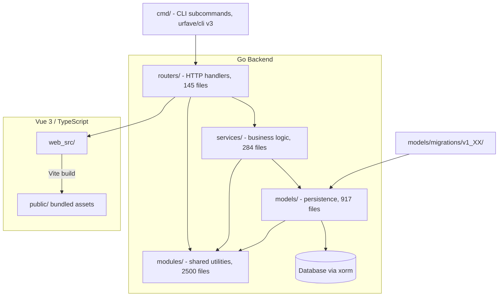

# Workspace Analysis: Gitea

## 1. Executive Summary

This workspace is **Gitea**, a self-hosted Git service (issues, pull requests, CI/CD via Actions, package registry, wiki). It is a large, mature **Go monorepo** with a **layered monolith backend** and a **Vue 3 / TypeScript frontend**, built on `xorm` for persistence and Vite/Tailwind for the client. The project enforces its architecture and coding conventions heavily through tooling (`depguard`, `golangci-lint`, ESLint, Stylelint) rather than relying on developer discipline alone.

> **Confidence note:** Some backend-specific claims below (ORM usage, migration internals, LDAP, markdown engine) come from a prior structural analysis pass and were **not re-verified** in the most recent sampling pass, which focused mainly on frontend tooling configs (`stylelint.config.ts`, `tailwind.config.ts`, `eslint.config.ts`, `eslint.json.config.ts`, `playwright.config.ts`, `vitest` config, `types.d.ts`) plus two Go files (`main.go`, `main_timezones.go`). They remain **unverified-but-uncontradicted** and are flagged accordingly.

---

## 2. Tech Stack

| Layer | Technology | Verification |
|---|---|---|
| Language | Go 1.26, module `gitea.dev` | Confirmed (`main.go`) |
| CLI framework | `github.com/urfave/cli/v3` | Confirmed (`main.go`) |
| ORM / DB | `xorm.io/xorm` + `xorm.io/builder` (sole sanctioned layer) | Unverified this pass, carried forward |
| Markdown | `github.com/yuin/goldmark` (sole renderer) | Unverified this pass |
| Auth | LDAP as first-class backend (`cmd/admin_auth_ldap*.go`) | Unverified this pass |
| Frontend | TypeScript + Vue 3, Vite, TailwindCSS | Confirmed |
| Frontend linting | ESLint (flat config) + dedicated `eslint.json.config.ts` for JSON/JSON5/JSONC | Confirmed |
| CSS linting | Stylelint (`@stylistic/stylelint-plugin`) | Confirmed |
| Testing (unit) | `testify` (Go), Vitest (`happy-dom`) for frontend | Confirmed |
| Testing (E2E) | Playwright | Confirmed |
| Package managers | Go modules, `pnpm` (frozen lockfile), `uv`/`pyproject.toml` for docs/build scripts | Confirmed |

---

## 3. Architecture

Gitea uses a **layered monolith**, explicitly *not* MVC:



**Key rules:**
- `routers/` → calls into `services/` for non-trivial logic (never duplicates business logic itself).
- `services/` → calls into `models/` for persistence (never touches the DB engine directly).
- `models/` → the only layer allowed to touch `db.GetEngine(ctx)` directly.
- `modules/` → shared, generic utilities imported almost everywhere; check here before writing new generic helpers.
- New DB-backed entities live under `models/<domain>/` (e.g. `models/issues/`, `models/actions/`), split into fine-grained files (e.g. `gpg_key.go`, `gpg_key_add.go`, `gpg_key_commit_verification.go`) rather than one large file per entity.
- Collection/list operations get a dedicated `_list.go` file (e.g. `comment_list.go`) instead of being bolted onto the entity's main file.

*(This structural picture is carried forward from prior analysis and not re-confirmed this pass — no `models/`/`services/`/`routers/` files were sampled directly.)*

---

## 4. Database Migrations

- Location: `models/migrations/v1_XX/v<N>.go` — one numbered file per DB version.
- Registration: centrally via `newMigration(id, desc, fn)` in `models/migrations.go`.
- **Enforced via `depguard`:** migration files are **forbidden** from importing `models` or `modules/structs`. They must redefine any struct shapes they need locally, annotated with a rationale comment, e.g.:
  ```go
  // Copy paste from models/repo.go because we cannot import models package.
  type Repository struct { ... }
  ```
- Migrations use the **raw session idiom** (`x.NewSession()`) rather than the higher-level `db` helpers, since they can't use application-level abstractions.
- Migration tests mirror the migration file name: `v<N>_test.go`, using a `migrationtest` helper package.

---

## 5. Coding Style & Naming Conventions

### Go
- **Files:** `snake_case.go` (`protected_branch.go`, `run_job.go`); migrations strictly `v<version>.go`.
- **Platform-specific files:** use Go build tags (`//go:build windows`) with a descriptive suffix + explanatory comment, not a rigid `_windows.go` naming scheme (e.g. `main_timezones.go` guards a `time/tzdata` side-effect import).
- **Structs/Types:** `PascalCase`, named after the singular entity (`ActionRunJob`, `ProtectedBranch`, `OAuth2Application`).
- **Error types:** `Err<Noun>` struct + `IsErr<Noun>(err) bool` predicate helper.
- **Methods:**
  - Lazy relation loaders: `Load*` (`LoadRepo`, `LoadDoer`).
  - Boolean predicates: `Is*`, `Has*`, `CanUser*`.
  - Migration entrypoints: PascalCase, verb-first (`FixMergeBase`).
  - Unexported helpers: camelCase verbs (`getRemoteAddress`).
- **Constants:** `iota` enum blocks with trailing `// N` comments, PascalCase even when unexported.
- **Transient/computed fields:** lowerCamelCase, tagged `xorm:"-"`.
- **Import aliasing:** domain-suffixed aliases mandatory for cross-domain imports:
  ```go
  repo_model "gitea.dev/models/repo"
  user_model "gitea.dev/models/user"
  webhook_module "gitea.dev/modules/webhook"
  ```
- **License header** mandatory on every Go file:
  ```go
  // Copyright <year> The Gitea Authors. All rights reserved.
  // SPDX-License-Identifier: MIT
  ```
  (older files may carry multiple copyright lines before the SPDX line — this is acceptable, not an anomaly.)
- **Test naming:** inconsistent today (`TestAddLdapBindDn` vs `Test_SSHParsePublicKey`); prefer `Test_<ExactFunctionOrFeatureName>` for *new* tests (convention, not enforced) — don't rewrite existing tests to conform.

### TypeScript / Frontend
- Prefer `!` non-null assertion over `?.`/`??`, but **only** when the value is genuinely guaranteed non-null (per `AGENTS.md`). Optional/env-derived values (e.g. `env.GITEA_TEST_E2E_URL?.replace?.(...)`) are legitimate `?.` use and not a counter-example.
- `camelCase` for vars/functions, `PascalCase` for imported types.
- Use `declare module` ambient blocks (`types.d.ts`) for both non-code asset imports (`*.svg`, `*.css`, `*.vue`) and typing untyped third-party packages (`idiomorph`, `swagger-ui-dist`) — avoid `@ts-ignore`/`any` as a first resort.

### CSS
- Prefer `flex-*` utilities over per-child margin utilities.
- Tailwind is configured with `prefix: 'tw-'`, `important: true`; base reset is **disabled**, and a blocklist bans several base utilities (`hidden`, `transform`, `shadow`, etc.) — unprefixed/blocklisted classes will not work.
- Theme tokens (colors, font sizes, border radii) map from CSS custom properties (`--color-*`), not hardcoded in `tailwind.config.ts` — new design tokens should be added as CSS variables first.
- **Visibility anti-pattern (explicitly banned):** no `[hidden]` attribute, `.hidden` class, inline `style="display:none"`, or jQuery `.show()/.hide()`. Use the `tw-hidden` utility or `showElem`/`hideElem`/`toggleElem` helpers from `utils/dom.js`.
- Stylelint enforces double-quoted strings, lowercase hex/units/pseudo-selectors, `declaration-strict-value`, `no-unknown-custom-properties`.

---

## 6. Required / Forbidden Libraries

### Must-use (internal)
| Package | Purpose |
|---|---|
| `gitea.dev/modules/...` | Shared utility layer — check before writing generic helpers |
| `gitea.dev/models/...` | Canonical data access — never duplicate persistence logic elsewhere |
| `gitea.dev/services/...` | Business logic layer above models |
| `gitea.dev/routers/...` | HTTP handler layer |
| `gitea.dev/modules/json` | **Mandatory** replacement for `encoding/json` |
| `gitea.dev/modules/util` | `ErrorWrap`, `NewInvalidArgumentErrorf`, sentinel errors |
| `gitea.dev/modules/git/internal` | Never import directly — use module's own `AddXxx` wrapper facade |

### Forbidden (enforced via `depguard` in `.golangci.yml` — CI-breaking, not just review comments)
| Banned | Use Instead |
|---|---|
| `encoding/json` | `gitea.dev/modules/json` |
| `github.com/unknwon/com` | `gitea.dev/modules/util` |
| `io/ioutil` | `os` / `io` |
| `golang.org/x/exp` | stdlib equivalents |
| `gopkg.in/ini.v1` | Gitea's own config system |
| `gitea.com/go-chi/cache` | Gitea's own cache system |
| `github.com/pkg/errors` | builtin `errors` + `%w` wrapping |

### Preferred third-party
- `github.com/stretchr/testify` — de facto standard, enforced via `testifylint` (with `empty`, `go-require`, `require-error` checks explicitly disabled).
- Stdlib-first policy: `strings`, `fmt`, `context`, `time`, `net/http`, `errors`, `io`, `os`, `strconv`, `bytes`, `path/filepath`, `net/url`, `sync`, `regexp`, `slices` — reach for these before adding a dependency (spirit-enforced by `usestdlibvars`).

---

## 7. Common Patterns

### CLI Entrypoint / Log Flushing
`main.go` overrides `cli.OsExiter` and explicitly calls `log.GetManager().Close()` **both** inside the custom exiter **and** after `RunMainApp` returns normally. This is called out in-code as a **MUST** — "otherwise there will be log loss." Any new exit path added to `cmd/`/`main.go` must flush logs on *every* route, not just the happy path.

### Error Handling
- Sentinel errors: `var ErrBranchIsProtected = util.ErrorWrap(util.ErrPermissionDenied, "branch is protected")`
- Custom error structs implement `Error() string` and `Unwrap() error` back to a shared sentinel.
- Always wrap with `fmt.Errorf("...: %w", err)` — never re-stringify errors (an anti-pattern seen once in `v286.go`, which loses `errors.Is`/`errors.As` support).
- Log-and-continue idiom for recoverable per-record failures in loops/migrations (`log.Warn(...); continue`).
- `panic()` reserved for programmer-error/invariant violations; `log.Fatal` reserved for unrecoverable migration states (e.g. unknown DB dialect) — these two are intentionally distinct, not interchangeable.
- Every `//nolint:nilnil` (or any `//nolint`) must carry a specific justification — enforced by `nolintlint`.

### Data Access
- DB-touching functions always take `context.Context` as the first parameter.
- The xorm engine is only ever touched via `db.GetEngine(ctx)`, and only inside `models/db`.
- Transactions wrap application code via `db.WithTx(ctx, func(ctx context.Context) error { ... })`.
- Migrations bypass this and use the raw `x.NewSession()` idiom instead.

---

## 8. Testing Strategy

| Type | Tooling | Notes |
|---|---|---|
| Go unit tests | stdlib `testing` + `testify` | Colocated `_test.go` files |
| Integration/fixtures | YAML in `models/fixtures/<entity>.yml` | Fixture-based DB seeding |
| Migration tests | `migrationtest` helper | Mirrors `v<N>.go` → `v<N>_test.go` |
| Frontend unit | Vitest, `happy-dom` environment | |
| E2E | Playwright | Target: sub-2s runtime per test (per `AGENTS.md`) |

---

## 9. Governance & Contribution Rules (from `AGENTS.md`)

- **Conventional Commits** required; no force-push, amend, or squash on open PRs.
- AI-assisted commits **must** include an `Assisted-by: AGENT_NAME:MODEL_VERSION` trailer.
- `Co-Authored-By` / `Signed-off-by` trailers are **explicitly forbidden** for AI contributions.
- Run `make fmt`, `make lint-go`, `make lint-js` before committing; run `make tidy` after any `go.mod` change.
- Contribution docs are topic-split under `docs/` (`guidelines-backend.md`, `guidelines-frontend.md`, `guidelines-refactoring.md`, `testing.md`) — check these before inventing new conventions.

---

## 10. Notable Clarifications / Nuances

- **Go and frontend tooling are not fully isolated:** while `golangci-lint` never runs on `web_src/` and ESLint/TS rules don't apply to `.go` files, Tailwind's content scanner *does* parse Go source for class extraction — `tailwind.config.ts`'s content glob includes `'./{build,models,modules,routers,services}/**/*.go'`. This is a build-tool content-scan concern, distinct from linting.
- **The `!` vs `?.`/`??` TypeScript rule has a narrow scope:** it only applies to values that are framework-guaranteed non-null. Optional/env-derived data (e.g. `playwright.config.ts`'s `env.GITEA_TEST_E2E_URL?.replace?.(...)`) is a legitimate, correct use of `?.` and does not violate the convention.
- **Multiple copyright lines are acceptable:** `main.go` carries both an original Gogs (2014) attribution and a Gitea (2016) line before the SPDX identifier — the single-line license header example in style guides is illustrative of the required *last-line* SPDX format, not a hard cap of one copyright line.

---

## 11. Open Items for Deeper Verification

The following were carried forward from a prior pass and should be re-confirmed with direct file reads if they become relevant to planned work:
1. `xorm`/`xorm.io/builder` as the sole DB layer — verify no raw `database/sql` usage in `models/`.
2. Exact `depguard` rule set for migration files (forbidding `models`/`modules/structs` imports) — check `.golangci.yml` directly.
3. `goldmark` as the sole markdown renderer — check for competing renderers.
4. LDAP implementation details in `cmd/admin_auth_ldap*.go`.
5. Full layering discipline in `models/ → services/ → routers/` — trace one real feature end-to-end (e.g. issues or actions) to confirm in practice.
