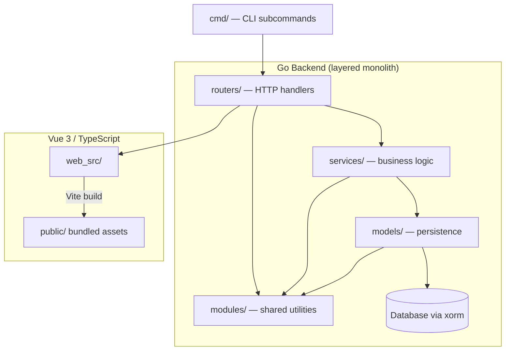
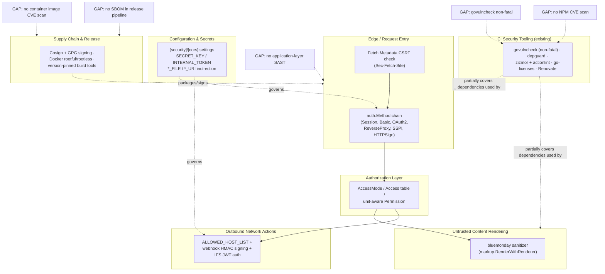
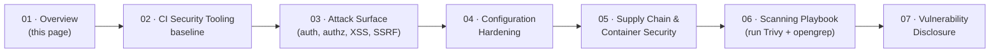

# Security Posture Overview

This page is the entry point for anyone about to point **Trivy** or **opengrep** at this repository.
It frames Gitea's overall security posture at an executive level — where controls already exist,
where the documented gaps are, and how the rest of this documentation set is organized so you can
navigate directly to the depth you need. Every claim below is synthesized from, and cross-referenced
back to, the more detailed pages in this set, which in turn synthesize Gitea's own Markdown
documentation tree (`docs/**/*.md`), `SECURITY.md`, `CONTRIBUTING.md`, and `WORKSPACE_ANALYSIS.md`.
See [`STYLE_GUIDE.md`](../STYLE_GUIDE.md) for the full source-provenance table.

> **Read this page first, then branch out.** It intentionally repeats a small amount of context from
> each downstream page so it can stand alone as a summary — but every important detail lives in the
> linked page, not here.

## What Gitea Is, in One Paragraph

Gitea is a self-hosted Git service (issues, pull requests, CI/CD via Actions, package registry,
wiki, federation via ActivityPub) built as a **layered-monolith Go backend** (`routers/` →
`services/` → `models/` → database via `xorm`, plus a shared `modules/` utility layer) with a
Vue 3/TypeScript frontend built by Vite. This architecture is enforced by tooling
(`depguard`, `golangci-lint`, ESLint, Stylelint) rather than developer discipline alone — a detail
that matters for scanning, because CI-breaking static rules already exist for some classes of risk,
as described in `WORKSPACE_ANALYSIS.md` and expanded in
[Existing Security Tooling in CI](../02-ci-security-tooling/existing-security-tooling-in-ci.md).



This diagram is the base layered-monolith picture from `WORKSPACE_ANALYSIS.md`; the annotated
version below overlays where the security-relevant controls documented across this set actually sit.

## Annotated Security-Control Map

The single biggest synthesis this documentation set offers is mapping *where* each existing control,
and each open gap, sits relative to that layered architecture — so a scanner operator knows which
layer a given Trivy/opengrep finding actually belongs to.



Each labeled box above is a page in this documentation set (linked in [Navigating This Set](#navigating-this-set)
below); each `GAP:` node is a concrete, named finding from the source docs that motivates adding
Trivy/opengrep in the first place, detailed further in the [Gap Summary](#gap-summary-what-trivy-and-opengrep-are-for) section.

## Threat-Model-at-a-Glance

Rather than a formal STRIDE exercise (not present in the source docs), this table maps **threat
actor → what they'd target → the existing mitigation → the relevant deep-dive page**, synthesized
from every attack-surface page in this set.

| Threat actor | What they'd target | Existing mitigation (per source docs) | Deep-dive page |
|---|---|---|---|
| Unauthenticated external attacker | Auth-chain ordering bugs, session fixation, CSRF on state-changing routes | Ordered `auth.Method` chains (`Group.Add(...)`), session-ID regeneration on sign-in, Fetch Metadata (`Sec-Fetch-Site`) CSRF check | [Authentication & Sessions](../03-attack-surface/authentication-and-sessions.md) |
| Authenticated low-privilege user | Privilege escalation via a missing/incorrect permission check on a new route; `ParseAccessMode` accepting `"owner"` from user input | Three-layer `AccessMode`/`Access`/`Permission` model; `"owner"` intentionally excluded from string parsing | [Authorization / Permission Model](../03-attack-surface/authorization-permission-model.md) |
| Malicious repository contributor | Stored XSS via a crafted README/wiki/issue/PR body, or a custom renderer/sanitizer rule that's too permissive | `bluemonday`-based sanitizer wired into `markup.RenderWithRenderer` for all built-in renderers (opt-out, not opt-in) | [Input Handling & XSS Defense](../03-attack-surface/input-handling-and-xss-defense.md) |
| Repository/org admin (or attacker who compromises one) | SSRF via a webhook URL, migration source, or OAuth2 client pointed at internal/loopback/cloud-metadata hosts | `ALLOWED_HOST_LIST` (`loopback`/`private`/`external`/CIDRs/wildcards), webhook HMAC signing, LFS JWT auth | [SSRF, Webhooks & Outbound Requests](../03-attack-surface/ssrf-webhooks-and-outbound-requests.md) |
| Anyone with read access to config/deployment artifacts | Leaked `SECRET_KEY`, `INTERNAL_TOKEN`, DB/SMTP/LDAP credentials committed in plaintext | `GITEA__SECTION__KEY__FILE` / `*_URI` indirection pattern; `ClearEnvConfigKeys()` scrubbing `GITEA__*` from the process environment post-install | [Security-Relevant Settings](../04-configuration-hardening/security-relevant-settings.md) |
| Supply-chain attacker (compromised dependency, tampered release artifact, malicious CI change) | Poisoned Go/npm dependency; tampered binary/container image; unpinned or `@latest`-resolved build tool | Cosign + detached GPG dual-signing, version-pinned build tools (`# renovate:` annotations), `depguard` import denylist, license scanning (`go-licenses` + `rolldown-license-plugin`) | [Build, Release & Container Posture](../05-supply-chain-and-container-security/build-release-and-container-posture.md) |
| Anyone relying on CI to catch known-vulnerable dependencies | A known Go CVE landing in `main` because `security-check` (`govulncheck`) is non-fatal (appended with a shell "or true" fallback) | Partial: `govulncheck` runs, but doesn't block merge | [Existing Security Tooling in CI](../02-ci-security-tooling/existing-security-tooling-in-ci.md) |

> **The recurring theme:** Gitea's source documentation shows strong *structural* controls (an ordered
> auth chain, a layered permission model, an opt-out-not-opt-in sanitizer, dual release signing) but
> comparatively thin *automated vulnerability/pattern detection* — no NPM CVE scan, no container image
> CVE scan, no application-layer SAST, and one non-fatal Go CVE check. This is precisely the shape of
> gap Trivy and opengrep are suited to close, and it is the organizing premise for the entire
> [Scanning Playbook](../06-scanning-playbook/running-trivy-and-opengrep.md).

## Gap Summary: What Trivy and Opengrep Are For

This table consolidates the concrete, explicitly-named gaps identified across every page in this set
— the "why bother adding these tools" answer in one place. Full detail and integration guidance for
each row lives in the [Scanning Playbook](../06-scanning-playbook/running-trivy-and-opengrep.md).

| Gap | Currently covered by | Where the gap is documented | Tool that fits |
|---|---|---|---|
| Go dependency CVEs pass CI silently | `govulncheck` (`security-check`), but invoked with `\|\| true` | [Existing Security Tooling in CI](../02-ci-security-tooling/existing-security-tooling-in-ci.md) | Trivy `fs`/`repo` scan, run **without** a non-fatal suffix |
| NPM/pnpm dependency CVEs | Nothing described in source docs | [Existing Security Tooling in CI](../02-ci-security-tooling/existing-security-tooling-in-ci.md) | Trivy `fs` scan against `pnpm-lock.yaml` |
| Container image CVEs | `pull-docker-dryrun.yml` validates that images *build*, not that they're CVE-free | [Build, Release & Container Posture](../05-supply-chain-and-container-security/build-release-and-container-posture.md) | Trivy `image` scan against `Dockerfile`/`Dockerfile.rootless` output |
| No SBOM in the release pipeline | No `cosign attest`/`syft`/SPDX/CycloneDX artifact described | [Build, Release & Container Posture](../05-supply-chain-and-container-security/build-release-and-container-posture.md) | Trivy `--format cyclonedx` bound to the existing Cosign identity |
| Application-layer SAST (injection, insecure crypto, secrets-in-code) | General linters (`golangci-lint`, ESLint) check style, not security semantics | [Existing Security Tooling in CI](../02-ci-security-tooling/existing-security-tooling-in-ci.md) | opengrep custom rules (see the rule-target backlog in the [Scanning Playbook](../06-scanning-playbook/running-trivy-and-opengrep.md)) |
| Secret detection in config/workflow files | Not directly described as a control | [Security-Relevant Settings](../04-configuration-hardening/security-relevant-settings.md) | opengrep secret-detection rules |
| Access-control **logic** bugs (missing/incorrect permission checks) | Neither tool class — this needs human review informed by Gitea's `AccessMode`/`Permission` vocabulary | [Authorization / Permission Model](../03-attack-surface/authorization-permission-model.md) | Manual review + opengrep rules as a *supplement*, not a replacement |

```mermaid
graph TD
  A[Security Finding Needed] --> B{What kind of question<br/>are you asking?}
  B -->|"Is a dependency/image/base<br/>OS package known-vulnerable?"| C[Trivy: SCA / image / fs scan]
  B -->|"Does source/config contain a<br/>known-bad pattern or secret?"| D[opengrep: SAST / secret rules]
  B -->|"Is the access-control LOGIC<br/>correct for this feature?"| E[Manual review, informed by<br/>Authorization/Permission Model docs]
  C --> F[Triage finding]
  D --> F
  E --> F
  F --> G{Exploitable / leaks<br/>other users' data?}
  G -->|Yes or unsure| H[security@gitea.io — private]
  G -->|No| I[Normal bug/enhancement issue]
```

This is the same decision flow developed in full in the
[Scanning Playbook](../06-scanning-playbook/running-trivy-and-opengrep.md) and
[Vulnerability Disclosure Process](../07-vulnerability-disclosure/reporting-process.md) pages — it's
repeated here because it is the single most important operational habit for anyone running these
scanners against this repository: **a finding is not automatically a confirmed, disclosable security
issue**, and the routing decision (public issue vs. `security@gitea.io`) matters as much as the scan
itself.

## Navigating This Set

The rest of this documentation set is organized so you can go from "what already exists" to
"what to actually run" to "what to do with a result," in order:



| Section | Page | What it answers |
|---|---|---|
| 02 · CI Security Tooling | [Existing Security Tooling in CI](../02-ci-security-tooling/existing-security-tooling-in-ci.md) | What already runs (`govulncheck`, `depguard`, `zizmor`, `actionlint`, license scanning, Renovate) so new scanning is additive, not duplicated |
| 03 · Attack Surface | [Authentication & Sessions](../03-attack-surface/authentication-and-sessions.md) | The full `auth.Method` chain, session fixation protection, CSRF handling, per-surface auth ordering |
| 03 · Attack Surface | [Authorization / Permission Model](../03-attack-surface/authorization-permission-model.md) | `AccessMode` / `Access` table / unit-aware `Permission` — the vocabulary needed to write custom access-control SAST rules |
| 03 · Attack Surface | [Input Handling & XSS Defense](../03-attack-surface/input-handling-and-xss-defense.md) | The `bluemonday`-based sanitizer pipeline and where sanitizer-bypass bugs would hide |
| 03 · Attack Surface | [SSRF, Webhooks & Outbound Requests](../03-attack-surface/ssrf-webhooks-and-outbound-requests.md) | `ALLOWED_HOST_LIST`, webhook signing, LFS JWT auth — Gitea's outbound-request attack surface |
| 04 · Configuration Hardening | [Security-Relevant Settings](../04-configuration-hardening/security-relevant-settings.md) | The `[security]`/`[cors]` `app.ini` catalog, secret-supply mechanics (`*_FILE`/`*_URI`), HTTP security headers |
| 05 · Supply Chain & Container Security | [Build, Release & Container Posture](../05-supply-chain-and-container-security/build-release-and-container-posture.md) | Cosign/GPG release signing, Docker rootful/rootless posture, dependency/tool pinning, license compliance |
| 06 · Scanning Playbook | [Running Trivy and Opengrep](../06-scanning-playbook/running-trivy-and-opengrep.md) | Concrete integration points in the existing pipeline, and a consolidated opengrep rule-target backlog |
| 07 · Vulnerability Disclosure | [Vulnerability Disclosure Process](../07-vulnerability-disclosure/reporting-process.md) | What to do with a real finding — `security@gitea.io`, PGP key, triage taxonomy, backport/EOL policy |

## Quick-Start Checklist for a Scanner Operator

1. **Read [Existing Security Tooling in CI](../02-ci-security-tooling/existing-security-tooling-in-ci.md) first.**
   Don't propose a check that already exists — know the baseline (`govulncheck`, `depguard`, `zizmor`,
   `actionlint`, `go-licenses`, Renovate) before adding anything.
2. **Pick a lane using the [gap summary](#gap-summary-what-trivy-and-opengrep-are-for) above** — Trivy
   for dependency/image/SBOM gaps, opengrep for source-pattern/secret-detection gaps, manual review
   (informed by the [Authorization / Permission Model](../03-attack-surface/authorization-permission-model.md)
   page) for access-control logic.
3. **Wire new scans into the existing pipeline shape**, not a parallel one — see the integration
   diagram and per-gap placement guidance in the
   [Scanning Playbook](../06-scanning-playbook/running-trivy-and-opengrep.md).
4. **Never append `|| true` to a new enforcement step** the way the existing `security-check` target
   does — that non-fatal pattern is explicitly called out in this set as a gap, not a model to copy.
5. **Triage every finding before disclosing it.** If a finding plausibly leaks another user's data or
   grants unintended access, it goes to `security@gitea.io` — **not** a public issue or PR comment.
   See [Vulnerability Disclosure Process](../07-vulnerability-disclosure/reporting-process.md), which
   also flags that the PGP key documented in `SECURITY.md` (`6FCD2D5B`) has a stated expiry of
   July 4, 2026 — already past as of this writing — so verify a current key before encrypting a
   sensitive report.

## Cross-References

- [Existing Security Tooling in CI](../02-ci-security-tooling/existing-security-tooling-in-ci.md) —
  the detailed tool inventory this overview's threat model and gap summary are drawn from.
- [Authentication & Sessions](../03-attack-surface/authentication-and-sessions.md),
  [Authorization / Permission Model](../03-attack-surface/authorization-permission-model.md),
  [Input Handling & XSS Defense](../03-attack-surface/input-handling-and-xss-defense.md),
  [SSRF, Webhooks & Outbound Requests](../03-attack-surface/ssrf-webhooks-and-outbound-requests.md) —
  the four attack-surface deep dives underlying the threat-model table above.
- [Security-Relevant Settings](../04-configuration-hardening/security-relevant-settings.md) — the
  configuration-hardening detail behind the "Config & Secrets" node in the annotated architecture
  diagram.
- [Build, Release & Container Posture](../05-supply-chain-and-container-security/build-release-and-container-posture.md) —
  the supply-chain/release detail behind the "Supply Chain & Release" node above.
- [Running Trivy and Opengrep](../06-scanning-playbook/running-trivy-and-opengrep.md) — the
  operational playbook this overview points to for every gap identified above.
- [Vulnerability Disclosure Process](../07-vulnerability-disclosure/reporting-process.md) — what to do
  once a scan produces a finding that looks real.
