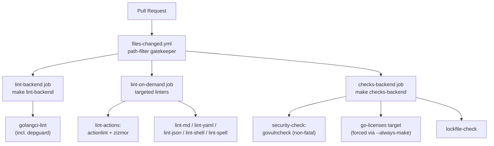

# Existing Security Tooling in CI

Before pointing Trivy or opengrep at this repository, it's worth understanding what security-relevant
tooling Gitea's CI pipeline **already** runs — so new scanning effort is additive rather than duplicated.
This page inventories every linter, checker, and dependency-management bot that currently touches
security concerns (vulnerability detection, supply-chain hygiene, CI-config safety, and license
compliance), based on [`docs/build-cicd-deployment/makefile-and-build.md`](../../docs/build-cicd-deployment/makefile-and-build.md),
[`docs/build-cicd-deployment/github-workflows.md`](../../docs/build-cicd-deployment/github-workflows.md),
[`docs/build-cicd-deployment/docker-and-packaging.md`](../../docs/build-cicd-deployment/docker-and-packaging.md),
[`docs/02-architecture/module-dependency-map.md`](../../docs/02-architecture/module-dependency-map.md), and
`WORKSPACE_ANALYSIS.md`.

> None of this is Trivy or opengrep themselves — this page is the "what's already covered" baseline
> that the [Scanning Playbook](../06-scanning-playbook/running-trivy-and-opengrep.md) builds on top of.

## How CI Is Organized

Gitea's own build/lint/test pipeline is defined once in the root `Makefile` and then invoked from
GitHub Actions workflows under `.github/workflows/*.yml`. The umbrella `make lint` target fans out into
every linter category; the umbrella `make checks` target runs cheaper "is my tree consistent"
verifications (lockfile drift, generated-file drift, `govulncheck`), as documented in
[`docs/build-cicd-deployment/makefile-and-build.md`](../../docs/build-cicd-deployment/makefile-and-build.md).



The `pull-compliance.yml` workflow is the entry point for this: it runs `lint-backend`, a targeted
`lint-on-demand` job (only running the linter categories relevant to what changed), and `checks-backend`
on every pull request, as described in
[`docs/build-cicd-deployment/github-workflows.md`](../../docs/build-cicd-deployment/github-workflows.md).

## Tool Inventory

| Tool | Invoked via | What it covers | Security relevance |
|---|---|---|---|
| `govulncheck` | `make security-check` (part of `checks-backend`) | Scans Go module dependency graph for known vulnerabilities reachable from actual call sites | Direct dependency vulnerability scanning — closest existing analog to Trivy's SCA function, but scoped to Go only |
| `golangci-lint` + `depguard` | `make lint-go` / `lint-backend` | General Go static analysis; `depguard` specifically bans certain packages/imports | Prevents known-risky or superseded packages (`encoding/json`, `io/ioutil`, `github.com/pkg/errors`, etc.) and enforces layering (e.g. migrations can't import live `models`) |
| `zizmor` | `make lint-actions` (via `uv run`) | GitHub Actions workflow/action security linter | Purpose-built CI-config security scanner — flags dangerous trigger patterns (`pull_request_target` misuse, script injection, unpinned actions) |
| `actionlint` | `make lint-actions` | GitHub Actions workflow syntax/semantics linter | Catches malformed or logically broken workflow YAML that could hide security-relevant misconfiguration |
| `go-licenses` (target forced via `--always-make`) | `checks-backend` (CI) / `cron-licenses.yml` (scheduled regen) | Generates `go-licenses.json` cataloging Go dependency licenses | Supply-chain / license compliance — surfaces unexpected license changes in dependencies |
| `rolldown-license-plugin` | Frontend production build (`vite build`) | Aggregates NPM dependency licenses against an allowlist, merges with `go-licenses.json`, emits `public/assets/licenses.txt` | Enforces a known-safe license allowlist (`Apache-2.0`, `0BSD`, `BSD-2/3-Clause`, `MIT`, `ISC`, `CPAL-1.0`, `Unlicense`, `EPL-1.0/2.0`, plus an explicit `khroma` exception) on the frontend dependency tree — see [`docs/09-core-modules/frontend-build.md`](../../docs/09-core-modules/frontend-build.md) |
| Renovate (`cron-renovate.yml`) | Hourly self-hosted bot against `renovate.json5` | Automated dependency version bumps (Go, npm, pinned tool versions in the `Makefile`) | Keeps dependencies current, which is a prerequisite for vulnerability scanners to have anything meaningful to fix — restricted to `go-gitea/gitea`, whitelists post-upgrade commands (`make tidy`, `make svg`, `make generate-codemirror-languages`) |
| `lockfile-check` | `checks-frontend` | `pnpm install --frozen-lockfile` + diff | Prevents silent lockfile drift that could mask a dependency substitution |
| `tidy-check` | `checks-backend` | Confirms `go.mod`/`go.sum` are tidy | Prevents stray/unaccounted-for Go dependencies from persisting undetected |
| `misspell`, `markdownlint`, `yamllint`, `djlint`, `editorconfig-checker`, `shellcheck` (`lint-shell`), ESLint, Stylelint | `make lint` sub-targets | General code/doc/config quality | Not primarily security tools, but reduce the odds that malformed config or scripts hide unreviewed logic; `lint-shell`'s `shellcheck` run is the closest existing check on shell-script injection-style bugs |

> As described in [`docs/build-cicd-deployment/docker-and-packaging.md`](../../docs/build-cicd-deployment/docker-and-packaging.md),
> the `deps-py` Makefile target provisions a `.venv` via `uv sync` specifically to run `zizmor`,
> `djlint`, and `yamllint` — these three tools are Python-ecosystem, not Go-ecosystem, which is why they're
> isolated into their own dependency group.

## Deep Dive: Each Existing Control

### `govulncheck` — Go Dependency Vulnerability Scanning

`govulncheck` runs as the `security-check` Makefile target, which is itself one of the sub-checks
composing `checks-backend`:

```makefile
checks-backend: tidy-check swagger-check openapi3-check fmt-check swagger-validate security-check
```

Per [`docs/build-cicd-deployment/makefile-and-build.md`](../../docs/build-cicd-deployment/makefile-and-build.md):

> `security-check` — Runs `govulncheck` (**non-fatal** — appended with `|| true`)

> **Gap called out explicitly in the source docs:** `govulncheck` findings currently do **not** fail CI.
> This means a known Go-ecosystem vulnerability could be flagged in output but silently pass the pull
> request gate. This is the single most concrete, named gap in the existing tooling baseline, and a
> natural place for a Trivy dependency scan (or a hardened, fatal `govulncheck` invocation) to add real
> enforcement rather than duplicate detection.

`checks-backend` runs inside the `pull-compliance.yml` workflow's `checks-backend` job on every PR
that touches backend files, and is additionally forced to always execute (`make --always-make
checks-backend`) so the `go-licenses` sub-target can't be skipped due to stale timestamps — see
[`docs/build-cicd-deployment/github-workflows.md`](../../docs/build-cicd-deployment/github-workflows.md).

### `depguard` — Enforced Import/Dependency Denylist

Configured inside `.golangci.yml` and run as part of `golangci-lint` (`make lint-go`), `depguard` is
notable because it is **CI-breaking**, not just a review suggestion — as emphasized in
`WORKSPACE_ANALYSIS.md`: "Forbidden (enforced via `depguard` in `.golangci.yml` — CI-breaking, not just
review comments)".

| Banned import | Required replacement | Rationale (from source docs) |
|---|---|---|
| `encoding/json` | `gitea.dev/modules/json` | Standardizes JSON handling behavior across the codebase |
| `io/ioutil` | `os` / `io` | Superseded stdlib API |
| `golang.org/x/exp` | stdlib equivalents | Avoid depending on experimental APIs |
| `gopkg.in/ini.v1` | Gitea's own config system | Avoid duplicate config-parsing logic |
| `gitea.com/go-chi/cache` | Gitea's own cache system | Avoid duplicate caching logic |
| `github.com/pkg/errors` | builtin `errors` + `%w` wrapping | Avoid a superseded error-wrapping pattern |
| `github.com/unknwon/com` | `gitea.dev/modules/util` | Consolidate general utility helpers |
| `gitea.dev/modules/git/internal` | the module's own `AddXxx` wrapper facade | Prevent bypassing an intentional internal abstraction boundary |

There is also a dedicated `migrations` rule scope (files matching `**/models/migrations/**/*.go`) that
forbids importing the live `models` package or `modules/structs`, specifically so that historical schema
migrations can't be silently corrupted by later struct changes — see
[`docs/02-architecture/module-dependency-map.md`](../../docs/02-architecture/module-dependency-map.md).

`depguard` is a **denylist of specific packages**, not a general-purpose SAST engine. It won't catch
injection flaws, insecure crypto usage patterns, secret literals, or CI workflow misconfiguration —
that's the gap opengrep-class tooling is positioned to fill (see
[Scanning Playbook](../06-scanning-playbook/running-trivy-and-opengrep.md)).

### `zizmor` + `actionlint` — GitHub Actions Workflow Security

Both run together under the `lint-actions` Makefile target, invoked from the `lint-on-demand` job in
`pull-compliance.yml` whenever `.github`-path files change:

```makefile
lint-actions: ## lint GitHub Actions workflow/action YAML
```

> `lint-actions` | `actionlint` + `zizmor` (via `uv run`) | `.github` workflow/action YAML
> — [`docs/build-cicd-deployment/makefile-and-build.md`](../../docs/build-cicd-deployment/makefile-and-build.md)

`zizmor` is specifically a **GitHub Actions security linter** (the CI-config analog to what opengrep
does for application source) — it looks for patterns like script-injection-prone `run:` blocks,
dangerous trigger combinations, and unpinned/mutable action references. The repository's own workflows
demonstrate awareness of `zizmor`'s ruleset: `giteabot.yml` carries an explicit suppression comment,
`zizmor: ignore[dangerous-triggers]`, justified in the workflow itself because that job "only runs a
pinned action and never checks out PR HEAD code" — as noted in
[`docs/build-cicd-deployment/github-workflows.md`](../../docs/build-cicd-deployment/github-workflows.md).

> This existing `zizmor` suppression is a useful reference pattern: if a future opengrep/Trivy CI-config
> rule fires on a workflow that has a *deliberate, reviewed* reason for its shape, follow the same
> convention — an inline, rule-scoped suppression comment with a one-line justification, not a blanket
> disable.

`actionlint` complements `zizmor` by validating workflow YAML structure/semantics (e.g. invalid
`needs:` references, malformed expressions) rather than security patterns specifically — the two tools
are run together because they check different classes of problems in the same files.

### License Scanning — Go and NPM Dependency Trees

Two independent license-scanning mechanisms exist, one per ecosystem:

- **Go dependencies:** the `go-licenses` target generates `go-licenses.json`, and is forced to always
  run inside `checks-backend` via `make --always-make checks-backend`. It's also regenerated on a
  (currently manual-dispatch-only) schedule by `cron-licenses.yml`, which commits the result back to
  `main` via a dedicated deploy key — see
  [`docs/build-cicd-deployment/github-workflows.md`](../../docs/build-cicd-deployment/github-workflows.md).
- **NPM/frontend dependencies:** `rolldown-license-plugin`'s `licensePlugin()` walks every NPM package
  that ends up in the production bundle, filters against an explicit allowlist (`Apache-2.0`, `0BSD`,
  `BSD-2/3-Clause`, `MIT`, `ISC`, `CPAL-1.0`, `Unlicense`, `EPL-1.0/2.0`, plus a named exception for
  `khroma`), merges the result with the Go license data, and emits `public/assets/licenses.txt` — the
  file linked from Gitea's "About" page. Per
  [`docs/09-core-modules/frontend-build.md`](../../docs/09-core-modules/frontend-build.md), this
  full scan only runs in **production** builds; a stub is used in dev builds because a full scan on
  every rebuild would be too slow.

This is supply-chain hygiene (open-source license compliance), not vulnerability scanning — but it's
worth knowing about before introducing Trivy, since Trivy also has license-scanning modes that could
either duplicate or usefully cross-check this existing mechanism. See
[Build, Release & Container Posture](../05-supply-chain-and-container-security/build-release-and-container-posture.md)
for more supply-chain context.

### Renovate — Automated Dependency Updates

`cron-renovate.yml` runs a self-hosted Renovate bot hourly (`23 * * * *`) against `renovate.json5`,
restricted to the `go-gitea/gitea` repository, with a whitelisted set of post-upgrade commands it's
allowed to run (`make tidy`, `make svg`, `make generate-codemirror-languages`) — see
[`docs/build-cicd-deployment/github-workflows.md`](../../docs/build-cicd-deployment/github-workflows.md).
Tool versions pinned directly in the `Makefile` (e.g. `GOLANGCI_LINT_PACKAGE`, `SWAGGER_PACKAGE`,
`XGO_PACKAGE`) carry `# renovate: datasource=go` comments specifically so Renovate can auto-bump them:

```makefile
GOLANGCI_LINT_PACKAGE ?= github.com/golangci/golangci-lint/v2/cmd/golangci-lint@v2.12.2 # renovate: datasource=go
SWAGGER_PACKAGE       ?= github.com/go-swagger/go-swagger/cmd/swagger@v0.35.0           # renovate: datasource=go
XGO_PACKAGE           ?= src.techknowlogick.com/xgo@v1.9.0                              # renovate: datasource=go
```

Renovate itself doesn't detect vulnerabilities — it just keeps the version surface current, which is a
prerequisite for any vulnerability scanner (govulncheck, Trivy) to have current data to work against.
Stale, un-bumped dependencies are exactly what allow known CVEs to linger.

### Supporting Linters (Indirect Security Value)

These are general code-quality tools, but each has a secondary security-adjacent benefit worth noting
when triaging where a new scanner's findings might overlap:

| Tool | Target | Indirect security value |
|---|---|---|
| `lint-shell` (`shellcheck`, containerized) | All `*.sh` files | Closest existing check to shell-injection-class bugs |
| `lint-yaml` (`yamllint`) | Whole repo | Catches malformed YAML that could otherwise hide misconfigured permissions/secrets blocks |
| `lint-json` (ESLint w/ JSON config) | JSON files | Structural validation of config/data files |
| `lint-editorconfig` | Templates, `.github/workflows`, locale JSON | Style-only, but keeps diffs minimal/reviewable |
| `fmt-check` | Whole Go tree | Ensures no un-formatted/hidden-diff code slips past review |

## What's Covered vs. What Isn't

| Concern | Covered today? | By what | Gap for Trivy/opengrep to fill |
|---|---|---|---|
| Go dependency CVEs | Partially | `govulncheck` (`security-check`) | Non-fatal today — Trivy SCA scanning could add enforcement or independent cross-check |
| NPM dependency CVEs | Not directly | — | No equivalent NPM vulnerability scan is described in source docs — a clear Trivy/`pnpm audit`-class gap |
| Container image CVEs | Not directly | `pull-docker-dryrun.yml` validates that images *build*, not that they're free of known vulnerabilities | Direct fit for Trivy's container image scanning mode |
| Banned/risky Go imports | Yes | `depguard` (CI-breaking) | N/A — already enforced |
| GitHub Actions workflow security patterns | Yes | `zizmor` + `actionlint` (`lint-actions`) | Opengrep could still add secret-detection or org-specific custom rules layered on top |
| Application-layer SAST (injection, insecure crypto, secrets-in-code) | Not directly | General linters (`golangci-lint`, ESLint) check style/quality, not security semantics | Primary opengrep/Semgrep-class opportunity |
| License compliance | Yes | `go-licenses` + `rolldown-license-plugin` allowlist | N/A — already enforced, two independent mechanisms |
| Dependency freshness | Yes | Renovate | N/A — already automated |
| Lockfile integrity | Yes | `lockfile-check` / `tidy-check` | N/A — already enforced |

> Where the source documentation doesn't describe a control, this table says so explicitly rather than
> assuming one exists. In particular, no NPM-ecosystem vulnerability scanner and no application-layer
> SAST tool are mentioned anywhere in `docs/build-cicd-deployment/*.md` or `WORKSPACE_ANALYSIS.md` — these
> are the two most clearly open gaps a Trivy + opengrep rollout would close.

## Cross-References

- [Security Posture Overview](../01-overview/security-posture-overview.md) — executive framing and
  threat-model summary this tooling baseline supports.
- [Scanning Playbook: Running Trivy and Opengrep](../06-scanning-playbook/running-trivy-and-opengrep.md) —
  concrete guidance for slotting new scans into the `pull-compliance.yml`/`make lint` pipeline described
  above without duplicating existing coverage.
- [Build, Release & Container Posture](../05-supply-chain-and-container-security/build-release-and-container-posture.md) —
  release signing, Docker posture, and the license-scanning mechanisms detailed above in more supply-chain depth.
- [Security-Relevant Settings](../04-configuration-hardening/security-relevant-settings.md) — configuration-level
  hardening that complements this CI-level tooling.
