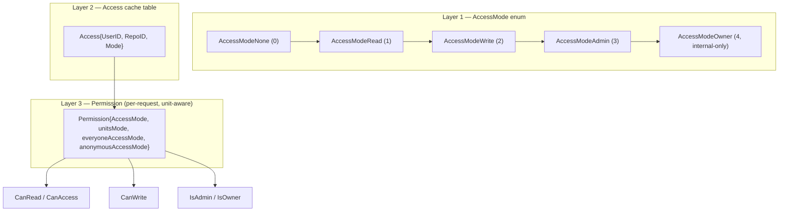
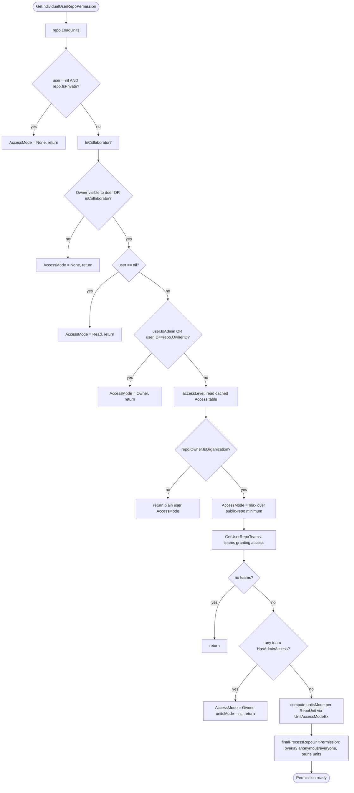
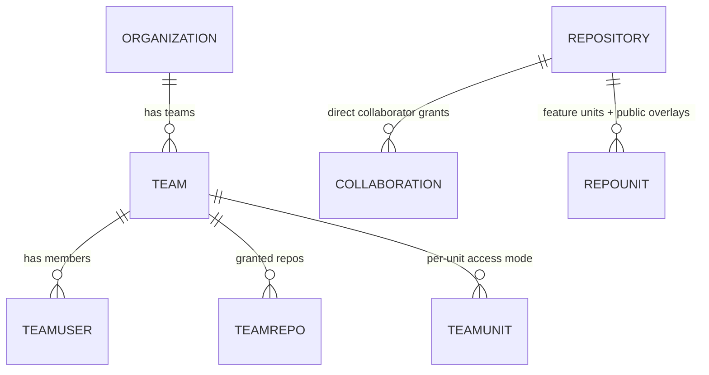
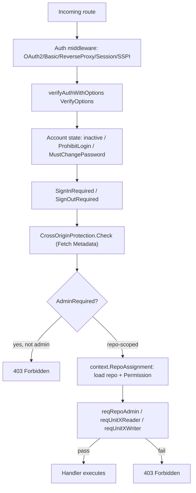
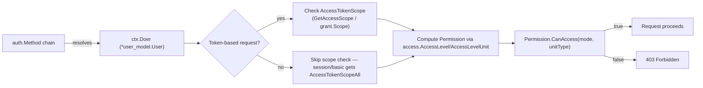

# Authorization / Permission Model

This page maps Gitea's authorization system as an **attack surface** — where access-control
decisions are made, what data structures back them, and where a scanner operator or reviewer
should focus manual/SAST attention for privilege-escalation or broken-access-control bugs. It
synthesizes `docs/05-database-models/permissions-model.md`, `docs/05-database-models/repository-model.md`,
`docs/05-database-models/user-organization-model.md`, `docs/06-web-routers/web-routes.md`,
`docs/07-rest-api/api-conventions-and-swagger.md`, `docs/08-services/auth-providers.md`,
`docs/08-services/services-catalog.md`, and `docs/02-architecture/request-lifecycle.md`.

> **Why this matters for scanning:** Trivy will not find logic flaws in an authorization model —
> that requires either manual review or SAST rules (opengrep/Semgrep) tuned to Gitea's specific
> vocabulary (`AccessMode`, `Permission.CanAccess`, `reqRepoAdmin`, `tokenRequiresScopes`, etc.).
> This page exists to give a scanner operator that vocabulary so custom rules can be written to
> catch missing/incorrect authorization checks in new code (e.g., a new route handler that
> forgets to call `reqRepoAdmin` or checks the wrong unit type).

## The Three-Layer Model

Gitea's authorization design (fully documented in the
[Permissions Model](../../docs/05-database-models/permissions-model.md)) layers three concepts:

1. **`AccessMode`** — a single ordered enum used everywhere to express "how much can this actor do."
2. **`Access`** — a denormalized cache table storing the max access mode a *specific user* has on a
   *specific repository*, avoiding expensive joins on every request.
3. **`Permission`** — a unit-aware struct computed per-request that combines the baseline
   `AccessMode` with per-feature (per-`unit.Type`) overrides from team grants and public-access
   overlays.



### Layer 1 — `AccessMode`

```go
type AccessMode int

const (
    AccessModeNone AccessMode = iota // 0: no access

    AccessModeRead  // 1: read access
    AccessModeWrite // 2: write access
    AccessModeAdmin // 3: admin access
    AccessModeOwner // 4: owner access
)
```

Because values are ordered integers, checks like `mode >= perm.AccessModeWrite` are pervasive.
`ParseAccessMode(s, allowed...)` converts user-supplied strings (`"read"`, `"write"`, `"admin"`)
back into the enum — and **`"owner"` is intentionally excluded from string parsing**, since it's
an internal-only level that must never be settable via user input (API payloads, forms). This is
a load-bearing security control: any code path that accidentally allows `ParseAccessMode` to
accept `"owner"` from an untrusted source would be a privilege-escalation bug worth flagging.

### Layer 2 — The `Access` Cache Table

```go
type Access struct {
    ID     int64 `xorm:"pk autoincr"`
    UserID int64 `xorm:"UNIQUE(s)"`
    RepoID int64 `xorm:"UNIQUE(s)"`
    Mode   perm.AccessMode
}
```

Important nuance: `Access` **does not cover the repository owner** — owner access is implicit
(`AccessModeOwner` whenever `userID == repo.OwnerID`), computed on the fly rather than cached.
Only collaborators and org-team members get rows here. Recalculation is handled by:

| Function | When used |
|---|---|
| `RecalculateAccesses(ctx, repo)` | Full recompute — dispatches to team-based or collaborator-based recompute depending on whether the owner is an org |
| `RecalculateTeamAccesses(ctx, repo, ignTeamID)` | Recomputes access for an org-owned repo from all its teams' members |
| `RecalculateUserAccess(ctx, repo, uid)` | Fast path: recompute for a single user |

A subtlety with security relevance: `minModeToKeep` means a **public, non-org-owned repo** does
not persist `Access` rows below `Write` (read is already implicit), while **private repos or
org-owned repos** persist from `Read` upward, since nothing is implicit there. A bug in this
threshold logic could either bloat the cache table or, worse, cause a stale/incorrect cached read
for a private repo.

### Layer 3 — Unit-Aware `Permission`

The `Access` table gives one mode per repository, but real authorization is **per-feature**: a
user might have `Write` on Issues but only `Read` on Code (e.g., an external triager). This is
`Permission` (`models/perm/access/repo_permission.go`):

```go
type Permission struct {
    AccessMode perm_model.AccessMode // baseline mode (repo-wide)

    units     []*repo_model.RepoUnit
    unitsMode map[unit.Type]perm_model.AccessMode // per-unit override (from team grants)

    everyoneAccessMode  map[unit.Type]perm_model.AccessMode // min mode for any signed-in user
    anonymousAccessMode map[unit.Type]perm_model.AccessMode // min mode for anonymous visitors
}
```

The resolution function is the single most security-critical piece of logic on this page:

```go
func (p *Permission) UnitAccessMode(unitType unit.Type) perm_model.AccessMode {
    if m, ok := p.unitsMode[unitType]; ok {
        return util.Iif(p.AccessMode >= perm_model.AccessModeAdmin, p.AccessMode, m)
    }
    unitDefaultAccessMode := p.AccessMode
    unitDefaultAccessMode = max(unitDefaultAccessMode, p.anonymousAccessMode[unitType])
    unitDefaultAccessMode = max(unitDefaultAccessMode, p.everyoneAccessMode[unitType])
    hasUnit := slices.ContainsFunc(p.units, func(u *repo_model.RepoUnit) bool { return u.Type == unitType })
    return util.Iif(hasUnit, unitDefaultAccessMode, perm_model.AccessModeNone)
}
```

Rules encoded here, as documented in the
[Permissions Model](../../docs/05-database-models/permissions-model.md):

1. A **per-unit override** (from a team's `TeamUnit` grant) wins — *unless* the user's baseline is
   already `Admin`/`Owner`, in which case the higher baseline wins (an admin can't be downgraded
   by a narrower team grant).
2. Without an override, fall back to `max(baseline, anonymousAccessMode[unit], everyoneAccessMode[unit])`
   — this is how a `RepoUnit.AnonymousAccessMode`/`EveryoneAccessMode` setting (e.g. "let anyone
   read the Wiki") grants access even to users with no explicit relationship to the repo.
3. But **only if the repository actually has that unit enabled** (`hasUnit`) — a disabled unit is
   always `AccessModeNone` regardless of overrides. Any bypass of this `hasUnit` gate would let a
   user access a feature the repo owner explicitly disabled.

Convenience wrappers exposed on `Permission`: `CanAccess`, `CanAccessAny`, `CanRead`, `CanReadAny`,
`CanWrite`, `CanReadIssuesOrPulls(isPull)`, `CanWriteIssuesOrPulls(isPull)`, `IsOwner()`,
`IsAdmin()`, `HasAnyUnitAccess()`, `HasAnyUnitPublicAccess()`, `ReadableUnitTypes()`.

## Computing Permission for a Real Request

`GetIndividualUserRepoPermission` (wrapped by `GetDoerRepoPermission`, which additionally detects
Actions-task "virtual users" and routes to `GetActionsUserRepoPermission`) is the main entry point
every handler ultimately calls:



Key special cases worth flagging to any reviewer of new authorization code:

- **Site admins** and the **repository owner** always short-circuit to `AccessModeOwner`,
  bypassing unit checks entirely — this is by design, but any new code path that treats "is admin"
  differently from this canonical check risks inconsistency.
- Users **blocked from viewing a private owner** (`organization.HasOrgOrUserVisible`) get `None`
  unless the `isCollaborator` override applies.
- For org-owned repos, if **any** team the user belongs to has `HasAdminAccess()` (the Owners team,
  or another team configured with `AccessMode >= Admin`), the entire `unitsMode` map is cleared
  and `AccessMode = Owner` — admin teams always get full access to every unit, sidestepping
  per-unit team grants entirely.
- Otherwise, `unitsMode[u.Type]` is the **max across all the user's teams'** `UnitAccessModeEx`
  results for that unit — `Team.UnitAccessModeEx` reads the `TeamUnit` row, falling back to the
  team's overall `AccessMode` when `HasAdminAccess()`.

### Other permission entry points (surface for auditing)

| Function | Purpose |
|---|---|
| `AccessLevel(ctx, user, repo)` | Legacy/simple wrapper returning just the repo-wide `AccessMode` |
| `AccessLevelUnit(ctx, user, repo, unitType)` | Same, but for one specific unit |
| `HasAccessUnit(ctx, user, repo, unitType, testMode)` | Boolean convenience check |
| `IsUserRepoAdmin` / `IsUserRealRepoAdmin` | Whether the user is (effectively) a repo admin — "real" excludes site-admin escalation |
| `CanBeAssigned(ctx, user, repo)` | Whether a user is eligible to be assigned to issues/PRs |
| `GetUsersWithUnitAccess` / `GetUserIDsWithUnitAccess` | Enumerate users with at least a given mode on a unit |
| `CheckRepoUnitUser(ctx, repo, user, unitType)` | Boolean shortcut combining `GetDoerRepoPermission` + `CanRead` |
| `PermissionNoAccess()` | Zero-value `Permission{AccessMode: AccessModeNone}` — the safe default |
| `GetActionsUserRepoPermission` | Special-cased permission resolution for CI/Actions "virtual" users, including cross-repo access for same-owner workflows (`checkSameOwnerCrossRepoAccess`, `CanReadWorkflowCrossRepo`) |

> Any of these functions being called with a mismatched `unitType`, or a caller reading
> `AccessLevel` (repo-wide) when it actually needed `AccessLevelUnit` (per-feature), is a classic
> class of broken-access-control bug in a system like this. When writing custom opengrep/Semgrep
> rules, consider flagging handler code that calls a repo-wide check but then serves unit-specific
> content (e.g., issues, wiki, packages).

## Repository Units: The Feature-Toggle Surface

As described in the [Repository Model](../../docs/05-database-models/repository-model.md), Gitea
avoids a sprawl of boolean columns (`HasIssues`, `HasWiki`, ...) by modeling each optional feature
as a `RepoUnit` row:

| Type | Value | Description |
|---|---|---|
| `TypeCode` | 1 | Source code browsing |
| `TypeIssues` | 2 | Native issue tracker |
| `TypePullRequests` | 3 | Pull requests |
| `TypeReleases` | 4 | Releases |
| `TypeWiki` | 5 | Native wiki |
| `TypeExternalWiki` | 6 | Link to an external wiki (read-only unit, capped at `AccessModeRead`) |
| `TypeExternalTracker` | 7 | Link to an external tracker (read-only unit, capped at `AccessModeRead`) |
| `TypeProjects` | 8 | Kanban-style projects |
| `TypePackages` | 9 | Package registry |
| `TypeActions` | 10 | CI/CD (Actions) |

```go
type RepoUnit struct {
    ID                  int64
    RepoID              int64              `xorm:"INDEX(s)"`
    Type                unit.Type          `xorm:"INDEX(s)"`
    Config              convert.Conversion `xorm:"TEXT"`
    CreatedUnix         timeutil.TimeStamp `xorm:"INDEX CREATED"`
    AnonymousAccessMode perm.AccessMode    `xorm:"NOT NULL DEFAULT 0"`
    EveryoneAccessMode  perm.AccessMode    `xorm:"NOT NULL DEFAULT 0"`
}
```

`AnonymousAccessMode`/`EveryoneAccessMode` deliberately let a repo owner open a single unit (e.g.
Wiki) to anonymous visitors or any signed-in user, **independent of the collaborator/team access
system** — an intentional public-access escape hatch. `applyPublicAccessPermission` (part of
`finalProcessRepoUnitPermission`) is a no-op instance-wide when `setting.Repository.ForcePrivate`
is set, which is the configuration knob that should be checked in any hardened, "private-instance
only" deployment (see the [Configuration Hardening](../04-configuration-hardening/security-relevant-settings.md)
page).

`MustGetUnit` never errors — it returns a synthetic, defaulted `RepoUnit` when a unit isn't
enabled, which is the safe accessor pattern for handler code that shouldn't crash on a disabled
feature.

## Collaborators, Teams, and Organizations

### Collaboration (direct grants)

A repository's `Collaboration` records grant a specific `AccessMode` to a specific user directly
on that repo, independent of organization/team membership (referenced in
[Repository Model](../../docs/05-database-models/repository-model.md) and managed by
`services/repository/collaboration.go`, per the
[Services Catalog](../../docs/08-services/services-catalog.md)).

### Teams and `TeamUnit` (org-scoped grants)

From [User & Organization Model](../../docs/05-database-models/user-organization-model.md):

```go
const OwnerTeamName = "Owners"

type Team struct {
    ID                      int64 `xorm:"pk autoincr"`
    OrgID                   int64 `xorm:"INDEX"`
    AccessMode              perm.AccessMode    `xorm:"'authorize'"` // team-wide default access mode
    Units                   []*TeamUnit         `xorm:"-"`
    IncludesAllRepositories bool                `xorm:"NOT NULL DEFAULT false"`
    CanCreateOrgRepo        bool                `xorm:"NOT NULL DEFAULT false"`
    Visibility              structs.VisibleType `xorm:"NOT NULL DEFAULT 2"`
}

type TeamUnit struct {
    ID         int64
    OrgID      int64     `xorm:"INDEX"`
    TeamID     int64     `xorm:"UNIQUE(s)"`
    Type       unit.Type `xorm:"UNIQUE(s)"`
    AccessMode perm.AccessMode
}
```

Security-relevant facts:

- Every organization automatically has an **"Owners" team**; its members get `perm.AccessModeOwner`
  on every org repository regardless of per-repo/per-unit configuration. Compromising membership
  of the Owners team (e.g. via a group-sync misconfiguration, see below) is equivalent to full
  organization compromise.
- `Team.HasAdminAccess()` (true when `AccessMode >= perm.AccessModeAdmin`) causes
  `GetUnitNames`/`GetUnitsMap` to short-circuit to *every* unit at admin level, bypassing
  per-unit `TeamUnit` rows entirely.
- `IncludesAllRepositories` grants automatic access to every repo in the org, **current and
  future**, bypassing the `TeamRepo` join table — a team configured this way is effectively an
  org-wide access grant and should be audited carefully.
- `Team.Visibility` (`Public`/`Limited`/`Private`) governs whether non-members can even see the
  team and its member list (`CanNonMemberReadMeta`) — a separate, lower-stakes information
  disclosure control from repo access itself.



### Group Sync — external identity provider → Team mapping

As documented in [Auth Providers](../../docs/08-services/auth-providers.md), LDAP and OAuth2/OIDC
sources can automatically manage org/team membership from group claims
(`services/auth/source/source_group_sync.go`), configured as JSON:

```json
{"cn=my-group,cn=groups,dc=example,dc=org": {"MyGiteaOrganization": ["MyGiteaTeam1", "MyGiteaTeam2"]}}
```

> **Attack-surface note:** because Owners-team membership implies full organizational
> `AccessModeOwner`, any misconfiguration of `GroupTeamMap` that maps a broad or attacker-influenced
> external group (e.g. a default "all employees" LDAP group, or an OIDC claim an end-user can
> influence) directly to an Owners team, or to any team with `HasAdminAccess()`, is a critical
> privilege-escalation risk. `GroupTeamMapRemoval` controls whether membership is revoked when a
> user leaves the source group — if disabled, stale elevated access can persist after an
> organizational change on the identity-provider side. This is exactly the kind of configuration
> issue worth checking for in any `app.ini`/LDAP-source review that accompanies a security scan.

## User Types and Special Flags

From [User & Organization Model](../../docs/05-database-models/user-organization-model.md), the
single `user` table backs individuals, organizations, bots, and federated users, and carries
several authorization-relevant boolean flags on the same row:

| Field | Meaning | Security relevance |
|---|---|---|
| `IsAdmin` | Site administrator | Bypasses `AccessLevel`/`AccessLevelUnit` checks entirely via the `SuperUser` branch in `GetIndividualUserRepoPermission` |
| `IsRestricted` | Only sees explicitly-granted repos/orgs | A hardening flag for accounts that should not benefit from public-repo implicit-read access |
| `ProhibitLogin` | Blocks Web UI login only | Does **not** block API/token-based access by itself — worth confirming during a review whether this flag is checked consistently across all auth paths |
| `MustChangePassword` | Forces password reset | Enforced by `verifyAuthWithOptions` per [Request Lifecycle](../../docs/02-architecture/request-lifecycle.md) |
| `RepoAdminChangeTeamAccess` (org-only field, same row) | Whether repo admins (not just org owners) can change which teams have access to a repo | A delegation-of-authority setting; if unexpectedly `true`, repo-level admins effectively gain a slice of org-admin capability |

`Organization` is a **zero-cost type cast** over `User` (`type Organization user_model.User`),
sharing the same table — this design means any authorization bug that fails to distinguish
"is this User an Organization" (`user.IsOrganization()`) from "is this User an individual" could
misapply the wrong permission-resolution branch (individual owner vs. org-team resolution) shown
in the flowchart above.

## Where This Is Enforced: Web Routes, API, and CLI

### Web router guard functions

Per [Web Router & Server-Rendered UI](../../docs/06-web-routers/web-routes.md), route groups
attach small guard closures as middleware:

- `reqSignIn` / `reqSignOut` / `optSignIn` — require/forbid a signed-in doer.
- `reqUnitAccess(unitType, accessMode, ignoreGlobal)` — checks organization/unit-level permission
  for owner-page sections (projects, code search, etc.).
- `context.RequireUnitReader(...)` / `context.RequireUnitWriter(...)` — aliased per-feature as
  `reqRepoIssuesOrPullsReader`, `reqUnitCodeReader`, `reqRepoAdmin`, `reqUnitWikiReader/Writer`,
  `reqRepoReleaseReader/Writer`, `reqRepoActionsReader`, etc.
- Repository **settings** routes (collaborators, branch/tag protection, webhooks, deploy keys, LFS
  admin, Actions secrets/variables/runners) are gated by `reqSignIn` + `context.RepoAssignment` +
  `reqRepoAdmin` as one shared block.
- Organization routes split into a `RequireMember`/`RequireTeamMember` group (dashboard, issues,
  pulls, milestones, teams) and a stricter `RequireOwner` group (`/teams/new`, `/worktime`, and the
  entire `/settings` subtree).
- The **admin panel** (`/-/admin`) is guarded by `adminReq`, a `verifyAuthWithOptions`-based
  site-admin check, wrapping dashboard, user/org/repo/package management, webhooks, auth sources,
  and global Actions settings.



For **Git-over-HTTP** specifically (`routers/web/githttp.go` / `routers/web/repo/githttp.go`),
`httpBase()` computes the required `perm.AccessMode` from the Git service type — `Read` for
`git-upload-pack` (clone/fetch), `Write` for `git-receive-pack` (push) — checks
`context.CheckRepoScopedToken` for repo-scoped access tokens, blocks pushes to archived/mirror
repos, and validates that 2FA-enabled accounts cannot authenticate with plain Basic auth. Actual
push authorization at the ref level (branch protection, tag protection, force-push rules, PR
head-branch maintainer-edit rules, LFS quota/size limits) happens **later**, in the server-side
`pre-receive` git hook, which calls back into `/api/internal/hook/pre-receive` — meaning a
security review of "can this user push" must trace through **both** `httpBase()` and the
`pre-receive` hook handler, not just one.

### REST API — token scopes layered on top of `AccessMode`

Per [API Conventions & Swagger](../../docs/07-rest-api/api-conventions-and-swagger.md), the API
adds a **second, independent gate** on top of the repository `Permission` model: token/OAuth2
**scopes**.

```go
const (
    AccessTokenScopeCategoryActivityPub AccessTokenScopeCategory = iota
    AccessTokenScopeCategoryAdmin
    AccessTokenScopeCategoryMisc
    AccessTokenScopeCategoryNotification
    AccessTokenScopeCategoryOrganization
    AccessTokenScopeCategoryPackage
    AccessTokenScopeCategoryIssue
    AccessTokenScopeCategoryRepository
    AccessTokenScopeCategoryUser
)
```

| Middleware | Meaning |
|---|---|
| `reqToken()` | Caller must be signed in (via any auth method) |
| `reqBasicOrRevProxyAuth()` | Only Basic Auth or reverse-proxy auth accepted (token management endpoints) |
| `reqSiteAdmin()` | Caller must be a site administrator |
| `reqOwner()` | Caller must own the repo (or be a site admin) |
| `reqAdmin()` | Caller must be a repo admin/collaborator with admin rights |
| `reqRepoWriter(unitTypes...)` | Caller must have write access to specific repo unit(s) |
| `reqRepoReader(unitType)` | Caller must have read access to a specific repo unit |
| `reqAnyRepoReader()` | Caller must have read access to at least one repo unit |
| `reqOrgOwnership()` | Caller must own the organization |
| `reqSelfOrAdmin()` | Caller must be the target user or a site admin |
| `individualPermsChecker` | Enforces visibility rules (private/limited) on user-scoped endpoints |

Both gates must pass for a token-authenticated request to succeed:



A token with `write:repository` scope still cannot write to a repository the user has no write
access to — and conversely, a fully-privileged user's session cannot bypass a narrowly-scoped
token's restrictions. **`AccessTokenScopePublicOnly`** further restricts a token to public
resources regardless of other scopes granted; this is enforced ad hoc per-resource (e.g. the
packages API explicitly rejects non-public owners for public-only tokens) rather than centrally
— a pattern worth double-checking for completeness whenever a new resource type is added, since a
missed `rejectPublicOnly()`/`checkTokenPublicOnly()` call would silently leak private data to a
"public-only" token.

`Sudo` (`SudoParam`/`SudoHeader`) lets a site admin perform a request "as" another user —
admin-only, but any endpoint that fails to gate the `sudo()` middleware behind an admin check
would be a direct impersonation vulnerability.

### CLI / admin escalation paths

Per [CLI & Admin Operations](../../docs/16-cli-admin/cli-commands.md), several CLI subcommands
operate entirely outside the web/API authorization stack (they run with the privileges of the
process/host operator, not an authenticated Gitea user):

| Command | Effect |
|---|---|
| `admin user create --admin` | Creates a user with `IsAdmin = true` directly |
| `admin user change-password` | Sets a new password for any user, no old-password check |
| `admin user generate-access-token` | Mints a personal access token for any user |
| `admin user must-change-password` | Forces/unforces password change |
| `admin regenerate keys` | Rewrites the SSH `authorized_keys` file from the DB |

> These commands are an intentional break-glass/administration surface, but they mean **host/CLI
> access is equivalent to full application-level admin access** — a fact worth noting explicitly
> in any threat model, since Trivy-class scanning of the deployment environment (container image
> permissions, who can exec into the Gitea container/host) is just as relevant to authorization
> integrity as scanning the application code itself.

## User Blocking as an Authorization-Adjacent Control

`services/user/block.go` (per the
[Services Catalog](../../docs/08-services/services-catalog.md)) implements user-to-user blocking:
`BlockUser`/`UnblockUser` unstar/unwatch repos in both directions, cancel pending repo transfers
between the two users, unassign issues, and remove collaborations
(`unstarRepos`, `unwatchRepos`, `cancelRepositoryTransfers`, `unassignIssues`,
`removeCollaborations`). `CanBlockUser`/`CanUnblockUser` gate the operation itself (e.g. you can't
block an org you're a member of in a way that would break your own access). Per
[User & Organization Model](../../docs/05-database-models/user-organization-model.md), the
underlying `Blocking{BlockerID, BlockeeID, Note}` table (`user_blocking`) means blocked users
"can't star/watch/follow/interact" — **and admins are exempt from being blocked**, which is
consistent with the site-admin bypass seen throughout the permission model, but is worth calling
out explicitly since it means blocking is not a security boundary against a malicious admin
account.

## Threat Model Summary

| Threat | Relevant Control | Where to Look |
|---|---|---|
| Privilege escalation via crafted API payload setting access mode to `"owner"` | `ParseAccessMode` excludes `"owner"` from the parseable set | `models/perm/access_mode.go` (per Permissions Model docs) |
| Broken access control: handler checks wrong unit type or repo-wide instead of per-unit mode | `Permission.UnitAccessMode` / `CanAccess` | `models/perm/access/repo_permission.go`; audit any new route's guard middleware choice |
| Stale/incorrect cached `Access` row leaking write access after a collaborator is removed | `RecalculateUserAccess` / `refreshAccesses` diffing logic | `models/perm/access/access.go` |
| Identity-provider group sync granting Owners-team / admin-team membership too broadly | `GroupTeamMap` / `GroupTeamMapRemoval` configuration | `services/auth/source/source_group_sync.go`; review `app.ini` LDAP/OAuth2 source config |
| Token scope bypass (e.g. public-only token reading private data) | `tokenRequiresScopes`, `checkTokenPublicOnly`, `rejectPublicOnly` | `routers/api/v1/api.go`, resource-specific handlers |
| Missing `reqRepoAdmin`/`reqSignIn` on a new settings route | Route-group middleware chain | `routers/web/web.go`, `registerWebRoutes` |
| Push authorization bypass at the Git-transport layer | `httpBase()` + server-side `pre-receive` hook | `routers/web/repo/githttp.go`, `/api/internal/hook/pre-receive` |
| Impersonation via `Sudo` header/param without admin check | `sudo()` middleware | `routers/api/v1/api.go` |
| Host/CLI-level admin bypass of application authorization entirely | `admin user create --admin`, `admin regenerate` | `cmd/admin_user_create.go`, `cmd/admin_regenerate.go` — a deployment/host-hardening concern, not fixable in application code |

## Cross-References

- [Authentication & Sessions](authentication-and-sessions.md) — how `ctx.Doer` is established before any of the above permission checks run.
- [Input Handling & XSS Defense](input-handling-and-xss-defense.md) — what happens once a request is authorized but contains untrusted content.
- [SSRF, Webhooks & Outbound Requests](ssrf-webhooks-and-outbound-requests.md) — authorization-adjacent controls on server-initiated outbound requests.
- [Configuration Hardening](../04-configuration-hardening/security-relevant-settings.md) — `ForcePrivate`, restricted-user defaults, and other `app.ini` knobs referenced above.
- [Running Trivy and Opengrep](../06-scanning-playbook/running-trivy-and-opengrep.md) — how to translate the vocabulary on this page into concrete SAST rule ideas.
