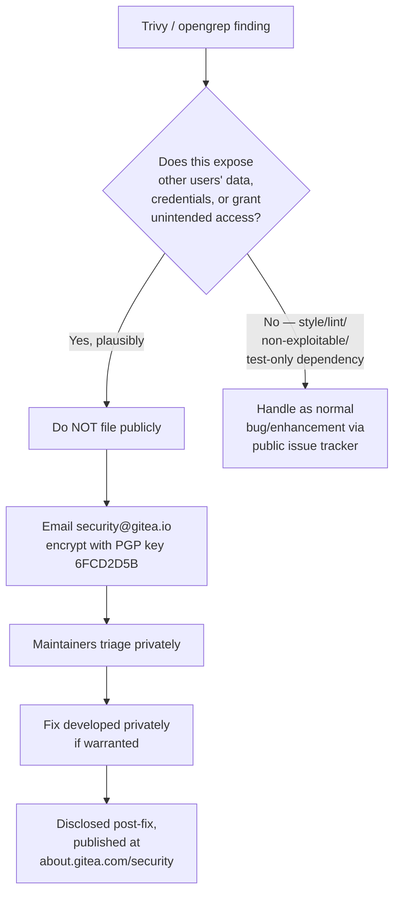

# Vulnerability Disclosure Process

You have plugged Trivy or opengrep into this repository and gotten a hit. Before you file anything
publicly, read this page. Gitea has an explicit, narrow channel for handling real security findings,
and it is **not** the public issue tracker. This page synthesizes the disclosure process from
`SECURITY.md`, the issue-triage conventions in `CONTRIBUTING.md`, and the security-fix backport/EOL
policy in `docs/release-management.md`, and connects them back to the scanning workflow described in
[Running Trivy and Opengrep](../06-scanning-playbook/running-trivy-and-opengrep.md).

> **Scope note:** This page describes *process*, not a technical control. It exists precisely because
> scanners generate findings that must be triaged by a human before anything becomes public — a
> Trivy CVE hit on a dependency or an opengrep secret-detection match is a *candidate* security issue,
> not automatically a confirmed one, and how you disclose it matters as much as what you found.

## The Golden Rule: Never File Security Issues Publicly

Per `SECURITY.md`:

> "If you discover a security issue, please bring it to their attention right away! ... Please
> **DO NOT** file a public issue, instead send your report privately to `security@gitea.io`."

`CONTRIBUTING.md` reinforces this in its issue-taxonomy section, defining a distinct issue category
specifically to keep security reports out of the public tracker:

> "`security issue`: bug that has serious implications such as leaking another users data. Please do
> not file such issues on the public tracker and send a mail to security@gitea.io instead"
> (`CONTRIBUTING.md`)

And again in the contribution guidelines' introduction:

> "Sensitive security-related issues should be reported to
> [security@gitea.io](mailto:security@gitea.io)." (`CONTRIBUTING.md`)

The repetition across both documents is deliberate — this is the one issue category in Gitea's
taxonomy (alongside `bug`, `feature`, `enhancement`, `refactoring`) that is explicitly routed *away*
from the normal GitHub workflow rather than into it.

### Why This Matters for Scanner-Generated Findings

Automated tools amplify the risk of accidental public disclosure because they:

- Generate findings in bulk, some of which may be routine noise but some of which may be genuinely
  exploitable (e.g., a hardcoded credential opengrep flags, or a critical-severity CVE Trivy flags in
  a directly-reachable dependency).
- Are often wired into CI, where output can land in public build logs, PR comments, or
  automatically-filed issues if not carefully gated.
- May be run by contributors or third parties who aren't as familiar with Gitea's internal triage
  conventions as a maintainer would be.

> **Operational guidance:** If you are integrating Trivy/opengrep into any CI pipeline for this
> project, ensure findings above a "this could be a real, exploitable issue in this codebase" bar are
> **not** auto-posted to public PR comments, public issue trackers, or public build logs. Route them
> to a private channel for human triage first. This is not spelled out mechanically in the source docs
> as CI configuration, but it is a direct, necessary consequence of the `SECURITY.md` disclosure rule
> when scanners are added to the pipeline.

## Reporting Channel and Encryption

| Element | Value | Source |
|---|---|---|
| Reporting address | `security@gitea.io` | `SECURITY.md` |
| Public issue tracker | **Explicitly prohibited** for security issues | `SECURITY.md`, `CONTRIBUTING.md` |
| Encryption | PGP key provided for encrypting mail body | `SECURITY.md` |
| PGP Key ID | `6FCD2D5B` | `SECURITY.md` |
| PGP Key Type / Size | RSA, 4096/4096 | `SECURITY.md` |
| PGP Fingerprint | `3DE0 3D1E 144A 7F06 9359 99DC AAFD 2381 6FCD 2D5B` | `SECURITY.md` |
| PGP Key validity | Valid until July 4, 2026 | `SECURITY.md` |
| PGP UserID | `Gitea Security <security@gitea.io>` | `SECURITY.md` |
| Historical disclosures | Published at `https://about.gitea.com/security` | `SECURITY.md` |
| Reporter acknowledgment | Public thanks offered; reporter's name kept confidential on request | `SECURITY.md` |

> **Key-expiry caveat:** `SECURITY.md` states the published PGP key is valid until **July 4, 2026**.
> As of this writing (July 14, 2026), that expiry date has already passed. If you are encrypting a
> report and this key appears expired or rejected by your mail/PGP client, **do not fall back to
> sending the report in plaintext** — instead, check `https://about.gitea.com/security` or Gitea's
> current published security policy for an updated key before transmitting sensitive details. This
> discrepancy is called out here rather than glossed over, per the source-fidelity conventions for
> this documentation set (see [`STYLE_GUIDE.md`](../STYLE_GUIDE.md)).

The full PGP public key block is embedded in `SECURITY.md` at the repository root — retrieve it
directly from that file (or from `https://about.gitea.com/security`) rather than copying it out of
derived documentation, to avoid transcription risk with sensitive cryptographic material.

## What Counts as a "Security Issue" vs. a Regular Bug

`CONTRIBUTING.md`'s issue taxonomy draws a specific line:

| Category | Definition (from `CONTRIBUTING.md`) | Routing |
|---|---|---|
| `bug` | "Something in the frontend or backend behaves unexpectedly" | Public issue tracker |
| `security issue` | "bug that has serious implications such as leaking another users data" | **Private** — `security@gitea.io` only |
| `feature` | "Completely new functionality" | Public issue tracker |
| `enhancement` | "An existing feature should get an upgrade" | Public issue tracker |
| `refactoring` | "Parts of the code base don't conform with other parts..." | Public issue tracker |

The defining characteristic called out in the source material is **impact to data confidentiality or
integrity for other users** ("leaking another users data" is the explicit example given) — not merely
that a tool flagged something. This is the practical triage question to ask before deciding whether a
scanner finding needs the private channel:

> **Judgment call, not automation:** Nothing in the source docs describes an automated classifier for
> this decision — it is a human triage step. When in doubt about whether a finding is sensitive enough
> to warrant private disclosure, err toward the private channel; the cost of a maintainer downgrading
> an over-cautious private report is far lower than the cost of a live exploit being disclosed publicly.

## How This Interacts With Existing (Non-Fatal) CI Security Tooling

As covered in [Existing Security Tooling in CI](../02-ci-security-tooling/existing-security-tooling-in-ci.md),
Gitea's CI already runs `govulncheck` via the `security-check` Make target — but per
`docs/build-cicd-deployment/makefile-and-build.md`, this check is currently **non-fatal**, invoked with
a trailing `|| true`. That means:

- A known-vulnerable dependency can currently pass CI without blocking a merge.
- If you (or Trivy, running independently) surface a CVE that `govulncheck` should have caught but
  didn't fail the build on, that is itself worth reporting through the appropriate channel:
  - If the underlying CVE is exploitable and currently affects a running Gitea instance in a way that
    could leak data or grant unauthorized access → treat it as a **security issue** and use
    `security@gitea.io`.
  - If it's simply "this tool's threshold seems too permissive" as a process/tooling observation
    (no live exploit path demonstrated) → this is process feedback, appropriate for a normal
    `enhancement`/`refactoring` issue or PR discussion, not the private security channel.

This distinction matters because conflating "the scanner found something" with "this is an
exploitable security issue" is exactly the failure mode `SECURITY.md`'s narrow channel is designed to
prevent noise on. See the [Scanning Playbook](../06-scanning-playbook/running-trivy-and-opengrep.md)
for guidance on where in the existing pipeline new Trivy/opengrep coverage should slot in without
duplicating `govulncheck`/`zizmor`/`actionlint`.

## Security Fixes in the Release Cycle

Once a report is triaged and a fix is warranted, `docs/release-management.md` describes how security
fixes move through Gitea's release process — relevant context for understanding *when* a fix you
report might actually reach users:

- **Backport priority:** After the `rc0` release candidate ships for a cycle, backporting is
  restricted to "bug- and security-fixes, and small enhancements" — large refactors are explicitly
  excluded at that point. Security fixes retain backport eligibility even under freeze restrictions
  that block other change types (`docs/release-management.md`).
- **Backport mechanics:** Fixes are backported automatically by the project's backport bot when the
  originating PR carries a `backport/<version>` label and does not carry `backport/manual`
  (`docs/release-management.md`). A `security issue`-originated fix PR would follow the same
  labeling mechanism once it becomes a normal (non-sensitive, already-fixed) PR.
- **Supported version window:** Gitea supports "the last major release" plus one — e.g., if v1.26 is
  current, v1.26 and v1.25 are supported, but not v1.24. Critically: **"We will only publish security
  fixes for the last major release"** (`docs/release-management.md`). If you are scanning or reporting
  against an older, unsupported release line, do not expect a dedicated security patch for that line —
  upgrading to a supported release is the documented remediation path.
- **`main` branch caveat:** The release docs also note that tracking latest `main` is expected to keep
  you covered going forward, since `main` is the tip branch all fixes land on first.
- **Public disclosure timing:** `SECURITY.md` points to `https://about.gitea.com/security` as the
  system of record for previously-disclosed vulnerabilities — implying disclosure to the public
  happens after private triage/fix, not at the moment of initial report.

## Practical Checklist for Scanner Operators

Use this checklist when a Trivy or opengrep run surfaces something that might be a real security
issue in this codebase (as opposed to a false positive, dev-dependency-only finding, or style
violation):

1. **Do not open a public GitHub issue and do not post the finding in a public PR comment or public
   CI log**, per `SECURITY.md` and `CONTRIBUTING.md`.
2. **Assess exploitability and user-data impact** using the triage question above — "does this
   plausibly leak another user's data or grant unintended access?"
3. **If yes (or unsure):** email `security@gitea.io`. Encrypt the report body using the PGP key
   documented in `SECURITY.md` (Key ID `6FCD2D5B`) — but first verify that key hasn't expired against
   `https://about.gitea.com/security`, given the `SECURITY.md`-stated expiry of July 4, 2026 has
   already passed as of this writing.
4. **If no (routine dependency bump, lint-only finding, dev-only tooling issue):** file it as a normal
   `bug`, `enhancement`, or `refactoring` issue per `CONTRIBUTING.md`'s taxonomy, or fold it into
   normal PR review — see the cross-reference to existing tooling below so you don't duplicate a check
   that already runs in CI.
5. **Expect confidentiality on request:** `SECURITY.md` states reporters are "greatly appreciated"
   and publicly thanked, but their name is kept confidential if requested — useful to know if your
   organization has policies about attribution for externally-reported findings.
6. **Understand the backport/EOL implications:** a confirmed security fix is prioritized for backport
   even under release-freeze restrictions, but only for the last major release and its immediate
   predecessor (`docs/release-management.md`) — plan remediation expectations accordingly if you're
   scanning an older deployed version.

## Cross-References

- [Existing Security Tooling in CI](../02-ci-security-tooling/existing-security-tooling-in-ci.md) —
  what `govulncheck`, `zizmor`, and `actionlint` already cover, and the non-fatal `security-check` gap
  referenced above.
- [Running Trivy and Opengrep](../06-scanning-playbook/running-trivy-and-opengrep.md) — where to slot
  new scanning coverage into the existing pipeline without duplicating checks, and how to route the
  resulting findings.
- [Security Posture Overview](../01-overview/security-posture-overview.md) — the broader threat-model
  context a scanner finding should be evaluated against.
- [Supply Chain & Container Security](../05-supply-chain-and-container-security/build-release-and-container-posture.md) —
  release signing and dependency-pinning posture relevant to CVE findings on release artifacts.
