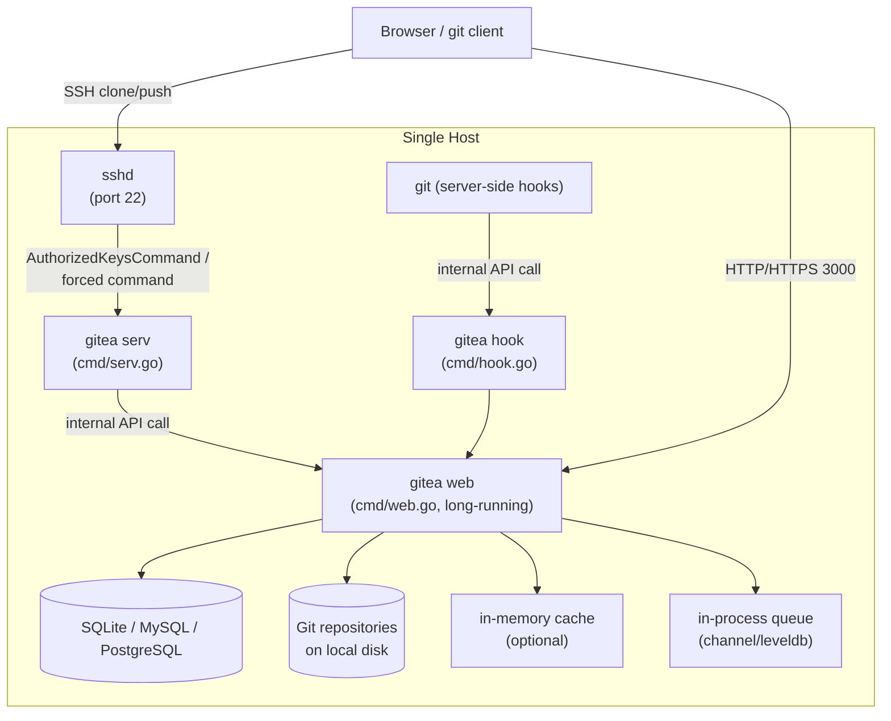
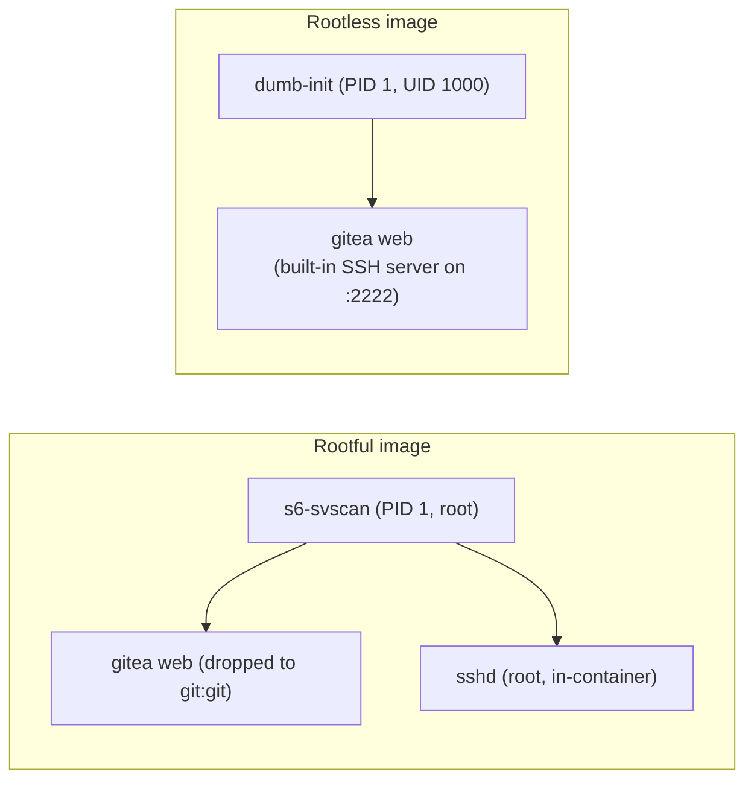
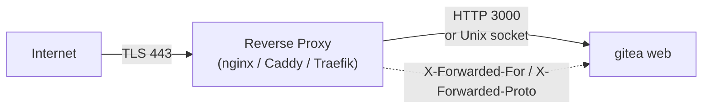
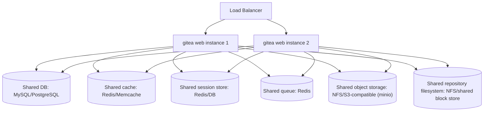

# Deployment Topologies

Gitea ships as a single statically-linkable Go binary (`gitea`) that can serve
HTTP(S)/FCGI, Git-over-SSH, and background workers from one process. This page
covers the main ways it is deployed in production: the single-binary install,
the two official Docker images (rootful and rootless), running behind a reverse
proxy, and what changes when you need high availability (HA).

## 1. Single-Binary Deployment

The simplest topology runs `gitea web` directly on a host (bare metal or VM),
typically supervised by `systemd` (see `contrib/service` for sample unit files)
or the FHS-compliant wrapper script in `contrib/fhs-compliant-script/gitea`.

Key characteristics:

- One long-running process, `gitea web`, handles all HTTP(S) traffic and hosts
  the background queue workers, cron jobs, and the internal API
  (`routers/private`).
- `sshd` (the OS's SSH daemon) is configured with an `AuthorizedKeysCommand`/
  forced command that invokes `gitea serv` (`cmd/serv.go`) for each SSH
  connection; `gitea serv` authenticates the key and either proxies the git
  pack protocol or calls back into `gitea web`'s internal API.
- Git server-side hooks (`pre-receive`, `update`, `post-receive`) are thin
  scripts that exec `gitea hook` (`cmd/hook.go`), which likewise talks to
  `gitea web` over the internal API rather than duplicating business logic in
  the short-lived hook process.
- By default, SQLite is used for a zero-dependency setup; MySQL/PostgreSQL/
  MSSQL are supported for anything beyond small, single-user instances.
- The default queue/cache/session backends are all in-process (`channel`/
  `level`/`memory`/`file`), which is fine for a single instance but does not
  survive process restarts gracefully and cannot be shared across multiple
  instances — see [HA Considerations](#4-high-availability-ha-considerations)
  below.

Protocol options supported by `cmd/web.go`'s `listen()` function
(`modules/setting.Protocol`): `http`, `https` (optionally with built-in ACME/
Let's Encrypt via `EnableAcme`, see `cmd/web_acme.go`), `fcgi`, `http+unix`, and
`fcgi+unix`. The Unix-socket variants are typically paired with a local reverse
proxy (nginx, Apache) that speaks to Gitea over a socket file rather than TCP.

## 2. Docker Deployment

Gitea publishes two Docker image variants, both built by multi-stage
Dockerfiles (`Dockerfile`, `Dockerfile.rootless`) that compile the frontend
(`make frontend` via Vite/pnpm) and backend (`make backend`) separately before
assembling the final Alpine-based runtime image.

### 2.1 Rootful image (`Dockerfile`)

- Base runtime: `alpine:3.24` with `git`, `openssh`, `linux-pam`, `s6`,
  `sqlite`, `su-exec`, `gnupg` installed.
- Process supervision: `s6-svscan` manages two long-running services defined
  under `docker/root/etc/s6/`: `gitea` (the `gitea web` process) and `openssh`
  (an in-container `sshd` for Git-over-SSH on port 22, as an alternative to
  routing SSH from the host).
- Runs as a dedicated `git` user (UID 1000) created at build time, but the
  entrypoint (`/usr/bin/entrypoint`) performs `chown`/permission fix-ups as
  root before dropping privileges via `su-exec` — hence "rootful": the
  container process starts as root to fix up bind-mounted volume permissions.
- Data directory: `/data` (a single `VOLUME`), containing the Gitea working
  directory, repositories, and (if using SQLite) the database file. `GITEA_CUSTOM=/data/gitea`
  points custom config/templates at this volume.
- Ports exposed: `22` (SSH) and `3000` (HTTP).

### 2.2 Rootless image (`Dockerfile.rootless`)

- Base runtime: `alpine:3.24` without `s6`/`su-exec`/`linux-pam`; uses
  `dumb-init` as PID 1 and a shell entrypoint
  (`/usr/local/bin/docker-entrypoint.sh`).
- Runs as a **fixed non-root UID:GID (1000:1000)** for the entire container
  lifetime — there is no root-owned fix-up step, which is friendlier to
  Kubernetes `PodSecurityPolicy`/`SecurityContext` restrictions
  (`runAsNonRoot`, read-only root filesystem, dropped capabilities).
- No in-container `sshd`; Git-over-SSH must be handled either by mapping port
  `2222` to an externally reachable port and running Gitea's **built-in SSH
  server** (`modules/ssh`, enabled via `[server] START_SSH_SERVER = true`)
  instead of relying on OpenSSH, or by omitting SSH support entirely.
- Two separate volumes are declared: `/var/lib/gitea` (working/data directory,
  `GITEA_WORK_DIR`) and `/etc/gitea` (configuration, `GITEA_APP_INI=/etc/gitea/app.ini`),
  which makes it easier to mount config as a read-only `ConfigMap`/secret
  separately from the read-write data volume in Kubernetes.
- Ports exposed: `2222` (built-in SSH) and `3000` (HTTP).

### 2.3 Choosing between them

| Concern | Rootful (`Dockerfile`) | Rootless (`Dockerfile.rootless`) |
|---|---|---|
| Container UID | Starts as root, drops to `git` | Fixed non-root `1000:1000` |
| SSH | OpenSSH `sshd` inside the container | Gitea's built-in SSH server |
| Volume layout | Single `/data` volume | Separate `/var/lib/gitea` + `/etc/gitea` |
| Best for | Traditional Docker/Compose hosts, easiest volume permission handling | Kubernetes, hardened container runtimes, `runAsNonRoot` policies |

Both images honor environment variables prefixed `GITEA__<SECTION>__<KEY>`
(handled by `modules/setting`'s environment-to-INI mapping) so `app.ini` values
can be injected via container env vars/Kubernetes secrets instead of (or in
addition to) a mounted config file.

## 3. Reverse Proxy Setups

Because Gitea listens on its own port (`3000` by default) and does not
terminate TLS for public traffic in most deployments, a reverse proxy
(nginx, Apache httpd, Caddy, Traefik, HAProxy) is commonly placed in front of
it to handle TLS termination, HTTP/2, compression offload, and virtual hosting
alongside other services on the same host.

Configuration touchpoints relevant to reverse-proxy setups (all in
`modules/setting/server.go` / `[server]` section unless noted):

- **`ROOT_URL`** must match the externally visible URL (scheme, host, and any
  sub-path) — Gitea uses this to generate absolute links, webhooks payloads,
  clone URLs, and SSH clone info. A mismatch here is the most common source of
  "links point to the wrong host" bugs behind a proxy.
- **`PROTOCOL`** can be set to `http+unix` so the reverse proxy talks to Gitea
  over a Unix domain socket instead of TCP, avoiding a loopback network hop.
- **`[server] REVERSE_PROXY_LIMIT` / `REVERSE_PROXY_TRUSTED_PROXIES`** — must
  be configured for Gitea to trust `X-Forwarded-For`/`X-Forwarded-Proto`
  headers set by the proxy (`routers/common.ForwardedHeadersHandler`,
  built on `github.com/chi-middleware/proxy`). Without this, Gitea will log the
  proxy's own IP as the client IP and may miscompute whether the request was
  HTTPS.
- **`ENABLE_GZIP`** can be disabled at the Gitea level if the reverse proxy
  already performs compression, to avoid double-compressing responses.
- **Sub-path hosting** (e.g. `https://example.com/gitea/`) requires
  `ROOT_URL` to include the sub-path and the reverse proxy to forward the
  `X-Forwarded-Prefix` (or equivalent) so `AppSubURL` is computed correctly;
  see the "Recommended reverse proxy configurations" section of the official
  Gitea admin documentation for concrete nginx/Apache/Caddy snippets.
- **WebSockets / SSE** — the live notification/event stream
  (`modules/eventsource`) and any long-polling connections need the proxy to
  avoid buffering or prematurely timing out long-lived connections
  (`proxy_buffering off`, generous `proxy_read_timeout` in nginx terms).
- **Git smart-HTTP and LFS** — large pushes/clones and LFS object transfer need
  the proxy's client body size limit (`client_max_body_size` in nginx) raised
  above Gitea's own defaults, and chunked transfer encoding must be permitted.

If TLS is terminated by Gitea itself instead of a proxy, `cmd/web_https.go` and
`cmd/web_acme.go` implement direct HTTPS serving, including built-in ACME
(Let's Encrypt) certificate management via `[server] ENABLE_ACME`.

## 4. High-Availability (HA) Considerations

Gitea's default configuration is optimized for a **single instance**: many
subsystems default to in-process, non-shared backends. Running multiple
`gitea web` instances behind a load balancer (for HA or horizontal scaling)
requires explicitly moving these subsystems to shared backends so that all
instances observe consistent state.

| Subsystem | Config section | Single-instance default | HA-safe backend(s) | Notes |
|---|---|---|---|---|
| Database | `[database]` | SQLite (file-based) | MySQL, PostgreSQL, MSSQL | SQLite is explicitly single-writer/single-host; HA requires a real network database. |
| Cache | `[cache] ADAPTER` | `memory` | `redis`, `memcache` | See `modules/setting/cache.go`; also configurable per-feature (`[cache.last_commit]`). |
| Session store | `[session] PROVIDER` | `memory` | `redis`, `db`, `mysql`, `postgres`, `memcache`, `couchbase` | See `modules/setting/session.go`; `memory`/`file` providers are per-process and break sticky-session-free load balancing. |
| Background queue | `[queue] TYPE` | `level` (embedded LevelDB) | `redis` | See `modules/setting/queue.go`; used by indexers, webhooks, mailer, mirror sync, notifications, actions, etc. Each named queue (`[queue.issue_indexer]`, `[queue.mailer]`, ...) can override the common `[queue]` section. |
| Global lock | `[global_lock] SERVICE_TYPE` | `memory` | `redis` (or a DB-based lock) | Coordinates cluster-wide mutexes (e.g. to avoid duplicate cron jobs firing on every node); see `modules/setting/gloabl_lock.go` and `modules/globallock`. |
| Object storage (avatars, attachments, LFS, packages, archives) | `[storage]`, `[storage.xxx]` | `local` (on-disk under `AppDataPath`) | `minio` (S3-compatible), Azure Blob | See `modules/setting/storage.go`; each storage-backed feature (`[lfs]`, `[attachment]`, `[avatar]`, `[repo-archive]`, `[packages]`) can point at its own bucket/section. |
| Git repository data | N/A (filesystem path) | Local disk under `[repository] ROOT` | Shared network filesystem (NFS) or one designated writer node with the rest read-only/behind a proxy | Gitea does not natively cluster raw repository storage; most HA guides recommend NFS for the repo root plus careful consideration of file-locking behavior, or a single "primary" node for all Git write operations with additional read replicas only for HTTP/HTTPS read paths. |
| Indexers (issue/code search) | `[indexer]` | Bleve (embedded, on-disk) | Elasticsearch, Meilisearch | See `modules/indexer`; embedded Bleve indexes are per-node and must be rebuilt/synced if not on shared storage or a networked search backend. |
| SSH | `[server] START_SSH_SERVER` or host `sshd` | Per-node | Any node can serve SSH if `authorized_keys`/host keys and the shared DB are consistent | Each node still needs its own SSH host key or a shared one; `gitea serv`/`gitea hook` must be able to reach whichever node holds authoritative state via the shared DB and repo storage. |
| Cron jobs | `[cron]` | Runs on every node independently | Combine with a shared `global_lock`/queue backend, or designate one node to run cron | Without a shared lock, every node will attempt scheduled tasks (e.g. mirror sync, cleanup) simultaneously, causing duplicate work or races. |

Practical guidance when designing a multi-node deployment:

1. Move the database to MySQL/PostgreSQL first — it is a hard requirement for
   any multi-node setup and SQLite is not supported for this topology.
2. Point `[cache]`, `[session]`, `[queue]`, and `[global_lock]` at a shared
   Redis instance (or dedicated instances per concern) so that requests can
   land on any node interchangeably (statelessness at the HTTP layer).
3. Move object storage (LFS objects, attachments, avatars, package blobs,
   archives) to an S3-compatible backend (`minio` storage type) rather than
   local disk, unless all nodes mount a shared, POSIX-correct network
   filesystem.
4. Decide how Git repository data is shared: either a shared network
   filesystem mounted by every node, or route all Git write traffic (SSH/HTTP
   push, hook execution) to a single primary node while allowing read-only
   traffic to be served by additional nodes.
5. Ensure only one node (or a properly locked set of nodes) runs `[cron]`
   jobs and scheduled background reconciliation to avoid duplicate work.
6. Terminate TLS and load-balance at a proxy tier in front of all nodes (see
   [Reverse Proxy Setups](#3-reverse-proxy-setups)), making sure
   `REVERSE_PROXY_TRUSTED_PROXIES` includes the load balancer's address(es).

> **Note:** Gitea does not ship a built-in clustering/consensus mechanism —
> "HA" here means running multiple stateless-as-possible `gitea web` processes
> against shared, externally-HA'd dependencies (database, Redis, object
> storage, shared filesystem), not a Gitea-native cluster protocol.

## Related Pages

- [System Architecture](system-architecture.md)
- [Request Lifecycle](request-lifecycle.md)
- [Module Dependency Map](module-dependency-map.md)
- [Configuration](../04-configuration/README.md)
- [Admin Guide](../18-admin-guide/README.md)
