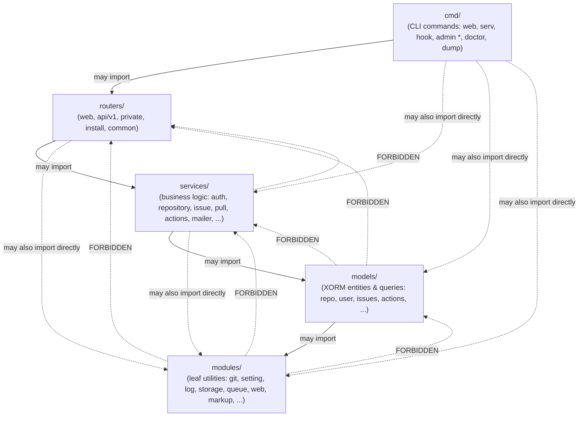

# Module Dependency Map

Gitea enforces a strict, one-directional dependency graph between its top-level
Go packages. This page documents that rule, shows how it is enforced by
tooling, and maps out the concrete import relationships between `cmd`,
`routers`, `services`, `models`, and `modules`.

## The Rule

As stated in [`docs/guidelines-backend.md`](../guidelines-backend.md):

> Dependencies only flow in one direction:
>
> ```text
> cmd → routers → services → models → modules
> ```
>
> A package on the left may import a package on its right, but never the
> reverse.

In practical terms:

- `modules/*` packages must have **no upward dependency** — they may not import
  anything from `models`, `services`, `routers`, or `cmd`. They are meant to be
  usable in isolation (and are, by many external Go projects that vendor pieces
  of Gitea's `modules`).
- `models/*` packages may depend on `modules/*` but never on `services/*`,
  `routers/*`, or `cmd/*`.
- `services/*` packages may depend on `models/*` and `modules/*` but never on
  `routers/*` or `cmd/*`.
- `routers/*` packages may depend on `services/*`, `models/*`, and `modules/*`
  but never on `cmd/*`.
- `cmd/*` sits at the top and may depend on everything below it.



> Solid arrows are the allowed direction of `import`. Dashed red arrows mark the
> directions that are architecturally forbidden — a lower layer must never
> import a higher layer.

## Why the Rule Exists

- **Testability**: `modules` and `models` can be unit tested without pulling in
  HTTP routing, session handling, or CLI parsing.
- **Reuse**: `modules/git`, `modules/markup`, `modules/setting`, and similar
  packages are useful standalone (e.g. in `cmd` tools, migration scripts, or
  even external consumers) precisely because they have no dependency on the
  web/service layers.
- **Compilation graph sanity**: a cyclic or upward dependency between layers
  would either fail to compile (Go forbids import cycles) or silently create a
  tangled, hard-to-reason-about dependency graph as the codebase grows past 80+
  `modules` packages and 40+ `services` packages.
- **Review discipline**: reviewers can reject a PR that imports `services` from
  `modules` on sight, without needing to inspect the runtime behavior.

## How It Is Enforced

The dependency direction is **not** just a convention documented in prose — it
is partially enforced by `golangci-lint`'s `depguard` linter, configured in
`.golangci.yml`:

```yaml
linters:
  settings:
    depguard:
      rules:
        main:
          deny:
            - pkg: encoding/json
              desc: use gitea's modules/json instead of encoding/json
            - pkg: gitea.dev/modules/git/internal
              desc: do not use the internal package, use AddXxx function instead
            # ... other banned stdlib/third-party packages ...
        migrations:
          files:
            - '**/models/migrations/**/*.go'
          deny:
            - pkg: gitea.dev/models$
              desc: migrations must not depend on the models package
            - pkg: gitea.dev/modules/structs
              desc: migrations must not depend on modules/structs (API structures change over time)
```

The `migrations` rule is notable: `models/migrations/*` (schema migration
scripts) must **not** depend on the *current* `models` package or
`modules/structs`, because migrations must remain valid snapshots of the schema
at the time they were written — if they imported the live `models` structs,
a later change to those structs could silently corrupt old migrations. Instead,
migration files redefine minimal local copies of the structs they need.

`depguard` only encodes a subset of the layering rules directly (mostly banned
individual packages); the broader **cmd → routers → services → models →
modules** direction is additionally enforced through:

- Go's own compiler rejecting import cycles, which naturally prevents `modules`
  from importing something that (transitively) imports `modules` back.
- Code review convention documented in `docs/guidelines-backend.md` and
  `CONTRIBUTING.md`.
- Naming conventions that make violations easy to spot: top-level packages are
  plural (`services`, `models`, `routers`), sub-packages singular
  (`services/user`, `models/repository`), and cross-layer references use
  snake_case aliases (e.g. `import user_service "gitea.dev/services/user"`) so
  a `grep` for `_service"` or `_model"` imports inside `modules/` immediately
  reveals a violation.

You can verify the "no upward dependency" property yourself with a simple grep,
which returns no results in this codebase:

```bash
# modules/ must never import models, services, or routers
grep -rl '"gitea.dev/\(models\|services\|routers\)' modules/

# models/ must never import services or routers
grep -rl '"gitea.dev/\(services\|routers\)' models/
```

## A Documented Exception

The rule is close to absolute, but one real exception exists in this codebase:
`services/repository/files/*.go` (content-editing service used by both the web
UI and the API for creating/updating/deleting files through the web editor)
imports `routers/api/v1/utils` for shared ref-resolution helpers
(`ResolveRefCommit`, `NewRefCommit`). This is a pragmatic reuse of API-layer
utility code from a service, and is one of the few upward-looking imports in
the tree — it is worth being aware of when tracing dependencies, and new code
should generally avoid introducing further exceptions of this kind (prefer
moving shared helpers into a `services` or `modules` package instead).

## Package-Level Map (representative packages)

| Layer | Example package | Imports from lower layers |
|-------|------------------|----------------------------|
| `cmd` | `cmd/web.go` | `routers`, `services/context` (indirectly), `modules/setting`, `modules/graceful`, `modules/log` |
| `cmd` | `cmd/hook.go`, `cmd/serv.go` | `modules/git`, `modules/private` (client for `routers/private`), `modules/setting` |
| `routers` | `routers/web/web.go` | `services/auth`, `services/context`, `services/forms`, `models/auth`, `models/perm`, `modules/web`, `modules/setting` |
| `routers` | `routers/api/v1` | `services/context`, `services/convert`, `models/*`, `modules/structs` |
| `routers` | `routers/private` | `services/context`, `models/repo`, `modules/git` |
| `services` | `services/context` | `models/user`, `models/unit`, `modules/session`, `modules/translation`, `modules/templates`, `modules/web` |
| `services` | `services/repository` | `models/repo`, `models/db`, `modules/git`, `modules/gitrepo`, `modules/storage` |
| `services` | `services/auth` | `models/auth`, `models/user`, `modules/setting`, `modules/session` |
| `models` | `models/repo` | `models/db`, `models/unit`, `modules/git`, `modules/timeutil`, `modules/setting` |
| `models` | `models/db` | `modules/setting`, `modules/log`, `modules/json` — the shared XORM engine and transaction helpers |
| `modules` | `modules/git` | other `modules/*` only (e.g. `modules/log`, `modules/util`, `modules/process`) — **no** `models`/`services`/`routers` |
| `modules` | `modules/setting` | other `modules/*` only (e.g. `modules/log`, `modules/json`) |

## Naming Convention Cheat Sheet

| Pattern | Meaning | Example |
|---------|---------|---------|
| Plural top-level package | Layer package | `services`, `models`, `routers` |
| Singular sub-package | Domain-scoped package within a layer | `services/user`, `models/repository`, `modules/git` |
| `_service` suffix alias | Disambiguates a `services/x` import when `x` is also a package name elsewhere | `repo_service "gitea.dev/services/repository"` |
| `_model` suffix alias | Disambiguates a `models/x` import | `user_model "gitea.dev/models/user"` |
| `_router`/`_web` suffix alias | Disambiguates a `routers/x` import | `web_routers "gitea.dev/routers/web"` |

## Related Pages

- [System Architecture](system-architecture.md)
- [Request Lifecycle](request-lifecycle.md)
- [Backend Guidelines](../guidelines-backend.md)
- [Core Modules](../09-core-modules/README.md)
- [Services](../08-services/README.md)
