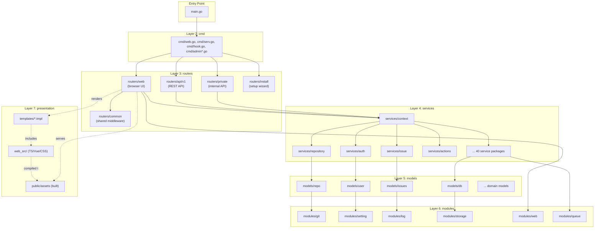
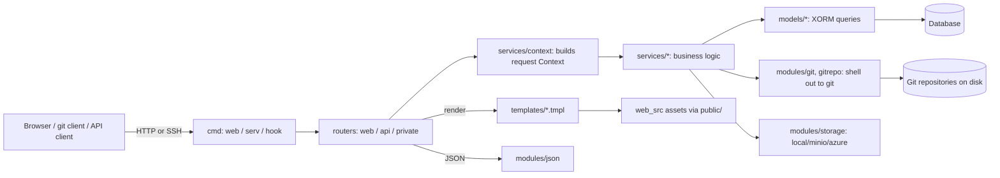

# System Architecture

Gitea is a monolithic Go application that bundles a web server, a Git server, a
database access layer, background workers, and a bundled frontend build into a
single binary (`gitea`). Despite being a single deployable artifact, the codebase
is organized into strictly layered Go packages that keep responsibilities separate
and dependencies flowing in one direction only. This page describes those layers,
how they map to directories in the repository, and how the pieces fit together at
build and run time.

> For the precise "who may import whom" rule, see
> [`docs/guidelines-backend.md`](../guidelines-backend.md) and the companion page
> [Module Dependency Map](module-dependency-map.md).

## The Seven Layers

Gitea's Go source is organized into the following layers, ordered from the
outermost (process entry point) to the innermost (leaf utility) layer:

| Layer | Directory | Responsibility |
|-------|-----------|-----------------|
| 1. Entry point | `main.go` | Sets build-time version info, wires signal/log flushing, delegates to `cmd` |
| 2. Commands | `cmd/` | CLI surface (`web`, `serv`, `hook`, `doctor`, `admin ...`, `dump`, etc.), argument parsing via `urfave/cli` |
| 3. Routers | `routers/` | HTTP routing: `routers/web` (browser UI), `routers/api/v1` (REST API), `routers/private` (internal API used by `git` hooks/SSH), `routers/install` (setup wizard), `routers/common` (shared middleware) |
| 4. Services | `services/` | Business logic that coordinates models, git operations, queues, and external integrations (auth, mailer, webhook, pull, actions, packages, etc.) |
| 5. Models | `models/` | XORM entities and direct database operations, organized by domain (`models/repo`, `models/issues`, `models/user`, `models/actions`, ...) |
| 6. Modules | `modules/` | Low-level, mostly dependency-free utilities (`modules/git`, `modules/setting`, `modules/log`, `modules/storage`, `modules/queue`, `modules/web`, ...) |
| 7. Presentation assets | `templates/`, `web_src/`, `public/` | Go `html/template` files rendered server-side, and the Vite/TypeScript/Vue frontend source compiled into `public/assets` |

`tests/` sits alongside all layers and contains integration/E2E harnesses
(`tests/integration`, `tests/e2e`) plus fixtures (`models/fixtures`) used by unit
tests throughout the tree.



## Layer Details

### 1–2. Entry point and `cmd`

`main.go` is intentionally thin: it sets `setting.AppVer`/`AppBuiltWith`/`AppStartTime`,
registers markup renderers via blank imports (`modules/markup/markdown`,
`modules/markup/csv`, etc.), and calls `cmd.RunMainApp`. All actual CLI wiring
lives in `cmd/main.go`, which builds a `urfave/cli/v3` app with subcommands such
as:

- `web` (`cmd/web.go`) — starts the HTTP(S)/Unix-socket/FCGI server
- `serv` (`cmd/serv.go`) — the Git SSH command wrapper invoked by `sshd`
- `hook` (`cmd/hook.go`) — Git server-side hooks invoked by the `git` binary itself
- `doctor`, `dump`, `migrate`, `admin *`, `cert`, `keys`, `manager` — operational tooling

Each subcommand ultimately calls into `routers.InitWebInstalled` (or a narrower
init routine) to bootstrap shared services before doing its work.

### 3. `routers`

The `routers` package is the HTTP/RPC boundary. `routers/init.go` defines
`InitWebInstalled(ctx)`, which performs the full application bootstrap sequence
(git, i18n, settings, storage, cache, DB engine, indexers, SSH, actions, cron,
etc.) and `NormalRoutes()`, which assembles the final `*web.Router` mounted by
`cmd/web.go`:

```go
// routers/init.go
func NormalRoutes() *web.Router {
    r := web.NewRouter()
    r.BeforeRouting(common.ProtocolMiddlewares()...)
    r.AfterRouting(common.MaintenanceModeHandler())

    r.Mount("/", web_routers.Routes())
    r.Mount("/api/v1", apiv1.Routes())
    r.Mount("/api/internal", private.Routes())
    ...
    return r
}
```

Sub-packages:

- `routers/web` — server-rendered HTML pages (`routers/web/repo`, `.../user`,
  `.../org`, `.../admin`, `.../shared`, etc.) plus the top-level route table in
  `routers/web/web.go` (~78 KB, hundreds of registered routes).
- `routers/api/v1` — the versioned JSON REST API (see
  [REST API](../07-rest-api/README.md)).
- `routers/private` — the internal-only API used by `cmd/hook.go` and `cmd/serv.go`
  to talk back to a running `gitea web` process over a Unix/loopback socket
  (repository access checks, hook execution, LFS auth, etc.).
- `routers/install` — the first-run setup wizard, active only until
  `app.ini` has `INSTALL_LOCK = true`.
- `routers/common` — cross-cutting middleware shared by both web and API routers
  (see [Request Lifecycle](request-lifecycle.md)).

### 4. `services`

`services` packages contain the actual business logic: they orchestrate models,
external processes (`git`), the queue system, mailers, and third-party
integrations. Notable examples:

- `services/context` — builds the per-request `context.Context`/`context.APIContext`
  objects that routers and further service calls depend on.
- `services/auth` — the pluggable authentication method chain (session, basic,
  OAuth2, reverse proxy, SSPI, etc.).
- `services/repository`, `services/issue`, `services/pull`, `services/release`,
  `services/wiki` — core Git-hosting domain logic.
- `services/actions`, `services/webhook`, `services/mailer`, `services/packages` —
  integrations and async side effects, generally backed by a `modules/queue` worker.

Services are the only layer permitted to combine multiple model packages and
modules into higher-level operations; routers should stay thin and delegate to
services rather than talking to `models` directly.

### 5. `models`

`models` packages define XORM-mapped Go structs and the direct database
operations (`Insert`, `GetByID`, `UpdateCols`, custom queries) for each domain:
`models/repo`, `models/user`, `models/issues`, `models/actions`,
`models/organization`, `models/packages`, `models/auth`, etc. `models/db`
contains the shared engine, transaction helpers (`db.WithTx`), and pagination
utilities used by every other models package. `models/migrations` holds the
ordered schema migration scripts run by `gitea migrate`. See
[Database & Models](../05-database-models/README.md) for schema-level detail.

### 6. `modules`

`modules` packages provide narrowly scoped, largely dependency-free
functionality: configuration parsing (`modules/setting`), logging
(`modules/log`), the Git CLI/gogit wrapper (`modules/git`, `modules/gitrepo`),
blob storage abstraction (`modules/storage`), the queue abstraction
(`modules/queue`), the chi-based router wrapper (`modules/web`), markup
rendering (`modules/markup`), and dozens more. Modules must not import from
`models`, `services`, or `routers` — see
[Module Dependency Map](module-dependency-map.md) for the enforced rule and how
it is checked.

### 7. Presentation: `templates/`, `web_src/`, `public/`

- `templates/*.tmpl` — Go `html/template` files rendered by `services/context`'s
  `ctx.HTML()`, organized to mirror the URL structure (`templates/repo`,
  `templates/user`, `templates/admin`, `templates/mail` for email bodies, etc.).
  Rendering is orchestrated by `modules/templates` (`templates.PageRenderer()`),
  which supports hot-reload in development mode.
- `web_src/` — the frontend source: `web_src/js` (Vue components, page controllers),
  `web_src/css`, `web_src/svg`, and `web_src/fomantic` (Fomantic-UI theme
  overrides). Built with Vite (`vite.config.ts`) and pnpm (`package.json`,
  `pnpm-workspace.yaml`).
- `public/` — the compiled output (`public/assets`) served directly by
  `routers/web/web.go` via `public.FileHandlerFunc()`, or in dev mode proxied
  through the Vite dev server (`public.ViteDevMiddleware`).

## How the Layers Cooperate at Runtime



Every incoming request or CLI invocation eventually threads through the same
init path (`routers.InitWebInstalled`), giving all entry points (HTTP web/API,
git hooks, SSH `serv`) consistent access to configuration, the database engine,
caches, and the queue system. See [Request Lifecycle](request-lifecycle.md) for
a step-by-step trace of a single HTTP request.

## Build-Time View

The frontend and backend are built independently and joined at packaging time
(see `Dockerfile`, `Makefile`):

1. `make frontend` (or `pnpm build`) compiles `web_src/` with Vite into
   `public/assets`.
2. `make backend` (or `go build`) compiles the Go sources, embedding
   `public/assets`, `templates/`, `options/`, and `custom/` via Go's `embed`
   package when the `bindata` build tag is set (used for release/Docker builds).
3. The resulting single `gitea` binary can run any subcommand (`web`, `serv`,
   `hook`, `doctor`, ...) — there is no separate frontend server or microservice
   process in a standard deployment.

> **Note:** Because hooks (`cmd/hook.go`) and the SSH command wrapper
> (`cmd/serv.go`) are invoked as short-lived child processes by `git`/`sshd`,
> they talk to the long-running `gitea web` process over the internal API
> (`routers/private`) rather than opening their own database connections in
> some configurations — see `cmd/serv.go` and `routers/private`.

## Related Pages

- [Request Lifecycle](request-lifecycle.md)
- [Module Dependency Map](module-dependency-map.md)
- [Deployment Topologies](deployment-topologies.md)
- [Web Routers](../06-web-routers/README.md)
- [Services](../08-services/README.md)
- [Core Modules](../09-core-modules/README.md)
- [Database & Models](../05-database-models/README.md)
