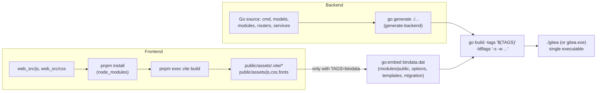

# Installation and Build

This page covers building Gitea from source: the required tools, the `make` targets that drive the build, the available build tags, and where the resulting binary ends up. For day-to-day development workflow (watch mode, linting, tests) see the project's own `docs/development.md` and `docs/build-setup.md` files at the repository root — this page distills the parts most relevant to getting a working build.

## Prerequisites

| Tool | Minimum version | Where it's declared | Notes |
|------|------------------|----------------------|-------|
| **Go** | `1.26.4` (module `go` directive) | `go.mod` | Install from [go.dev](https://go.dev/doc/install). Match the CI version to avoid `gofmt` diffs. |
| **Node.js** | `>= 22.18.0` | `package.json` (`engines.node`) | Needed to build frontend assets (JS/CSS) with Vite. |
| **pnpm** | `>= 11.0.0` | `package.json` (`engines.pnpm`) | Frontend package manager; invoked automatically by `make` targets. |
| **Make** | GNU Make | — | Drives the whole build. On Windows, install via [MSYS2](https://www.msys2.org/) or [Chocolatey](https://chocolatey.org/packages/make). |
| **Git** | any recent version | — | Required both to clone the source and because Gitea shells out to `git` at runtime. |
| **Git LFS** | any recent version | — | Only required to run the integration test suite. |
| **Python + uv** (optional) | — | — | Only needed for `make lint-templates`, `make lint-yaml`, `make lint-actions`. |

> [!NOTE]
> Some `make` tasks build external Go tools on demand (e.g. `make watch-backend`, which uses [`air`](https://github.com/air-verse/air)). Make sure `"$GOPATH"/bin` is on your `PATH` so those tools are found after installation.

Gitea's `go.mod` currently opts into the experimental JSON v2 package via an exported environment variable in the `Makefile`:

```makefile
export GOEXPERIMENT ?= jsonv2
```

This is set automatically by `make`; you normally don't need to configure it yourself.

### Getting the source

```bash
git clone https://github.com/go-gitea/gitea
cd gitea
```

To test a specific pull request locally:

```bash
git fetch origin pull/123456/head:pr-123456
git checkout pr-123456
```

### Reproducible Dev Environments (Nix Flake / DevContainer)

If you'd rather not install Go/Node/pnpm/Python manually, the repository ships two
ready-to-use, pinned environments that provide every tool listed above:

- **Nix flake** (`flake.nix`, `flake.lock`) — running `nix develop` drops you into a shell with
  `go` (currently `go_1_26`), `nodejs_26`, `pnpm_10`, `python314`/`uv`, `git`, `git-lfs`,
  `gnumake`, `sqlite`, and (on Linux) a statically-linked `glibc` plus the `CFLAGS`/`LDFLAGS`
  needed for CGO builds. It also pre-sets `GO`, `GOROOT`, `TAGS=""`, and `STATIC=true` as
  environment variables for the shell.
- **VS Code Dev Container** (`.devcontainer/devcontainer.json`) — based on the
  `mcr.microsoft.com/devcontainers/go:1.26-trixie` image, with the Node.js, Git LFS, `uv`,
  Python `3.14`, and SQLite dev-container features layered on top. Opening the repository in
  VS Code / GitHub Codespaces with the "Reopen in Container" action provisions the same tool
  set automatically and runs `make deps` as its `postCreateCommand`. Port `3000` is
  pre-forwarded and labeled "Gitea Web".

Either path is equivalent to manually installing the tools from the Prerequisites table above;
use whichever fits your workflow (host-level Nix shell vs. a fully containerized editor).

## The Build Pipeline

`make build` is the top-level target and simply depends on two independent sub-targets:

```makefile
.PHONY: build
build: frontend backend ## build everything

.PHONY: frontend
frontend: $(FRONTEND_DEST) ## build frontend files

.PHONY: backend
backend: generate-backend $(EXECUTABLE) ## build backend files
```



### `make frontend`

The frontend target is driven by a file-based Makefile rule keyed on the Vite manifest:

```makefile
FRONTEND_SOURCES := $(shell find web_src/js web_src/css -type f)
FRONTEND_CONFIGS := vite.config.ts tailwind.config.ts
FRONTEND_DEST := public/assets/.vite/manifest.json

$(FRONTEND_DEST): $(FRONTEND_SOURCES) $(FRONTEND_CONFIGS) pnpm-lock.yaml
	@$(MAKE) -s node_modules
	@rm -rf $(FRONTEND_DEST_ENTRIES)
	@echo "Running vite build..."
	@pnpm exec vite build
	@touch $(FRONTEND_DEST)
```

`node_modules` itself is installed on demand from the lockfile:

```makefile
node_modules: pnpm-lock.yaml
	pnpm install --frozen-lockfile
	@touch node_modules
```

Running `make frontend` (or `make vite`) will:

1. Install JS dependencies with `pnpm install --frozen-lockfile` if `node_modules` is stale.
2. Remove any previous build output (`public/assets/js`, `css`, `fonts`, `.vite`).
3. Run `pnpm exec vite build`, which bundles `web_src/js` and `web_src/css` into `public/assets/`.

Source maps are controlled by the `ENABLE_SOURCEMAP` environment variable:

- `ENABLE_SOURCEMAP=true` — full source maps (default for `make watch-frontend` / dev builds).
- `ENABLE_SOURCEMAP=reduced` — limited maps (default for production builds).
- `ENABLE_SOURCEMAP=false` — no source maps.

### `make backend`

```makefile
backend: generate-backend $(EXECUTABLE) ## build backend files

generate-backend: $(TAGS_PREREQ) generate-go

generate-go: $(TAGS_PREREQ)
	@echo "Running go generate..."
	@CC= GOOS= GOARCH= CGO_ENABLED=0 $(GO) generate -tags '$(TAGS)' ./...

$(EXECUTABLE): $(GO_SOURCES) $(TAGS_PREREQ)
	CGO_ENABLED="$(CGO_ENABLED)" CGO_CFLAGS="$(CGO_CFLAGS)" $(GO) build $(GOFLAGS) $(EXTRA_GOFLAGS) \
	  -tags '$(TAGS)' -ldflags '-s -w $(EXTLDFLAGS) $(LDFLAGS)' -o $@
```

1. `generate-backend` runs `go generate ./...` across the whole module (this is where generated Go files such as `modules/charset/invisible_gen.go` are produced).
2. The `$(EXECUTABLE)` rule then compiles the binary with `go build`, applying any `TAGS` and `LDFLAGS` you supply, stripping debug symbols (`-s -w`).

The compiled binary is named `gitea` (or `gitea.exe` on Windows, detected via `GOOS`/`OS`).

### Running Both Together

```bash
make build
```

is equivalent to running `make frontend` followed by `make backend`. Because both targets have their own dependency tracking, subsequent `make build` runs only rebuild what changed.

### Continuous / Watch Mode

For iterative development, Gitea provides watch targets that rebuild automatically:

```bash
make watch            # watch both frontend and backend
make watch-frontend   # Vite dev server only
make watch-backend    # Go rebuild-and-restart via `air`
```

> [!TIP]
> Watching all backend source files can exceed the default open-file limit on macOS/Linux. Raise it for the session with `ulimit -n 12288` (or add it to your shell profile).

### Running Tests

There is no single top-level `make test` target; backend and frontend unit tests are run
separately, and integration/E2E tests are separate targets again:

```bash
make test-backend      # go test ./... over the whole module
make test-frontend     # vitest run over web_src/js
make lint              # lint-frontend + lint-backend + lint-templates + lint-swagger +
                        # lint-spell + lint-md + lint-actions + lint-json + lint-yaml + lint-shell
```

`make test-backend` also supports filtering by test name via the pattern target
`test-backend#<TestName>` (dots are translated to slashes for subtests), e.g.
`make test-backend#TestAPIRepo` runs `go test -run TestAPIRepo ./...` under the same `TAGS`.
Broader integration, migration, and end-to-end (Playwright) suites are covered by `make test-integration`,
`make test-migration`, and `make test-e2e` respectively — see the project's own `docs/testing.md`
at the repository root for the full test-suite reference (fixtures, database backends used in CI,
`TEST_TAGS`, etc.).

## Build Tags

Build tags are passed via the `TAGS` make variable and toggle optional compiled-in features:

| Tag | Effect |
|-----|--------|
| `bindata` | Embeds all frontend/template/locale assets directly into the binary via `//go:embed`, producing a single self-contained monolithic executable. **Required for distribution/production builds.** Without it, Gitea reads assets from disk at runtime (useful for development, since template/asset edits don't require a rebuild). |
| `sqlite` / `sqlite_mattn` | Enables SQLite database support. In this build, SQLite support (via the pure-Go driver) is compiled in by default for local development — no tag is required for basic SQLite use; `sqlite_mattn` selects the CGO-based `mattn/go-sqlite3` driver and requires `CGO_ENABLED=1`. |
| `pam` | Enables Linux PAM (Pluggable Authentication Modules) support, letting Gitea authenticate against local system users or any PAM-configured backend. Also requires CGO (`CGO_ENABLED=1`) and is **not compatible with static (`STATIC=1`) builds**. |
| `gogit` | *(Experimental)* Uses the pure-Go `go-git` implementation instead of shelling out to the system `git` binary for some operations — primarily useful to resolve Windows-specific performance issues; POSIX systems generally don't need it. |

The `Makefile` automatically sets `CGO_ENABLED=1` whenever `sqlite_mattn` or `pam` is present in `TAGS`:

```makefile
CGO_ENABLED ?= 0
ifneq (,$(findstring sqlite_mattn,$(TAGS))$(findstring pam,$(TAGS)))
	CGO_ENABLED = 1
endif
```

### Examples

Build a production-ready, fully self-contained binary:

```bash
TAGS="bindata" make build
```

Cross-compile a Windows binary with bindata and the experimental go-git backend:

```bash
GOOS=windows TAGS="bindata gogit" make build
```

Cross-compile for Linux ARM64:

```bash
GOOS=linux GOARCH=arm64 TAGS="bindata" make build
```

Build with PAM support (requires CGO and a non-static build):

```bash
TAGS="bindata pam" make build
```

## Overriding Compiled-in Paths (`LDFLAGS`)

Packagers frequently need to bake in different default paths (e.g. `/etc/gitea/app.ini`) instead of relying on the working directory. This is done with `-X` linker flags passed through `LDFLAGS`:

```bash
LDFLAGS='-X "gitea.dev/modules/setting.CustomConf=/etc/gitea/app.ini" \
         -X "gitea.dev/modules/setting.AppWorkPath=/var/lib/gitea" \
         -X "gitea.dev/modules/setting.CustomPath=/var/lib/gitea/custom" \
         -X "gitea.dev/cmd.PIDFile=/run/gitea.pid"' \
TAGS="bindata" make build
```

| Variable | Linker symbol |
|----------|----------------|
| Custom config file | `modules/setting.CustomConf` |
| Application working path | `modules/setting.AppWorkPath` |
| Custom directory (`custom/`) | `modules/setting.CustomPath` |
| Default PID file location | `cmd.PIDFile` |

Run `gitea help` after building to confirm the computed values for `AppPath`, `AppWorkPath`, `CustomPath`, and `CustomConf`.

## Binary Output

- **Local build (`make build`)**: produces `./gitea` (or `gitea.exe`) in the repository root — the same directory as `main.go` and `go.mod`.
- **Release build (`make release`)**: cross-compiles for many OS/arch combinations via [`xgo`](https://github.com/techknowlogick/xgo) and places binaries under `dist/binaries/`, then packages tarballs/checksums under `dist/release/`.

```makefile
DIST := dist
DIST_DIRS := $(DIST)/binaries $(DIST)/release
```

```bash
make release   # runs frontend, generate, release-windows/linux/darwin/freebsd, then packages everything
```

## Generating Shell Completions

Once built, the binary can generate its own shell completion scripts without any extra build step:

```bash
gitea completion bash   # also supports: fish, pwsh, zsh
```

## Next Steps

- Configure your instance: [Configuration (`app.ini`)](configuration-app-ini.md)
- Start the server and complete first-run setup: [Running Gitea](running-gitea.md)
