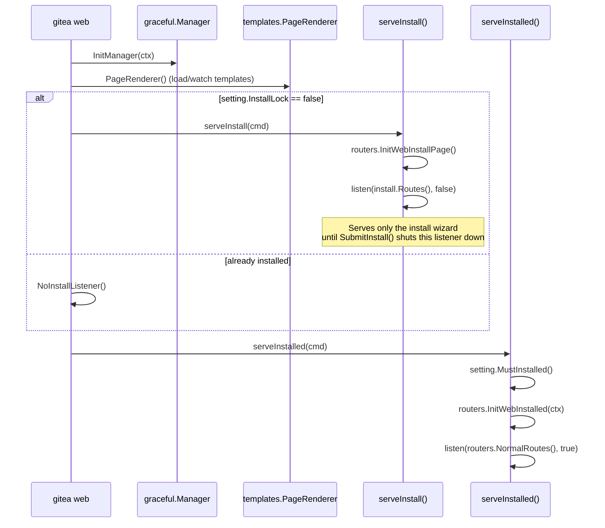

# Running Gitea

Once you have a built binary (see [Installation and Build](installation-and-build.md)) and a basic understanding of `app.ini` (see [Configuration](configuration-app-ini.md)), you're ready to start Gitea. This page walks through starting the web server, the first-run install wizard, and recommended post-install steps.

## Starting the Server

The `web` subcommand starts the Gitea web server — it is the only command you need to run a full instance:

```bash
./gitea web
```

This is implemented by `newWebCommand()` in `cmd/web.go`:

```go
func newWebCommand() *cli.Command {
	return &cli.Command{
		Name:  "web",
		Usage: "Start Gitea web server",
		Description: `Gitea web server is the only thing you need to run,
and it takes care of all the other things for you`,
		Before: PrepareConsoleLoggerLevel(log.INFO),
		Action: runWeb,
		Flags: []cli.Flag{
			&cli.StringFlag{Name: "port", Aliases: []string{"p"}, Value: "3000"},
			&cli.StringFlag{Name: "install-port", Value: "3000"},
			&cli.StringFlag{Name: "pid", Aliases: []string{"P"}, Value: PIDFile},
			&cli.BoolFlag{Name: "quiet", Aliases: []string{"q"}},
			&cli.BoolFlag{Name: "verbose"},
		},
	}
}
```

Useful flags:

| Flag | Purpose |
|------|---------|
| `-p`, `--port` | Temporary port override (helps avoid conflicts without editing `app.ini`). |
| `--install-port` | Port used specifically for the install wizard, if different from the eventual runtime port. |
| `-P`, `--pid` | Custom PID file path (defaults to `/run/gitea.pid`, or a build-time override). |
| `-q`, `--quiet` | Only log fatal errors until logging is fully configured. |
| `--verbose` | Log at TRACE level until logging is properly configured. |

By convention you run this from the directory containing your `custom/` folder (or point `--custom-path` / `--config` / `--work-path` elsewhere), commonly under a dedicated `git` system user with `RUN_USER` set accordingly in `app.ini`.

### What Happens on Startup

`runWeb()` in `cmd/web.go` drives the startup sequence:



In short: if `[security] INSTALL_LOCK` is **not** set to `true`, Gitea first serves only the installer UI on the configured port. Once installation completes, that temporary HTTP server is shut down and the *real* Gitea web server (`routers.NormalRoutes()`) starts on the same port.

## The First-Run Install Wizard

When `INSTALL_LOCK = false` (the default for a fresh `app.ini`, or when no config file exists yet), visiting the server's URL (e.g. `http://localhost:3000`) shows the install wizard instead of the normal application.

### Routing and Handlers

The installer has its own minimal route table, implemented in `routers/install/install.go`:

- `GET /` (and other install paths) → `Install(ctx *context.Context)` — renders `templates/install.tmpl`, pre-filled with any values already present in `setting.*` (i.e., what's already been read from `app.ini` or environment variables).
- `POST /` → `SubmitInstall(ctx *context.Context)` — validates the submitted form, tests the database connection, runs schema migrations, writes `app.ini`, optionally creates the initial admin account, and finally shuts the installer HTTP server down.
- Both fall back to `InstallDone(ctx)` — renders `templates/post-install.tmpl` — once `setting.InstallLock` is already `true`.

```go
// routers/install/install.go
const (
	tplInstall     templates.TplName = "install"
	tplPostInstall templates.TplName = "post-install"
)

func Install(ctx *context.Context) {
	if setting.InstallLock {
		InstallDone(ctx)
		return
	}
	// ... pre-fill form from current setting.* values ...
	ctx.HTML(http.StatusOK, tplInstall)
}
```

### Wizard Sections (`templates/install.tmpl`)

The install form (rendered from `templates/install.tmpl`) is organized into a few logical groups:

1. **Database Settings** (`install.db_title`) — `db_type` (MySQL/PostgreSQL/MSSQL/SQLite3), `db_host`, `db_user`, `db_passwd`, `db_name`, `db_schema` (Postgres), `ssl_mode`, or `db_path` for SQLite.
2. **General Settings** (`install.general_title`) — `app_name`, repository root path (`repo_root_path`), run user, domain, HTTP/SSH ports, `ROOT_URL`, log path.
3. **Optional Settings** (`install.optional_title`) — E-mail/SMTP configuration (`smtp_addr`, `smtp_port`, `smtp_from`, `smtp_user`, `smtp_passwd`), server/registration behavior (OpenID, captcha, self-registration policy), and the initial **admin account** (username, email, password).
4. **Environment Config Keys** (`install.env_config_keys`) — a read-only list of any `GITEA__...` environment variables that are currently overriding config, so the administrator understands why a field may already be filled in and non-editable.

### What `SubmitInstall` Does

Walking through `routers/install/install.go`, submitting the form performs, in order:

1. Normalizes `AppURL` (ensures a trailing slash).
2. Verifies the `git` binary is on `PATH` (`exec.LookPath("git")`).
3. Applies the submitted database settings to `setting.Database.*` and calls `checkDatabase()`, which:
   - Rejects an empty SQLite path.
   - Calls `db.InitEngine(ctx)` to open a connection.
   - Calls `db_install.CheckDatabaseConnection(ctx)` to validate connectivity.
   - Checks whether the database already contains post-installation users (to detect a re-run against an existing install).
4. Prepares `AppDataPath` and creates the repository root, LFS root, and log root directories if missing.
5. Validates the admin account fields, if an initial admin was requested (username format, email presence, password confirmation match).
6. Runs database migrations: `db.InitEngineWithMigration(ctx, versioned_migration.Migrate)`.
7. Loads (or creates) `app.ini` via `setting.NewConfigProviderFromFile(setting.CustomConf)` and writes back all the settings collected above — `APP_NAME`, `RUN_USER`, `WORK_PATH`, `RUN_MODE=prod`, the full `[database]` block, `[repository] ROOT`, `[server]` domain/port/URL/SSH settings, `[lfs]`, `[mailer]`, `[service]`, `[openid]`, etc.
8. Creates the initial administrator user (if requested) via the user model, and auto-logs them in by setting the session and an auth-token cookie.
9. Calls `setting.ClearEnvConfigKeys()` to remove any `GITEA__...` env vars from the process environment (they've already been persisted to `app.ini`).
10. Calls `InstallDone(ctx)`, and, after a short delay (to let the browser load the confirmation page), gracefully shuts down the temporary install HTTP server:

```go
setting.ClearEnvConfigKeys()
log.Info("First-time run install finished!")
InstallDone(ctx)

go func() {
	time.Sleep(3 * time.Second)
	srv := ctx.Value(http.ServerContextKey).(*http.Server)
	if err := srv.Shutdown(graceful.GetManager().HammerContext()); err != nil {
		log.Error("Unable to shutdown the install server! Error: %v", err)
	}
	// runWeb() then proceeds to start the "normal" server
}()
```

At this point `INSTALL_LOCK = true` has been written to `app.ini`, so any future restart of `gitea web` skips the installer and goes straight to `serveInstalled()`.

> [!NOTE]
> You can pre-configure `app.ini` yourself and set `INSTALL_LOCK = true` before ever starting Gitea, in which case the install wizard is skipped entirely (useful for automated/containerized deployments). You must then also create an initial admin account manually — see below.

## Post-Install Steps

### 1. Create the First Administrator (if you skipped the wizard's admin field)

```bash
./gitea admin user create --username admin --password 'change-me-now' --email admin@example.com --admin
```

This is implemented by `microcmdUserCreate()` in `cmd/admin_user_create.go`, part of the broader `gitea admin user` command family (`cmd/admin_user.go`, `cmd/admin_user_list.go`, ...).

### 2. Verify Configuration and Look for Warnings

```bash
gitea help                 # confirm resolved AppPath / AppWorkPath / CustomPath / CustomConf
gitea doctor check          # run built-in diagnostics
```

### 3. Set Up Process Supervision

Run Gitea under a proper process manager (systemd, Docker restart policies, etc.) rather than a bare foreground process. A minimal systemd unit typically runs:

```ini
ExecStart=/usr/local/bin/gitea web --config /etc/gitea/app.ini
```

as the dedicated `RUN_USER` (e.g. `git`), with `WorkingDirectory` set to the value configured for `AppWorkPath`.

### 4. Put a Reverse Proxy in Front (recommended for HTTPS)

If terminating TLS externally (nginx, Caddy, Traefik), set `[server] ROOT_URL` to the externally visible HTTPS URL and leave `PUBLIC_URL_DETECTION = auto` (the default) so Gitea correctly derives links from `X-Forwarded-Proto`/`Host` headers.

### 5. Configure Backups

At minimum, back up:

- The database (or the SQLite file at `[database] PATH`).
- `custom/conf/app.ini` (and especially the `SECRET_KEY` / `INTERNAL_TOKEN` values — losing them makes some encrypted data unrecoverable).
- The repository root (`[repository] ROOT`) and LFS storage path.

Gitea also ships a built-in `gitea dump` command that bundles the database, repositories, and configuration into a single archive for backup/migration purposes (see `cmd/dump.go`).

### 6. Enable Background Services as Needed

Depending on your `app.ini`, `routers.InitWebInstalled()` (in `routers/init.go`) initializes many long-running subsystems on every startup: storage backends, mailer, caching, the code/issue search indexer, mirror synchronization, webhooks, the pull-request auto-merge checker, SSH server (if `START_SSH_SERVER = true`), Actions services, and the cron scheduler (`cron.Init(ctx)`) that drives all `[cron.*]` maintenance jobs. Review the `[cron.*]`, `[indexer]`, `[mirror]`, and `[queue]` sections of `app.ini` to tune these for your environment.

## Stopping and Restarting

Gitea handles `SIGINT`/`SIGTERM` via its graceful shutdown manager (`modules/graceful`), draining in-flight requests before exiting. Simply stop the process (or `systemctl stop gitea`) to shut it down cleanly; restarting is just running `gitea web` again — the installer step is skipped once `INSTALL_LOCK = true` is present in `app.ini`.

## Related Pages

- [Overview](overview.md) — what Gitea is and its core features.
- [Installation and Build](installation-and-build.md) — building the `gitea` binary.
- [Configuration (`app.ini`)](configuration-app-ini.md) — the configuration file format and key sections.
