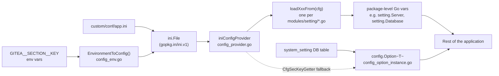

# Settings Catalog

This page is a reference catalog of Gitea's configuration surface: which Go source file in `modules/setting/*.go` owns which `app.ini` section, how environment variables can override any value, and how a small subset of settings can additionally be changed live from the Admin UI without restarting the server (the "dynamic" settings mechanism).

> [!TIP]
> For a narrative walkthrough of the INI file format and the most commonly-touched sections (`[server]`, `[database]`, `[security]`, `[mailer]`), see [Configuration (`app.ini`)](../03-getting-started/configuration-app-ini.md). This page focuses on **mapping every settings file to its INI section** and on the **loading/override mechanics**.

## How Configuration Loading Works

Gitea's configuration subsystem lives entirely in `modules/setting`. The flow from disk to typed Go variables is:



1. **`NewConfigProviderFromFile`** (`config_provider.go`) loads `app.ini` (and any files appended to it) into a `gopkg.in/ini.v1` document wrapped by the `ConfigProvider`/`ConfigSection`/`ConfigKey` interfaces. This abstraction is what the rest of `modules/setting` reads from — no code touches the `ini` package directly.
2. **`EnvironmentToConfig`** (`config_env.go`) is run over the loaded provider before any `loadXxxFrom` function executes, injecting/overriding INI keys from `GITEA__...` environment variables.
3. Each settings file exposes one (or more) `loadXxxFrom(rootCfg ConfigProvider)` function that reads a specific `[section]` via `rootCfg.Section("name")` and populates exported package-level variables (e.g. `setting.Database`, `setting.Git`, `setting.Actions`). `modules/setting/setting.go`'s `loadCommonSettingsFrom` and `LoadSettings` call these in a carefully ordered sequence (see below).
4. A separate, much smaller mechanism — `config.Option[T]` in `modules/setting/config` — supports **dynamic** settings that can be changed at runtime from the Admin UI and are persisted to the `system_setting` database table instead of `app.ini`. These are documented in [Dynamic vs. Static Settings](#dynamic-vs-static-settings) below.

### Load Ordering

`loadCommonSettingsFrom` in `setting.go` loads settings needed very early (install lock, run mode, logging, server, SSH — the SSH check needs to happen before the run-user match check) and then a long list of the remaining common settings. A second pass, `LoadSettings()`, is only run for a fully started server (not during `install`) and loads settings that depend on the database or other already-loaded settings (DB connection, mailer, queues, indexers, tasks):

```go
// modules/setting/setting.go (abridged)
func loadCommonSettingsFrom(cfg ConfigProvider) error {
    InstallLock = HasInstallLock(cfg)
    loadRunModeFrom(cfg)
    loadLogGlobalFrom(cfg)
    loadServerFrom(cfg)
    loadSSHFrom(cfg)
    mustCurrentRunUserMatch(cfg)
    loadOAuth2From(cfg)
    loadSecurityFrom(cfg)
    // ... attachment, LFS, time, repository, avatars, packages, actions, UI,
    // admin, api, metrics, camo, i18n, git, mirror, markup, global lock, other
}

func LoadSettings() {
    initAllLoggers()
    loadDBSetting(CfgProvider)
    loadServiceFrom(CfgProvider)
    loadOAuth2ClientFrom(CfgProvider)
    loadCacheFrom(CfgProvider)
    loadSessionFrom(CfgProvider)
    loadCorsFrom(CfgProvider)
    loadMailsFrom(CfgProvider)
    loadProxyFrom(CfgProvider)
    loadWebhookFrom(CfgProvider)
    loadMigrationsFrom(CfgProvider)
    loadIndexerFrom(CfgProvider)
    loadTaskFrom(CfgProvider)
    LoadQueueSettings()
    loadProjectFrom(CfgProvider)
    loadMimeTypeMapFrom(CfgProvider)
    loadFederationFrom(CfgProvider)
}
```

> [!NOTE]
> The comment "WARNING: don't change the sequence except you know what you are doing" in `loadCommonSettingsFrom` is not decorative — several loaders read package variables set by earlier loaders (e.g. `mustCurrentRunUserMatch` depends on `SSH.StartBuiltinServer`, and `loadRepositoryFrom` checks `Packages.Enabled`/`Actions.Enabled` which are only meaningful after those sections load).

## Settings File → INI Section Catalog

The table below enumerates every settings file in `modules/setting/` (excluding `_test.go` files), the INI section(s) it maps, and a short description of its purpose. "Dynamic option" marks files that also register `config.Option[T]` values (system-setting/DB-backed, editable from the Admin UI) in addition to, or instead of, static `app.ini` keys.

| Settings file | INI section(s) | Purpose |
|---|---|---|
| `setting.go` | *(root, no header)* — `RUN_MODE`, `RUN_USER`, `WORK_PATH`, `I_AM_BEING_UNSAFE_RUNNING_AS_ROOT` | Global bootstrap: run mode/user, orchestrates the overall load sequence (`loadCommonSettingsFrom`, `LoadSettings`). |
| `config_provider.go` | *(infra, no section of its own)* | Defines the `ConfigProvider`/`ConfigSection`/`ConfigKey` abstraction over `ini.v1`; helper functions (`ConfigSectionKey`, `ConfigInheritedKey`, `deprecatedSetting`) used by every other loader. |
| `config_env.go` | *(infra)* | Implements `GITEA__SECTION__KEY` environment-variable override mechanism (see [Environment Variable Overrides](#environment-variable-overrides)). |
| `config.go` / `config_option_instance.go` / `config/*.go` | `[picture]`, `[repository]` (partial, dynamic keys only), plus DB-backed instance settings | Dynamic settings registry: `config.Option[T]`, `WebBannerType`, `MaintenanceModeType` (see [Dynamic vs. Static Settings](#dynamic-vs-static-settings)). |
| `server.go` | `[server]` | HTTP/HTTPS/FastCGI listener, `ROOT_URL`/public URL detection, ACME/TLS, graceful restart, static file serving. |
| `ssh.go` | `[server]` (SSH-prefixed keys), `[ssh.minimum_key_sizes]` | Built-in vs. OS SSH server, host keys, trusted CA keys, minimum key size policy. |
| `database.go` | `[database]` | DB engine selection (`mysql`/`postgres`/`mssql`/`sqlite3`), connection pool tuning, retries, SQL logging. |
| `security.go` | `[security]`, cross-reads `[cors]` for `X_FRAME_OPTIONS` | `SECRET_KEY`/`INTERNAL_TOKEN` (and their `*_URI` file-based variants), install lock, password policy, reverse-proxy auth headers, HTTP security headers, allowed-host list. |
| `camo.go` | `[camo]` | Optional image-proxy (Camo) settings to avoid mixed-content/leak-referrer issues for external images. |
| `oauth2.go` | `[oauth2]`, `[oauth2_client]` | Built-in OAuth2 provider (JWT signing key, token TTLs) and OAuth2 *client* behavior for third-party logins/updates. |
| `log.go` | `[log]`, `[log.<mode-name>]` (e.g. `[log.console]`, `[log.file]`, `[log.conn]`) | Logger configuration: root log level, per-writer sub-sections, access log template. |
| `git.go` | `[git]`, `[git.timeout]`, `[git.config]`, `[git.reflog]` (deprecated) | Git binary behavior: diff limits, GC args, wire protocol, passthrough `git config` key/value pairs. |
| `service.go` | `[service]`, `[service.explore]`, `[openid]`, `[qos]` | Registration/sign-in policy, captcha providers, visibility defaults, explore-page filtering, OpenID login, QoS (request prioritization). |
| `repository.go` | `[repository]`, `[repository.editor]`, `[repository.upload]`, `[repository.pull-request]`, `[repository.issue]`, `[repository.release]`, `[repository.signing]` | Repository-wide defaults and per-feature sub-sections (web editor, upload, PR, issue, release, commit-signing behavior). |
| `mime_type_map.go` | `[repository.mimetype_mapping]` | Custom file-extension → MIME-type overrides used when serving raw repository content. |
| `project.go` | `[project]` | Kanban-style Project board defaults. |
| `cors.go` | `[cors]` | Cross-Origin Resource Sharing policy for the API. |
| `ui.go` | `[ui]`, `[ui.admin]`, `[ui.user]`, `[ui.meta]`, `[ui.notification]`, `[ui.svg]`, `[ui.csv]` | Pagination sizes, themes, emoji/reactions, notification polling intervals, SVG/CSV render limits. |
| `markup.go` | `[markdown]`, `[markup]`, `[markup.<name>]` (custom renderers) | Markdown rendering options and pluggable external renderers (each custom renderer gets its own `[markup.xxx]` sub-section). |
| `highlight.go` | `[highlight.mapping]` | Maps file extensions to a specific Chroma syntax-highlighting lexer name. |
| `indexer.go` | `[indexer]` | Code search and issue search indexer backend selection (bleve/elasticsearch/meilisearch), paths, connection strings. |
| `queue.go` | `[queue]`, `[queue.<name>]` (e.g. `[queue.issue_indexer]`) | Background queue backend (`level`/`channel`/`redis`/`dummy`), per-queue overrides, worker counts. |
| `admin.go` | `[admin]` | Default admin-created-user email notification behavior, disabled regex/self-registration options for admin-only account creation. |
| `api.go` | `[api]` (reads `ROOT_URL` from `[server]` for defaults) | REST API-wide settings: max response items, enable Swagger, default git trees per page. |
| `metrics.go` | `[metrics]` | Prometheus `/metrics` endpoint toggle and auth token requirement. |
| `i18n.go` | `[i18n]` | Enabled UI languages (`LANGS`) and display names (`NAMES`). |
| `mirror.go` | `[mirror]`, checks `[repository].DISABLE_MIRRORS` | Pull-mirror concurrency/timeout defaults. |
| `webhook.go` | `[webhook]` | Outgoing webhook delivery: timeout, allowed target host list, paged-history retention. |
| `mailer.go` | `[mailer]`, `[mailer.override_header]` | Outgoing SMTP/sendmail configuration, per-header overrides, and (cross-reads `[service]`) whether email confirmation/notification mail are enabled. |
| `incoming_email.go` | `[email.incoming]` | Inbound email (reply-by-email) IMAP polling configuration for issue/PR comments. |
| `cache.go` | `[cache]`, `[cache.last_commit]` | Generic cache backend (`memory`/`redis`/`memcache`/`twoqueue`) plus a dedicated last-commit-info cache. |
| `session.go` | `[session]` | Web session store backend and cookie behavior. |
| `picture.go` | `[picture]`, `[avatar]`, `[repo-avatar]` | Avatar storage paths/sizes and (via `config.go`) the dynamic `DISABLE_GRAVATAR` / `ENABLE_FEDERATED_AVATAR` options. |
| `attachment.go` | `[attachment]` | Issue/PR/release attachment size limits, allowed types, storage backend selection. |
| `time.go` | `[time]` | Default UI time-zone display (`DEFAULT_UI_LOCATION`). |
| `cron.go` (+ each feature's own file, e.g. `mirror.go`) | `[cron]`, `[cron.<task-name>]` (~25 sub-sections, e.g. `[cron.archive_cleanup]`, `[cron.update_mirrors]`, `[cron.gc_lfs]`) | Generic cron scheduling helper (`SetCronConfigs`, uses reflection over struct fields tagged with cron task names) shared by every periodic task. |
| `task.go` | `[task]`, `[queue.task]` | Migration/mirror-clone task queue configuration. |
| `migrations.go` | `[migrations]` | Repository migration (import from GitHub/GitLab/etc.) allow/block lists and timeout. |
| `federation.go` | `[federation]` | ActivityPub federation enable flag, request size limits, custom headers. |
| `packages.go` | `[packages]` | Package registry enable flag, storage backend, per-ecosystem chunk size limits (see [Packages Registry](../15-packages-registry/README.md)). |
| `actions.go` | `[actions]`, `[actions.artifacts]`/storage sections | Actions (CI/CD) enable flag, workflow directory discovery, log/artifact retention, task-picking concurrency, log compression (see [Actions Architecture](../14-actions-ci/actions-architecture.md)). |
| `lfs.go` | `[server]` (`LFS_START_SERVER`, `LFS_JWT_SECRET*`), `[lfs]` | Git LFS server toggle, JWT auth secret, LFS object storage backend. |
| `storage.go` | `[storage]`, `[storage.<name>]` (e.g. `[storage.repo-archive]`, `[storage.packages]`, `[storage.minio]`, `[storage.azureblob]`, `[storage.actions_log]`) | Generic object storage abstraction (local/MinIO/Azure Blob) shared by LFS, avatars, attachments, packages, actions logs/artifacts, and repo archives (see [Storage, Queue & Caching](../09-core-modules/storage-queue-cache.md)). |
| `repository_archive.go` | `[repo-archive]` (via `getStorage`, falls back to `[storage.repo-archive]`) | Repository archive (zip/tar.gz download) storage-specific settings. |
| `proxy.go` | `[proxy]` | Outbound HTTP proxy used for webhooks, migrations, and other outgoing requests. |
| `other.go` | `[other]` | Miscellaneous flags: `SHOW_FOOTER_VERSION`, `ENABLE_SITEMAP`, `ENABLE_FEED_HEADER`, etc. |
| `gloabl_lock.go` (sic — file name typo in upstream) | `[global_lock]` | Distributed lock backend selection (in-memory vs. Redis) used to serialize cross-node operations. |
| `glob.go` | *(helper, no section)* | Shared glob-pattern parsing helper used by several `*_LIST` config keys (e.g. email domain allow/block lists). |
| `global.go` | *(package-level constants)* | Shared constants (e.g. `SettingsKeyHiddenCommentTypes`) with no dedicated INI section. |
| `path.go` | *(root)* — `WORK_PATH`, and CLI/env inputs | Resolves `AppPath`, `AppWorkPath`, `CustomPath`, `CustomConf` before any INI section is even read (see [Configuration (`app.ini`) → Loading Order](../03-getting-started/configuration-app-ini.md#loading-order-and-path-resolution)). |
| `testenv.go` | *(test-only)* | Test-harness helpers to construct a `ConfigProvider` in unit tests; not used in production. |
| `asset_dynamic.go` / `asset_static.go` | *(build-tag switch, no section)* | Chooses between filesystem-based (`dynamic`) and embedded (`static`, release builds) asset loading; controlled by Go build tags, not INI. |

## Environment Variable Overrides

Any `app.ini` key can be overridden — or injected without an `app.ini` file at all — through environment variables. This is implemented entirely in `modules/setting/config_env.go` and consumed by `EnvironmentToConfig`, which is called before the section loaders run.

### Naming Convention

```
GITEA__SECTION__KEY=value
```

- Prefix is the constant `EnvConfigKeyPrefixGitea = "GITEA__"`.
- `SECTION` and `KEY` are separated by a double underscore `__`.
- Section names are lower-cased automatically (`decodeEnvSectionKey`), matching the case-insensitive nature of INI section names.
- The **default (no-header) section** is addressed with an empty section name: `GITEA____KEY=value` (double underscore, empty section, double underscore, key).

### Escaping Special Characters (sub-sections, dots, dashes)

Section names that contain characters outside `[A-Z0-9_]` (most commonly a `.` for sub-sections like `log.console`, or a `-` as in `repository.pull-request`) must be escaped using the `_0x`/`_0X` hex-byte encoding implemented by `decodeEnvSectionKey`:

```
_0x2E_   ; encodes '.' (0x2E)
_0x2D_   ; encodes '-' (0x2D)
```

Example — overriding `[log.console] LEVEL` and `[repository.pull-request] WORK_IN_PROGRESS_PREFIXES`:

```bash
GITEA__LOG_0x2E_CONSOLE__LEVEL=debug
GITEA__REPOSITORY_0x2D_PULL_0x2D_REQUEST__WORK_IN_PROGRESS_PREFIXES="WIP:,[WIP]"
```

### Reading a Value from a File

Appending `__FILE` to the key name (`EnvConfigKeySuffixFile = "__FILE"`) tells Gitea to treat the environment variable's value as a **path**, read that file's contents, and use the (trimmed) file contents as the actual config value — the standard pattern for injecting secrets from Docker/Kubernetes secret mounts without putting them directly in the environment:

```bash
GITEA__SECURITY__SECRET_KEY__FILE=/run/secrets/gitea_secret_key
GITEA__MAILER__PASSWD__FILE=/run/secrets/smtp_password
```

`EnvironmentToConfig` strips a single trailing `\n` or `\r\n` from the file content before applying it.

### Precedence and Collection

- Environment variables are applied **on top of** whatever `app.ini` already contains — `EnvironmentToConfig` creates the section/key if missing, or overwrites the existing key's value if present.
- `CollectEnvConfigKeys()` scans `os.Environ()` for anything with the `GITEA__` prefix, primarily so the install wizard can display which environment-driven keys are in effect (`routers/install/install.go`) — this is informational, not required for the override to take effect.
- `ClearEnvConfigKeys()` unsets every `GITEA__*` variable from the current process environment after installation completes, so environment-provided secrets aren't inherited by subprocesses Gitea spawns (e.g. git hooks) unless intentionally passed through.
- `UnsetUnnecessaryEnvVars()` additionally clears `XDG_CONFIG_HOME` so Gitea's git operations consistently use `HOME/.gitconfig` rather than an XDG-based config path.

This is the mechanism the official Docker image relies on to let operators configure Gitea purely via `docker run -e GITEA__...` or a Kubernetes `ConfigMap`/`Secret`, without mounting a custom `app.ini` at all.

## Dynamic vs. Static Settings

The overwhelming majority of Gitea's configuration is **static**: read once from `app.ini` (plus environment overrides) at process startup into package-level Go variables (`setting.Server`, `setting.Database`, `setting.Git`, etc.), and never re-read until the process restarts. Changing these requires editing `app.ini` (or the environment) and restarting Gitea.

A small, deliberately narrow set of options are **dynamic**: they can be changed by an instance administrator from **Admin Panel → Configuration → Config Settings** (`routers/web/admin/config.go`, function `ConfigSettings`/`ChangeConfig`) while the server keeps running, with no restart required. These are implemented by `config.Option[T]` in `modules/setting/config/value.go`, registered from `modules/setting/config_option_instance.go` and `modules/setting/config.go`.

```mermaid
sequenceDiagram
    participant Admin as Admin (browser)
    participant Router as routers/web/admin/config.go
    participant DB as models/system.SetSettings
    participant Opt as "config.Option~T~.ValueRevision"
    participant App as "Code reading Config().X.Y"

    Admin->>Router: POST ChangeConfig {key, value}
    Router->>Router: validateConfigKeyValue (JSON, size limit)
    Router->>DB: SetSettings(ctx, {key: value})
    DB->>DB: UPDATE system_setting SET version=version+1 (per key + global revision row)
    Router->>Opt: config.GetDynGetter().InvalidateCache()
    App->>Opt: Value(ctx) / ValueRevision(ctx)
    Opt->>DB: GetRevision(ctx) -- cached for 1s
    alt revision changed
        Opt->>DB: GetValue(ctx, dynKey)
        Opt->>Opt: parse JSON, cache value+revision
    end
    Opt-->>App: typed value (or default)
```

### The `config.Option[T]` Type

Each dynamic setting is a generic `*config.Option[T]` value, created with `config.NewOption[T](dynKey string)` and configured with a fluent API:

```go
// modules/setting/config.go
Picture: &PictureStruct{
    DisableGravatar: config.NewOption[bool]("picture.disable_gravatar").
        WithDefaultSimple(true).
        WithFileConfig(config.CfgSecKey{Sec: "picture", Key: "DISABLE_GRAVATAR"}),
    EnableFederatedAvatar: config.NewOption[bool]("picture.enable_federated_avatar").
        WithFileConfig(config.CfgSecKey{Sec: "picture", Key: "ENABLE_FEDERATED_AVATAR"}),
},
Repository: &RepositoryStruct{
    OpenWithEditorApps: config.NewOption[OpenWithEditorAppsType]("repository.open-with.editor-apps").
        WithEmptyAsDefault().
        WithDefaultFunc(openWithEditorAppsDefaultValue),
    GitGuideRemoteName: config.NewOption[string]("repository.git-guide-remote-name").
        WithEmptyAsDefault().WithDefaultSimple("origin"),
},
Instance: &InstanceStruct{
    WebBanner:       config.NewOption[WebBannerType]("instance.web_banner"),
    MaintenanceMode: config.NewOption[MaintenanceModeType]("instance.maintenance_mode"),
},
```

Key building blocks (`modules/setting/config/value.go`):

- `dynKey` — the string key stored in the `system_setting` DB table (e.g. `"picture.disable_gravatar"`).
- `WithFileConfig(CfgSecKey{Sec, Key})` — an **optional fallback**: if no value has ever been set in the database, the option falls back to reading the classic `app.ini` `[Sec] Key` value (via `GetCfgSecKeyGetter()`, backed by `CfgProvider`). This lets an option start life as a normal static `app.ini` setting and be promoted to dynamic without breaking existing deployments.
- `WithDefaultSimple(v)` / `WithDefaultFunc(f)` — the default value used when neither the DB nor `app.ini` has a value.
- `WithEmptyAsDefault()` — treat a zero/empty parsed value as "unset" and fall back to the default instead.
- `Value(ctx)` / `HasValue(ctx)` / `ValueRevision(ctx)` — read the current effective value; internally cached per-`Option` and invalidated only when the shared **revision** counter changes (`opt.revision` vs. `dg.GetRevision(ctx)`), so hot-path reads are cheap (no DB round-trip on every call).
- Values are stored/parsed as **JSON** (`json.Unmarshal`/`Marshal` against `util.UnsafeStringToBytes`), which is why `ChangeConfig`'s `validateConfigKeyValue` checks `json.Valid([]byte(input))` before persisting.

### Storage and Revisioning

The actual persistence layer is `models/system.Setting` (table `system_setting`, columns `setting_key`, `setting_value`, `Version`) — see `models/system/setting.go`:

- A synthetic row with key `"revision"` acts as a global change counter; `SetSettings` increments it (and each touched row's `version`) inside a transaction.
- `dbConfigCachedGetter` (implements `config.DynKeyGetter`) caches the entire settings map in memory and only re-queries the database when the cached revision is older than **1 second** or the global revision counter has changed — this keeps `Value(ctx)` calls cheap even though they are effectively backed by a database table.
- `routers/common/db.go` wires this in during startup: `config.SetDynGetter(system_model.NewDatabaseDynKeyGetter())`.
- Admin UI writes (`ChangeConfig`) call `config.GetDynGetter().InvalidateCache()` immediately after `SetSettings`, so the change is visible on the very next read rather than waiting up to a second for the cache TTL.

### Currently Registered Dynamic Options

| Dynamic key | Go type | Default | Used for |
|---|---|---|---|
| `picture.disable_gravatar` | `bool` | `true` | Disable Gravatar avatar lookups instance-wide, overridable per admin action; read in `models/user/avatar.go`, `models/avatars/avatar.go`. |
| `picture.enable_federated_avatar` | `bool` | `false` | Enable federated avatar (libravatar-style) lookups. |
| `repository.open-with.editor-apps` | `OpenWithEditorAppsType` (list of `{DisplayName, OpenURL}`) | VS Code / VSCodium / IntelliJ IDEA presets | Populates the "Open with" dropdown on repository pages (`routers/web/repo/view_home.go`). |
| `repository.git-guide-remote-name` | `string` | `"origin"` | Remote name shown in the repository's clone/quick-start instructions. |
| `instance.web_banner` | `WebBannerType` (`DisplayEnabled`, `ContentMessage`, `StartTimeUnix`, `EndTimeUnix`) | disabled | Site-wide announcement banner with an optional scheduled display window (`ShouldDisplay()` checks the time window); rendered via `routers/web/misc/misc.go`. |
| `instance.maintenance_mode` | `MaintenanceModeType` (`AdminWebAccessOnly`, `StartTimeUnix`, `EndTimeUnix`) | disabled | Puts the instance into maintenance mode (only admins can browse the web UI) for a scheduled window; enforced in `routers/common/maintenancemode.go` and checked at login (`routers/web/auth/auth.go`). |

> [!NOTE]
> These are the **only** two structs registered under `Config().Instance/Picture/Repository` at the time of writing (`modules/setting/config.go`, `initDefaultConfig`). Per-repository unit configs (`ExternalTrackerConfig()`, `PullRequestsConfig()`, `ProjectsConfig()`, `IssuesConfig()`, etc.) use a related but separate mechanism — they are JSON blobs stored per-repository in the `repo_unit` table, not global `config.Option[T]` values, and are documented in [Repository Model](../05-database-models/repository-model.md).

### Choosing Between Static and Dynamic

When adding a new setting to Gitea, the project convention favors **static `app.ini` options** for anything that:

- affects process-level behavior (ports, storage backends, database connections) — these inherently require a restart anyway;
- is security-sensitive and should be controlled by the file-system/deployment owner, not a web-authenticated admin session.

**Dynamic `config.Option[T]`** options are reserved for settings that:

- are safe for a web admin to toggle without SSH/file access to the host;
- benefit from taking effect immediately across all instance processes (e.g. in a multi-node deployment, a static `app.ini` change requires updating and restarting every node, while a dynamic option is read from the shared database by all nodes as soon as the cache TTL/invalidation fires).

## See Also

- [Configuration (`app.ini`)](../03-getting-started/configuration-app-ini.md) — narrative introduction to the INI format, path resolution, and the most common sections.
- [Storage, Queue & Caching](../09-core-modules/storage-queue-cache.md) — deep dive on `[storage]`, `[storage.*]`, `[queue]`, `[cache]` internals.
- [Actions Architecture](../14-actions-ci/actions-architecture.md) — `[actions]` section in the context of the CI/CD runner protocol.
- [Packages Registry](../15-packages-registry/README.md) — `[packages]` section and per-ecosystem storage settings.
- [Auth Providers](../08-services/auth-providers.md) — `[oauth2]`, `[oauth2_client]`, `[openid]`, `[service]` in the context of authentication flows.
