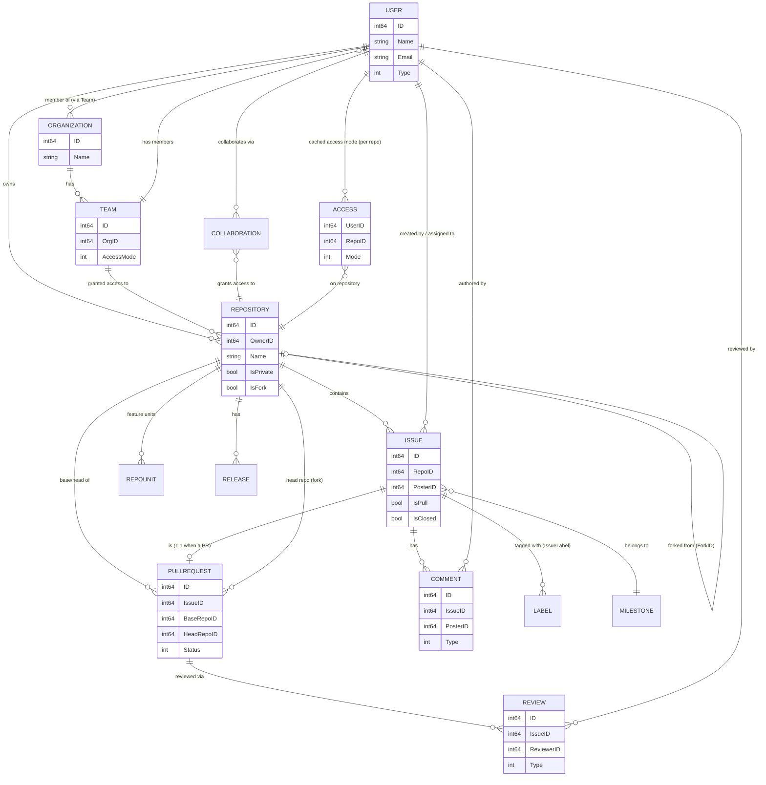

# Database & Models

Documentation of Gitea's database schema, ORM models, and migrations.

Gitea persists all structured data (users, repositories, issues, pull
requests, releases, packages, actions runs, etc.) through the
[xorm](https://xorm.io/) ORM in `models/`, supporting SQLite, MySQL,
PostgreSQL, and MSSQL as interchangeable backends. Schema evolution is handled
by a versioned, ordered list of Go migration functions in
`models/migrations/`. This section documents the DB engine abstraction, the
migration system, the core domain entities (repositories, users/
organizations, issues/pull requests, and the permission model that ties them
together), the many supplementary model packages that round out the schema,
and the fixture-based testing infrastructure that exercises all of it.

## Section Contents

| Page | Description |
|---|---|
| [DB Engine and Drivers](db-engine-and-drivers.md) | The `db.Engine` abstraction, supported drivers (MySQL, PostgreSQL, MSSQL, SQLite via `mattn`/`modernc`), connection setup, and transaction helpers |
| [Database Migrations](migrations.md) | How the ordered migration list works, writing a new migration, and running migrations via CLI |
| [Repository Model](repository-model.md) | The `Repository` entity and satellite models: forks, mirrors, releases, topics, stars/watches, wiki, repo units |
| [Issues & Pull Requests Model](issues-and-pulls-model.md) | `Issue`, `PullRequest`, comments, labels, milestones, and their relationships |
| [User & Organization Model](user-organization-model.md) | `User`, `Team`, `Organization` entities and membership |
| [Permissions Model](permissions-model.md) | Access levels, unit-based permissions, and how they are resolved for a given user/repo/org |
| [Supplementary Models](supplementary-models.md) | Every remaining `models/*` package: keys, avatars, dbfs, projects, secrets, system settings, webhooks, admin tasks, activities, actions, packages, git metadata |
| [Testing & Fixtures](testing-fixtures.md) | The `models/fixtures/` YAML data set, the fixture loader, and the assertion/consistency helpers used by model-layer tests |

## Core Entity Relationships

The diagram below shows how the primary entities documented in this section relate to one
another. It intentionally omits the many supplementary tables covered in
[Supplementary Models](supplementary-models.md) to keep the core relationships readable — see
the individual pages for the full picture of each subsystem (repo units, teams, labels, reviews,
etc.).

Every arrow above corresponds to a foreign key documented on the respective entity's own page:
`Repository.OwnerID` → `User.ID`, `Issue.RepoID` → `Repository.ID`, `PullRequest.IssueID` →
`Issue.ID` (a `PullRequest` row extends exactly one `Issue` row 1:1), `Review.IssueID` →
`Issue.ID`, and so on. See [Permissions Model](permissions-model.md) for how the `Access` cache
table and `Team`/`TeamUnit` grants are actually resolved into an effective per-request
`Permission`.

## Where to Go Next

| If you want to... | Go to |
|---|---|
| See how a request reaches a model | [Request Lifecycle](../02-architecture/request-lifecycle.md) |
| See the package registry's own tables | [Packages & Registry: Database Schema](../15-packages-registry/database-schema.md) |
| See how permissions gate HTTP routes | [Web Router & Server-Rendered UI](../06-web-routers/web-routes.md) |
| See the full Actions/CI run-job-step state machine | [Actions & CI: Actions Architecture](../14-actions-ci/actions-architecture.md) |
| See the webhook delivery pipeline built on `models/webhook` | [Webhooks & Integrations](../16-webhooks-integrations/webhook-delivery-pipeline.md) |
| Write or run a model-layer unit test | [Testing & Fixtures](testing-fixtures.md) |
