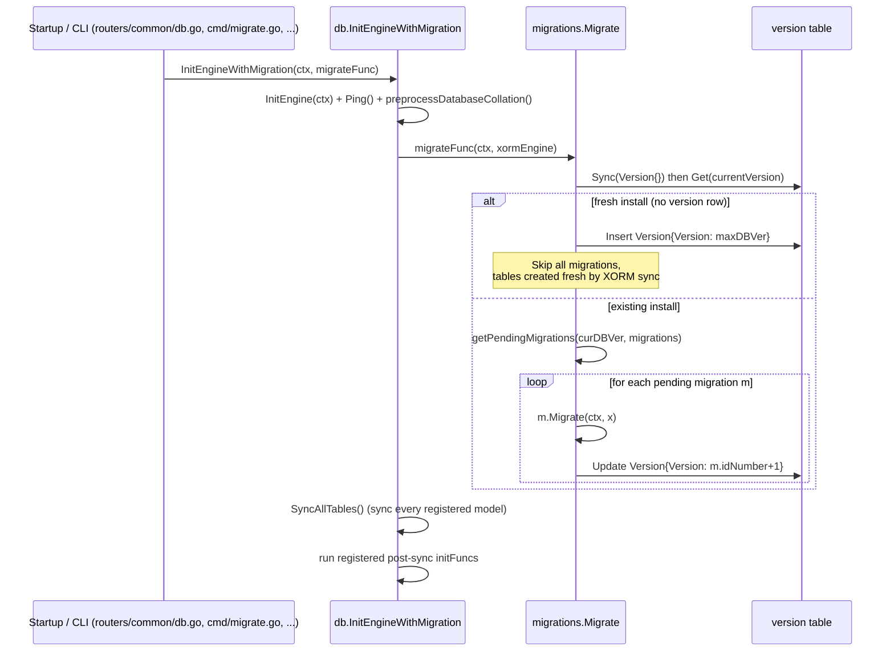

# Database Migrations

Gitea uses a hand-rolled, linear migration framework (not a third-party migration library)
built on top of the [DB Engine](db-engine-and-drivers.md) abstractions. Every schema change
ever shipped since Gitea 1.5.3 is represented as a numbered, ordered Go function. This page
explains how the framework works, the version-per-release directory convention, how to add a
new migration, and the test harness used to validate migrations against real fixture data.

> Source of truth for this page: `models/migrations/migrations.go`,
> `models/migrations/migrations_test.go`, `models/migrations/base/`,
> `models/migrations/migrationtest/tests.go`, `models/migrations/fixtures/`,
> and the per-version packages `models/migrations/v1_6` through `models/migrations/v1_27`.

## Why a Custom Framework?

Gitea doesn't use raw `.sql` files. Because it must run against SQLite, MySQL, PostgreSQL and
MSSQL with a single codebase, migrations are written as **Go functions that operate on an
`db.EngineMigration`** (an XORM engine), using XORM's schema-sync capabilities
(`Sync`, `SyncWithOptions`) plus raw SQL where needed for data transformations. This lets a
single migration function work across all four supported databases without needing a
dialect-specific SQL file per migration.

## The `migration` Type and Ordered List

`models/migrations/migrations.go` defines the central `migration` struct:

```go
type migration struct {
    idNumber    int64 // DB version is "the last migration's idNumber" + 1
    description string
    migrate     func(context.Context, db.EngineMigration) error
}
```

`newMigration` is a small generic helper that accepts *either* a context-aware function or a
plain `func(db.EngineMigration) error` (for older-style migrations that don't need a
`context.Context`), normalizing both into the same signature:

```go
func newMigration[T func(db.EngineMigration) error | func(context.Context, db.EngineMigration) error](
    idNumber int64, desc string, fn T,
) *migration {
    m := &migration{idNumber: idNumber, description: desc}
    var ok bool
    if m.migrate, ok = any(fn).(func(context.Context, db.EngineMigration) error); !ok {
        m.migrate = func(ctx context.Context, x db.EngineMigration) error {
            return any(fn).(func(db.EngineMigration) error)(x)
        }
    }
    return m
}
```

All migrations are registered, in strict chronological order, inside `prepareMigrationTasks()`.
This function is memoized via the package-level `preparedMigrations` slice (computed once, then
cached) and returns a big literal slice such as:

```go
func prepareMigrationTasks() []*migration {
    if preparedMigrations != nil {
        return preparedMigrations
    }
    preparedMigrations = []*migration{
        // Gitea 1.5.0 ends at database version 69

        newMigration(70, "add issue_dependencies", v1_6.AddIssueDependencies),
        newMigration(71, "protect each scratch token", v1_6.AddScratchHash),
        newMigration(72, "add review", v1_6.AddReview),

        // Gitea 1.6.0 ends at database version 73

        newMigration(73, "add must_change_password column for users table", v1_7.AddMustChangePassword),
        ...
        newMigration(342, "Add scoped workflows schema", v1_27.AddScopedWorkflowsSchema),
    }
    return preparedMigrations
}
```

Comments like `// Gitea X.Y.0 ends at database version N` mark release boundaries within the
otherwise flat list — this is purely documentation for maintainers, it has no functional effect.

### `minDBVersion` and the Version Table

```go
const minDBVersion = 70 // Gitea 1.5.3
```

Gitea refuses to auto-migrate databases older than version 70 (Gitea 1.5.3); such installs
must first be upgraded to an intermediate release (documented as v1.6.4 in the fatal error
message) before jumping to the current version. The current applied version is tracked in a
dedicated `version` table, mapped from the `Version` struct:

```go
type Version struct {
    ID      int64 `xorm:"pk autoincr"`
    Version int64 // DB version is "the last migration's idNumber" + 1
}
```

Only one row (`ID == 1`) is ever used.

## The Migration Lifecycle



`Migrate(ctx, x)` (the top-level entry point, in `migrations.go`) implements this logic:

```go
func Migrate(ctx context.Context, x db.EngineMigration) error {
    migrations := prepareMigrationTasks()
    maxDBVer := calcDBVersion(migrations)

    x.SetMapper(names.GonicMapper{})
    if err := x.Sync(new(Version)); err != nil {
        return fmt.Errorf("sync: %w", err)
    }

    currentVersion := &Version{ID: 1}
    has, err := x.Get(currentVersion)
    if err != nil {
        return fmt.Errorf("get: %w", err)
    } else if !has {
        // fresh installation: skip all migrations, XORM will create all tables when syncing
        currentVersion.ID = 0
        currentVersion.Version = maxDBVer
        if _, err = x.Insert(currentVersion); err != nil {
            return fmt.Errorf("insert: %w", err)
        }
    }

    curDBVer := currentVersion.Version
    if curDBVer < minDBVersion {
        log.Fatal(`Gitea no longer supports auto-migration from your previously installed version...`)
        return nil
    }
    if maxDBVer < curDBVer {
        log.Fatal("Migration Error: %s", ...) // downgrade protection
        return nil
    }

    if err = git.InitSimple(); err != nil {
        return err
    }

    for _, m := range getPendingMigrations(curDBVer, migrations) {
        log.Info("Migration[%d]: %s", m.idNumber, m.description)
        x.SetMapper(names.GonicMapper{})
        if err = m.Migrate(ctx, x); err != nil {
            return fmt.Errorf("migration[%d]: %s failed: %w", m.idNumber, m.description, err)
        }
        currentVersion.Version = migrationIDNumberToDBVersion(m.idNumber)
        if _, err = x.ID(1).Update(currentVersion); err != nil {
            return err
        }
    }
    return nil
}
```

Key behaviors:

- **Fresh installs skip migrations entirely.** If there's no `version` row at all, Gitea
  assumes this is a brand new database, sets the version straight to `maxDBVer`, and lets
  `SyncAllTables()` (called afterwards by `InitEngineWithMigration`) create the full, current
  schema directly from the model structs — no need to replay 250+ historical migrations.
- **Downgrade protection.** If the on-disk DB claims a version *newer* than what this binary
  knows about, Gitea refuses to start (`log.Fatal`) rather than silently running an older
  binary against a newer schema, which could corrupt data. In non-production builds, the fatal
  message even suggests the exact `UPDATE version SET version=...` statement to force past it
  (for developers who know what they're doing).
- **Too-old protection.** `curDBVer < minDBVersion` also calls `log.Fatal`, instructing the
  admin to upgrade to an intermediate Gitea version first.
- **The mapper is reset before every single migration** (`x.SetMapper(names.GonicMapper{})`)
  because migrations aren't supposed to depend on mapper state left over by a previous one.
- **`git.InitSimple()` is called before running any pending migration**, since some migrations
  need to invoke git commands (e.g., to inspect repositories on disk).
- **Version is persisted after each migration, not just at the end** — so a crash partway
  through a long migration run resumes correctly from the last successfully applied migration
  rather than re-running everything (or worse, skipping migrations).

### Supporting Functions

| Function | Purpose |
|---|---|
| `GetCurrentDBVersion(x)` | Syncs the `Version` table and returns the current stored version (`-1` if uninitialized) |
| `calcDBVersion(migrations)` | Computes the expected DB version from the migration list, panicking if migrations aren't contiguous/ordered starting at `minDBVersion` |
| `ExpectedDBVersion()` | Public wrapper around `calcDBVersion(prepareMigrationTasks())` — "what version should this binary's DB be at" |
| `EnsureUpToDate(ctx, x)` | Read-only check (no migrations run) used by `gitea doctor` — fails if current ≠ expected, or if too old |
| `getPendingMigrations(curDBVer, migrations)` | Slices the migration list to just what still needs to run |
| `migrationIDNumberToDBVersion(idNumber)` | Simply `idNumber + 1` — the DB version convention is always "one past the last applied migration's ID" |

`EnsureUpToDate` is important operationally: it's how `gitea doctor` and
`services/doctor/dbconsistency.go` verify the database schema matches the running binary
*without* risking any writes:

```go
func EnsureUpToDate(ctx context.Context, x db.EngineMigration) error {
    currentDB, err := GetCurrentDBVersion(x)
    ...
    if minDBVersion > currentDB {
        return fmt.Errorf("DB version %d (<= %d) is too old for auto-migration...", currentDB, minDBVersion)
    }
    expectedDB := ExpectedDBVersion()
    if currentDB != expectedDB {
        return fmt.Errorf(`current database version %d is not equal to the expected version %d. Please run "gitea [--config /path/to/app.ini] migrate"...`, currentDB, expectedDB)
    }
    return nil
}
```

## Directory / Naming Convention per Gitea Version

Migrations live in one package per **minor Gitea release line**, named `v1_<minor>`
(e.g. `v1_6`, `v1_7`, ..., `v1_27`), under `models/migrations/`:

```
models/migrations/
├── migrations.go            # the ordered list + Migrate()/EnsureUpToDate() entry points
├── migrations_test.go
├── base/                    # shared helpers (RecreateTable, DropTableColumns, ModifyColumn, hashing...)
├── migrationtest/           # PrepareTestEnv() harness used by v1_NN/*_test.go files
├── fixtures/                # YAML fixtures for specific migration tests, keyed by Go test name
├── v1_6/
│   ├── v70.go
│   ├── v71.go
│   └── v72.go
├── v1_7/  ...
├── ...
└── v1_27/
    ├── main_test.go
    ├── v331.go   v331_test.go
    ├── v332.go
    ├── v333.go   v333_test.go
    ├── v334.go   v334_test.go
    ├── v335.go
    ├── v336.go
    ├── v337.go
    ├── v338.go   v338_test.go
    ├── v339.go   v339_test.go
    ├── v340.go
    ├── v341.go   v341_test.go
    └── v342.go
```

**File naming inside each version package is `v<idNumber>.go`** — the file name's number
matches exactly the `idNumber` passed to `newMigration(idNumber, ...)` in `migrations.go`.
For example, `v1_27/v340.go` implements migration ID `340`, registered as:

```go
newMigration(340, "Add ContinueOnError column to ActionRunJob", v1_27.AddContinueOnErrorToActionRunJob),
```

And the file itself:

```go
// models/migrations/v1_27/v340.go
package v1_27

import (
    "gitea.dev/models/db"

    "xorm.io/xorm"
)

// AddContinueOnErrorToActionRunJob adds the ContinueOnError column to ActionRunJob,
// storing the job-level continue-on-error value from the workflow YAML.
func AddContinueOnErrorToActionRunJob(x db.EngineMigration) error {
    type ActionRunJob struct {
        ContinueOnError bool `xorm:"NOT NULL DEFAULT FALSE"`
    }

    _, err := x.SyncWithOptions(xorm.SyncOptions{
        IgnoreDropIndices: true,
        IgnoreConstrains:  true,
    }, new(ActionRunJob))
    return err
}
```

Notice the pattern common to almost every simple column-add migration:

1. Define a **local, minimal struct** inside the function (not the "real" model struct from
   `models/actions`) containing only the field(s) being added, with the correct `xorm` tag.
2. Call `x.SyncWithOptions(xorm.SyncOptions{IgnoreDropIndices: true, IgnoreConstrains: true}, new(LocalStruct))`
   so XORM adds just the missing column, without trying to reconcile the *entire* schema
   (which could drop indices/constraints the migration doesn't know about).

Each version package's file numbers are contiguous with the previous package's last number —
e.g., `v1_26` ends at some ID, and `v1_27` begins at `id+1` (`331` in this case) — enforced at
runtime by the `calcDBVersion` panic checks (`"migrations should start at minDBVersion"` /
`"migrations are not in order"`), and validated by `migrations_test.go`.

## How to Add a New Migration

1. **Determine the next ID.** Find the highest `idNumber` currently registered in
   `prepareMigrationTasks()` (the last entry in the list) — your new migration is `+1`.
2. **Create (or reuse) the current release's version package.** If a `v1_28` directory doesn't
   exist yet (assuming `v1_27` is the latest), create it following the same `main_test.go`
   pattern used by every existing version package:

   ```go
   // models/migrations/v1_28/main_test.go
   package v1_28

   import (
       "testing"

       "gitea.dev/models/migrations/migrationtest"
   )

   func TestMain(m *testing.M) {
       migrationtest.MainTest(m)
   }
   ```

3. **Write the migration file `v<idNumber>.go`** in that package, implementing a function with
   signature `func(x db.EngineMigration) error` or `func(ctx context.Context, x db.EngineMigration) error`.
   Common patterns (see `models/migrations/base/db.go` for shared helpers):
   - **Add a column**: define a minimal local struct and call `x.SyncWithOptions(...)`.
   - **Rename/modify a column's type**: use `base.ModifyColumn(x, tableName, col)`.
   - **Drop columns**: use `base.DropTableColumns(sess, tableName, columnNames...)`.
   - **Fully recreate a table** (e.g., changing a primary key or removing a `NOT NULL`
     constraint SQLite can't `ALTER`): use `base.RecreateTables(beans...)` /
     `base.RecreateTable(sess, bean)`, which copies data into a temp table, drops the old one,
     and renames the temp table into place.
   - **Data-only migrations** (no schema change, e.g., re-hashing values): operate directly via
     `x.Iterate(...)` or raw SQL through `x.Exec(...)`.
4. **Register it** in `models/migrations/migrations.go`, appending to the very bottom of the
   `preparedMigrations` slice inside `prepareMigrationTasks()`:

   ```go
   newMigration(343, "describe what this migration does", v1_28.YourNewMigrationFunc),
   ```

   > Never insert a migration in the middle of the list or reuse/change an existing `idNumber`
   > — that breaks version tracking for every already-deployed instance at that version.

5. **Write a migration test** (see below) exercising the migration against fixture/inserted
   data, verifying the resulting schema/data is correct.
6. **If a migration must be retired** (per code comments in `migrations.go`): remove it from
   the *top* of the list and bump `minDBVersion` accordingly — never remove from the middle.

### Data type / dialect notes

Because the same Go function must work on SQLite, MySQL, PostgreSQL and MSSQL, migrations
generally avoid raw dialect-specific SQL unless unavoidable — note the existence of migrations
like `v1_27.FixLegacyMSSQLDateTimeColumns`, which specifically targets MSSQL's legacy
`DATETIME` type (versus `DATETIME2`), showing that dialect-conditional logic inside a migration
(checking `x.Dialect().URI().DBType`) is an accepted pattern when truly necessary.

## Migration Test Harness

### `migrationtest.PrepareTestEnv`

`models/migrations/migrationtest/tests.go` provides the shared setup used by (almost) every
`v1_NN/*_test.go` file:

```go
func PrepareTestEnv(t *testing.T, skip int, syncModels ...any) (db.EngineMigration, func()) {
    ...
    require.NoError(t, unittest.SyncDirs(...))
    cleanup, err := unittest.ResetTestDatabase()
    ...
    err = db.InitEngine(t.Context())
    x := unittest.GetXORMEngine()

    if len(syncModels) > 0 {
        if err := x.Sync(syncModels...); err != nil { ... }
    }

    fixturesDir := filepath.Join(giteaRoot, "models", "migrations", "fixtures", t.Name())
    if _, err := os.Stat(fixturesDir); err == nil {
        unittest.InitFixtures(unittest.FixturesOptions{Dir: fixturesDir})
        unittest.LoadFixtures()
    }
    return x, deferFn
}
```

Key behavior:

- `syncModels` are the **local struct definitions the test needs** — since migrations often
  work with minimal, function-local structs rather than the full current model, tests sync
  exactly the "before" schema shape they need to insert fixture rows into.
- **Fixtures are auto-discovered by test name**: `PrepareTestEnv` looks for a directory at
  `models/migrations/fixtures/<TestName>/` — if it exists, all `.yml` files in it are loaded as
  fixtures before the migration under test runs. This means a test named
  `TestAddIssueResourceIndexTable` will automatically pick up
  `models/migrations/fixtures/Test_AddIssueResourceIndexTable/issue.yml` if present.
- Returns `(x, deferFn)` where `x` is a ready-to-use `db.EngineMigration` and `deferFn` cleans
  up the test database, closes the engine, and restores logging — callers must
  `defer deferable()` immediately.

`LoadTableSchemasMap(t, x)` is a small helper for tests that need to assert on the resulting
schema shape (column types, indices) after a migration runs, returning `map[string]*schemas.Table`
keyed by table name via `x.DBMetas()`.

`MainTest(m)` / `mainTest(m)` set up the shared test process: initializing the test logger,
loading the integration test config (`setting.PrepareIntegrationTestConfig()`), setting up the
Gitea test environment, and initializing git — every version package's `main_test.go` simply
calls `migrationtest.MainTest(m)` from its own `TestMain`.

### Example: A full migration + test pair

`models/migrations/v1_27/v334.go` and `v334_test.go` together show the standard shape:

```go
// v334.go
func AddCancellingSupportToActionRunner(x db.EngineMigration) error {
    type ActionRunner struct {
        HasCancellingSupport bool `xorm:"has_cancelling_support NOT NULL DEFAULT false"`
    }

    _, err := x.SyncWithOptions(xorm.SyncOptions{
        IgnoreConstrains:  true,
        IgnoreDropIndices: true,
    }, new(ActionRunner))
    return err
}
```

```go
// v334_test.go
func TestAddCancellingSupportToActionRunner(t *testing.T) {
    type ActionRunner struct {
        ID   int64 `xorm:"pk autoincr"`
        Name string
    }

    x, deferable := migrationtest.PrepareTestEnv(t, 0, new(ActionRunner))
    defer deferable()
    if x == nil || t.Failed() {
        return
    }

    _, err := x.Insert(&ActionRunner{Name: "runner"})
    require.NoError(t, err)

    require.NoError(t, AddCancellingSupportToActionRunner(x))

    var hasCancellingSupport bool
    has, err := x.SQL("SELECT has_cancelling_support FROM action_runner WHERE id = ?", 1).Get(&hasCancellingSupport)
    require.NoError(t, err)
    require.True(t, has)
    require.False(t, hasCancellingSupport)
}
```

The test: (1) syncs the **pre-migration** shape of `ActionRunner` (without the new column), (2)
inserts a row, (3) runs the migration function directly, then (4) verifies the new column
exists with the expected default value — all against a real (test) database engine, not mocks.

### `fixtures/` Directory

`models/migrations/fixtures/` holds YAML fixture data for migration tests that need
pre-existing rows with specific values (rather than programmatically inserting rows in the
test body). Each subdirectory is named exactly after the Go test function it belongs to, e.g.:

```
models/migrations/fixtures/
├── Test_AddCombinedIndexToIssueUser/
├── Test_AddConfidentialClientColumnToOAuth2ApplicationTable/
├── Test_AddHeaderAuthorizationEncryptedColWebhook/
├── Test_AddIssueResourceIndexTable/
│   └── issue.yml
├── Test_AddRepoIDForAttachment/
├── Test_AddUniqueIndexForProjectIssue/
├── Test_CheckProjectColumnsConsistency/
├── Test_DeleteOrphanedIssueLabels/
├── Test_FixCommitStatusTargetURLToUseRunAndJobID/
├── Test_RemigrateU2FCredentials/
├── Test_RemoveInvalidLabels/
├── Test_RepositoryFormat/
├── Test_StoreWebauthnCredentialIDAsBytes/
├── Test_UnwrapLDAPSourceCfg/
├── Test_UpdateBadgeColName/
└── Test_UpdateOpenMilestoneCounts/
```

Each `.yml` file inside a test's directory is a standard Gitea unit-test fixture (same format
used by `models/fixtures/*.yml` for regular model tests — see the Database & Models overview),
loaded via `unittest.InitFixtures`/`unittest.LoadFixtures` and matched to the table whose name
equals the YAML file's base name (`issue.yml` → `issue` table).

> **Tip:** Prefer fixtures over hand-written `Insert` calls when a migration test needs many
> rows, specific edge-case values (NULLs, empty strings, duplicate keys), or when mirroring a
> real bug report's exact data shape that triggered the migration in the first place.

## Shared Migration Helpers (`models/migrations/base/`)

- **`db.go`** — dialect-agnostic schema surgery helpers used across many version packages:
  - `RecreateTables(beans ...any) func(db.EngineMigration) error` /
    `RecreateTable(sess db.Session, bean any) error` — safely recreate a table (needed for
    changes SQLite can't `ALTER TABLE` for, like dropping a `NOT NULL` or changing a primary
    key): creates a `tmp_recreate__<table>` table with the new definition, copies data over,
    drops the old table, and renames the temp table into place.
  - `DropTableColumns(sess, tableName, columnNames...)` — dialect-aware column dropping.
  - `ModifyColumn(x, tableName, col *schemas.Column)` — dialect-aware column type/constraint
    changes.
- **`hash.go`** — small hashing helper(s) used by password/token migration functions (e.g.,
  `v1_9.HashAppToken`).

## Related Pages

- [DB Engine and Drivers](db-engine-and-drivers.md) — the underlying `EngineMigration`
  interface, connection setup, and how `InitEngineWithMigration` invokes `migrations.Migrate`.
- [Database & Models overview](README.md) — how the `models/` package is organized as a whole.
