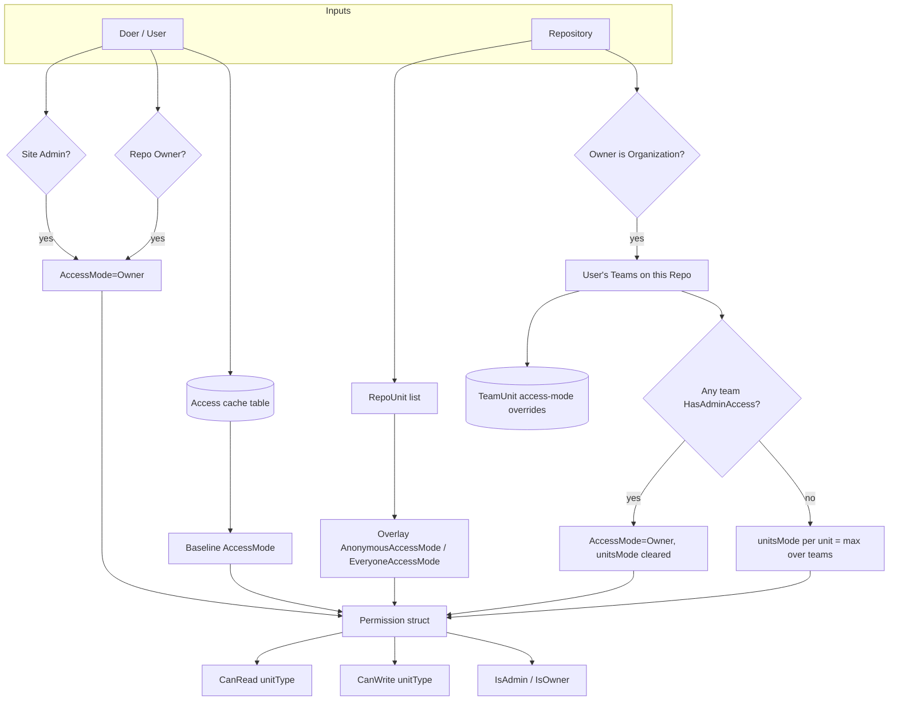

# Permissions Model

Gitea's authorization system layers three concepts on top of each other: a coarse
**`AccessMode`** enum (`models/perm`), a per-repository **cached access table**
(`models/perm/access`), and a **unit-aware `Permission`** struct that is computed on-demand for
every request and combines repo units, collaborators, and organization teams. This page walks
through all three layers.

Source: `models/perm/access_mode.go`, `models/perm/access/`, `models/unit/`.

## Layer 1 — `AccessMode`

`models/perm/access_mode.go` defines the single ordered scale used everywhere in Gitea to
express "how much can this actor do":

```go
type AccessMode int

const (
    AccessModeNone AccessMode = iota // 0: no access

    AccessModeRead  // 1: read access
    AccessModeWrite // 2: write access
    AccessModeAdmin // 3: admin access
    AccessModeOwner // 4: owner access
)
```

Because the values are ordered integers, comparisons like `mode >= perm.AccessModeWrite` are
used pervasively to test "at least" a given level. `ParseAccessMode(s, allowed...)` converts the
string forms used in API payloads (`"read"`, `"write"`, `"admin"`) back into the enum,
optionally restricting to a whitelist of `allowed` values (`"owner"` is intentionally excluded
from string parsing — it's an internal-only level, never settable via user input).

## Layer 2 — The `Access` Cache Table

`models/perm/access/access.go` maintains a **denormalized cache table** (`Access`) that stores
the maximum access mode a specific user has on a specific repository, so that hot-path
permission checks don't need to join collaborators + teams + team-units on every request.

```go
type Access struct {
    ID     int64 `xorm:"pk autoincr"`
    UserID int64 `xorm:"UNIQUE(s)"`
    RepoID int64 `xorm:"UNIQUE(s)"`
    Mode   perm.AccessMode
}
```

Important: `Access` does **not** cover the repository owner themself (owner access is implicit,
computed as `AccessModeOwner` whenever `userID == repo.OwnerID`) — only other users
(collaborators or organization-team members) get rows here.

### Recalculation functions

| Function | When used |
|---|---|
| `RecalculateAccesses(ctx, repo)` | Full recompute for a repo — dispatches to team-based or collaborator-based recompute depending on whether the owner is an org |
| `RecalculateTeamAccesses(ctx, repo, ignTeamID)` | Recomputes access for an org-owned repo from all its teams' members (skips team `ignTeamID`, used when removing a repo from a team) |
| `RecalculateUserAccess(ctx, repo, uid)` | Fast path: recompute for a single user only (e.g. after adding/removing one collaborator) |

`refreshAccesses` is the core diffing routine: it computes a desired `accessMap[userID] =
maxAccessMode(...)`, compares it against existing `Access` rows, and performs minimal
insert/update/delete operations rather than "delete all, re-insert all" — important for repos
with many collaborators.

`minModeToKeep` logic: for a **public, non-org-owned repo**, any access mode below `Write` isn't
persisted (read access is already implicit for public repos, so storing it would be redundant);
for **private repos or org-owned repos**, the threshold drops to `Read` since nothing is implicit.

### `accessLevel(ctx, user, repo)`

The core lookup: returns `AccessModeRead` for any repo that is fully public (or, for restricted
users, public-and-owner-is-public), `AccessModeOwner` if `userID == repo.OwnerID`, otherwise
looks up the cached `Access` row (defaulting to whatever public-read applies).

## Layer 3 — Unit-Aware `Permission`

The `Access` table gives a single access mode for a whole repository, but real authorization
needs to be **per-feature** (a user might have `Write` on Issues but only `Read` on Code, e.g. an
external triager). This is modeled by `Permission` in `models/perm/access/repo_permission.go`.

```go
type Permission struct {
    AccessMode perm_model.AccessMode // the "baseline" mode (repo-wide, e.g. owner/collaborator mode)

    units     []*repo_model.RepoUnit
    unitsMode map[unit.Type]perm_model.AccessMode // per-unit override (from team grants)

    everyoneAccessMode  map[unit.Type]perm_model.AccessMode // min mode for any signed-in user
    anonymousAccessMode map[unit.Type]perm_model.AccessMode // min mode for anonymous visitors
}
```

### Resolving a unit's effective access mode

```go
func (p *Permission) UnitAccessMode(unitType unit.Type) perm_model.AccessMode {
    if m, ok := p.unitsMode[unitType]; ok {
        return util.Iif(p.AccessMode >= perm_model.AccessModeAdmin, p.AccessMode, m)
    }
    unitDefaultAccessMode := p.AccessMode
    unitDefaultAccessMode = max(unitDefaultAccessMode, p.anonymousAccessMode[unitType])
    unitDefaultAccessMode = max(unitDefaultAccessMode, p.everyoneAccessMode[unitType])
    hasUnit := slices.ContainsFunc(p.units, func(u *repo_model.RepoUnit) bool { return u.Type == unitType })
    return util.Iif(hasUnit, unitDefaultAccessMode, perm_model.AccessModeNone)
}
```

Rules encoded here:

1. If a **per-unit override** exists (from a team grant via `TeamUnit`), use it — *unless* the
   user's baseline is already `Admin`/`Owner`, in which case the higher baseline wins (an admin
   can't be downgraded by a narrower team grant).
2. If there's no per-unit override, fall back to `max(baseline, anonymousAccessMode[unit],
   everyoneAccessMode[unit])` — this is how a `RepoUnit.AnonymousAccessMode` /
   `EveryoneAccessMode` setting (e.g. "let anyone read the Wiki") grants access even to users who
   otherwise have no explicit relationship to the repo.
3. But only if the repository actually **has** that unit enabled at all (`hasUnit`) — a disabled
   unit is always `AccessModeNone` regardless of overrides.

Convenience wrappers: `CanAccess`, `CanAccessAny`, `CanRead`, `CanReadAny`, `CanWrite`,
`CanReadIssuesOrPulls(isPull)`, `CanWriteIssuesOrPulls(isPull)`, `IsOwner()`, `IsAdmin()`,
`HasAnyUnitAccess()`, `HasAnyUnitPublicAccess()`, `ReadableUnitTypes()`.

### `finalProcessRepoUnitPermission` — applying public-access overlays

After the baseline `Permission` is computed, `finalProcessRepoUnitPermission` overlays
`AnonymousAccessMode`/`EveryoneAccessMode` from each `RepoUnit` (via `applyPublicAccessPermission`,
which is a no-op when `setting.Repository.ForcePrivate` is set instance-wide) and then **prunes**
`perm.units` down to only the units the user can reach through some mode (explicit unitsMode,
anonymous overlay, or everyone overlay) — this keeps `HasAnyUnitAccess`/`ReadableUnitTypes` cheap
and accurate.

### Computing permission for a real request — `GetIndividualUserRepoPermission`

This is the main entry point (wrapped by `GetDoerRepoPermission`, which additionally detects
Actions-task "virtual users" and routes to `GetActionsUserRepoPermission` instead):

```mermaid
flowchart TD
    Start([GetIndividualUserRepoPermission]) --> LoadUnits[repo.LoadUnits]
    LoadUnits --> AnonPrivate{user==nil AND repo.IsPrivate?}
    AnonPrivate -->|yes| NoneA[AccessMode = None, return]
    AnonPrivate -->|no| CheckCollab[IsCollaborator?]
    CheckCollab --> OwnerVisible{Owner visible to doer OR isCollaborator?}
    OwnerVisible -->|no| NoneB[AccessMode = None, return]
    OwnerVisible -->|yes| AnonPublic{user == nil?}
    AnonPublic -->|yes| ReadA[AccessMode = Read, return]
    AnonPublic -->|no| SuperUser{user.IsAdmin OR user.ID==repo.OwnerID?}
    SuperUser -->|yes| OwnerA[AccessMode = Owner, return]
    SuperUser -->|no| AccessLvl[accessLevel: read cached Access table]
    AccessLvl --> IsOrgOwned{repo.Owner.IsOrganization?}
    IsOrgOwned -->|no| ReturnPlain[return plain user AccessMode]
    IsOrgOwned -->|yes| MinMode[AccessMode = max(AccessMode, minAccessMode for public repo)]
    MinMode --> GetTeams[GetUserRepoTeams: teams granting access to this repo]
    GetTeams --> NoTeams{no teams?}
    NoTeams -->|yes| ReturnOrg[return]
    NoTeams -->|no| OwnerTeam{any team HasAdminAccess?}
    OwnerTeam -->|yes| OwnerB[AccessMode = Owner, unitsMode = nil, return]
    OwnerTeam -->|no| PerUnit[compute unitsMode per RepoUnit from each team's UnitAccessModeEx]
    PerUnit --> Finalize[finalProcessRepoUnitPermission: overlay anonymous/everyone modes, prune units]
    Finalize --> Done([Permission ready])
```

Key special cases baked into the flow:

- **Site admins** and the **repo owner** always get `AccessModeOwner`, bypassing unit checks
  entirely.
- Users **blocked from viewing a private owner** (`organization.HasOrgOrUserVisible`) get `None`
  even if they're technically a collaborator-adjacent case is handled by checking
  `isCollaborator` as an override.
- For org-owned repos, if **any** team the user belongs to has `HasAdminAccess()` (i.e. is the
  Owners team or another admin-mode team), the whole `unitsMode` map is cleared and
  `AccessMode = Owner` — admin teams always get full access to every unit, sidestepping
  per-unit team grants.
- Otherwise, `unitsMode[u.Type]` is the max across all the user's teams' `UnitAccessModeEx`
  results for that unit type (`Team.UnitAccessModeEx` reads the `TeamUnit` row, falling back to
  the team's overall `AccessMode` when `HasAdminAccess()`).

### Other permission entry points

| Function | Purpose |
|---|---|
| `AccessLevel(ctx, user, repo)` | Legacy/simple wrapper returning just the repo-wide `AccessMode` |
| `AccessLevelUnit(ctx, user, repo, unitType)` | Same, but for one specific unit |
| `HasAccessUnit(ctx, user, repo, unitType, testMode)` | Boolean convenience check |
| `IsUserRepoAdmin(ctx, repo, user)` / `IsUserRealRepoAdmin(ctx, repo, user)` | Whether the user is (effectively) a repo admin — "real" excludes site-admin escalation |
| `CanBeAssigned(ctx, user, repo)` | Whether a user is eligible to be assigned to issues/PRs on the repo |
| `GetUsersWithUnitAccess` / `GetUserIDsWithUnitAccess` | Enumerate all users with at least a given mode on a unit (e.g. to build the assignee picker) |
| `CheckRepoUnitUser(ctx, repo, user, unitType)` | Boolean shortcut combining `GetDoerRepoPermission` + `CanRead` |
| `PermissionNoAccess()` | Returns a zero-value `Permission{AccessMode: AccessModeNone}` |
| `GetActionsUserRepoPermission` | Special-cased permission resolution for CI/Actions "virtual" users, including cross-repo access for same-owner workflows (`checkSameOwnerCrossRepoAccess`) and `CanReadWorkflowCrossRepo` |

## Unit Types Recap

The unit-type enum (`models/unit/unit.go`) that `Permission.unitsMode` and `RepoUnit.Type` key
on is the same one described in the [Repository Model](repository-model.md#repo-units--feature-toggle-system)
page: `TypeCode`, `TypeIssues`, `TypePullRequests`, `TypeReleases`, `TypeWiki`,
`TypeExternalWiki`, `TypeExternalTracker`, `TypeProjects`, `TypePackages`, `TypeActions`. Each
`unit.Unit` definition also carries a `MaxPerm()` — for `TypeExternalTracker`/`TypeExternalWiki`
this caps at `AccessModeRead` (you can only *link* to an external tracker/wiki, never manage it
through Gitea's permission system), while all other units cap at `AccessModeAdmin` (owner access
still wins via the baseline `AccessMode`).

## Permission Resolution Diagram



## Related Pages

- [Repository Model](repository-model.md) — `RepoUnit`, `Collaboration`
- [User & Organization Model](user-organization-model.md) — `Team`, `TeamUnit`, `TeamRepo`
- [Issues & Pull Requests Model](issues-and-pulls-model.md)
