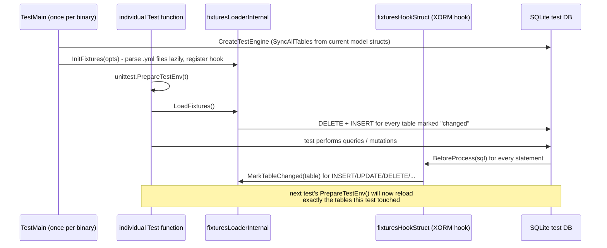

# Testing & Fixtures

Nearly every model-layer unit test in Gitea (`models/*_test.go`, and many `services/*_test.go`)
runs against a **real SQLite database** seeded from a shared set of YAML fixture files, rather
than mocks. This page documents the fixture data set, the loader that seeds them, and the
helper assertions built on top — the machinery that makes `unittest.PrepareTestEnv(t)` +
`unittest.AssertExistsAndLoadBean(...)` the standard pattern seen throughout the codebase's
test files.

> Source of truth for this page: `models/fixtures/*.yml` (78 files), `models/unittest/testdb.go`,
> `models/unittest/fixtures.go`, `models/unittest/fixtures_loader.go`,
> `models/unittest/unit_tests.go`, `models/unittest/consistency.go`, `models/unittest/fscopy.go`,
> `models/unittest/mock_http.go`, `models/unittest/reflection.go`, and `models/migrations/fixtures/`
> (covered separately in [Migrations](migrations.md#migration-tests)).

## The Fixture Data Set (`models/fixtures/`)

`models/fixtures/` holds 78 YAML files, one per database table, forming a single consistent
"test universe" — a handful of users/orgs, a handful of repositories they own or collaborate on,
issues/PRs/comments on those repos, and so on, all cross-referenced by numeric ID. Every model
test in the codebase that touches the database loads some or all of this same fixture set, so
IDs are treated as stable, well-known constants throughout the test suite (e.g. "user 1 owns
repo 1", "user 2 is a collaborator on repo 1 with Write access").

Representative examples, grouped by the domain pages elsewhere in this section:

| Domain | Fixture files |
|---|---|
| Users & orgs | `user.yml`, `email_address.yml`, `two_factor.yml`, `webauthn_credential.yml`, `gpg_key.yml`, `public_key.yml`, `deploy_key.yml`, `follow.yml`, `user_blocking.yml`, `org_user.yml`, `team.yml`, `team_user.yml`, `team_repo.yml`, `team_unit.yml`, `badge.yml` |
| Repositories | `repository.yml`, `repo_unit.yml`, `repo_topic.yml`, `topic.yml`, `star.yml`, `watch.yml`, `collaboration.yml`, `mirror.yml`, `release.yml`, `repo_redirect.yml`, `repo_transfer.yml`, `repo_archiver.yml`, `repo_indexer_status.yml`, `repo_license.yml` |
| Issues & PRs | `issue.yml`, `issue_index.yml`, `issue_label.yml`, `issue_assignees.yml`, `issue_user.yml`, `issue_watch.yml`, `issue_pin.yml`, `comment.yml`, `label.yml`, `milestone.yml`, `reaction.yml`, `pull_request.yml`, `review.yml`, `tracked_time.yml`, `stopwatch.yml`, `project.yml`, `project_board.yml`, `project_issue.yml` |
| Git metadata | `branch.yml`, `renamed_branch.yml`, `protected_branch.yml`, `protected_tag.yml`, `commit_status.yml`, `commit_status_index.yml`, `lfs_meta_object.yml` |
| Auth | `access.yml`, `access_token.yml`, `login_source.yml`, `external_login_user.yml`, `oauth2_application.yml`, `oauth2_authorization_code.yml`, `oauth2_grant.yml`, `user_open_id.yml`, `user_redirect.yml` |
| Actions & webhooks | `action.yml`, `action_artifact.yml`, `action_run.yml`, `action_run_job.yml`, `action_runner.yml`, `action_runner_token.yml`, `action_task.yml`, `action_task_output.yml`, `webhook.yml`, `hook_task.yml` |
| Misc | `attachment.yml`, `notice.yml`, `notification.yml`, `system_setting.yml` |

Each file is a plain YAML list of objects, one per row, using **XORM's DB column names**
(snake_case) rather than Go struct field names — for example `repository.yml` rows use `owner_id`,
`lower_name`, `is_private`, matching the `xorm:"..."` tags on `repo.Repository`, not the Go field
names directly. A binary column value is written as a `0x`-prefixed hex string (e.g. for a
`BLOB`/`bytea` column) and is decoded back to raw bytes by `preprocessFixtureRow` before insert
(see below) — this is the one piece of "magic" encoding fixture authors need to know about.

> **Tip:** When adding a new column to an existing model, existing fixture rows are **not**
> auto-populated with the new column — you must either add an explicit value to every affected
> `.yml` row or ensure the column has a sensible XORM/SQL default, otherwise fixture-dependent
> tests for that table may fail differently across SQLite/MySQL/Postgres/MSSQL due to differing
> NULL/default-value handling.

## Loading Fixtures into a Test Database

### `TestMain` / `unittest.MainTest`

Almost every package under `models/` (and many under `services/`) has a `main_test.go` whose
entire content is a call into `unittest.MainTest`:

```go
func TestMain(m *testing.M) {
    unittest.MainTest(m)
}
```

`MainTest` → `mainTest` performs full process-level test setup, once per test binary:

1. Creates a fresh temp directory (`tempdir.OsTempDir("gitea-test").MkdirTempRandom(...)`) and
   mocks `setting`'s built-in paths to point at it (`setting.MockBuiltinPaths`).
2. Calls `setting.SetupGiteaTestEnv()` to load baseline test configuration.
3. Calls `CreateTestEngine(sqliteTestDbPath, FixturesOptions{Dir: "models/fixtures", Files:
   testOpts.FixtureFiles})` — this is the core of test-DB setup (see next section). If
   `testOpts.FixtureFiles` is left `nil`, **all** fixture files in the directory are loaded; a
   package can instead pass a curated subset if it only needs certain tables (an **empty**
   (non-nil) slice explicitly means "load nothing").
4. Sets a batch of hard-coded test-only `setting.*` values (`AppURL`, `Domain`, `SSH.*`,
   `Database.Type = "sqlite3"`, default branch `"master"`, Gravatar source, etc.) so tests don't
   depend on the developer's local `app.ini`.
5. Initializes `cache`, `storage`, syncs `tests/gitea-repositories-meta/` into
   `setting.RepoRootPath` (the actual bare git repos backing fixture rows like `repository.yml`),
   and calls `git.InitFull()`.
6. Runs an optional package-supplied `TestOptions.SetUp`/`TearDown` hook around `m.Run()` — used
   by a handful of packages that need extra one-time setup (e.g. seeding a search index).

### `CreateTestEngine` → XORM engine + schema sync + fixture load

```go
func CreateTestEngine(testSQLiteFile string, opts FixturesOptions) error {
    driver, connStr, err := db.ConnStr(db.ConnOptions{
        Type: setting.DatabaseTypeSQLite3, SQLitePath: testSQLiteFile,
        SQLiteBusyTimeout: setting.DefaultSQLiteBusyTimeout,
    })
    x, err := xorm.NewEngine(driver, connStr)
    x.SetMapper(names.GonicMapper{})
    db.SetDefaultEngine(context.Background(), x)
    if err = db.SyncAllTables(); err != nil { return err }
    return InitFixtures(opts)
}
```

Tests **always** run against a real SQLite file (never MySQL/Postgres/MSSQL, and never
in-memory `:memory:` — a real file lets multiple connections/goroutines within one test share
state correctly). `db.SyncAllTables()` — the same function used at real server startup after
migrations run — creates every table directly from the current Go model struct tags, so tests
always run against the **current** schema, never a historical migrated-up-from-scratch one; this
is why fixture data must always match the *latest* model shape, not any particular migration
version.

### `InitFixtures` / `LoadFixtures` / the fixtures hook

`InitFixtures(opts)` builds a `fixturesLoaderInternal` (via `NewFixturesLoader`) that:

- Reads every requested `.yml` file's rows once, quotes identifiers for the target dialect, and
  pre-builds parameterized `INSERT` SQL strings (`prepareFixtureItem`) — this happens lazily, on
  first load, not at `NewFixturesLoader` time.
- Registers every table backed by a `db.RegisterModel`'d bean into `tableSyncMap` as `false`
  (needs (re)loading) — tables with **no** matching fixture file are still tracked, so that if a
  previous test wrote extra rows into a table with no `.yml` file, `Load()` will `DELETE FROM`
  it to reset state even without a corresponding fixture.
- Also registers a **dummy password-hash algorithm** (`hash.Register("dummy", ...)` +
  `hash.SetDefaultPasswordHashAlgorithm("dummy")`) so fixture-file password hashes don't need to
  match a real bcrypt/argon2/pbkdf2 output — tests can use predictable, fast dummy hashes.
- Attaches a `fixturesHookStruct` XORM hook (`AddHook`) that inspects **every** SQL statement
  executed during the test run (unless it originates from fixture-loading itself, detected via
  `db.ContextKeyTestFixtures` in the context) and calls `MarkTableChanged(tableName)` for any
  `INSERT`/`UPDATE`/`DELETE`/`MERGE`/`TRUNCATE`. This is how Gitea knows, cheaply, which tables
  were mutated by the *previous* test and therefore need re-seeding before the *next* one.

`LoadFixtures()` (called from `unittest.PrepareTestDatabase()`, itself called from
`unittest.PrepareTestEnv(t)` at the start of most test functions) then:

1. Opens one SQL transaction.
2. For every table currently marked "changed" (`tableSyncMap[table] == false`) **and** that has
   a corresponding fixture file, runs `DELETE FROM <table>` followed by all its pre-built
   `INSERT` statements (wrapping in `SET IDENTITY_INSERT ... ON/OFF` for MSSQL, since fixture
   rows specify explicit primary keys). Marks the table `true` (clean) once done.
3. Commits the transaction.
4. For any table still marked "changed" that has **no** fixture file at all, issues a bare
   `DELETE FROM` outside the fixture-loading context (so the fixtures hook doesn't re-mark it as
   dirty) to clear leftover test data.
5. On PostgreSQL only, runs `loadFixtureResetSeqPgsql` — a generated batch of `SELECT
   setval(...)` statements that resets every table's auto-increment sequence to `MAX(id)`,
   because Postgres sequences don't automatically track explicit-PK inserts the way
   SQLite/MySQL/MSSQL identity columns do.

This "only reload tables that changed" design means fixture reloading between tests is proportional
to how much a test actually wrote, not the full 78-table fixture set every time — important given
how many hundreds of test functions run per package.



## Assertion Helpers (`models/unittest/unit_tests.go`)

Generic helpers layered on top of the seeded database, used pervasively across `models/*_test.go`
and `services/*_test.go`:

| Function | Purpose |
|---|---|
| `AssertExistsAndLoadBean[T](t, bean T, conditions ...any) T` | Loads a row matching `bean`'s non-zero fields plus optional extra `conditions`; fails the test (`t.Errorf`/`FailNow`) if no row matches. The generic form lets callers write `issue := unittest.AssertExistsAndLoadBean(t, &issues_model.Issue{ID: 1})` and get back a properly-typed `*Issue`. |
| `GetBean[T](t, bean T, conditions ...any) T` | Same lookup, but does **not** fail the test if the row doesn't exist — used when absence is a valid, asserted-separately outcome. |
| `AssertNotExistsBean(t, bean, conditions ...any)` | Asserts that *no* row matches. |
| `AssertExistsAndLoadMap(t, table, conditions ...any) map[string]string` | Same idea, but for ad-hoc raw-SQL-style checks against a table that has no convenient Go struct in scope. |
| `GetCount(t, bean, conditions ...any) int` / `GetCountByCond(t, table, cond) int64` | Row counts for a bean or a raw `builder.Cond`. |
| `AssertCount` / `AssertCountByCond` | Assert an expected count, returning a bool (so callers can `assert.True(t, unittest.AssertCount(...))` in table-driven tests). |
| `AssertInt64InRange(t, low, high, value)` | Range assertion — used for timestamp fields (`CreatedUnix`) where an exact expected value would make tests flaky. |
| `Cond(query, args...)` / `OrderBy(orderBy)` | Wrap a raw XORM condition/order clause so it can be passed through the same `conditions ...any` variadic parameter as struct-based lookups. |
| `DumpQueryResult(t, sqlOrBean, args...)` | Debug helper — prints a query's result set to test output; not meant to remain in committed test code, but handy while developing a new test. |

## Consistency Checks (`models/unittest/consistency.go`)

`CheckConsistencyFor(t, beansToCheck ...any)` runs a table-specific **consistency checker
function** registered for each bean type against the *current* state of the test database —
distinct from (but complementary to) the generic orphaned-row helpers in
[DB Engine and Drivers: Consistency Checks](db-engine-and-drivers.md#consistency-checks-consistencygo).
Checkers are registered in an `init()` and keyed by reflected type, e.g. verifying that a
`Repository`'s cached `NumIssues`/`NumStars`/`NumForks` counters actually match `COUNT(*)` on the
real underlying rows. This is typically called at the *end* of a test that mutates
counters/derived state, to catch "forgot to update the denormalized counter" bugs that a purely
functional assertion (checking only the return value) would miss.

## Supporting Utilities

- **`models/unittest/testdb.go`**'s `ResetTestDatabase()` — an alternative, heavier reset used
  by a small number of tests/tools that need a completely fresh (not fixture-reloaded, but
  *dropped and recreated*) database — for SQLite this means deleting and recreating the `-test.db`
  file (the filename **must** end in `-test.db`, enforced by an explicit check, as a safety rail
  against accidentally pointing this at a real database file); for MySQL/Postgres/MSSQL it drops
  and recreates the whole named database (which itself must contain the substring `"test"`).
- **`models/unittest/fscopy.go`**'s `SyncDirs` — a recursive directory-sync helper (used to copy
  `tests/gitea-repositories-meta/*` — the bare git repos backing fixture repository rows — into
  the temp `RepoRootPath` before each test run) that's smarter than a plain recursive copy: it
  diffs file content/mtimes and only touches files that actually changed, and removes files in
  the destination that no longer exist in the source, so repeated test runs stay fast.
- **`models/unittest/mock_http.go`** — an `http.RoundTripper` mock/recorder used by tests that
  need to simulate external HTTP calls (e.g. OAuth2/OpenID provider responses, webhook delivery
  targets) without making real network calls.
- **`models/unittest/reflection.go`** — small reflection helpers (e.g. extracting a bean's table
  name or checking for a zero value generically) shared by the fixture loader and assertion
  helpers above.

## Migration Tests vs. Model Tests

The fixture *format* (`.yml`, XORM column names, `0x`-hex binary encoding) is shared with the
migration test harness described in [Migrations: Migration Test Harness](migrations.md#migration-test-harness),
but the two use **separate fixture directories** for a reason: `models/fixtures/` always matches
the *current* (HEAD) schema, since `CreateTestEngine` syncs tables from today's model structs.
`models/migrations/fixtures/<TestName>/*.yml`, by contrast, must match the **schema shape at the
point that specific historical migration ran** — often an older, narrower version of a table
than what exists today — so migration tests intentionally do not reuse `models/fixtures/`.

## Related Pages

- [DB Engine and Drivers](db-engine-and-drivers.md) — the underlying XORM engine that
  `CreateTestEngine` spins up, and the generic `CountOrphanedObjects`/`DeleteOrphanedObjects`
  consistency helpers.
- [Migrations](migrations.md) — the separate fixture set and test harness used specifically to
  validate individual historical migration functions.
- [Supplementary Models](supplementary-models.md) — every model package whose tables are seeded
  by the fixtures documented here.
