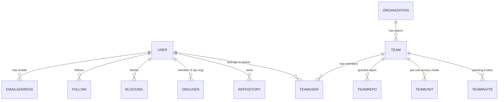
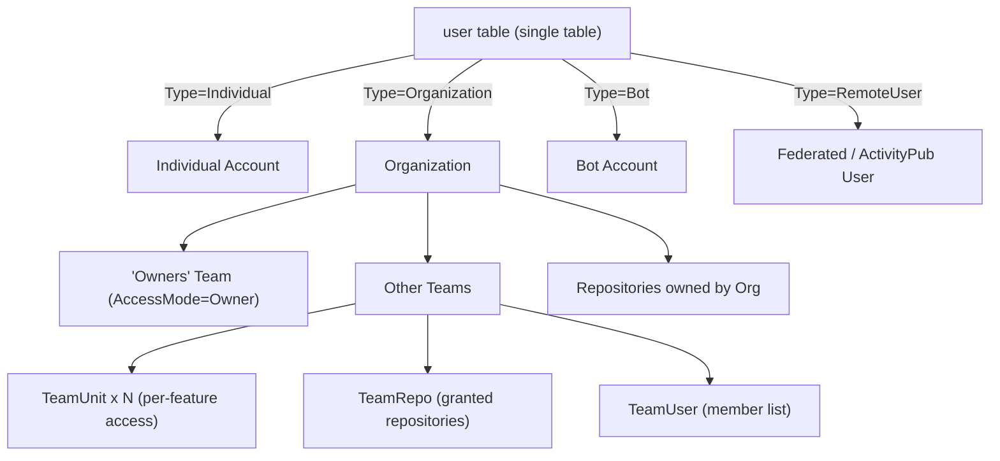

# User & Organization Model

Gitea uses a single database table (`user`) to represent **both** individual accounts and
organizations. This unification is what allows repositories, teams, and permissions to treat
"owner" uniformly whether the owner is a person or an organization. This page covers
`models/user/` (accounts, follows, blocks, emails) and `models/organization/` (organizations,
teams, membership).

## The `User` Struct — One Table, Multiple Meanings

`models/user/user.go`:

```go
type UserType int
const (
    UserTypeIndividual           UserType = iota // 0 — a normal human account
    UserTypeOrganization                          // 1 — an organization
    UserTypeUserReserved                          // 2 — reserved placeholder (spam prevention)
    UserTypeOrganizationReserved                  // 3 — reserved org placeholder
    UserTypeBot                                   // 4 — bot account
    UserTypeRemoteUser                            // 5 — federated/remote (ActivityPub) user
)

type User struct {
    ID        int64  `xorm:"pk autoincr"`
    LowerName string `xorm:"UNIQUE NOT NULL"`
    Name      string `xorm:"UNIQUE NOT NULL"`
    FullName  string

    Email                        string `xorm:"NOT NULL"`
    KeepEmailPrivate             bool
    EmailNotificationsPreference string `xorm:"VARCHAR(20) NOT NULL DEFAULT 'enabled'"`
    Passwd                       string `xorm:"NOT NULL"`
    PasswdHashAlgo               string `xorm:"NOT NULL DEFAULT 'argon2'"`
    MustChangePassword           bool   `xorm:"NOT NULL DEFAULT false"`

    LoginType   auth.Type // Plain, LDAP, SMTP, OAuth2, SSPI, ...
    LoginSource int64
    LoginName   string
    Type        UserType
    Location, Website, Language, Description string

    CreatedUnix, UpdatedUnix, LastLoginUnix timeutil.TimeStamp

    LastRepoVisibility bool
    MaxRepoCreation    int `xorm:"NOT NULL DEFAULT -1"` // -1 = use global default

    IsActive     bool `xorm:"INDEX"` // primary email activated
    IsAdmin      bool                // site admin
    IsRestricted bool `xorm:"NOT NULL DEFAULT false"` // only sees explicitly-granted repos/orgs

    AllowGitHook, AllowImportLocal, AllowCreateOrganization bool
    ProhibitLogin bool `xorm:"NOT NULL DEFAULT false"` // blocks Web UI login only

    Avatar, AvatarEmail string
    UseCustomAvatar     bool

    NumFollowers, NumFollowing, NumStars, NumRepos int

    // Organization-only fields (unused when Type == Individual)
    NumTeams                  int
    NumMembers                int
    Visibility                structs.VisibleType `xorm:"NOT NULL DEFAULT 0"`
    RepoAdminChangeTeamAccess bool                `xorm:"NOT NULL DEFAULT false"`

    DiffViewStyle, Theme string
    KeepActivityPrivate  bool
}
```

Because organization-only fields (`NumTeams`, `NumMembers`, `Visibility`,
`RepoAdminChangeTeamAccess`) live on the same row as individual-only fields (`MaxRepoCreation`,
`ProhibitLogin`), the table is sparse per-type but this design lets the rest of the codebase
treat "repository owner" as a single `User` pointer regardless of kind.

### The `Organization` type alias

`models/organization/org.go` defines:

```go
// Organization represents an organization
type Organization user_model.User

func OrgFromUser(user *user_model.User) *Organization {
    return (*Organization)(user)
}

func (Organization) TableName() string { return "user" }
```

`Organization` is a **Go type alias/cast** over `User`, not a separate struct or table — it just
adds organization-specific methods (`IsOwnedBy`, `IsOrgAdmin`, `IsOrgMember`,
`CanCreateOrgRepo`, `GetTeam`, `GetOwnerTeam`) on top of the same underlying row and reuses the
`user` table (`TableName()` returns `"user"`). Converting between the two is a zero-cost pointer
cast: `OrgFromUser(user)` / `org.AsUser()`.

`user.IsOrganization()` simply checks `u.Type == UserTypeOrganization`.

### Key behaviors

| Method / Concept | Behavior |
|---|---|
| `GetEmail()` | Returns the placeholder no-reply address if `KeepEmailPrivate`, else the real email |
| `GetPlaceholderEmail()` | `<id>+<lowername>@<NoReplyAddress>` |
| `MaxCreationLimit()` | Effective repo-creation cap: explicit `MaxRepoCreation`, else org/user default from `setting` |
| `IsLocal()` / `IsOAuth2()` | Based on `LoginType` |
| `BeforeUpdate()` | Normalizes `LowerName`, lowercases `Email`, truncates `Location`/`Website`/`Description` to 255 runes |
| `AfterLoad()` | Defaults `Theme` to `setting.UI.DefaultTheme` if empty |

### Related single-purpose tables in `models/user/`

| File | Struct | Purpose |
|---|---|---|
| `email_address.go` | `EmailAddress{ID, UID, Email, LowerEmail, IsActivated, IsPrimary}` | Multiple verified emails per user; exactly one `IsPrimary` |
| `follow.go` | `Follow{UserID, FollowID}` | Social "follow" graph; updates denormalized `NumFollowers`/`NumFollowing` transactionally |
| `block.go` | `Blocking{BlockerID, BlockeeID, Note}` (table `user_blocking`) | User-to-user blocks; blocked users can't star/watch/follow/interact; admins are exempt |
| `badge.go` | Badge / UserBadge | Profile badges |
| `external_login_user.go` | `ExternalLoginUser` | Links a local account to an external OAuth2/SSPI identity |
| `openid.go` | `UserOpenID` | OpenID identifiers associated with an account |
| `must_change_password.go` | — | Bulk-sets `MustChangePassword` for all/matching users |
| `redirect.go` | `Redirect` | Old username → user ID redirect after a rename |
| `setting.go` / `setting_options.go` | `Setting` (K/V) | Arbitrary per-user settings store |
| `user_system.go` | — | Well-known system users: Ghost (deleted-user placeholder), Actions bot |

> **Note:** `user_model.NewGhostUser()` (referenced throughout `models/issues` and
> `models/repo`) returns a synthetic "Ghost" `User` used whenever a poster/publisher account has
> been deleted, so historical records (`Release.Publisher`, `Comment.Poster`, etc.) never need a
> nullable foreign key.

## Organizations — `models/organization/`

### Teams — `team.go`

```go
const OwnerTeamName = "Owners"

type Team struct {
    ID                      int64 `xorm:"pk autoincr"`
    OrgID                   int64 `xorm:"INDEX"`
    LowerName, Name         string
    Description             string
    AccessMode              perm.AccessMode    `xorm:"'authorize'"` // team-wide default access mode
    Members                 []*user_model.User `xorm:"-"`
    NumRepos, NumMembers    int
    Units                   []*TeamUnit         `xorm:"-"`
    IncludesAllRepositories bool                `xorm:"NOT NULL DEFAULT false"`
    CanCreateOrgRepo        bool                `xorm:"NOT NULL DEFAULT false"`
    Visibility              structs.VisibleType `xorm:"NOT NULL DEFAULT 2"`
}
```

- Every organization automatically has an **"Owners"** team (`OwnerTeamName`), created when the
  org is created. `IsOwnerTeam()` checks `t.Name == OwnerTeamName`; owner-team members get
  `perm.AccessModeOwner` on every org repository regardless of per-repo/per-unit configuration
  (see [Permissions Model](permissions-model.md)).
- `HasAdminAccess()` returns true when `AccessMode >= perm.AccessModeAdmin` — such teams get
  access to *every* unit at admin level (`GetUnitNames`/`GetUnitsMap` short-circuit to
  `unit.AllUnitKeyNames()` rather than consulting per-unit rows).
- `IncludesAllRepositories` marks a team that automatically gets access to every repo in the
  org (current and future), bypassing the `TeamRepo` join table.
- `Visibility` (`Public`/`Limited`/`Private`) governs whether non-members can see the team and
  its member list at all (`CanNonMemberReadMeta`).

### Team units — `team_unit.go`

```go
type TeamUnit struct {
    ID         int64
    OrgID      int64     `xorm:"INDEX"`
    TeamID     int64     `xorm:"UNIQUE(s)"`
    Type       unit.Type `xorm:"UNIQUE(s)"`
    AccessMode perm.AccessMode
}
```

This is the team-level counterpart to a repository's `RepoUnit`: it lets a team have **different
access levels for different features** — e.g. a "QA" team might get `Write` on `TypeIssues` but
only `Read` on `TypeCode`. `Team.UnitAccessModeEx(ctx, unitType)` (used by
`GetIndividualUserRepoPermission` in the permission model) resolves the effective access mode
for a given unit, falling back to the team's overall `AccessMode` when `HasAdminAccess()` is
true.

### Team ↔ repository / team ↔ user joins

| File | Struct | Purpose |
|---|---|---|
| `team_repo.go` | `TeamRepo{OrgID, TeamID, RepoID}` | Which repos a team can access |
| `team_user.go` | `TeamUser{OrgID, TeamID, UID}` | Which users belong to a team |
| `team_invite.go` | `TeamInvite` | Pending email invitations to join a team |
| `org_user.go` | `OrgUser{UID, OrgID, IsPublic}` | Organization membership; `IsPublic` controls whether membership shows on the user's public profile |

### Organization worktime — `org_worktime.go`

Aggregates `TrackedTime` (see [Issues & Pull Requests Model](issues-and-pulls-model.md#time-tracking--stopwatch--trackedtime))
across all repositories owned by an organization, for org-wide time reports.

## User / Organization / Team Relationship Diagram





## Related Pages

- [Repository Model](repository-model.md)
- [Permissions Model](permissions-model.md)
- [Issues & Pull Requests Model](issues-and-pulls-model.md)
