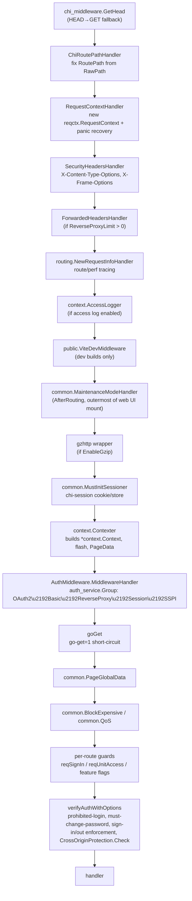

# Middleware Chain: Sessions, CSRF/Origin Protection, and the Auth Context

This page traces exactly how a web request acquires a session, gets its
`*context.Context` built, gets authenticated, and gets protected against
cross-origin/CSRF attacks, by following the middlewares registered in
`routers/web/web.go`, `routers/common/middleware.go`, `routers/common/auth.go`, and
`services/context/context.go`.

## Ordering overview

`routers.NormalRoutes()` installs a first layer of protocol-level middlewares via
`common.ProtocolMiddlewares()`, then mounts the web UI router, which installs a second,
web-UI-specific layer. Put together, a request to a normal web UI page flows through
these middlewares, strictly in this order:



## 1. Protocol-level middlewares (`routers/common/middleware.go`)

`ProtocolMiddlewares()` runs first, for *every* route mounted under `NormalRoutes()`
(web UI, REST API, internal API, packages, actions):

| Middleware | Purpose |
|---|---|
| `ChiRoutePathHandler()` | Forces chi to route on `RawPath` (if present) instead of the decoded path, so paths containing an encoded `%2f` are matched correctly instead of being collapsed into a path segment separator. |
| `RequestContextHandler()` | Wraps the response writer, creates the `reqctx.RequestContext` (used for profiling and the request-scoped cache), starts a tracer span, and installs a top-level `recover()` that renders a panic error page instead of crashing the process. Also registers a cleanup hook to remove temp files created by `ParseMultipartForm`. |
| `SecurityHeadersHandler()` | Unconditionally sets `X-Content-Type-Options` and `X-Frame-Options` response headers (configurable via `setting.Security.*`, with an `"unset"` escape hatch). |
| `ForwardedHeadersHandler(limit, trustedProxies)` | Only installed if `ReverseProxyLimit > 0` and `ReverseProxyTrustedProxies` is non-empty; parses `X-Forwarded-For`/`X-Forwarded-Proto` from trusted proxy hops so `ctx.RemoteAddr()` and TLS detection are correct behind a load balancer. |
| `routing.NewRequestInfoHandler()` | Records per-route function info used for the `/-/admin/monitor` request trace and Prometheus route labels. |
| `context.AccessLogger()` | Only if `setting.IsAccessLogEnabled()`; writes the access log line. |
| `public.ViteDevMiddleware` | Only for non-production builds; proxies asset requests to the Vite dev server. |

`common.MaintenanceModeHandler()` is installed with `r.AfterRouting(...)` at the
`NormalRoutes()` level (i.e. it wraps the already-matched route, after routing but
before the handler runs), so it can return a maintenance-mode page for any mounted
sub-router without needing to know which one matched.

## 2. Session middleware (`common.MustInitSessioner`)

`MustInitSessioner()` wraps [`go-chi/session`](https://gitea.com/go-chi/captcha) using
`setting.SessionConfig` (`Provider`, `ProviderConfig`, `CookieName`, `CookiePath`,
`Gclifetime`, `Maxlifetime`, `Secure`, `SameSite`, `Domain`). It is only added to the
web UI's inner `mid` slice (not the REST or internal API), because those use bearer
tokens/`INTERNAL_TOKEN` instead of cookie sessions. `IgnoreReleaseForWebSocket: true`
means a websocket handler is responsible for managing its own session release rather
than relying on the middleware's implicit release-on-response.

Note the code comment `CHI-SESSION-GOB-REGISTER`: any package that stores custom
struct types in the session must call `gob.Register` for those types during package
init, otherwise decoding a previously-stored session after a server restart will fail
silently.

## 3. Context construction (`context.Contexter`)

`context.Contexter()` (in `services/context/context.go`) is the single middleware that
turns a raw `*http.Request` into Gitea's `*context.Context`:

- Builds `Base` (the low-level request/response wrapper) via `NewBaseContext`.
- Builds the full `*context.Context` via `NewWebContext(base, rnd, session.GetContextSession(req))`,
  which sets up `ctx.Render`, `ctx.Session`, `ctx.Cache`, `ctx.Link`, `ctx.Repo`,
  `ctx.Org`, and the Go-template `TemplateContext` (avatar/render/misc/actions
  template helpers, `Consts` map of repo unit type IDs).
- Merges common template data (`middleware.CommonTemplateContextData()`), the current
  URL, and an (initially empty) `PageData` map that is later serialized into
  `window.config.pageData` for frontend JS.
- Reads the last flash message from a signed cookie (`CookieNameFlash`) and registers
  a `ctx.Resp.Before(...)` hook to write any *new* flash message back to that cookie
  before the response is sent.
- For `POST` requests with `multipart/form-data`, calls `ctx.ParseMultipartForm()`
  eagerly — the code comment `GLOBAL-PARSE-FORM` explains this is a legacy holdover
  from when CSRF tokens needed to be extracted from multipart bodies; Gitea has since
  dropped the old CSRF-token mechanism in favor of `http.CrossOriginProtection`
  (see §5 below), but the eager multipart parsing remains because some handlers rely
  on form values being pre-parsed.
- Sets cache-control headers, `SystemConfig`, `ShowTwoFactorRequiredMessage`,
  `DisableMigrations`/`DisableStars`/`EnableActions` template flags, and `AllLangs`.

The install-page variant, `context.ContexterInstallPage(data map[string]any)`, is a
stripped-down version used only by `routers/install` (no auth, no flash cookie, no
multipart handling) — see [Install & Private Routers](install-and-private.md).

## 4. Authentication (`AuthMiddleware`)

`newWebAuthMiddleware()` (in `routers/web/web.go`) returns an `AuthMiddleware` with
three fields:

```go
type AuthMiddleware struct {
	AllowOAuth2       types.PreMiddlewareProvider
	AllowBasic        types.PreMiddlewareProvider
	MiddlewareHandler func(*context.Context)
}
```

`AllowBasic`/`AllowOAuth2` are tiny middlewares that stash a boolean flag in the
request's `reqctx` data store (via private context-key types, so no other package can
set them). Individual route groups opt in by listing `webAuth.AllowBasic` and/or
`webAuth.AllowOAuth2` as extra middlewares — this is how routes like git-over-HTTP, RSS
feeds, and OAuth2 token endpoints support non-browser/non-session clients while the
rest of the site only accepts the session cookie.

`MiddlewareHandler` is installed once, globally, in the web UI's middleware chain (so
it always runs and always determines `ctx.Doer`/`ctx.IsSigned`, even on routes that
don't require sign-in). It builds an `auth_service.Group` and adds methods
conditionally:

1. `auth_service.OAuth2{}` — only if the request was flagged with `AllowOAuth2`.
2. `auth_service.Basic{}` — only if the request was flagged with `AllowBasic`.
3. `auth_service.ReverseProxy{CreateSession: !isSessionless}` — only if
   `setting.Service.EnableReverseProxyAuth`; must run **before** `Session` per the
   inline comment, otherwise a previously-created session would suppress the
   reverse-proxy header on subsequent requests.
4. `auth_service.Session{}` — always added; this is what makes normal browser-cookie
   sign-in work, and it's a no-op if the user is already signed in via one of the
   methods above.
5. `auth_service.SSPI{CreateSession: !isSessionless}` — only on Windows with SSPI
   enabled (`auth_model.IsSSPIEnabled`), and always added **last**, per its own
   documented constraint.

`isSessionless := allowOAuth2 || allowBasic` — non-browser auth methods explicitly
avoid creating a persistent session, since the client is expected to re-authenticate
on every request (e.g. `git clone` sending Basic auth on each HTTP request).

`common.AuthShared(ctx.Base, ctx.Session, group)` runs the group's `Verify()` chain,
sets `ctx.Data["IsSigned"]`, `ctx.Data[middleware.ContextDataKeySignedUser]`,
`ctx.Data["SignedUserID"]`, `ctx.Data["IsAdmin"]`, and returns whether the auth was via
HTTP Basic (`ar.IsBasicAuth`) so later checks (e.g. rejecting Basic auth for 2FA-enabled
accounts on git-http) can react to it. If auth fails outright it returns
`401 Unauthorized`; if no credentials were presented at all, `ctx.Doer` stays `nil` and
any stale `uid` is removed from the session.

## 5. Per-route auth policy & CSRF/origin protection (`verifyAuthWithOptions`)

`verifyAuthWithOptions(options *common.VerifyOptions)` builds the closure attached to
routes as `reqSignIn`, `reqSignOut`, `optSignIn`, `optExploreSignIn`, and the
admin-panel's `adminReq`:

```go
type VerifyOptions struct {
	SignInRequired               bool
	SignOutRequired              bool
	AdminRequired                bool
	DisableCrossOriginProtection bool
}
```

Each generated middleware, in order:

1. **Prohibited/inactive account checks** — if the doer is signed in but inactive
   (pending email confirmation) or `ProhibitLogin`, renders the appropriate notice page
   instead of continuing.
2. **Forced password change** — if `ctx.Doer.MustChangePassword` and the request isn't
   already for `/user/settings/change_password`, redirects there (returning `401` with
   a `UserMsg` instead, for `git`-user-agent clients, since a redirect is useless to a
   git client).
3. **`SignOutRequired`** — if a signed-in user hits a sign-out-required route (e.g.
   `/user/login`), redirects them away (honoring an optional `redirect_to` param).
4. **Cross-origin/CSRF protection** — for any route that is *not* `SignOutRequired` and
   has not opted out via `DisableCrossOriginProtection`, calls Go's standard-library
   `http.CrossOriginProtection` (`crossOriginProtection.Check(ctx.Req)`, backed by the
   `Sec-Fetch-Site` browser fetch-metadata header) and returns `403 Forbidden` on
   failure. This is Gitea's replacement for a classic CSRF-token cookie/form-field pair
   — see the note in `context.Contexter()` about the legacy token mechanism having been
   dropped. Non-browser clients (git CLI, RSS readers, OAuth2 non-browser flows) never
   send `Sec-Fetch-Site`, so those route groups use
   `optSignInFromAnyOrigin = verifyAuthWithOptions(&common.VerifyOptions{DisableCrossOriginProtection: true})`
   to bypass this check safely (it isn't a cross-origin *browser* request in the first
   place).
5. **`SignInRequired`** — redirects anonymous users to
   `middleware.RedirectLinkUserLogin(ctx.Req)` (preserving the original URL for
   post-login redirect), or shows the "activate your account" page if the account isn't
   confirmed yet.
6. **Stale "remember me" cookie** — if not signed in but the `CookieRememberName` site
   cookie is present, redirects to log in (to let the remember-me auth method act on
   it) rather than silently proceeding as anonymous.
7. **`AdminRequired`** — returns `403 Forbidden` if `!ctx.Doer.IsAdmin`; otherwise sets
   `ctx.Data["PageIsAdmin"] = true` for the template layout to render the admin nav.

## 6. Feature-flag & permission guards

After the global chain above, individual route groups attach small closures (all
defined inline in `registerWebRoutes`) as additional per-route/per-group middlewares:

- **Feature flags** (`setting.*`-driven `403`/`404`): `webhooksEnabled`,
  `starsEnabled`, `lfsServerEnabled`, `federationEnabled`, `dlSourceEnabled`,
  `sitemapEnabled`, `packagesEnabled`, `feedEnabled`, `oauth2Enabled`,
  `openIDSignInEnabled`/`openIDSignUpEnabled`, `reqMilestonesDashboardPageEnabled`.
- **Unit/permission guards**: `reqUnitAccess(unitType, accessMode, ignoreGlobal)` for
  org/owner-page sections, and `context.RequireUnitReader(...)`/
  `context.RequireUnitWriter(...)` (aliased as `reqRepoIssuesOrPullsReader`,
  `reqUnitCodeReader`, `reqRepoAdmin`, etc.) for per-repository-unit checks — these run
  *after* `context.RepoAssignment`/`context.OrgAssignment` have populated
  `ctx.Repo`/`ctx.Org` so they can inspect `ctx.Repo.Permission` or
  `ctx.Org.Organization.UnitPermission(...)`.

This is the layer documented per-route in the tables in
[Web Router & Server-Rendered UI](web-routes.md).

## Internal API and install-page differences

The internal API (`routers/private`) and install router (`routers/install`) do **not**
go through any of the above session/CSRF/auth-context chain — they use
`context.PrivateContexter()`/`context.ContexterInstallPage()` respectively and their
own, much simpler, auth mechanisms (`INTERNAL_TOKEN` bearer comparison, and "no auth at
all" pre-install). See [Install & Private Routers](install-and-private.md) for the
full breakdown.

## Where to go next

| If you want to... | Go to |
|---|---|
| See the route-group tree these middlewares are attached to | [Route Organization](route-organization.md) |
| See per-route middleware/handler tables | [Web Router & Server-Rendered UI](web-routes.md) |
| See the pre-install and internal-API auth mechanisms | [Install & Private Routers](install-and-private.md) |
| See the auth provider implementations (`OAuth2`, `Basic`, `Session`, `SSPI`, `ReverseProxy`) | [Services](../08-services/README.md) and [Authentication](../11-authentication/README.md) |
