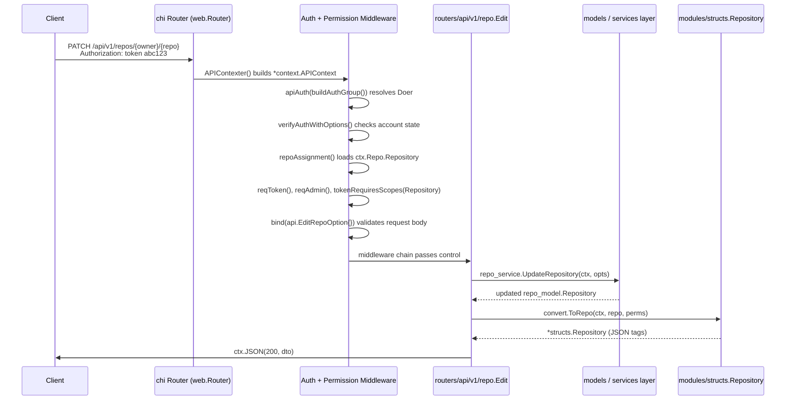
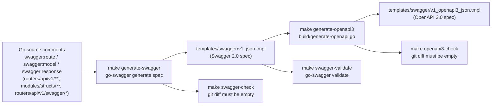

# API Conventions & Swagger

This page documents the cross-cutting conventions that apply to (almost) every endpoint in the Gitea REST API: how clients authenticate, how list endpoints paginate, how errors are shaped, and how the machine-readable Swagger 2.0 / OpenAPI 3 specifications are generated, checked, and validated by the build system.

## Authentication Schemes

All authentication metadata is declared as Go doc-comments on the `package v1` declaration in [`routers/api/v1/api.go`](../../routers/api/v1/api.go), using `go-swagger`'s `swagger:meta` annotation. This is the single source of truth for the `securityDefinitions` section of the generated spec:

```go
//	Security:
//	- BasicAuth :
//	- Token :
//	- AccessToken :
//	- AuthorizationHeaderToken :
//	- SudoParam :
//	- SudoHeader :
//	- TOTPHeader :
//
//	SecurityDefinitions:
//	BasicAuth:
//	     type: basic
//	Token:
//	     type: apiKey
//	     name: token
//	     in: query
//	     description: This authentication option is deprecated for removal in Gitea 1.23. ...
//	AccessToken:
//	     type: apiKey
//	     name: access_token
//	     in: query
//	     description: This authentication option is deprecated for removal in Gitea 1.23. ...
//	AuthorizationHeaderToken:
//	     type: apiKey
//	     name: Authorization
//	     in: header
//	     description: API tokens must be prepended with "token" followed by a space.
//	SudoParam:
//	     type: apiKey
//	     name: sudo
//	     in: query
//	     description: Sudo API request as the user provided as the key. Admin privileges are required.
//	SudoHeader:
//	     type: apiKey
//	     name: Sudo
//	     in: header
//	     description: Sudo API request as the user provided as the key. Admin privileges are required.
//	TOTPHeader:
//	     type: apiKey
//	     name: X-GITEA-OTP
//	     in: header
//	     description: Must be used in combination with BasicAuth if two-factor authentication is enabled.
```

| Scheme | Where | Status | Notes |
|---|---|---|---|
| `BasicAuth` | `Authorization: Basic ...` header | Active | Username/password or username + personal access token as password. Also used with `TOTPHeader` for 2FA-enabled accounts. |
| `AuthorizationHeaderToken` | `Authorization: token <token>` header | **Recommended** | The modern, preferred way to send a personal access token or OAuth2 token. |
| `Token` | `?token=<token>` query parameter | Deprecated (removal planned for 1.23) | Kept for backward compatibility; triggers `X-Gitea-Warning` response header. |
| `AccessToken` | `?access_token=<token>` query parameter | Deprecated (removal planned for 1.23) | Same as `Token`, alternate parameter name. |
| `SudoParam` / `SudoHeader` | `?sudo=<user>` or `Sudo: <user>` | Admin-only | Lets a site admin perform a request "as" another user; see `sudo()` middleware. |
| `TOTPHeader` | `X-GITEA-OTP: <code>` header | Conditional | Required together with Basic Auth when the account has 2FA enabled. |

Additional auth methods (not listed in the swagger metadata, but active in the actual auth chain) are wired up in `buildAuthGroup()`:

```go
func buildAuthGroup() *auth.Group {
    group := auth.NewGroup(
        &auth.OAuth2{},
        &auth.HTTPSign{},
        &auth.Basic{}, // FIXME: this should be removed once we don't allow basic auth in API
    )
    if setting.Service.EnableReverseProxyAuthAPI {
        group.Add(&auth.ReverseProxy{})
    }
    return group
}
```

This means the API also accepts **OAuth2 bearer tokens** and **HTTP Signature** authentication (used by federation/ActivityPub and git-over-http in some configurations), and optionally **reverse-proxy** auth headers when `[service].ENABLE_REVERSE_PROXY_AUTH_API` is set.

### Access-Token Scopes

Personal access tokens and OAuth2 tokens carry **scopes** grouped into categories (`models/auth/access_token_scope.go`):

```go
const (
    AccessTokenScopeCategoryActivityPub AccessTokenScopeCategory = iota
    AccessTokenScopeCategoryAdmin
    AccessTokenScopeCategoryMisc
    AccessTokenScopeCategoryNotification
    AccessTokenScopeCategoryOrganization
    AccessTokenScopeCategoryPackage
    AccessTokenScopeCategoryIssue
    AccessTokenScopeCategoryRepository
    AccessTokenScopeCategoryUser
)
```

Each category has independent `read`/`write` levels. Routes declare which categories they need via the `tokenRequiresScopes(...)` middleware, e.g.:

```go
m.Post("/orgs", tokenRequiresScopes(auth_model.AccessTokenScopeCategoryOrganization), reqToken(), bind(api.CreateOrgOption{}), org.Create)
```

`tokenRequiresScopes` inspects the HTTP method to decide whether `read` or `write` scope is required (`GET`/`HEAD` → read; `POST`/`PUT`/`PATCH`/`DELETE` → write), then checks the token's `AccessTokenScope.HasScope(...)`. It also detects **public-only** tokens (a scope restricted to public resources) and stores that on `ctx.PublicOnly`; subsequent middleware such as `checkTokenPublicOnly()` and `rejectPublicOnly()` enforce that restriction per-resource (e.g. refusing access to private repos/orgs/users, or blocking the whole `/notifications` group outright for public-only tokens).

### Authorization Middleware Chain

Beyond authentication, most routes stack one or more permission-check middlewares defined in `api.go`:

| Middleware | Meaning |
|---|---|
| `reqToken()` | Caller must be signed in (via any auth method) |
| `reqBasicOrRevProxyAuth()` | Only Basic Auth or reverse-proxy auth accepted (used for token management) |
| `reqSiteAdmin()` | Caller must be a site administrator |
| `reqOwner()` | Caller must own the repo (or be a site admin) |
| `reqAdmin()` | Caller must be a repo admin/collaborator with admin rights |
| `reqRepoWriter(unitTypes...)` | Caller must have write access to specific repo unit(s) |
| `reqRepoReader(unitType)` | Caller must have read access to a specific repo unit |
| `reqAnyRepoReader()` | Caller must have read access to at least one repo unit |
| `reqOrgOwnership()` | Caller must own the organization |
| `reqSelfOrAdmin()` | Caller must be the target user or a site admin |
| `individualPermsChecker` | Enforces visibility rules (private/limited) on user-scoped endpoints |

## Pagination Conventions

List endpoints follow a uniform `page`/`limit` query-parameter convention, implemented once in `routers/api/v1/utils/page.go`:

```go
// GetListOptions returns list options using the page and limit parameters
func GetListOptions(ctx *context.APIContext) db.ListOptions {
    return db.ListOptions{
        Page:     max(ctx.FormInt("page"), 1),
        PageSize: convert.ToCorrectPageSize(ctx.FormInt("limit")),
    }
}
```

`ToCorrectPageSize` (in `services/convert/utils.go`) clamps the requested size:

```go
func ToCorrectPageSize(size int) int {
    if size <= 0 {
        size = setting.API.DefaultPagingNum // default: 30
    } else if size > setting.API.MaxResponseItems {
        size = setting.API.MaxResponseItems // default: 50
    }
    return size
}
```

| Query param | Meaning | Default | Max |
|---|---|---|---|
| `page` | 1-based page number | `1` | — |
| `limit` | Items per page | `[api].DEFAULT_PAGING_NUM` (30) | `[api].MAX_RESPONSE_ITEMS` (50) |

Handlers that return a page of results also emit two response headers via `APIContext`:

- **`X-Total-Count`** — the total number of matching records (`SetTotalCountHeader`, in `services/context/base.go`).
- **`Link`** — an [RFC 5988](https://tools.ietf.org/html/rfc5988)-style header with `rel="next"`, `"prev"`, `"first"`, `"last"` URLs, generated by `SetLinkHeader` / `genAPILinks` in `services/context/api.go`:

```go
func (ctx *APIContext) SetLinkHeader(total int64, pageSize int) {
    links := genAPILinks(ctx.Req.URL, total, pageSize, ctx.FormInt("page"))
    if len(links) > 0 {
        ctx.RespHeader().Set("Link", strings.Join(links, ","))
        ctx.AppendAccessControlExposeHeaders("Link")
    }
}
```

> Both `X-Total-Count` and `Link` are added to the CORS `Access-Control-Expose-Headers` allow-list so browser-based clients can read them cross-origin.

## Error Response Format

Every API error returned by Gitea has one consistent JSON envelope, defined in `services/context/api.go`:

```go
// APIError is error format response
// swagger:response error
type APIError struct {
    Message string `json:"message"`
    URL     string `json:"url"`
}
```

`URL` points at the Swagger documentation (`setting.API.SwaggerURL`) so API consumers can look up the failing operation. Helper methods on `*APIContext` produce this shape consistently:

| Helper | HTTP status | Behavior |
|---|---|---|
| `ctx.APIError(status, msg)` | any | Generic — logs if `status == 500`; redacts message in production unless caller is admin |
| `ctx.APIErrorNotFound(msg...)` | 404 | Defaults message to `"not found"` |
| `ctx.APIErrorInternal(err)` | 500 | Logs full error server-side; only exposes details to admins or in non-prod |
| `ctx.APIErrorAuto(err)` | varies | Maps sentinel errors (`util.ErrInvalidArgument` → 400, `util.ErrPermissionDenied` → 403, `util.ErrNotExist` → 404, `util.ErrAlreadyExist` → 409, `util.ErrContentTooLarge` → 413, `util.ErrUnprocessableContent` → 422) to the right status automatically |

Related, more specific response types are also declared as `swagger:response` models so they show up correctly in the generated spec:

```go
type APIValidationError struct { Message string; URL string }   // swagger:response validationError
type APIInvalidTopicsError struct { Message string; InvalidTopics []string } // swagger:response invalidTopicsError
type APIEmpty struct{}                                          // swagger:response empty
type APIForbiddenError struct { APIError }                      // swagger:response forbidden
type APINotFound struct{}                                       // swagger:response notFound
type APIConflict struct{}                                       // swagger:response conflict
type APIRepoArchivedError struct { APIError }                   // swagger:response repoArchivedError
```

Body-validation failures raised by request binding (see below) are surfaced as HTTP `422 Unprocessable Entity` with the field name and validation rule embedded in the message:

```go
errs := binding.Bind(ctx.Req, theObj)
if len(errs) > 0 {
    ctx.APIError(http.StatusUnprocessableEntity, fmt.Sprintf("%s: %s", errs[0].FieldNames, errs[0].Error()))
    return
}
```

## API Request Flow

The diagram below traces a typical authenticated write request (e.g. `PATCH /api/v1/repos/{owner}/{repo}`) from the client through the chi router, the auth/permission middleware chain, the handler, and back out as a `modules/structs` DTO serialized to JSON.

```mermaid
graph LR
    A[Client Request] --> B["chi Router<br/>web.Router (api.go Routes())"]
    B --> C["APIContexter middleware<br/>builds *context.APIContext"]
    C --> D["apiAuth(buildAuthGroup())<br/>OAuth2 / HTTPSign / Basic / ReverseProxy"]
    D --> E["verifyAuthWithOptions<br/>account status checks"]
    E --> F["Resource assignment<br/>repoAssignment / orgAssignment / UserAssignmentAPI"]
    F --> G["Permission middleware<br/>reqToken / reqAdmin / reqRepoWriter / tokenRequiresScopes"]
    G --> H["bind(Option{})<br/>go-chi/binding validates JSON body"]
    H --> I["Handler function<br/>routers/api/v1/&lt;group&gt;/*.go"]
    I --> J["models / services layer<br/>DB + git operations"]
    J --> K["services/convert<br/>maps model -&gt; modules/structs DTO"]
    K --> L["ctx.JSON(status, dto)"]
    L --> M[JSON Response to Client]
```





At every stage, failures short-circuit the chain by calling one of the `ctx.APIError*` helpers, which writes the standard error envelope and returns without invoking the handler.

## Swagger / OpenAPI Generation & Validation

Gitea's API documentation is **generated from Go source comments**, not hand-written. The pipeline has three stages, all driven by `Makefile` targets:



### `make generate-swagger`

```makefile
SWAGGER_PACKAGE ?= github.com/go-swagger/go-swagger/cmd/swagger@v0.35.0
SWAGGER_SPEC := templates/swagger/v1_json.tmpl
SWAGGER_SPEC_INPUT := templates/swagger/v1_input.json
SWAGGER_EXCLUDE := gitea.dev/sdk
OPENAPI3_SPEC := templates/swagger/v1_openapi3_json.tmpl

generate-swagger: $(SWAGGER_SPEC) $(OPENAPI3_SPEC)

$(SWAGGER_SPEC): $(GO_SOURCES) $(SWAGGER_SPEC_INPUT)
	@output="$$($(GO) run $(SWAGGER_PACKAGE) generate spec \
	    --enable-allof-compounding --skip-enum-desc \
	    --exclude "$(SWAGGER_EXCLUDE)" \
	    --input "$(SWAGGER_SPEC_INPUT)" \
	    --output './$(SWAGGER_SPEC)' 2>&1)" || { printf '%s\n' "$$output" >&2; exit 1; }; ...
```

This invokes the `go-swagger` CLI, which walks all Go packages for `swagger:*` annotations (the `_ "gitea.dev/routers/api/v1/swagger"` blank import in `api.go` exists purely to pull in operation-definition stubs used for documentation) and writes a Swagger 2.0 JSON document into a Go template file (`templates/swagger/v1_json.tmpl`) so it can be served dynamically with the correct `basePath` at runtime.

### `make swagger-check`

Run in CI (`checks-backend`): regenerates the spec and fails the build if the working tree's committed spec differs from a fresh generation — this ensures the checked-in spec is never stale relative to the Go source.

### `make swagger-validate`

```makefile
swagger-validate: ## check if the swagger spec is valid
	@$(SED_INPLACE) -E -e 's|"basePath":( *)"(.*)"|"basePath":\1"/\2"|g' './$(SWAGGER_SPEC)'
	@output="$$($(GO) run $(SWAGGER_PACKAGE) validate './$(SWAGGER_SPEC)' 2>&1)"; status=$$?; ...
	case "$$output" in *WARNING:*) exit 1;; esac
```

Because `basePath` in the template is a Go template placeholder (e.g. `{{...}}`) rather than a literal path, this target temporarily patches it to a valid-looking `/`-prefixed string, runs `swagger validate`, then reverts the patch. The build fails on both **errors and warnings** from `go-swagger`.

### `make generate-openapi3` / `openapi3-check`

```makefile
generate-openapi3: $(OPENAPI3_SPEC)

$(OPENAPI3_SPEC): $(SWAGGER_SPEC) build/generate-openapi.go $(wildcard build/openapi3gen/*.go)
	$(GO) run build/generate-openapi.go
```

`build/generate-openapi.go` converts the already-generated Swagger 2.0 document into an OpenAPI 3.0 document (`templates/swagger/v1_openapi3_json.tmpl`) using the helper package `build/openapi3gen`. `openapi3-check` diffs the result the same way `swagger-check` does.

### Where this fits in CI

```makefile
checks-backend: tidy-check swagger-check openapi3-check fmt-check swagger-validate security-check
lint: lint-frontend lint-backend lint-templates lint-swagger lint-spell lint-md lint-actions lint-json lint-yaml lint-shell
```

`lint-swagger` additionally runs a [Spectral](https://github.com/stoplightio/spectral) lint pass over the generated spec:

```makefile
	pnpm exec spectral lint -q -F hint $(SWAGGER_SPEC)
```

So a contributor who adds or changes an endpoint is expected to run `make generate-swagger generate-openapi3` locally and commit the regenerated `templates/swagger/*.tmpl` files; CI will otherwise fail on `swagger-check`/`openapi3-check`.

### Interactive Docs

When `[api].ENABLE_SWAGGER` is `true` (the default), the generated spec is served through a Swagger UI reachable at `/api/swagger`, and `/api/v1/swagger` simply redirects there:

```go
if setting.API.EnableSwagger {
    m.Get("/swagger", func(ctx *context.APIContext) {
        ctx.Redirect(setting.AppSubURL + "/api/swagger")
    })
}
```

## Related Pages

- [API v1 Overview](api-v1-overview.md) — resource groups and base URL structure.
- [Packages & Actions API](packages-and-actions-api.md) — the package-registry (`routers/api/packages/*`) and Actions runner/artifact (`routers/api/actions/*`) APIs, which sit outside `/api/v1` and are **not** covered by the Swagger/OpenAPI generation described on this page.
- [Core Modules](../09-core-modules/README.md) — the `modules/structs` package referenced throughout this page.
