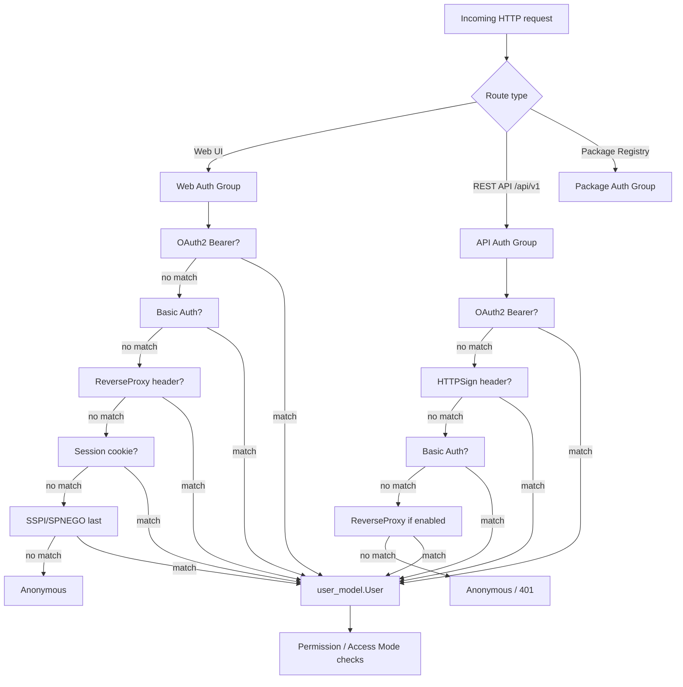
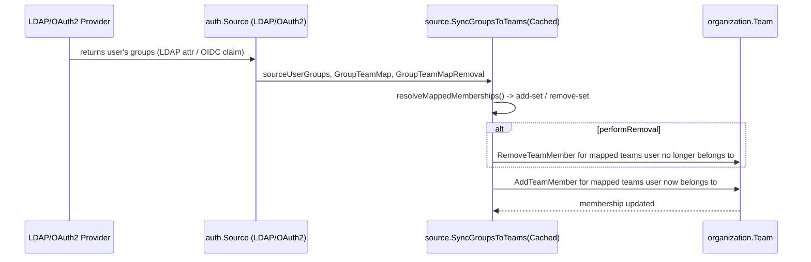
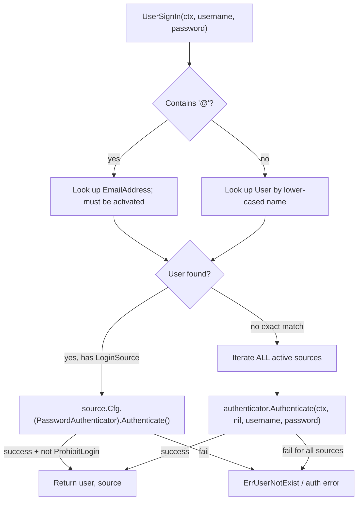
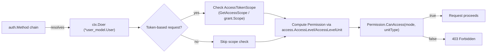

# Authentication & Authorization

Gitea supports a wide range of authentication mechanisms — from classic username/password
login, to personal access tokens, OAuth2 (via `goth`), LDAP, PAM, SMTP, SSPI (Windows domain
auth via SPNEGO), reverse-proxy header auth, and HTTP-signature auth for federation (ActivityPub).
All of these are unified behind a single `auth.Method` interface and composed into ordered
**auth chains** that are evaluated per request. This page documents that architecture, the
individual providers, access tokens/scopes, group-to-team synchronization, WebAuthn/TOTP 2FA,
and how authentication results feed into the permission (access mode) system.

> Source root: [`services/auth`](../../services/auth), providers under
> [`services/auth/source/*`](../../services/auth/source), models in
> [`models/auth`](../../models/auth), and web-auth session glue in
> [`routers/web/web.go`](../../routers/web/web.go) / [`routers/api/v1/api.go`](../../routers/api/v1/api.go).

> **Consolidation note:** an earlier documentation pass planned two separate pages —
> `auth-providers.md` and `authentication-providers.md` — for this topic. Re-verification found
> that only this file (`auth-providers.md`) was ever created, and it is already the single
> canonical target for every cross-reference to authentication material elsewhere in the docs
> tree (`docs/11-authentication/README.md`, `docs/04-configuration/README.md`,
> `docs/04-configuration/settings-catalog.md`, `docs/07-rest-api/README.md`,
> `docs/16-cli-admin/cli-commands.md`, `docs/index.md`, and the services catalogs themselves).
> No `authentication-providers.md` file exists on disk, so there is no overlap or duplicate
> content to consolidate — this page remains the sole, authoritative source for authentication
> providers, auth chains, tokens/scopes, and permission resolution. If a future contributor is
> tempted to add a new `authentication-providers.md`, it should instead be a redirect stub
> pointing back here, or its content should be merged into this file, to avoid re-introducing
> the duplication this note was written to rule out.

## The `auth.Method` Interface

Every authentication mechanism implements a single, small interface defined in
[`services/auth/interface.go`](../../services/auth/interface.go):

```go
// Method represents an authentication method (plugin) for HTTP requests.
type Method interface {
    // Verify tries to verify the authentication data contained in the request.
    // If verification succeeds, it returns either an existing user object (with id > 0)
    // or a new user object (with id = 0) populated with the information that was found
    // in the authentication data (username or email).
    Verify(http *http.Request, w http.ResponseWriter, store DataStore, sess SessionStore) (*user_model.User, error)

    Name() string
}
```

Key contract details:

- **Returning `(nil, nil)`** means "this method is not applicable to the request" (e.g. no
  `Authorization` header present) — the caller should try the next method in the chain.
- **Returning `(nil, err)`** means the method recognized its own credential format but
  verification failed (bad password, expired token, etc.) — this is a hard failure that other
  methods may still attempt to override if they succeed.
- **Returning `(user, nil)`** is a successful authentication.

Two additional optional interfaces extend a login `Source`'s configuration object
(`auth.Source.Cfg`, see [`models/auth/source.go`](../../models/auth/source.go)):

```go
// PasswordAuthenticator represents a source of authentication
type PasswordAuthenticator interface {
    Authenticate(ctx context.Context, user *user_model.User, login, password string) (*user_model.User, error)
}

// SynchronizableSource represents a source that can synchronize users
type SynchronizableSource interface {
    Sync(ctx context.Context, updateExisting bool) error
}
```

`PasswordAuthenticator` is implemented by LDAP, SMTP, PAM and the internal DB source, and is
used by `UserSignIn` (username/password login flow). `SynchronizableSource` is implemented by
LDAP and OAuth2 sources and is invoked by the periodic "sync external users" cron task
(`services/auth/sync.go` wires it to `cron`).

## Provider Catalog

| Method / Source | File(s) | Kind | Notes |
|---|---|---|---|
| `Session` | `services/auth/session.go` | HTTP `Method` | Reads `uid` from the signed cookie session |
| `Basic` | `services/auth/basic.go` | HTTP `Method` | HTTP Basic header; also re-used to validate PATs, OAuth2 access tokens, and Action task tokens |
| `OAuth2` | `services/auth/oauth2.go` | HTTP `Method` | Bearer token/JWT in header or `token`/`access_token` query param |
| `ReverseProxy` | `services/auth/reverseproxy.go` | HTTP `Method` | Trusts a header set by an upstream proxy (e.g. `X-WEBAUTH-USER`) |
| `SSPI` | `services/auth/sspi.go` | HTTP `Method` | Windows SPNEGO/Kerberos negotiation, login-page only |
| `HTTPSign` | `services/auth/httpsign.go` | HTTP `Method` | HTTP Signature (`Signature` header) using SSH keys or SSH certificates — used for federation/ActivityPub |
| `Group` | `services/auth/group.go` | HTTP `Method` (composite) | Runs a list of `Method`s in order, first success wins |
| LDAP (`LDAP`/`DLDAP`) | `services/auth/source/ldap/*` | Login **Source** | Bind-DN or direct-bind LDAP, via `go-ldap` |
| PAM | `services/auth/source/pam/*` | Login **Source** | Delegates to the OS's PAM stack via `modules/auth/pam` |
| SMTP | `services/auth/source/smtp/*` | Login **Source** | Authenticates against an SMTP server (PLAIN/LOGIN/CRAM-MD5) |
| OAuth2 provider | `services/auth/source/oauth2/*` | Login **Source** | Wraps `github.com/markbates/goth` providers (GitHub, GitLab, Google, OIDC generic, etc.) |
| DB | `services/auth/source/db` | Login **Source** | Internal database password auth (the default) |
| SSPI config | `services/auth/source/sspi` | Login **Source** | Configuration object consumed by the `SSPI` `Method` |

> There are two related but distinct concepts named "auth method"/"source" in Gitea:
> an **`auth.Method`** verifies an incoming *HTTP request* (session cookie, bearer token,
> header, signature, ...). A **`auth.Source`** (`models/auth/source.go`) is an admin-configured
> *credential backend* (LDAP server, SMTP server, OAuth2 app, PAM service, SSPI domain) used to
> validate a username/password pair or to redirect/callback for OAuth2. `Basic`/`Session` call
> into the active `Source`s via `UserSignIn`; OAuth2/SSPI use their `Source` for configuration.

## Per-Request Auth Method Chain (`Group`)

Multiple `Method`s are combined into a `Group` (`services/auth/group.go`), which is itself a
`Method`. `Group.Verify` iterates its members in order:

```go
func (b *Group) Verify(req *http.Request, w http.ResponseWriter, store DataStore, sess SessionStore) (*user_model.User, error) {
    var retErr error
    for _, m := range b.methods {
        user, err := m.Verify(req, w, store, sess)
        if err != nil {
            if retErr == nil {
                retErr = err
            }
            continue // try other methods; some share the same protocol
        }
        if user != nil {
            if store.GetData()["AuthedMethod"] == nil {
                store.GetData()["AuthedMethod"] = m.Name()
            }
            return user, nil
        }
    }
    return nil, retErr
}
```

The **order of methods matters** because some methods (e.g. reverse proxy, SSPI) create a new
session or the effect depends on which method runs first when multiple could apply to the same
header. Gitea builds different chains depending on the surface:

### Web UI chain (`routers/web/web.go` → `newWebAuthMiddleware`)

```go
group := auth_service.NewGroup()
if allowOAuth2 {
    group.Add(&auth_service.OAuth2{})
}
if allowBasic {
    group.Add(&auth_service.Basic{})
}
if setting.Service.EnableReverseProxyAuth {
    // reverse-proxy should be before Session, otherwise the header
    // will be ignored if the user has already logged in
    group.Add(&auth_service.ReverseProxy{CreateSession: !isSessionless})
}
group.Add(&auth_service.Session{})
if enableSSPI {
    // it MUST be the last, see the comment of SSPI
    group.Add(&auth_service.SSPI{CreateSession: !isSessionless})
}
```

`allowOAuth2`/`allowBasic` are per-route flags set by the `AllowOAuth2`/`AllowBasic`
pre-middlewares (used for routes like Git-over-HTTP and RSS/attachment downloads that must
support sessionless auth).

### REST API chain (`routers/api/v1/api.go` → `buildAuthGroup`)

```go
func buildAuthGroup() *auth.Group {
    group := auth.NewGroup(
        &auth.OAuth2{},
        &auth.HTTPSign{},
        &auth.Basic{}, // FIXME: should be removed once basic auth in API isn't allowed
    )
    if setting.Service.EnableReverseProxyAuthAPI {
        group.Add(&auth.ReverseProxy{})
    }
    return group
}
```

### Package registry API chain (`routers/api/packages/api.go`)

Each package registry endpoint calls `verifyAuth(r, []auth.Method{...}, opts)` with a
registry-specific method list (e.g. NuGet's own API-key `Method` that wraps `Basic.VerifyAuthToken`,
see `routers/api/packages/nuget/auth.go`), and `ReverseProxy` is appended automatically when
`EnableReverseProxyAuth` is set.



`common.AuthShared` (`routers/common/auth.go`) is the shared glue that calls
`authMethod.Verify(...)` (where `authMethod` is usually the `Group`), stores `ctx.Doer`,
`ctx.IsSigned`, `IsBasicAuth`, and refreshes the request locale to the signed-in user's language.

## Provider Details

### Session (`services/auth/session.go`)

The simplest method: reads the `uid` key from the session store (backed by
`modules/session`), loads the `User` by ID, and returns it. Returns `(nil, nil)` if there is
no session or no `uid` key — allowing later/earlier methods to take over. Session data is
established by `handleSignIn` in `services/auth/auth.go`, which regenerates the session ID
(session-fixation protection), clears stale two-factor/OpenID keys, and stores `uid`/`uname`.

### Basic (`services/auth/basic.go`)

Parses the `Authorization: Basic ...` header (and the legacy `x-oauth-basic` password
convention where the token is placed in the username field). `Basic.VerifyAuthToken` is reused
by other integrations (e.g. NuGet's `X-NuGet-ApiKey`) and tries, in order:

1. **OAuth2 access token** — `GetOAuthAccessTokenScopeAndUserID` parses a JWT-shaped token
   and resolves the `OAuth2Grant`.
2. **Personal Access Token** — `auth_model.GetAccessTokenBySHA` looks up a PAT by its
   last-eight-chars index then verifies the full SHA constant-time.
3. **Actions task token** — `actions_model.GetRunningTaskByToken`, used by CI runners.
4. **Username/password fallback** — only if `setting.Service.EnableBasicAuth` is true, calls
   `UserSignIn`, then enforces 2FA: WebAuthn-enrolled accounts are rejected outright for Basic
   auth (`"basic authorization is not allowed while WebAuthn enrolled"`), and TOTP-enrolled
   accounts must supply a valid `X-Gitea-OTP` header, verified via
   `TwoFactor.ValidateAndConsumeTOTP` (atomic single-use consumption to prevent replay).

`GetAccessScope(store)` derives the effective `AccessTokenScope` for the request from
`store.GetData()["ApiTokenScope"]`/`LoginMethod` — `Basic`/session logins get
`AccessTokenScopeAll`, while `ActionTokenMethodName` gets no scope (enforced separately).

### OAuth2 bearer tokens (`services/auth/oauth2.go`)

Distinct from the OAuth2 login *Source* below — this `Method` authenticates **API requests**
carrying a bearer token, either:

- in the query string as `token=`/`access_token=` (unless `DisableQueryAuthToken`), or
- in the `Authorization: Bearer <token>` header.

`userFromToken` classifies the token:

1. If it contains a `.` (JWT-shaped): try Actions task JWT (`actions.TokenToTaskID`), then
   OAuth2 access token (`GetOAuthAccessTokenScopeAndUserID`).
2. Otherwise: treat it as a Personal Access Token SHA, falling back to an Actions task token.

### ReverseProxy (`services/auth/reverseproxy.go`)

Trusts a reverse proxy (e.g. an SSO gateway) to have already authenticated the caller and to
populate `setting.ReverseProxyAuthUser` (default `X-WEBAUTH-USER`) with the username, and
optionally `setting.ReverseProxyAuthEmail`/`...AuthFullName`. If the user doesn't exist and
`EnableReverseProxyAutoRegister` is set, a new active user is auto-created (`newUser`). When
`CreateSession` is true and no matching session already exists, it calls `handleSignIn` to
establish a normal cookie session — this is why `ReverseProxy` must run **before** `Session` in
the chain (otherwise a stale session for a different user could shadow the header).

### SSPI (`services/auth/sspi.go`)

Implements Windows Integrated Authentication (SPNEGO/Kerberos) for domain-joined Windows
clients, backed by the platform-specific `sspiauth_windows.go` (real implementation) /
`sspiauth_posix.go` (stub) and the `websspi`-style `SSPIAuth` interface:

```go
type SSPIAuth interface {
    AppendAuthenticateHeader(w http.ResponseWriter, data string)
    Authenticate(r *http.Request, w http.ResponseWriter) (userInfo *SSPIUserInfo, outToken string, err error)
}
```

`shouldAuthenticate` only activates for `POST /user/login?auth_with_sspi=1` — so SSPI never
interferes with any other route. Negotiation may require multiple round-trips, during which the
method writes a `401` with a `WWW-Authenticate` negotiate header and re-renders the sign-in
template. On success, `sanitizeUsername` strips NETBIOS domain prefixes / UPN suffixes
(`stripDomainNames`) and replaces separators (`replaceSeparators`) according to the configured
`sspi.Source`. Because a failed negotiation returns `401` immediately, **SSPI must be the last
method in the chain** — otherwise it would short-circuit before Session/Basic/OAuth2 get a
chance to run.

### HTTPSign (`services/auth/httpsign.go`)

Implements [HTTP Signatures](https://github.com/go-fed/httpsig) verification, primarily used
for **ActivityPub federation** requests where the caller signs the request with an SSH key
pair instead of presenting a bearer credential. Two verification paths:

- **`VerifyPubKey`** — looks up a registered `PublicKey` by the signature's `keyId` fingerprint
  and verifies the signature against it (ED25519 or RSA/SHA-256/512, matched from the SSH key
  type).
- **`VerifyCert`** (when `X-Ssh-Certificate` is present and `setting.SSH.TrustedUserCAKeys` is
  configured) — parses an SSH certificate, validates it was signed by a trusted CA
  (`IsUserAuthority`), verifies the HTTP signature against the certificate's public key, then
  matches one of the certificate's `ValidPrincipals` against a registered `PublicKey`.

On success, the resolved key's `OwnerID` becomes `ctx.Doer`, and `store.GetData()["IsApiToken"]`
is set (so downstream code treats it like an API-token authenticated request rather than an
interactive session).

### LDAP (`services/auth/source/ldap`)

Two flavors selected by `auth.LDAP` (bind-DN search+bind) vs `auth.DLDAP` (direct/simple bind),
both backed by the same `Source` struct (`source.go`) built on `github.com/go-ldap/ldap`.
Notable fields: `BindDN`/`BindPassword` (encrypted at rest via `secret.EncryptSecret` in
`ToDB`), `UserBase`/`Filter`/`AdminFilter`/`RestrictedFilter`, SSH key & avatar attribute
mapping, and the group-sync fields `GroupsEnabled`, `GroupDN`, `GroupFilter`, `GroupMemberUID`,
`UserUID`, `GroupTeamMap`, `GroupTeamMapRemoval` (see [Group Sync](#group-sync) below).
`source_authenticate.go` implements `PasswordAuthenticator.Authenticate` (bind as the user, or
bind as `BindDN` then search); `source_sync.go` implements `SynchronizableSource.Sync` used by
the periodic external-user sync job to create/update/deactivate local users from LDAP search
results.

### PAM (`services/auth/source/pam`)

Delegates username/password validation to the host's PAM stack via `modules/auth/pam`
(`pam.Auth(serviceName, userName, passwd)`, with a `pam_stub.go` fallback on platforms without
cgo/PAM support). Config is just `ServiceName` (the PAM service, e.g. `system-auth`) and
`EmailDomain` (used to synthesize an email address for auto-created users, since PAM has no
email attribute).

### SMTP (`services/auth/source/smtp`)

Authenticates by opening an SMTP connection to `Host:Port` and performing SMTP AUTH
(`Auth` field selects PLAIN/LOGIN/CRAM-MD5) with the supplied credentials — if the server
accepts the login, the user is authenticated. Supports `AllowedDomains` restriction,
`ForceSMTPS`/`SkipVerify` TLS controls, and `HeloHostname`/`DisableHelo`.

### OAuth2 login source (`services/auth/source/oauth2`)

This is the **login Source**, distinct from the bearer-token `Method` above — it configures an
external OAuth2/OIDC identity provider using `github.com/markbates/goth`. `providers.go` /
`providers_base.go` / `providers_custom.go` / `providers_openid.go` / `providers_simple.go`
register/build `goth.Provider`s (GitHub, GitLab, Google, Bitbucket, generic OpenID Connect,
etc.). `source_callout.go` performs the redirect ("callout") to the provider's authorization
endpoint; `routers/web/auth/oauth.go` handles the callback, token exchange, user
creation/linking, and admin/restricted-group derivation
(`getUserAdminAndRestrictedFromGroupClaims`). `source_sync.go` implements `Sync` to refresh
stored OAuth2 refresh tokens for accounts, disabling users whose grant has been revoked
upstream (`invalid_grant`).

## Access Tokens & Scopes

Personal Access Tokens (PATs) are modeled by `AccessToken` in
[`models/auth/access_token.go`](../../models/auth/access_token.go):

```go
type AccessToken struct {
    ID             int64 `xorm:"pk autoincr"`
    UID            int64 `xorm:"INDEX"`
    Name           string
    Token          string `xorm:"-"`          // only available at creation time
    TokenHash      string `xorm:"UNIQUE"`      // sha256+salt of token, persisted
    TokenSalt      string
    TokenLastEight string `xorm:"INDEX token_last_eight"` // fast index lookup
    Scope          AccessTokenScope
    ...
}
```

Tokens are never stored in plaintext: `NewAccessToken` generates a random token, stores its
`TokenLastEight` (an index shortcut) and a salted hash (`HashToken`); `GetAccessTokenBySHA`
looks candidates up by the last-eight index and does a constant-time hash comparison
(`crypto/subtle`), with an optional LRU cache (`successfulAccessTokenCache`,
sized by `setting.SuccessfulTokensCacheSize`) to skip repeated hash work for hot tokens.

### Scopes (`models/auth/access_token_scope.go`)

Scopes are modeled as a bitmap under the hood for fast checks, but represented publicly as
category-based strings, e.g. `read:repository`, `write:organization`, or the special values
`all` and `public-only`:

| Category | Read scope | Write scope |
|---|---|---|
| ActivityPub | `read:activitypub` | `write:activitypub` |
| Admin | `read:admin` | `write:admin` |
| Misc | `read:misc` | `write:misc` |
| Notification | `read:notification` | `write:notification` |
| Organization | `read:organization` | `write:organization` |
| Package | `read:package` | `write:package` |
| Issue | `read:issue` | `write:issue` |
| Repository | `read:repository` | `write:repository` |
| User | `read:user` | `write:user` |

Write scope always implies read scope for the same category (bitwise OR of the read bit into
the write constant). `AccessTokenScopePublicOnly` further restricts a token to public
repos/orgs regardless of other scopes granted — enforced, e.g., in the packages API
(`routers/api/packages/api.go`) by rejecting access to non-public package owners for
public-only tokens.

OAuth2 access tokens (issued to OAuth2 Applications, distinct from PATs) reuse the same
`AccessTokenScope` type; `oauth2_provider.GrantAdditionalScopes(grant.Scope)` expands an
`OAuth2Grant`'s scope into the equivalent `AccessTokenScope`.

### Auth Tokens (Remember-Me cookies)

Persistent "remember me" login cookies use a **separate** mechanism,
[`models/auth/auth_token.go`](../../models/auth/auth_token.go) +
[`services/auth/auth_token.go`](../../services/auth/auth_token.go), inspired by
[Paragon Initiative's secure remember-me design](https://paragonie.com/blog/2015/04/secure-authentication-php-with-long-term-persistence).
Each cookie value is `id:token`; the server stores only `TokenHash = sha256(token)` keyed by
`id`. On each use, `CheckAuthToken` verifies the hash in constant time, and
`RegenerateAuthToken` **rotates the hash on every login** while keeping the same `id` — if an
attacker replays a stolen (already-used) token, the hash mismatch triggers `DeleteAuthTokenByID`,
immediately revoking that device's remember-me token and forcing re-authentication.

## WebAuthn / Passkeys and TOTP (Two-Factor Auth)

Gitea supports two independent 2FA mechanisms, and a user may be enrolled in either or both:

### TOTP (Time-based One-Time Password)

Modeled by `TwoFactor` in [`models/auth/twofactor.go`](../../models/auth/twofactor.go). The
shared secret is AES-encrypted at rest (key derived from `setting.SecretKey` via MD5, see
`getEncryptionKey`) and Base64-encoded in the `Secret` column. Validation uses
`github.com/pquerna/otp/totp`, and — critically — passcodes are **single-use**:
`ValidateAndConsumeTOTP` performs a conditional UPDATE (`last_used_passcode <> ?` or `IS NULL`)
so a captured OTP cannot be replayed within its validity window, even under concurrent
requests (the UPDATE's row lock serializes racers). A scratch/recovery token
(`GenerateScratchToken`, using an ambiguity-free Base32 alphabet) is available as a backup.

### WebAuthn / Passkeys

Modeled by `WebAuthnCredential` in `models/auth/webauthn.go`, and wired up via
[`modules/auth/webauthn/webauthn.go`](../../modules/auth/webauthn/webauthn.go), which
initializes a single global `webauthn.WebAuthn` instance (from `github.com/go-webauthn/webauthn`)
at startup (`auth.Init()` calls `webauthn.Init()`):

```go
WebAuthn = &webauthn.WebAuthn{
    Config: &webauthn.Config{
        RPDisplayName: setting.AppName,
        RPID:          setting.Domain,
        RPOrigins:     []string{appURL},
        AuthenticatorSelection: protocol.AuthenticatorSelection{
            UserVerification: protocol.VerificationDiscouraged,
        },
        AttestationPreference: protocol.PreferDirectAttestation,
    },
}
```

The package's `user` wrapper adapts a Gitea `*user_model.User` to the `webauthn.User`
interface (`WebAuthnID`, `WebAuthnName`, `WebAuthnDisplayName`, `WebAuthnCredentials` — the
latter loading stored credentials from the DB). WebAuthn registration/assertion ceremonies
themselves (challenge generation, session storage of `webauthn.SessionData` via `gob`, and
credential creation) are driven from the web routers under `routers/web/auth` and
`routers/web/user/setting/security` (out of scope here, but they build on this module).

> **Interaction with Basic auth**: `Basic.Verify` explicitly **rejects** Basic authentication
> for any user with WebAuthn credentials registered (`hasWebAuthn`) — WebAuthn cannot be
> satisfied over a header-only credential, so such users must use session login, OAuth2, or a
> PAT instead. Users with only TOTP enrolled can still use Basic auth by supplying the
> `X-Gitea-OTP` header.

`HasTwoFactorOrWebAuthn` and `DisableTwoFactor` (in `twofactor.go`) provide unified
enable/disable-all-2FA helpers used by account security settings and admin tooling.

## Group Sync — Mapping External Groups to Teams

When users authenticate via LDAP or OAuth2/OIDC, Gitea can automatically manage their
Organization/Team memberships based on group claims/attributes returned by the identity
provider. This is implemented centrally in
[`services/auth/source/source_group_sync.go`](../../services/auth/source/source_group_sync.go)
and driven by each source's configuration.

### Configuration shape

Both LDAP and OAuth2 sources share the same JSON mapping shape, configured as a string field
`GroupTeamMap` and parsed with `modules/auth.UnmarshalGroupTeamMapping`:

```go
func UnmarshalGroupTeamMapping(raw string) (map[string]map[string][]string, error) {
    groupTeamMapping := make(map[string]map[string][]string)
    if raw == "" {
        return groupTeamMapping, nil
    }
    return groupTeamMapping, json.Unmarshal([]byte(raw), &groupTeamMapping)
}
```

i.e. `{ "<external-group-name>": { "<gitea-org-name>": ["<team1>", "<team2>", ...] } }`.
Example (from the LDAP admin CLI tests):

```json
{"cn=my-group,cn=groups,dc=example,dc=org": {"MyGiteaOrganization": ["MyGiteaTeam1", "MyGiteaTeam2"]}}
```

For LDAP this maps an LDAP group DN/CN to one or more Gitea org/team pairs
(`GroupTeamMap`), with `GroupTeamMapRemoval` controlling whether membership is revoked
when the user is no longer in the source group. For OAuth2, `GroupClaimName` selects which
claim in the ID token / userinfo response carries the group list (parsed via
`claimValueToStringSet`, which accepts a `[]string`, a `[]any`, or a delimited string), and
`AdminGroup`/`RestrictedGroup` can additionally promote/restrict a user based on group
membership (`getUserAdminAndRestrictedFromGroupClaims` in `routers/web/auth/oauth.go`).

### Core sync algorithm

```go
func SyncGroupsToTeamsCached(ctx context.Context, user *user_model.User,
    sourceUserGroups container.Set[string],
    sourceGroupTeamMapping map[string]map[string][]string,
    performRemoval bool,
    orgCache map[string]*organization.Organization,
    teamCache map[string]*organization.Team) error {

    membershipsToAdd, membershipsToRemove := resolveMappedMemberships(sourceUserGroups, sourceGroupTeamMapping)

    if performRemoval {
        syncGroupsToTeamsCached(ctx, user, membershipsToRemove, syncRemove, orgCache, teamCache)
    }
    return syncGroupsToTeamsCached(ctx, user, membershipsToAdd, syncAdd, orgCache, teamCache)
}
```

`resolveMappedMemberships` partitions every configured `(group → org/team)` rule into "add"
(the authenticated user *is* currently a member of that external group) or "remove" (they are
not) sets. `syncGroupsToTeamsCached` then resolves each org/team by name (using the supplied
caches to avoid repeated DB lookups across many users in a bulk sync), checks current
membership via `organization.IsTeamMember`, and calls `org_service.AddTeamMember` /
`RemoveTeamMember` as needed. **Organizations and teams are never auto-created** — if the
mapped org/team doesn't exist yet, a warning is logged and that mapping entry is skipped, so
admins must pre-create the target orgs/teams.



### Call sites

| Trigger | File | Notes |
|---|---|---|
| LDAP interactive login | `services/auth/source/ldap/source_authenticate.go` | Runs synchronously after successful bind |
| LDAP bulk sync (cron) | `services/auth/source/ldap/source_sync.go` | Uses `SyncGroupsToTeamsCached` with per-run caches for efficiency across all synced users |
| OAuth2 new-account auto-registration | `routers/web/auth/oauth.go` (`syncGroupsToTeams`) | Runs once right after the user record is created |
| OAuth2 existing-account login | `routers/web/auth/oauth.go` (`handleOAuth2SignIn` path) | Re-evaluates group claims on every login |
| OAuth2 account linking | `routers/web/auth/linkaccount.go` | Runs when a goth identity is linked to an existing local account |

## Password / Credential Login Flow (`UserSignIn`)

[`services/auth/signin.go`](../../services/auth/signin.go) implements the shared
username/password validation path used by `Basic.Verify` and the `/user/login` web form:



Every active `auth.Source` whose `Cfg` implements `PasswordAuthenticator` is imported for its
side-effecting `init()` registration via blank imports in `signin.go`:

```go
_ "gitea.dev/services/auth/source/db"   // internal DB password auth
_ "gitea.dev/services/auth/source/ldap" // LDAP
_ "gitea.dev/services/auth/source/pam"  // PAM
_ "gitea.dev/services/auth/source/sspi" // SSPI
```

(SMTP and OAuth2 are imported directly since `signin.go` references their exported error
values / structs.) Each `Source.Cfg` type registers itself against a `Type` via
`auth.RegisterTypeConfig` in its own `init()` (see `services/auth/source/ldap/source.go`,
`.../pam/source.go`, etc.), so `models/auth/source.go`'s generic `Source` struct can deserialize
the correct concrete config type when loaded from the DB.

## Permission Enforcement: from `Doer` to `AccessMode`

Authentication only establishes **who** is making the request (`ctx.Doer`); **what** they are
allowed to do is a separate authorization step built on
[`models/perm/access_mode.go`](../../models/perm/access_mode.go) and
[`models/perm/access/repo_permission.go`](../../models/perm/access/repo_permission.go).

`AccessMode` is a simple ordered enum:

```go
type AccessMode int

const (
    AccessModeNone AccessMode = iota // 0: no access
    AccessModeRead                   // 1: read access
    AccessModeWrite                  // 2: write access
    AccessModeAdmin                  // 3: admin access
    AccessModeOwner                  // 4: owner access
)
```

Because the levels are ordered integers, checks are simple comparisons (`>=`). The
`Permission` struct (`repo_permission.go`) aggregates:

- `AccessMode` — the user's overall access level to the repository (owner/collaborator/team
  membership resolved elsewhere, e.g. `access.AccessLevel(ctx, user, repo)`).
- `unitsMode` — a per-`unit.Type` override map (e.g. a team might grant write to Issues but
  only read to Code).
- `everyoneAccessMode` / `anonymousAccessMode` — minimum access every signed-in user, or even
  anonymous visitors, get for specific units (used for public repos with open issue trackers,
  etc.).

```go
func (p *Permission) UnitAccessMode(unitType unit.Type) perm_model.AccessMode {
    if m, ok := p.unitsMode[unitType]; ok {
        return util.Iif(p.AccessMode >= perm_model.AccessModeAdmin, p.AccessMode, m)
    }
    unitDefaultAccessMode := max(p.AccessMode, p.anonymousAccessMode[unitType], p.everyoneAccessMode[unitType])
    hasUnit := slices.ContainsFunc(p.units, func(u *repo_model.RepoUnit) bool { return u.Type == unitType })
    return util.Iif(hasUnit, unitDefaultAccessMode, perm_model.AccessModeNone)
}

func (p *Permission) CanAccess(mode perm_model.AccessMode, unitType unit.Type) bool {
    return p.UnitAccessMode(unitType) >= mode
}
```

`AccessLevel`/`AccessLevelUnit` (top-level functions in `repo_permission.go`) compute a
`Permission` for a given `(user, repo)` pair by consulting collaborator records, team unit
permissions, and repo visibility — this is the point where the authenticated `Doer` from the
auth chain is translated into concrete allow/deny decisions for a specific repository and unit
(code, issues, pull requests, wiki, packages, actions, etc.).

### Where scope and access mode intersect

For **API-token-authenticated** requests, two independent gates must both pass:

1. **Token scope** — does `GetAccessScope(store)` (or the OAuth2 grant's scope) include the
   category/verb needed for this endpoint (e.g. `write:repository`)? Enforced by API route
   middlewares such as `reqToken`/`tokenRequiresScopes` in `routers/api/v1` and the packages
   API's `tokenRequiresScope` check shown above.
2. **Repository/org access mode** — does the authenticated user's `AccessMode` for this
   resource meet the unit's required mode (`Permission.CanAccess`)? A token with
   `write:repository` scope still cannot write to a repository the user has no write access to.

For **session/basic password** logins, `GetAccessScope` simply returns
`AccessTokenScopeAll`, so only the access-mode gate applies — matching normal web UI behavior.



## Related Pages

- [Services Layer Overview](README.md)
- [Database Models](../05-database-models/README.md) — for `models/auth`, `models/perm`
  entity definitions
- [Web Routers](../06-web-routers/README.md) — for how `newWebAuthMiddleware`,
  `verifyAuthWithOptions`, and route-level `reqSignIn`/`reqToken` guards are wired up
- [REST API](../07-rest-api/README.md) — for endpoint-level scope enforcement
