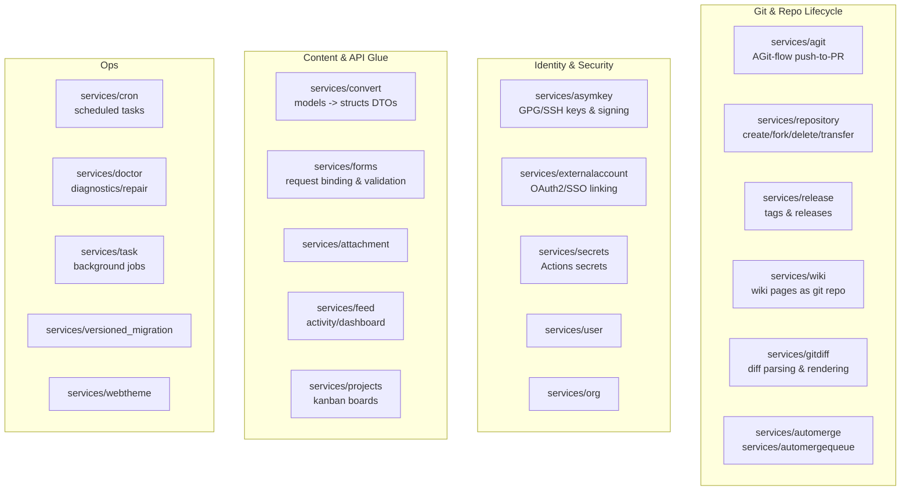
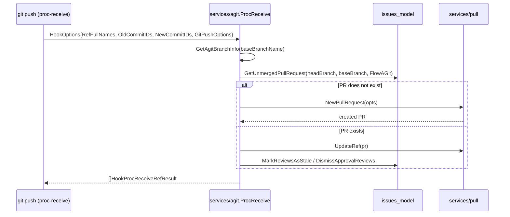
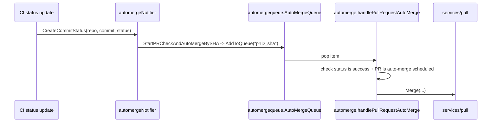
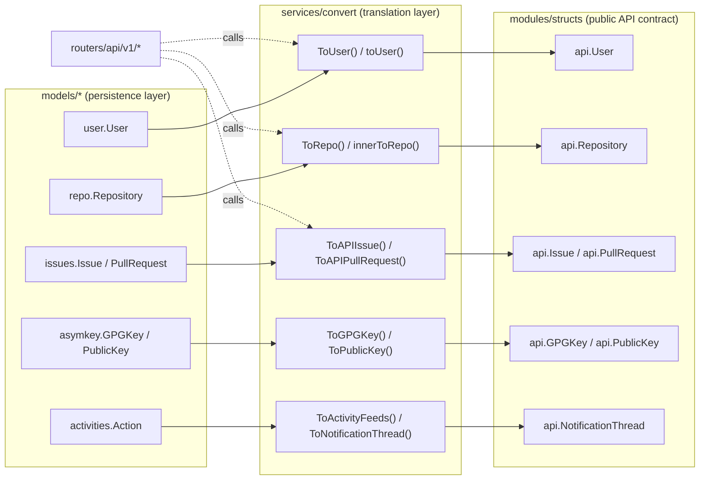
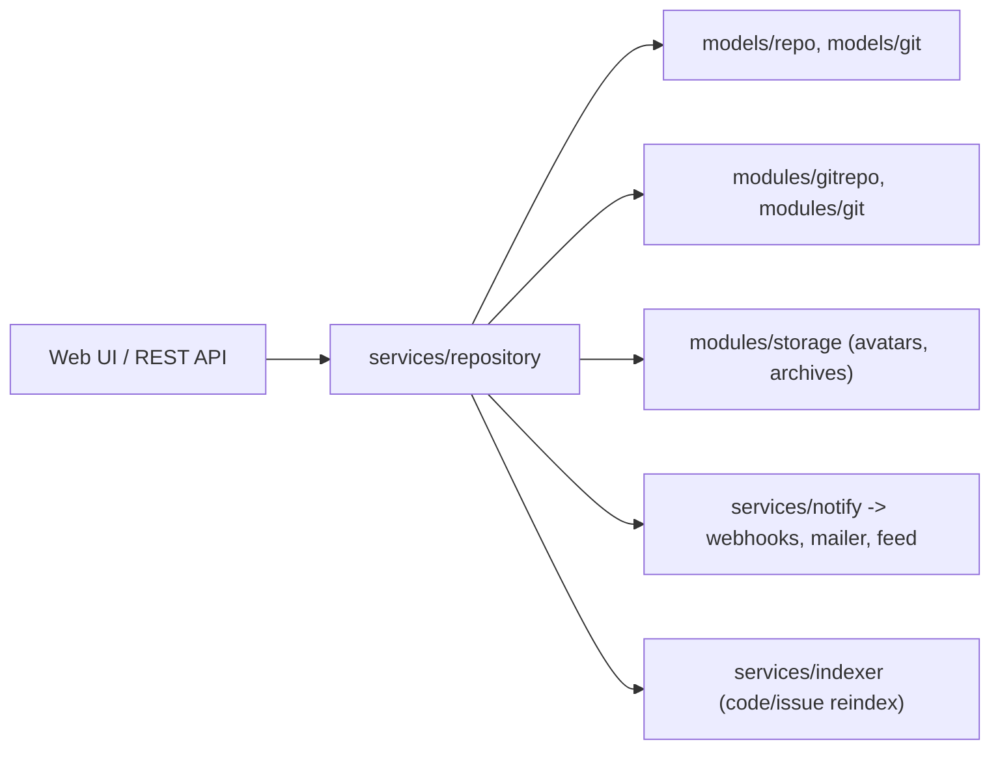

# Services Catalog

Gitea's business logic lives almost entirely under [`services/`](../../services). Routers
(`routers/web`, `routers/api`) are intentionally thin — they parse HTTP input, call into a
service function, and render the result. This page catalogs the services that are **not**
covered by their own dedicated pages elsewhere in this documentation (auth, actions, packages,
notifications, storage/queue/cache, and git/LFS internals each have their own pages — see the
cross-references at the end).

> For authentication providers see [Authentication & Authorization](auth-providers.md).
> For CI/CD see [Actions Architecture](../14-actions-ci/actions-architecture.md).
> For notifications/webhooks see [Notify, Mailer & Webhook](../09-core-modules/notify-mailer-webhook.md).

## Layout at a Glance



## AGit Flow — `services/agit`

Gitea supports [AGit-flow](https://git-repo.info/en/2020/03/agit-flow-and-git-repo/), which lets
a contributor open (and update) a pull request purely by pushing to a special ref
(`refs/for/<base>/<topic>`) without needing a fork or a separate `git push` for a PR creation
API call. The implementation lives in [`services/agit/agit.go`](../../services/agit/agit.go)
and is invoked from the git `proc-receive` hook path.

Key entry points:

| Function | Purpose |
|---|---|
| `GetAgitBranchInfo(ctx, repoID, baseBranchName)` | Resolves the pushed ref into a `(baseBranch, topicBranch)` pair, trying progressively shorter prefixes of the ref name split on `/` until an existing branch is found. |
| `ProcReceive(ctx, repo, gitRepo, opts *private.HookOptions)` | The main handler. Iterates every ref pushed in this session, and for each `refs/for/...` ref either creates a brand-new `PullRequest` (flow `issues_model.PullRequestFlowAGit`) or updates an existing unmerged one. |

Behavior highlights from `ProcReceive`:

- Push options `title`, `description`, `topic`, and `force-push` are read from
  `opts.GitPushOptions`; values may be `{base64}`-prefixed (for multi-line values) and are
  decoded by `parseAgitPushOptionValue`.
- The topic branch is always namespaced with the pusher's username
  (`<username>/<topic>`) so that different users can reuse the same topic name without
  collision.
- If no existing PR is found, `title`/`description` fall back to the new commit's
  `MessageTitle()`/`MessageBody()`, and a new `PullRequest` + `Issue` pair is created via
  `pull_service.NewPullRequest`.
- If a PR already exists, a non-force push is rejected unless the `force-push` Git push option
  was supplied (detected via `git rev-list --max-count=1 old..^new`), the PR's `HeadCommitID`
  is advanced, and `pull_service.UpdateRef` moves the internal ref. Existing reviews are marked
  stale (`issues_model.MarkReviewsAsStale`) and, if the branch protection rule has
  `DismissStaleApprovals` set, approvals are dismissed via `pull_service.DismissApprovalReviews`.



## GPG/SSH Key Management & Commit Signing — `services/asymkey`

This service owns everything related to asymmetric keys: SSH public/deploy keys, GPG keys, and
**server-side commit signing** used for auto-generated commits (wiki edits, merges, the "initial
commit" on repo creation).

Files:

- [`sign.go`](../../services/asymkey/sign.go) — signing policy engine and signing helpers.
- [`commit.go`](../../services/asymkey/commit.go) — GPG signature verification for commits shown
  in the UI/API (`ParseCommitWithSignature` and friends).
- [`deploy_key.go`](../../services/asymkey/deploy_key.go) — deploy key deletion side-effects.
- [`ssh_key.go`](../../services/asymkey/ssh_key.go), [`ssh_key_authorized_keys.go`](../../services/asymkey/ssh_key_authorized_keys.go),
  [`ssh_key_authorized_principals.go`](../../services/asymkey/ssh_key_authorized_principals.go),
  [`ssh_key_principals.go`](../../services/asymkey/ssh_key_principals.go) — regeneration of the
  `authorized_keys` / `authorized_principals` files consumed by OpenSSH's `AuthorizedKeysCommand`.

**Signing modes** (configured via `[repository.signing]` in `app.ini`, parsed by
`signingModeFromStrings`) form the vocabulary the signing engine reasons about:

```go
const (
    never         signingMode = "never"
    always        signingMode = "always"
    pubkey        signingMode = "pubkey"
    twofa         signingMode = "twofa"
    parentSigned  signingMode = "parentsigned"
    baseSigned    signingMode = "basesigned"
    headSigned    signingMode = "headsigned"
    commitsSigned signingMode = "commitssigned"
    approved      signingMode = "approved"
    noKey         signingMode = "nokey"
)
```

Primary functions (all in `sign.go`) return `(shouldSign bool, key *git.SigningKey, sig *git.Signature, err error)`:

| Function | Used when |
|---|---|
| `SignInitialCommit(ctx, u)` | The very first commit created on `git init` for a new repository. |
| `SignWikiCommit(ctx, repo, gitRepo, u)` | A user edits a wiki page through the web UI. |
| `SignCRUDAction(ctx, u, gitRepo, parentCommit)` | Web-based file create/update/delete ("CRUD") commits. |
| `SignMerge(ctx, pr, u, gitRepo)` | A merge commit produced by the merge service. |
| `AllHeadCommitsVerified(ctx, pr, gitRepo)` | Branch protection check requiring all commits on a PR head to be GPG-verified. |

`ErrWontSign` is a typed error returned when the configured mode requires signing but no key is
available, letting callers distinguish "signing is optional and skipped" from "signing was
required and failed."

## Attachment Handling — `services/attachment`

[`attachment.go`](../../services/attachment/attachment.go) centralizes upload validation, size
limiting, and storage placement for file attachments (issue/PR comments and release assets).

```go
func NewAttachment(ctx context.Context, attach *repo_model.Attachment, file io.Reader, size int64) (*repo_model.Attachment, error)
func UploadAttachmentForIssue(ctx context.Context, file *UploaderFile, attach *repo_model.Attachment) (*repo_model.Attachment, error)
func UploadAttachmentForRelease(ctx context.Context, file *UploaderFile, attach *repo_model.Attachment) (*repo_model.Attachment, error)
func UpdateAttachment(ctx context.Context, allowedTypes string, attach *repo_model.Attachment) error
```

- `UploadAttachmentForIssue`/`UploadAttachmentForRelease` are thin wrappers over the private
  `uploadAttachment`, differing only in `allowedTypes`/`maxFileSize` (from
  `setting.Attachment.*` vs `setting.Repository.Release.*`).
  `UploaderFile` wraps either a known-size `io.Reader` (`NewLimitedUploaderKnownSize`) or an
  `http.MaxBytesReader`-based upload (`NewLimitedUploaderMaxBytesReader`) so oversized uploads
  are rejected before hitting storage.
- `NewAttachment` generates the attachment UUID, streams the content into the configured
  attachment `storage.ObjectStorage` (see [Storage, Queue & Caching](../09-core-modules/storage-queue-cache.md)),
  and persists the `repo_model.Attachment` row inside a DB transaction — if the storage write
  succeeds but the DB insert fails, the stored blob is cleaned up.

## Auto-Merge — `services/automerge` and `services/automergequeue`

Two cooperating packages implement "merge this PR automatically once checks pass":

- **`services/automergequeue`** owns the actual queue (`AutoMergeQueue *queue.WorkerPoolQueue[string]`)
  and the trigger function `StartPRCheckAndAutoMerge(ctx, pull)`, which resolves the PR's current
  head commit SHA via `gitrepo.OpenRepository` + `GetRefCommitID` and pushes a
  `"<prID>_<sha>"` item onto the queue through `AddToQueue`.
- **`services/automerge`** is the queue's consumer/business layer:
  - `Init()` registers the queue handler (`handler`) which calls `handlePullRequestAutoMerge`.
  - `ScheduleAutoMerge(ctx, doer, pull, style, message, deleteBranchAfterMerge)` records a
    scheduled auto-merge (creates a `pull_model.AutoMerge` row) and immediately calls
    `StartPRCheckAndAutoMergeBySHA` to check if it can merge right away.
  - `RemoveScheduledAutoMerge(ctx, doer, pull)` cancels a pending schedule.
  - `StartPRCheckAndAutoMergeBySHA(ctx, sha, repo)` looks up every unmerged PR whose head matches
    `sha` in that repo and enqueues each for a merge attempt.
  - [`notify.go`](../../services/automerge/notify.go) implements `notify_service.Notifier`
    (`automergeNotifier`) so that `CreateCommitStatus` and PR review events automatically
    re-trigger an auto-merge check — e.g., once a CI status turns green, the notifier hook
    fires `StartPRCheckAndAutoMergeBySHA` for that repo/SHA.



## DTO Conversion Layer — `services/convert`

`services/convert` is the **only** package allowed to translate internal persistence models
(`models/*`) into the public API DTOs defined in [`modules/structs`](../../modules/structs). This
strict separation means `models/` types can freely change internal representation (e.g. add a
new normalized column, change a `bool` to an enum) without breaking the versioned REST API
contract — only `services/convert` needs to be updated.



The package is organized one file per domain, mirroring `modules/structs`:

| File | Converts | Notable exported functions |
|---|---|---|
| `user.go` | `user_model.User` → `api.User` | `ToUser`, `ToUsers`, `ToUserWithAccessMode`, `User2UserSettings`, `ToUserAndPermission` |
| `repository.go` | `repo_model.Repository` → `api.Repository` | `ToRepo`, `innerToRepo`, `ToRepoTransfer` |
| `issue.go` / `issue_comment.go` | `issues_model.Issue`/`Comment` → `api.Issue`/`api.Comment` | `ToAPIIssue`, `ToAPIIssueList`, `ToComment` |
| `pull.go` / `pull_review.go` | `issues_model.PullRequest`/`Review` → `api.PullRequest`/`api.PullReview` | `ToAPIPullRequest`, `ToPullReview` |
| `git_commit.go` | `git.Commit` → `api.Commit` | `ToCommit` |
| `release.go` | `repo_model.Release` → `api.Release` | `ToAPIRelease` |
| `project.go` | `project_model.Project`/`Column` → `api.Project` | `ToProject` |
| `package.go` | `packages_model.PackageDescriptor` → `api.Package` | `ToPackage` |
| `notification.go` | `activities_model.Notification` → `api.NotificationThread` | see [`notification.go`](../../services/convert/notification.go) |
| `activity.go` | `activities_model.Action` → `api.Activity` | `ToActivity` |
| `attachment.go` | `repo_model.Attachment` → `api.Attachment` | `ToAPIAttachment` |
| `status.go` | `git_model.CommitStatus` → `api.CommitStatus` | `ToCommitStatus` |
| `wiki.go` | wiki metadata → `api.WikiPage` | `ToWikiPage` |
| `mirror.go` | mirror settings → `api.Mirror`-ish fields | `ToMirror` |
| `convert.go` | everything else (branches, tags, hooks, GPG/SSH keys, Actions types, LFS locks, diff files) | `ToBranch`, `ToTag`, `ToActionWorkflowRun`, `ToActionArtifact`, `ToGPGKey`, `ToDeployKey`, `ToOrganization`, `ToTeam`, `ToLFSLock`, `ToChangedFile` |

Two conversion patterns recur throughout the package, illustrated by `ToUser` /`toUser` in
[`user.go`](../../services/convert/user.go):

```go
// ToUser convert user_model.User to api.User
// if doer is set, private information is added if the doer has the permission to see it
func ToUser(ctx context.Context, user, doer *user_model.User) *api.User {
    if user == nil {
        return nil
    }
    authed := false
    signed := false
    if doer != nil {
        signed = true
        authed = doer.ID == user.ID || doer.IsAdmin
    }
    return toUser(ctx, user, signed, authed)
}
```

1. **Nil-safety** — every `To*` function returns `nil` for a `nil` input so callers can convert
   slices without special-casing.
2. **Viewer-aware redaction** — many converters take the *requesting* user (`doer`) alongside the
   entity being converted, and selectively populate privileged fields (e.g. `LoginName`,
   `IsAdmin`, private email) only if the viewer is the owner or a site admin. This keeps
   authorization logic for "what fields can this caller see" in one place instead of duplicated
   across every API handler.

Because REST handlers in `routers/api/v1` call these functions directly (e.g.
`convert.ToUser(ctx, u, ctx.Doer)`), this package is the seam between the
[REST API v1](../07-rest-api/api-v1-overview.md) contract and the
[database models](../05-database-models/README.md).

## Scheduled Tasks — `services/cron`

`services/cron` is Gitea's in-process cron scheduler, built on `github.com/go-co-op/gocron`
under the hood via [`cron.go`](../../services/cron/cron.go). Tasks are plain Go functions
registered at `init()` time and run according to a cron-style schedule string, honoring
`RUN_AT_START` and (optionally) a distributed lock so only one node executes a task in an
HA deployment.

```go
type Check struct { /* not this package — see doctor below, do not confuse */ }

type Task struct {
    Name string
    RunAtStart bool
    Config     Config
    fun        func(context.Context, *user_model.User, Config) error
}

func RegisterTask(name string, config Config, fun func(context.Context, *user_model.User, Config) error) error
func RegisterTaskFatal(name string, config Config, fun func(context.Context, *user_model.User, Config) error)
func GetTask(name string) *Task
func ListTasks() TaskTable
func Init(original context.Context)
```

Task registration is split across three files by concern:

- [`tasks_basic.go`](../../services/cron/tasks_basic.go) — `registerUpdateMirrorTask`,
  `registerRepoHealthCheck`, `registerCheckRepoStats`, `registerArchiveCleanup`,
  `registerSyncExternalUsers`, `registerDeletedBranchesCleanup`,
  `registerUpdateMigrationPosterID`, `registerCleanupHookTaskTable`,
  `registerCleanupPackages`, `registerSyncRepoLicenses`.
- [`tasks_extended.go`](../../services/cron/tasks_extended.go) — heavier/optional jobs:
  `registerDeleteInactiveUsers`, `registerDeleteRepositoryArchives`,
  `registerGarbageCollectRepositories`, `registerRewriteAllPublicKeys`,
  `registerRewriteAllPrincipalKeys`, `registerRepositoryUpdateHook`,
  `registerReinitMissingRepositories`, `registerDeleteMissingRepositories`,
  `registerRemoveRandomAvatars`, `registerDeleteOldActions`, `registerUpdateGiteaChecker`
  (checks for new Gitea releases), `registerDeleteOldSystemNotices`, `registerGCLFS`,
  `registerRebuildIssueIndexer`.
- [`tasks_actions.go`](../../services/cron/tasks_actions.go) — Actions-specific housekeeping:
  `registerStopZombieTasks`, `registerStopEndlessTasks`, `registerCancelAbandonedJobs`,
  `registerScheduleTasks`, `registerActionsCleanup`.

Each task's `Run()` (in [`tasks.go`](../../services/cron/tasks.go)) wraps execution with a
global lock keyed by `getCronTaskLockKey(name)` so the same named task cannot run concurrently
across multiple `gitea` processes sharing the same database, and records success/failure with
`FormatLastMessage` for display on the **Admin → Monitoring → Cron Tasks** page.

## Diagnostics — `services/doctor`

`gitea doctor` runs a collection of `*doctor.Check` entries registered globally at package
`init()` time (via `doctor.Register(&Check{...})` calls scattered across the files below).
[`doctor.go`](../../services/doctor/doctor.go) defines the `Check` type and the runner:

```go
type Check struct {
    Title                      string
    Name                       string
    IsDefault                  bool
    Run                        func(ctx context.Context, logger log.Logger, autofix bool) error
    AbortIfFailed              bool
    SkipDatabaseInitialization bool
    Priority                   int
    InitStorage                bool
}

func RunChecks(ctx context.Context, colorize, autofix bool, checks []*Check) error
func Register(command *Check)
func SortChecks(checks []*Check)
```

`RunChecks` lazily initializes the DB connection (`initDBSkipLogger`) and, if any selected check
sets `InitStorage`, the object storage layer — only once, the first time a check needs it —
before running checks in priority order (`SortChecks`, ties broken alphabetically by `Name`).
Checks that set `AbortIfFailed` stop the whole run on error; others just report `ERROR` and
continue, giving admins a full report in one pass.

Check groups, one per file:

| File | Focus |
|---|---|
| [`dbconsistency.go`](../../services/doctor/dbconsistency.go) | Orphaned rows / dangling foreign keys across many tables (issues without repos, comments without issues, etc.) with optional `autofix` deletion. |
| [`storage.go`](../../services/doctor/storage.go) | Verifies objects referenced in the DB actually exist in configured storage (attachments, avatars, LFS, packages) and vice versa. |
| [`repository.go`](../../services/doctor/repository.go) | Repository-level integrity (missing `.git` directories, broken hooks). |
| [`lfs.go`](../../services/doctor/lfs.go) | LFS object consistency. |
| [`misc.go`](../../services/doctor/misc.go) | Grab-bag: script permissions, authorized_keys sync, default branch consistency, etc. |

## External Account Linking — `services/externalaccount`

[`user.go`](../../services/externalaccount/user.go) bridges OAuth2/SSO identities (from the
`goth` library, used by `services/auth/source/oauth2`) to local Gitea accounts:

```go
func LinkAccountToUser(ctx context.Context, authSourceID int64, user *user_model.User, gothUser goth.User) error
func EnsureLinkExternalToUser(ctx context.Context, authSourceID int64, user *user_model.User, gothUser goth.User) error
func UpdateMigrationsByType(ctx context.Context, tp structs.GitServiceType, externalUserID string, userID int64) error
```

- `toExternalLoginUser` maps a `goth.User` (provider name, external ID, tokens, raw JSON blob)
  into a `user_model.ExternalLoginUser` row.
- `LinkAccountToUser` inserts that row unconditionally (used right after first successful OAuth2
  login/signup).
- `EnsureLinkExternalToUser` is idempotent — it checks whether a link already exists before
  inserting, safe to call on every login.
- `UpdateMigrationsByType` re-points migrated content (issues/PRs/comments originally created by
  an external service account, e.g. from a GitHub import) to the newly linked local user once
  the external identity is confirmed, keyed by `structs.GitServiceType` (GitHub, GitLab, Gitea,
  etc.) and the external numeric user ID.

## Activity Feeds — `services/feed`

`services/feed` is the write-and-read path for the **Dashboard** and repository "Activity" pages,
backed by the `activities_model.Action` table.

```go
func GetFeedsForDashboard(ctx context.Context, opts activities_model.GetFeedsOptions) (activities_model.ActionList, int64, error)
func GetFeeds(ctx context.Context, opts activities_model.GetFeedsOptions) (activities_model.ActionList, int64, error)
func NotifyWatchers(ctx context.Context, acts ...*activities_model.Action) error
```

- `GetFeeds`/`GetFeedsForDashboard` wrap `activities_model` queries with permission filtering.
- `NotifyWatchers` is the fan-out: given one or more `Action` records (e.g. "user X pushed to
  repo Y"), it resolves every relevant watcher of the repo (respecting per-action visibility —
  code/issue/PR permission bits passed as `permCode/permIssue/permPR`) and inserts one `Action`
  row per watcher via `notifyWatchers`, which is what actually powers each user's personalized
  dashboard feed.
- [`notifier.go`](../../services/feed/notifier.go) implements the global
  `notify_service.Notifier` interface (`actionNotifier`) — nearly every notification hook
  (`NewIssue`, `NewPullRequest`, `PushCommits`, `CreateRepository`, `MergePullRequest`, `NewRelease`,
  etc.) constructs an `Action` and calls `NotifyWatchers`, making this the primary consumer that
  turns "something happened" events into durable, queryable feed rows. See
  [Notify, Mailer & Webhook](../09-core-modules/notify-mailer-webhook.md) for the broader
  notifier dispatch mechanism this plugs into.

## Form Validation — `services/forms`

Every HTML form and many JSON request bodies submitted to `routers/web` are represented as a Go
struct in `services/forms`, using [`gitea.com/go-chi/binding`](https://gitea.com/go-chi/binding)
tags for declarative validation, plus an optional `Validate` method for anything binding tags
can't express.

```go
// CreateRepoForm form for creating repository
type CreateRepoForm struct {
    UID           int64  `binding:"Required"`
    RepoName      string `binding:"Required;AlphaDashDot;MaxSize(100)"`
    Private       bool
    Description   string `binding:"MaxSize(2048)"`
    DefaultBranch string `binding:"GitRefName;MaxSize(100)"`
    AutoInit      bool
    // ...
}

func (f *CreateRepoForm) Validate(req *http.Request, errs binding.Errors) binding.Errors {
    ctx := context.GetValidateContext(req)
    return middleware.Validate(errs, ctx.Data, f, ctx.Locale)
}
```

Files are grouped by feature area:

| File | Forms for |
|---|---|
| `repo_form.go` (largest, ~25 KB) | Repo create/migrate/edit, collaborator, webhook, protected-branch, mirror settings, etc. |
| `repo_form_editor.go` | Web file editor (create/edit/delete/upload). |
| `repo_branch_form.go` / `repo_tag_form.go` | Branch/tag rename, protection rule forms. |
| `user_form.go` | Registration, login, profile/account settings, 2FA. |
| `user_form_auth_openid.go` | OpenID sign-in. |
| `user_form_hidden_comments.go` | Per-user issue-comment-type visibility preferences. |
| `org.go` | Organization create/settings/team forms. |
| `admin.go` | Site-admin user/config edit forms. |
| `package_form.go` | Package registry settings. |
| `auth_form.go` | Authentication source (LDAP/OAuth2/etc.) admin forms. |
| `runner.go` | Actions runner registration token form. |

`binding` validation runs automatically as chi middleware (`web.Bind(&forms.CreateRepoForm{})`)
before the route handler executes — by the time a handler in `routers/web` runs, `ctx.Data["Err_*"]`
flags and error messages are already populated for invalid fields, so handlers just check
`ctx.HasError()`.

## Git Diff Rendering — `services/gitdiff`

`services/gitdiff` parses raw unified-diff output from `git diff`/`git show` into a structured,
render-ready tree used by both the web UI (commit/PR diff views) and the REST API
(`GET /repos/{owner}/{repo}/pulls/{index}/files`).

Core type hierarchy (in [`gitdiff.go`](../../services/gitdiff/gitdiff.go)):

```go
type Diff struct {
    Files                    []*DiffFile
    NumFiles                 int
    TotalAddition, TotalDeletion int
    // ...
}

type DiffFile struct {
    Name, OldName string
    Addition, Deletion int
    Type          DiffFileType // Add / Change / Del / Rename / Copy
    IsBin, IsLFSFile, IsRenamed, IsSubmodule bool
    Sections      []*DiffSection
    IsGenerated, IsVendored bool
    SubmoduleDiffInfo *SubmoduleDiffInfo
    IsViewed, HasChangedSinceLastReview bool // per-user review state
}

type DiffSection struct {
    FileName string
    Lines    []*DiffLine
}

type DiffLine struct {
    Type    DiffLineType // Plain / Add / Del / Section
    Content string
    LeftIdx, RightIdx int
    // ...
}
```

Entry points:

| Function | Purpose |
|---|---|
| `GetDiffForRender(ctx, repoLink, gitRepo, opts, files...)` | Full diff for **web UI rendering**: adds syntax highlighting hooks, generated/vendored file detection, per-user "viewed" sync, and (for changed files) tail-section expansion so "load more" works without a second diff call. |
| `GetDiffForAPI(ctx, gitRepo, opts, files...)` | Lighter-weight variant for the REST API — same parsing, without UI-only enrichment. |
| `GetDiffShortStat(ctx, repoStorage, gitRepo, before, after)` | Just the aggregate `+N -M` / file-count stats, used for PR summary badges without parsing full content. |
| `BuildBlobExcerptDiffSection` (`gitdiff_excerpt.go`) | Builds the "Load more lines" expand-context sections used when a user clicks to reveal collapsed unchanged lines around a hunk. |
| `GetDiffTree` (`git_diff_tree.go`) | Cheap `git diff-tree`-based file list (paths + change type) without hunk content — used where only the changed-file list is needed. |

`services/gitdiff` also implements **CSV table diffing** ([`csv.go`](../../services/gitdiff/csv.go)):
when both sides of a diffed file parse as valid CSV, `CreateCsvDiff` produces a
`[]*TableDiffSection` (row/column-aligned diff) instead of a plain text diff, which the web UI
renders as an actual table with per-cell add/delete/change markers — including a heuristic
column-remapping (`getColumnMapping`/`tryMapColumnsByContent`) to handle inserted/reordered
columns gracefully. [`submodule.go`](../../services/gitdiff/submodule.go) adds submodule-specific
link rendering (`SubmoduleDiffInfo`) so diffs on submodule pointer changes link to the submodule's
own commit/compare view.

## Organization Service — `services/org`

Business logic for organizations and teams that goes beyond simple CRUD on the `organization`
model:

| File | Responsibility |
|---|---|
| `org.go` | `DeleteOrganization(ctx, org, purge)` — deletes an org and (if `purge`) all of its owned repos; `ChangeOrganizationVisibility` — flips public/limited/private and cascades visibility changes to owned repos (`updateRepoForVisibilityChanged`); `UpdateOrgEmailAddress`. |
| `user.go` | `RemoveOrgUser(ctx, org, user)` — removes a member and cleans up their team memberships. |
| `team.go` | `NewTeam`, `UpdateTeam` (handles permission/repo-scope changes), `DeleteTeam`, `AddTeamMember`, `RemoveTeamMember` — team lifecycle plus the repo-access side effects of team membership changes. |
| `team_invite.go` | `CreateTeamInvite(ctx, inviter, team, uname)` — email/link-based team invitations for users not yet registered or not yet members. |

## Project Boards — `services/projects`

Supports Gitea's Kanban-style "Projects" feature (columns containing issues/PRs), in
[`issue.go`](../../services/projects/issue.go):

```go
func MoveIssuesOnProjectColumn(ctx context.Context, doer *user_model.User, column *project_model.Column, sortedIssueIDs map[int64]int64) error
func LoadIssuesFromProject(ctx context.Context, project *project_model.Project, opts *issues_model.IssuesOptions) (results map[int64]issues_model.IssueList, _ error)
func LoadIssueNumbersForProjects(ctx context.Context, projects []*project_model.Project, doer *user_model.User) error
```

`MoveIssuesOnProjectColumn` implements drag-and-drop reordering: it re-sorts issues within/between
columns transactionally, firing `notify_service` hooks for cross-column moves (project board
status changes are visible in issue timelines). `LoadIssuesFromProject`/`LoadIssueNumbersForProjects`
are read-side helpers used to render the project board with per-column issue lists and totals
without N+1 queries.

## Release Management — `services/release`

Everything around Git tags and Gitea "Releases" (tag + optional attachments/notes) lives here.

| Function (file) | Purpose |
|---|---|
| `CreateRelease(gitRepo, rel, attachmentUUIDs, msg)` (`release.go`) | Creates the underlying Git tag (if not already present) and the `Release` DB row, attaching uploaded assets. |
| `CreateNewTag(ctx, doer, repo, commit, tagName, msg)` (`release.go`) | Tag-only creation (no release metadata), used by the "create tag" UI/API separate from releases. |
| `UpdateRelease(ctx, doer, gitRepo, rel, ...)` (`release.go`) | Edits release metadata/attachments, can move the underlying tag. |
| `DeleteReleaseByID(ctx, repo, rel, doer, delTag)` (`release.go`) | Deletes a release and, optionally, the tag itself. |
| `GenerateReleaseNotes(ctx, repo, gitRepo, opts)` (`notes.go`) | Auto-generates changelog-style release notes by walking merged PRs between two refs (`collectPullRequestsFromCommits`), grouping by first-time contributors (`isFirstContribution`) — the same feature GitHub calls "Generate release notes". |
| `AddAllRepoTagsToSyncQueue` / `initTagSyncQueue` (`tag.go`) | Queue-based background sync that keeps DB tag records consistent with the actual Git refs (e.g. after a mirror pull or force-push of a tag). |

Typed errors `ErrInvalidTagName`, `ErrProtectedTagName`, `ErrTagAlreadyExists` give routers precise
messages to surface (e.g. "tag already exists" vs. generic 500).

## Repository Service — `services/repository`

The largest single service package, covering the full repository lifecycle. Sub-packages exist
for especially large concerns: `archiver` (zip/tarball generation, covered by
`DeleteRepositoryArchives` cron cleanup), `commitstatus`, `files` (web-based file CRUD used by
the code editor), and `gitgraph` (commit graph rendering data).

| Area | File(s) | Key functions |
|---|---|---|
| Creation | `create.go`, `repository.go`, `init.go` | `CreateRepositoryDirectly`, `CreateRepository` |
| Adoption | `adopt.go` | `AdoptRepository` — turns an existing bare repo directory on disk (placed there manually) into a tracked Gitea repository. |
| Forking | `fork.go` | `ForkRepository` |
| Deletion | `delete.go`, `repository.go` | `DeleteRepositoryDirectly`, `DeleteRepository` |
| Transfer | `transfer.go` | Ownership transfer including acceptance workflow for org repos. |
| Templates | `template.go` | Generating a new repo from a "template repository" (`generate.go` handles content substitution of `{{...}}` placeholders). |
| Branches | `branch.go` (largest file, ~29 KB) | Branch creation/deletion/protection/sync with the DB `Branch` table. |
| Collaborators & Teams | `collaboration.go`, `repo_team.go` | Adding/removing collaborators and team repo access. |
| Mirrors / Push | `push.go` | Post-receive side effects: updates default branch detection, triggers webhooks/notifications, updates `Repository.Size`. |
| Merge from upstream | `merge_upstream.go` | "Sync fork" — merges the fork's base branch from the original repository. |
| Migration | `migrate.go` | Used by `services/task` when importing a repo from an external Git service. |
| LFS | `lfs.go` | Repository-level LFS enable/disable, quota checks. |
| License detection | `license.go` | Detects OSS license from repo file content. |
| Avatars | `avatar.go` | Repo avatar upload/removal. |
| Contributors graph | `contributors_graph.go` | Computes weekly commit-count-by-author data cached for the "Contributors" chart. |
| Health checks | `check.go` | `GitFsck`-style consistency checks invoked from cron/doctor. |
| Hooks | `hooks.go` | Regenerates server-side Git hook scripts (`pre-receive`, `update`, `post-receive`) that shell out to the `gitea hook` CLI subcommand. |



## Secrets Management — `services/secrets`

A small, focused service backing Actions/CI secrets (repo, org, or user-level).
[`secrets.go`](../../services/secrets/secrets.go):

```go
func CreateOrUpdateSecret(ctx context.Context, ownerID, repoID int64, name, data, description string) (*secret_model.Secret, bool, error)
func DeleteSecretByID(ctx context.Context, ownerID, repoID, secretID int64) error
func DeleteSecretByName(ctx context.Context, ownerID, repoID int64, name string) error
```

`CreateOrUpdateSecret` validates the secret name (`ValidateName`, in
[`validation.go`](../../services/secrets/validation.go) — enforces the GitHub Actions-compatible
naming rule: must start with a letter/underscore, contain only alphanumerics/underscore, and not
be prefixed `GITHUB_`), then either inserts a new **encrypted** secret
(`secret_model.InsertEncryptedSecret`, which uses the instance `SECRET_KEY`-derived cipher — see
encryption details in [Storage, Queue & Caching](../09-core-modules/storage-queue-cache.md)) or
updates the existing row's ciphertext in place, returning whether a new row was created (for
correct HTTP status: `201 Created` vs `204 No Content`).

## Background Tasks — `services/task`

`services/task` runs long-lived, asynchronous jobs off the request path — today this is scoped to
**repository migration/import**, driven by a queue.

```go
func CreateMigrateTask(ctx context.Context, doer, u *user_model.User, opts base.MigrateOptions) (*admin_model.Task, error)
func MigrateRepository(ctx context.Context, doer, u *user_model.User, opts base.MigrateOptions) error
func RetryMigrateTask(ctx context.Context, repoID int64) error
func Run(ctx context.Context, t *admin_model.Task) error
func Init() error
```

`CreateMigrateTask` persists an `admin_model.Task` row (status `Queued`) and pushes it onto a
`queue.WorkerPoolQueue`; the registered `handler` (`task.go`) calls `Run`, which dispatches to
`runMigrateTask` in [`migrate.go`](../../services/task/migrate.go). `runMigrateTask` invokes the
actual migration downloader/uploader pair from `modules/migration` (GitHub/GitLab/etc.
importers), updates task status/progress as it streams issues, PRs, releases, and Git objects
into the new local repository, and calls `handleCreateError` to translate low-level errors (auth
failures, remote-not-found) into user-facing task error messages. `RetryMigrateTask` re-enqueues
a previously failed migration task by ID.

## Versioned In-Place Migrations — `services/versioned_migration`

A single-purpose wrapper, [`migration.go`](../../services/versioned_migration/migration.go),
around the database schema migration runner in `models/migrations`:

```go
func Migrate(ctx context.Context, x db.EngineMigration) error {
    release, err := globallock.Lock(ctx, "gitea_versioned_migration")
    if err != nil {
        return err
    }
    defer release()
    return migrations.Migrate(ctx, x)
}
```

The only thing this layer adds over calling `migrations.Migrate` directly is a **global lock**
(`modules/globallock`, backed by the DB or a configured lock provider) named
`gitea_versioned_migration` — this guarantees that if multiple `gitea` instances start up
simultaneously against the same database (a common pattern in container orchestration
rolling-restarts), only one instance actually runs the versioned migration steps while the
others block until it's done. See [Migrations](../05-database-models/migrations.md) for the
migration steps themselves.

## Web Theme — `services/webtheme`

Discovers and describes CSS themes shipped under `public/assets/css/themes/theme-*.css` (or, in
development, served by the Vite dev server) for the theme picker in user settings.
[`webtheme.go`](../../services/webtheme/webtheme.go):

```go
type ThemeMetaInfo struct {
    FileName       string
    InternalName   string
    DisplayName    string
    ColorblindType string // "red-green" | "blue-yellow" | ""
    ColorScheme    string // "light" | "dark" | ...
}
```

Each theme's metadata (display name, colorblind-friendliness, light/dark classification) is
authored **inside the CSS file itself**, in a private `gitea-theme-meta-info { --key: "value"; }`
rule block, and extracted at runtime by `parseThemeMetaInfoToMap` using a small regex-based
parser (`reMetaInfoItem`/`reMetaInfoBlock`) rather than a separate manifest file — keeping theme
metadata co-located with the theme it describes. The parsed results are cached in an
`atomic.Pointer[themeCollectionStruct]` and refreshed based on file modification time
(`lastCheckTime`), with a special-case fast path (`usingViteDevMode`) when running the frontend
dev server where themes aren't compiled to static files yet. `GetExtraIconName`/`GetDescription`
provide UI hints (accessibility icon + tooltip) for colorblind-friendly variants.

## User Service — `services/user`

Account lifecycle operations that touch more than the `user_model.User` row alone:

| File | Key functions |
|---|---|
| `user.go` | `RenameUser` (updates username everywhere it's denormalized: repo paths on disk, avatar links, etc.), `DeleteUser`/`deleteUser` (cascading deletion of owned repos, keys, tokens, sessions — or "soft" handling when `purge=false`), `DeleteInactiveUsers` (used by the cron task of the same intent). |
| `update.go` | `UpdateUser(ctx, u, opts *UpdateOptions)` — generic profile field updates using an `optional.Option[UpdateOptionField[T]]` pattern so callers can distinguish "don't touch this field" from "set it to zero value"; `UpdateAuth` for password/login-source changes. |
| `email.go` | `ReplacePrimaryEmailAddress`, `AddEmailAddresses`, `DeleteEmailAddresses` — keeps `user_model.EmailAddress` rows and the denormalized `User.Email` column consistent, including re-sending activation mail where required. |
| `avatar.go` | `UploadAvatar`, `DeleteAvatar`. |
| `block.go` | `BlockUser`/`UnblockUser` — implements Gitea's user-blocking feature: unstars/unwatches repos both directions, cancels pending repo transfers between the two users, unassigns issues, and removes collaborations (`unstarRepos`, `unwatchRepos`, `cancelRepositoryTransfers`, `unassignIssues`, `removeCollaborations`), plus `CanBlockUser`/`CanUnblockUser` permission gates (e.g. can't block an org you're a member of in a way that breaks access). |

## Wiki Service — `services/wiki`

Gitea stores each repository's wiki as its **own bare Git repository** (named
`<repo>.wiki.git`), with page titles mapped to file paths using a reversible escaping scheme.
[`wiki_path.go`](../../services/wiki/wiki_path.go) implements that mapping:

```go
type WebPath string

func UserTitleToWebPath(base, title string) WebPath
func WebPathToUserTitle(s WebPath) (dir, display string)
func WebPathToGitPath(s WebPath) string
func GitPathToWebPath(s string) (wp WebPath, err error)
func WebPathSegments(s WebPath) []string
```

Special characters and path segments that would collide with Git path rules are escaped (e.g. a
literal `-` in a title needs a "dash marker" so it isn't confused with the directory separator
substitution scheme — see `hasDashMarker`/`addDashMarker`/`removeDashMarker`), so that a human
title like `Foo Bar/Sub Page` round-trips correctly to/from a `.md` file path in the wiki repo.

[`wiki.go`](../../services/wiki/wiki.go) implements the actual content operations, all funneling
through the private `updateWikiPage`:

```go
func InitWiki(ctx context.Context, repo *repo_model.Repository) error
func AddWikiPage(ctx context.Context, doer *user_model.User, repo *repo_model.Repository, wikiName WebPath, content, message string) error
func EditWikiPage(ctx context.Context, doer *user_model.User, repo *repo_model.Repository, oldWikiName, newWikiName WebPath, content, message string) error
func DeleteWikiPage(ctx context.Context, doer *user_model.User, repo *repo_model.Repository, wikiName WebPath) (err error)
func DeleteWiki(ctx context.Context, repo *repo_model.Repository) error
func ChangeDefaultWikiBranch(ctx context.Context, repo *repo_model.Repository, newBranch string) error
```

`InitWiki` creates the bare `.wiki.git` repository lazily on first page save.
`updateWikiPage` acquires a per-repository lock (`getWikiWorkingLockKey`) to serialize concurrent
wiki edits, clones/checks out a temporary working copy, writes the new file content, and commits
+ pushes back — reusing `services/asymkey.SignWikiCommit` (see above) so wiki commits respect
the instance's commit-signing policy just like any other Git write path.

## Cross-References

- [Authentication & Authorization](auth-providers.md) — `services/auth`.
- [Actions Architecture](../14-actions-ci/actions-architecture.md) — `services/actions`.
- [Notify, Mailer & Webhook](../09-core-modules/notify-mailer-webhook.md) — `services/notify`, `services/webhook`, `services/mailer`.
- [Storage, Queue & Caching](../09-core-modules/storage-queue-cache.md) — underlying primitives used by `attachment`, `secrets`, `cron`, `automergequeue`, `task`.
- [Supported Ecosystems](../15-packages-registry/supported-ecosystems.md) / [Package Flow](../15-packages-registry/package-flow.md) — `services/packages`.
- [Search & Indexing](../09-core-modules/indexers.md) — `services/indexer`.
- [Git Module](../09-core-modules/git-module.md) / [LFS & Hooks](../09-core-modules/lfs-and-hooks.md) — `services/git`, `services/lfs`.
- [Migrations](../05-database-models/migrations.md) — schema migrations run through `services/versioned_migration`.
- [REST API v1 Overview](../07-rest-api/api-v1-overview.md) — consumer of `services/convert`.
