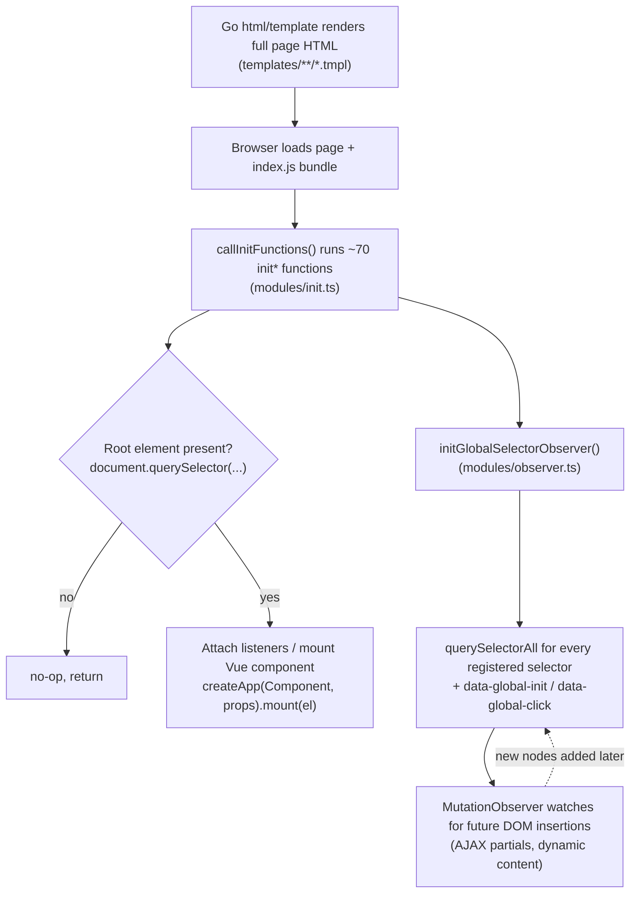

# Frontend Features & the "Islands of Interactivity" Pattern

Gitea's UI is fundamentally **server-rendered**: every page's HTML comes from Go's
`html/template` engine (see `templates/**/*.tmpl`). The frontend TypeScript/Vue code in
`web_src/js/` does not take over routing or rendering — instead it *progressively enhances*
already-rendered HTML by attaching event listeners, mounting small Vue components into specific
DOM nodes, and reacting to DOM mutations. This page catalogs the ~80 feature modules under
`web_src/js/features/`, the Vue `components/`, the custom `webcomponents/`, the Markdown/markup
live-preview pipeline, and explains the "islands of interactivity" architecture that ties them
all together. For the build tooling that compiles all of this, see
[Frontend Build Pipeline](frontend-build.md).

## The Islands of Interactivity Pattern

Rather than a single-page app that owns the whole DOM, Gitea's frontend is organized as many
small, independent "islands": isolated pieces of interactive behavior that attach themselves to
specific elements already present in server-rendered HTML. Three mechanisms implement this.

### 1. Global init functions, called once at page load

`web_src/js/index.ts` is the single entry bundle loaded on every page. It imports ~70 named
`init*` functions from `features/*.ts` and passes them as an array to `callInitFunctions()`
(defined in `web_src/js/modules/init.ts`):

```ts
// web_src/js/index.ts (excerpt)
import {initDashboardRepoList} from './features/dashboard.ts';
import {initHeatmap} from './features/heatmap.ts';
import {initRepoDiffView} from './features/repo-diff.ts';
import {initRepoEditor} from './features/repo-editor.ts';
import {initUserAuthWebAuthn, initUserAuthWebAuthnRegister} from './features/user-auth-webauthn.ts';
// ...

const initPerformanceTracer = callInitFunctions([
  initGiteaFomantic,
  initGlobalComponent, initGlobalDropdown, initGlobalFetchAction, initGlobalTooltips,
  // ...
  initHeatmap, initImageDiff, initRepoDiffView, initRepoEditor,
  initUserAuthWebAuthn, initUserAuthWebAuthnRegister,
  // ...
]);
initGlobalSelectorObserver(initPerformanceTracer);
```

Each `init*` function is responsible for finding its own root element(s) — typically via
`document.querySelector` — and returning immediately (a no-op) if that element isn't present on
the current page:

```ts
// web_src/js/features/heatmap.ts (excerpt)
export async function initHeatmap() {
  const el = document.querySelector<HTMLElement>('#user-heatmap');
  if (!el) return;
  // ... fetch data, dynamically import the Vue component, mount it
}
```

This means every page pays only the (very small) cost of running a `querySelector` for features
irrelevant to it — there's no router or page-type dispatch table; every module self-selects.
`window.config.frontendInited = true` is set once all init functions and the selector observer
have run, giving both humans and E2E tests (Playwright) a reliable signal that hydration is
complete. `?_ui_performance_trace=1` in the URL enables `InitPerformanceTracer`, which times each
init function and each selector-scan and logs the slowest 20 to the console — useful for
regressions where a single `init*` function blocks the main thread.

### 2. Declarative `data-global-init` / `data-global-click` attributes

For features that need to run not just once at page load but also whenever *new* matching
elements are inserted into the DOM later (e.g. after an AJAX partial reload, or content added via
`innerHTML`), Gitea uses a `MutationObserver`-backed registry in `web_src/js/modules/observer.ts`:

```ts
export function registerGlobalInitFunc<T extends HTMLElement>(name: string, handler: GlobalInitFunc<T>) {
  globalInitFuncs[name] = handler as GlobalInitFunc<Element>;
}
export function registerGlobalSelectorFunc<T extends Element>(selector: string, handler: (el: T) => void) {
  selectorHandlers.push({selector, handler: handler as (el: Element) => void});
}
export function registerGlobalEventFunc<T extends HTMLElement, E extends Event>(event: string, name: string, func: GlobalEventFunc<T, E>) {
  globalEventFuncs[`${event}:${name}`] = func as GlobalEventFunc<HTMLElement, Event>;
}
```

`initGlobalSelectorObserver()` (called last, after all `init*` functions have registered their
handlers) does one `querySelectorAll` per registered selector over the whole document, then sets
up a single `MutationObserver` that re-runs the matching handler for any element added later
anywhere in the page. Server templates opt an element into this system just by adding an
attribute — no JS import needed at the template layer:

```html
<!-- templates/repo/settings/actions_general.tmpl -->
<form class="ui form" data-global-init="initRepoActionsPermissionsForm">...</form>

<!-- templates/repo/latest_commit.tmpl -->
<button class="ui button ellipsis-button" data-global-click="onRepoEllipsisButtonClick">...</button>

<!-- templates/repo/view_file.tmpl -->
<a class="btn-octicon" data-global-click="onCopyContentButtonClick" ...>
```

Corresponding TS registers the handler once, by name, and the observer wires it to every current
and future matching element automatically:

```ts
// web_src/js/features/common-actions-permissions.ts
registerGlobalInitFunc('initRepoActionsPermissionsForm', initActionsPermissionsFormInner);
```

This attribute-based dispatch means backend template authors can add new interactive behavior to
server-rendered HTML by adding one attribute, without needing to add a `querySelector`-based
`init*` function to `index.ts` at all — as long as the handler name is already registered
somewhere in a loaded module.

### 3. Vue components mounted onto specific elements ("islands")

For anything with non-trivial client-side state (heatmaps, diff file trees, action run logs,
branch selectors, etc.), a feature module dynamically imports a `.vue` single-file component and
mounts a whole isolated Vue app instance directly onto the server-rendered placeholder element:

```ts
// web_src/js/features/heatmap.ts
const {default: ActivityHeatmap} = await import('../components/ActivityHeatmap.vue');
const View = createApp(ActivityHeatmap, {values, locale});
View.mount(el);
el.classList.remove('is-loading');
```

```ts
// web_src/js/features/ref-issue.ts — an app that can also unmount itself
const app = createApp(ContextPopup, {...});
app.mount(el);
// later, e.g. on tippy.js popup hide:
onDestroy: () => app.unmount(),
```

Each such mount is its own independent Vue application instance — there is no single root Vue
app for the whole page. Data typically flows in via `data-*` HTML attributes read by the
surrounding `init*` function, or via `window.config.pageData` (see
`web_src/js/globals.d.ts` for the full shape, e.g. `pageData.citationFileContent`,
`pageData.DiffFileTree`, `pageData.repoActivityTopAuthors`), and is passed to the component as
Vue `props`.



## Feature Module Catalog (`web_src/js/features/*.ts`)

The `web_src/js/features/` directory contains ~70 top-level modules (plus a `features/comp/` and
`features/admin/` subfolder). Grouped by area:

### Repository: code browsing & editing

| Module | Responsibility |
|---|---|
| `repo-code.ts` | Code view line highlighting/selection, permalink generation. |
| `repo-editor.ts` | The web-based file editor page (CodeMirror wiring, commit form, preview tab). |
| `repo-findfile.ts` | Fuzzy "Go to file" finder (mounts `RepoFileSearch.vue`). |
| `repo-view-file-tree.ts` | Mounts the sidebar file tree (`ViewFileTree.vue` + `ViewFileTreeStore.ts`) on repo code/blob pages. |
| `file-view.ts` / `file-fold.ts` | Raw file view controls; collapsible file sections. |
| `repo-unicode-escape.ts` | Warns about/escapes ambiguous Unicode characters in rendered file content. |
| `copycontent.ts` | Generic "copy to clipboard" button wiring for file/content views. |

### Repository: diff & review

| Module | Responsibility |
|---|---|
| `repo-diff.ts` | Main PR/commit diff view: expand/collapse hunks, whitespace toggle, review comments. |
| `repo-diff-commit.ts` / `repo-diff-commitselect.ts` | Commit range selector for diffs (mounts `DiffCommitSelector.vue`). |
| `repo-diff-filetree.ts` | Mounts `DiffFileTree.vue`/`DiffFileTreeItem.vue` sidebar for changed-files navigation. |
| `imagediff.ts` | Side-by-side / swipe / onion-skin image diff viewer. |
| `pull-view-file.ts` | Per-file "viewed" checkbox tracking state on PR file review. |

### Repository: issues, pulls, projects

| Module | Responsibility |
|---|---|
| `repo-issue.ts` (largest feature file, ~23 KB) | Issue/PR page: reference autocomplete, PR review submission, label/milestone/assignee sidebar wiring, filter-by-label. |
| `repo-issue-content.ts` | Issue content edit-history diff viewer. |
| `repo-issue-edit.ts` | Inline issue title/description editing. |
| `repo-issue-list.ts` | Issue list page filters, bulk actions. |
| `repo-issue-pull.ts` | Mounts `PullRequestMergeForm.vue` (merge box: merge style choice, auto-merge, delete-branch-after-merge). |
| `repo-issue-sidebar.ts` / `repo-issue-sidebar-combolist.ts` | New Vue-free combo-list sidebar widgets (labels/assignees/milestone/project pickers) — see `repo-issue-sidebar.md` in the same directory for the design rationale. |
| `issue.ts` | Shared issue helpers (used across list/detail pages). |
| `ref-issue.ts` | Hover context popup for `#123`-style issue/PR references (mounts `ContextPopup.vue`). |
| `common-issue-list.ts` | "Quick goto issue by number" keyboard shortcut, shared between repo and org-wide issue lists. |
| `repo-projects.ts` | Kanban-style project board (drag/drop columns using Sortable.js). |
| `repo-milestone.ts` | Milestone page small helpers. |

### Repository: actions (CI/CD)

| Module | Responsibility |
|---|---|
| `repo-actions.ts` | Mounts `RepoActionView.vue` (the Actions run log viewer: log streaming, job/step tree). |
| `common-actions-permissions.ts` | Repo/org Actions permission settings form (`data-global-init="initRepoActionsPermissionsForm"`). |

Related Vue components (not under `features/` but part of the same feature area): `ActionRunJobView.vue`, `ActionRunSummaryView.vue`, `ActionRunView.ts`, `ActionStatusIcon.vue`, `WorkflowGraph.vue` + `WorkflowGraph.utils.ts` (workflow dependency graph rendering), `ActionRunArtifacts.ts`.

### Repository: branches, releases, wiki, settings, migration

| Module | Responsibility |
|---|---|
| `repo-branch.ts` | Branch list/protection page buttons. |
| `repo-settings-branches.ts` | Branch protection rule form logic. |
| `repo-settings.ts` | General repository settings page (webhooks, visibility, danger zone confirms). |
| `repo-release.ts` | Release/tag creation form (target branch/tag combo, asset list). |
| `repo-wiki.ts` | Wiki page editor/preview toggle. |
| `repo-migrate.ts` / `repo-migration.ts` | Repository migration wizard + async migration status polling. |
| `repo-new.ts` | "New repository" form (auto-fill name from template, license/gitignore selects). |
| `repo-branch.ts`, `repo-search.ts` | Repo-scoped code/commit search bar. |
| `repo-legacy.ts` | Grab-bag of legacy repo header behaviors (branch/tag selector dropdown, mounts `RepoBranchTagSelector.vue`). |
| `repo-common.ts` | Shared repo chrome: top-authors chart (mounts `RepoActivityTopAuthors.vue`), archive-format download links. |
| `repo-home.ts` | Repo homepage: topics bar editing. |
| `repo-graph.ts` | Commit graph rendering (Git history graph visualization). |
| `contributors.ts` / `code-frequency.ts` / `recent-commits.ts` | Repo "Insights" charts, each mounting a Chart.js-backed Vue component (`RepoContributors.vue`, `RepoCodeFrequency.vue`, `RepoRecentCommits.vue`). |
| `repo-commit.ts` | Commit page: ellipsis "..." expand button, commit status icons, avatar stack popovers, follow-rename checkbox. |

### User account & auth

| Module | Responsibility |
|---|---|
| `user-auth.ts` | External login provider buttons, "check app URL reachable" ping on OAuth app settings. |
| `user-auth-webauthn.ts` | WebAuthn/FIDO2 login and security-key registration flows (`navigator.credentials.get/create`, base64url encode/decode via `uint8-to-base64`). |
| `user-settings.ts` | Account settings page misc form wiring. |
| `sshkey-helper.ts` | Parses pasted SSH public keys client-side to show fingerprint/type before submit. |
| `oauth2-settings.ts` | Disables the redirect-URI-confirmation checkbox logic on OAuth2 application settings. |
| `org-team.ts` / `common-organization.ts` | Organization team member management, org-wide UI bits. |

### Admin

Located in `features/admin/`: `users.ts` (admin user list search form), `config.ts` (admin config
page interactivity), `common.ts`, `selfcheck.ts` (self-check diagnostics page).

### Cross-cutting / common utilities

| Module | Responsibility |
|---|---|
| `common-page.ts` | Global Vue component auto-mounting (`initGlobalComponent`), global dropdown/input init. |
| `common-button.ts` | Generic button behaviors: click-on-Enter, loading-state buttons, link-buttons. |
| `common-form.ts` | Global "confirm before leaving dirty form", quick-submit-on-Enter, mounts the shared Markdown combo editor. |
| `common-fetch-action.ts` (largest common module, ~17 KB) | Declarative `data-fetch-action`/CSRF-aware form and link POST/DELETE handling — the primary AJAX mutation mechanism used across almost every settings/action button in Gitea. |
| `dashboard.ts` | Dashboard "your repositories" list (mounts `DashboardRepoList.vue`). |
| `notification.ts` | Notification bell count polling via `EventSource`/`SharedWorker` (see `eventsource.sharedworker.ts`). |
| `heatmap.ts` | Contribution heatmap on user profile (mounts `ActivityHeatmap.vue`). |
| `citation.ts` | `CITATION.cff` → APA/BibTeX conversion and copy modal, using `@citation-js/*` packages loaded lazily. |
| `dropzone.ts` | File upload drag-and-drop zones (wraps `@deltablot/dropzone`), used by issue/comment attachments and release assets. |
| `colorpicker.ts` | Label-color picker (wraps `vanilla-colorful` + `colord`), used on label create/edit forms. |
| `captcha.ts` | Loads and initializes whichever captcha provider is configured (`grecaptcha`/`turnstile`/`hcaptcha`/`mCaptcha`). |
| `tablesort.ts` | Generic click-to-sort `<table>` behavior. |
| `tribute.ts` | `@mention` / `:emoji:` autocomplete popups inside comment/issue text areas (via `tributejs`). |
| `emoji.ts` | Emoji shortcode → unicode/custom-emoji-image rendering helpers. |
| `stopwatch.ts` | The floating time-tracking stopwatch widget shown while a timer is running. |
| `install.ts` | The first-run installation wizard page (`/install`). |

### `features/comp/` — shared, reusable "component" helpers

Unlike `features/*.ts` (one module per page/feature), `features/comp/*.ts` holds smaller reusable
building blocks consumed by several features:

`ComboMarkdownEditor.ts` (the shared Markdown/EasyMDE + CodeMirror dual-mode editor used
everywhere comments/issues/PRs are written), `EditorMarkdown.ts`, `EditorUpload.ts` (drag-drop
+ paste image upload into the editor), `EasyMDEToolbarActions.ts`, `ConfirmModal.ts` (promise-based
confirm dialog wrapper around Fomantic modal), `Cropper.ts` (avatar cropping, via `cropperjs`),
`LabelEdit.ts`, `QuickSubmit.ts`, `ReactionSelector.ts` (emoji reactions picker), `ScopedWorkflows.ts`
(Actions workflow YAML scoping helper), `SearchRepoBox.ts` / `SearchUserBox.ts` (typeahead search
dropdowns), `TextExpander.ts` (wraps `@github/text-expander-element` for `@`/`:` triggers),
`WebHookEditor.ts`.

## Vue Components (`web_src/js/components/*.vue`)

All Vue single-file components live flat under `web_src/js/components/` (no further nesting) and
are always mounted imperatively from a `features/*.ts` module via `createApp(...).mount(el)` —
none are statically imported into a shared root app. Notable components:

| Component | Mounted by | Purpose |
|---|---|---|
| `ActivityHeatmap.vue` | `features/heatmap.ts` | Calendar heatmap of contributions. |
| `DashboardRepoList.vue` | `features/dashboard.ts` | Filterable/sortable repo list on the dashboard. |
| `DiffFileTree.vue` + `DiffFileTreeItem.vue` | `features/repo-diff-filetree.ts` | Collapsible changed-files tree in PR/commit diffs. |
| `DiffCommitSelector.vue` | `features/repo-diff-commitselect.ts` | Commit-range picker on diff pages. |
| `ViewFileTree.vue` + `ViewFileTreeItem.vue` + `ViewFileTreeStore.ts` | `features/repo-view-file-tree.ts` | Repo code browser file tree sidebar with its own reactive store module. |
| `RepoBranchTagSelector.vue` | `features/repo-legacy.ts` | Branch/tag switcher dropdown. |
| `RepoFileSearch.vue` | `features/repo-findfile.ts` | Fuzzy file finder modal. |
| `RepoContributors.vue`, `RepoCodeFrequency.vue`, `RepoRecentCommits.vue`, `RepoActivityTopAuthors.vue` | respective `features/*.ts` | "Insights" tab charts (built on `chart.js`/`vue-chartjs`). |
| `PullRequestMergeForm.vue` | `features/repo-issue-pull.ts` | The PR merge box (merge strategy radios, auto-merge scheduling). |
| `ContextPopup.vue` | `features/ref-issue.ts` | Hover popup showing issue/PR title+status for `#123` references. |
| `RepoActionView.vue`, `ActionRunSummaryView.vue`, `ActionStatusIcon.vue`, `WorkflowGraph.vue` | `features/repo-actions.ts`, `components/ActionRunView.ts` | Actions run log viewer and workflow graph. |

## Custom Web Components (`web_src/js/webcomponents/*.ts`)

`web_src/js/webcomponents/README.md` documents the constraints on this folder explicitly: these
elements are loaded in `<head>` **before** `<body>`, in a dedicated, lightweight entry point
(registered as custom elements via the browser's native
[Web Components](https://developer.mozilla.org/en-US/docs/Web/Web_Components) API rather than
Vue), so they must stay small and must not import the non-tree-shakeable `svg.ts`. Every custom
tag must also be registered in `vite.config.ts`'s `webComponents` set so Vue's compiler doesn't
try to treat them as unresolved Vue components when they're nested inside `.vue` templates.

| Element | File | Purpose |
|---|---|---|
| `<overflow-menu>` | `overflow-menu.ts` | Responsive "..." overflow menu that moves overflowing toolbar/tab items into a dropdown as viewport width shrinks. |
| `<relative-time>` | `relative-time.ts` (largest file here, ~17 KB) | Renders a `datetime` attribute as a live, locale-aware "3 hours ago"-style relative timestamp, auto-updating on an interval. |
| `polyfills.ts` | — | Loads any needed polyfills for browsers lacking native support for the custom elements used (including the vendored `markdown-toolbar-element`/`text-expander-element` from GitHub). |

`web_src/js/webcomponents/index.ts` is the dedicated entry that registers all of the above (plus
re-exporting the vendored `<markdown-toolbar>` and `<text-expander>` elements from
`@github/markdown-toolbar-element` and `@github/text-expander-element`) so they're guaranteed to
be defined before any server-rendered HTML using those tags is parsed.

## Markup Live-Preview Pipeline (`web_src/js/markup/*.ts`)

Server-rendered Markdown/AsciiDoc/reStructuredText/Org-mode content (rendered to HTML by Go's
`modules/markup` package — see [Core Modules Overview](README.md)) still needs client-side
post-processing for interactive or heavy-to-render elements. `web_src/js/markup/content.ts` is
the single entry point, registered once via `initMarkupContent()` (called from `index.ts`) and
using `registerGlobalSelectorFunc('.markup', ...)` so it applies to **every** rendered markup
block on the page, including ones inserted later (e.g. an issue comment loaded via AJAX):

```ts
// web_src/js/markup/content.ts
export function initMarkupContent(): void {
  registerGlobalInitFunc('initExternalRenderIframe', initExternalRenderIframe);
  registerGlobalSelectorFunc('.markup', (el: HTMLElement) => {
    if (el.matches('.truncated-markup')) {
      toggleElemClass(el.querySelectorAll('.is-loading'), 'is-loading', false);
      return; // don't run heavy features on truncated/preview snippets
    }
    initMarkupCodeCopy(el);
    initMarkupTasklist(el);
    initMarkupCodeMermaid(el);
    initMarkupCodeMath(el);
  });
}
```

| Module | Responsibility |
|---|---|
| `content.ts` | Orchestrates the others; short-circuits for `.truncated-markup` snippets (e.g. activity feed previews) to avoid running expensive rendering on incomplete/trimmed HTML. |
| `anchors.ts` | Adds clickable "#" anchor links next to headings inside rendered markup (`initMarkupAnchors`, registered separately, page-wide). |
| `codecopy.ts` | Adds a "copy code" button to every fenced code block. |
| `tasklist.ts` | Makes Markdown `- [ ]` checkboxes clickable and syncs the change back to the server (edits the underlying comment/issue body). |
| `mermaid.ts` (largest markup module, ~11 KB) | Lazily loads the `mermaid` package (plus `@mermaid-js/layout-elk` for the ELK layout engine) and renders ` ```mermaid ` fenced code blocks into diagrams in the browser, respecting `window.config.mermaidMaxSourceCharacters` as a DoS-safety limit. |
| `math.ts` | Lazily loads `katex` to render `$...$`/`$$...$$` LaTeX math blocks. |
| `render-iframe.ts` | Manages the sandboxed `<iframe>` used for "externally rendered" content (see `external-render-frontend.ts` / `external-render-helper.ts` — separate Vite entry points, iframe-postMessage protocol) for content types that need script execution isolated from the parent page. |
| `html2markdown.ts` | Converts pasted rich HTML (e.g. copy-pasted from a webpage) back into Markdown when pasting into the comment editor — used together with `@github/paste-markdown`. |

This mirrors the general islands pattern one level down: `content.ts` is itself a "feature"
registered exactly like any other `features/*.ts` module, but its own internal dispatch
(`.markup` selector) fans out to sub-behaviors, each independently lazy-loaded only when actually
needed (all the heavy dependencies — `mermaid`, `katex`, citation.js — are dynamic `import()`
calls, keeping the main `index.js` bundle free of libraries most pages never use).

## Supporting Modules (`web_src/js/modules/*.ts`)

While not "features" themselves, these modules are the plumbing every feature module relies on:

* **`init.ts`** — `callInitFunctions()` / `InitPerformanceTracer`, described above.
* **`observer.ts`** — `registerGlobalInitFunc` / `registerGlobalSelectorFunc` /
  `registerGlobalEventFunc` / `initGlobalSelectorObserver`, the `data-global-*` dispatch system.
* **`fetch.ts`** — Thin `fetch()` wrapper (`GET`/`POST`/etc.) that automatically attaches Gitea's
  CSRF token header; used by nearly every feature that talks to the backend.
* **`fomantic/*.ts`** — Native TypeScript reimplementations of Fomantic UI's `dropdown`, `modal`,
  `dimmer`, `tab`, `transition` behaviors (see `web_src/js/modules/fomantic/aria.md` for the
  accessibility rationale), replacing the original jQuery-based Fomantic JS for these components.
* **`tippy.ts`** — Centralized `tippy.js` tooltip/popover factory (`initGlobalTooltips`), shared
  styling/positioning defaults.
* **`shortcut.ts`** — Global keyboard shortcut registry (`initGlobalShortcut`).
* **`toast.ts`** — Toast/flash notification helper (wraps `toastify-js`).
* **`errors.ts`** — Consistent error formatting/logging helper (`errorMessage()`), used in most
  `catch` blocks across feature modules.
* **`user-settings.ts`** — `localUserSettings`, a typed `localStorage` wrapper for
  client-only preferences (e.g. citation format choice, remembered UI toggles) that don't need a
  server round-trip.
* **`clipboard.ts`**, **`sortable.ts`** (wraps `sortablejs` for drag-reorder lists), **`search.ts`**,
  **`worker.ts`**, **`gitea-actions.ts`**, **`favicon-status.ts`** (updates the tab favicon to show
  CI status), **`action-status-icon.ts`**, **`diff-file.ts`**, **`codeeditor/`** (CodeMirror setup
  shared by the file editor and the Markdown editor), **`devtest.ts`** (the `/-/devtest` component
  gallery page used to visually test UI components in isolation, see `vite.config.ts`'s
  `devtest` build entry).

## Why This Architecture

This design keeps Gitea's frontend footprint small and the backend/frontend coupling loose:

* **No client-side router** — every navigation is a normal full-page load handled by Go's router
  (see [Web Routers](../06-web-routers/README.md)); the frontend never needs to reconstruct page
  state from an API, because the HTML already contains it.
* **Incremental adoption of Vue** — new complex widgets can be written as Vue SFCs without
  requiring a rewrite of surrounding legacy Fomantic/jQuery-influenced markup; old and new code
  co-exist page by page, even within the same page.
