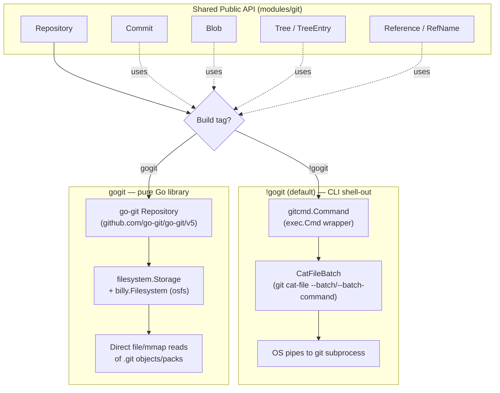
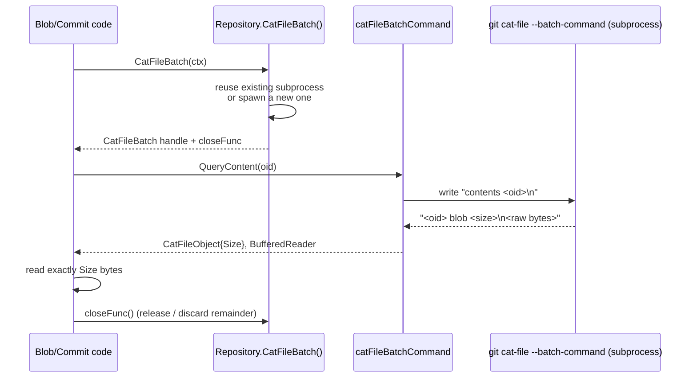

# Git Module

Gitea's Git integration lives in `modules/git/` and its sub-package `modules/git/gitcmd/`. This is arguably the most performance-critical part of the codebase, since almost every page render, API call, and push operation reads or writes Git objects. To meet very different deployment needs, Gitea ships **two interchangeable backend implementations** that are selected at *compile time* using Go build tags, plus a shared shell-command layer (`gitcmd`) used by both.

> The module's own `README.md` notes it started life as an external project (`github.com/go-gitea/git`) and was merged into the main repository "for easier pull request[s]" — it is designed to be usable as a semi-standalone Git access layer.

## Two Backends, One Interface

| Backend | Build tag | Underlying implementation | Const |
|---|---|---|---|
| **nogogit** (default) | `!gogit` | Shells out to the real `git` binary via `gitcmd.Command`, streaming data through the `git cat-file --batch(-command)` protocol | `isGogit = false` (`repo_base_nogogit.go`) |
| **gogit** | `gogit` | Pure-Go [go-git](https://github.com/go-git/go-git) library operating directly on packfiles/loose objects through a `billy.Filesystem` | `isGogit = true` (`repo_base_gogit.go`) |

Both backends expose **the exact same Go API** (`Repository`, `Commit`, `Blob`, `Tree`, `TreeEntry`, `Reference`, etc.), so the rest of Gitea (`models/`, `services/`, `routers/`) never needs to know which backend is active — it just calls methods like `repo.GetCommit(sha)` or `blob.DataAsync()`.

This dual-backend design is implemented file-by-file: any source file whose Git behavior differs between backends is split into a `_gogit.go` and `_nogogit.go` variant guarded by the matching build tag, e.g.:

```
repo_base_gogit.go       //go:build gogit
repo_base_nogogit.go     //go:build !gogit

blob_gogit.go            //go:build gogit
blob_nogogit.go          //go:build !gogit

commit_info_gogit.go     //go:build gogit
commit_info_nogogit.go   //go:build !gogit

repo_branch_gogit.go      repo_branch_nogogit.go
repo_commit_gogit.go      repo_commit_nogogit.go
repo_ref_gogit.go          repo_ref_nogogit.go
repo_tag_gogit.go          repo_tag_nogogit.go
repo_tree_gogit.go         repo_tree_nogogit.go
tree_entry_gogit.go        tree_entry_nogogit.go
notes_gogit.go              notes_nogogit.go
last_commit_cache_gogit.go  last_commit_cache_nogogit.go
signature_gogit.go          signature_nogogit.go
object_id_gogit.go           (nogogit uses shared object_id.go)
```

Files without a suffix (`commit.go`, `blob.go`, `tree_entry.go`, `ref.go`, `diff.go`, `grep.go`, `git.go`, `hook.go`, …) contain logic that is identical for both backends and simply call into the backend-specific pieces.

Gitea builds the `nogogit` variant by default; the `gogit` variant is opt-in via `go build -tags gogit`. It exists primarily for platforms where shelling out to `git` is undesirable or unavailable, but it doesn't support every feature (see [Feature Differences](#feature-differences) below).



### `nogogit`: shelling out via `gitcmd`

The `gitcmd` sub-package (`modules/git/gitcmd/command.go`) wraps `os/exec.Cmd` in a `Command` builder with careful argument-safety rules (`AddArguments` only accepts trusted `internal.CmdArg` values; user input must go through `AddDynamicArguments`, which prevents argument-injection / RCE risks). It supports:

- Working directory, environment, timeouts, and context cancellation
- Piping stdin/stdout for streaming protocols (`MakeStdinStdoutPipe`, `MakeStdoutPipe`)
- Structured stderr capture and `LogString()` for safe debug logging (credentials are stripped via `SanitizeCredentialURLs`)

```go
// modules/git/gitcmd/command.go
func NewCommand(args ...internal.CmdArg) *Command {
    cargs := make([]string, 0, len(args))
    for _, arg := range args {
        cargs = append(cargs, string(arg))
    }
    return &Command{prog: GitExecutable, args: cargs}
}
```

`Repository` in this mode (`repo_base_nogogit.go`) has no in-memory object graph at all — it only stores the repo `Path` plus a lazily created `catFileBatchCloser`, which is the shared long-lived subprocess used for object lookups (see [catfile-batch protocol](#the-catfile-batch-protocol) below):

```go
// modules/git/repo_base_nogogit.go
type Repository struct {
    Path string
    tagCache *ObjectCache[*Tag]
    mu                 sync.Mutex
    catFileBatchCloser CatFileBatchCloser
    catFileBatchInUse  bool
    Ctx             context.Context
    LastCommitCache *LastCommitCache
    objectFormat ObjectFormat
}
```

### `gogit`: pure-Go object access

In the `gogit` build, `OpenRepository` (`repo_base_gogit.go`) opens the on-disk `.git` directory through `go-billy`'s `osfs` filesystem abstraction and constructs a go-git `filesystem.Storage` with an LRU object cache and `KeepDescriptors: true` (packfiles stay memory-mapped/open for the life of the `Repository`):

```go
// modules/git/repo_base_gogit.go
storage := filesystem.NewStorageWithOptions(fs, cache.NewObjectLRUDefault(),
    filesystem.Options{KeepDescriptors: true, LargeObjectThreshold: setting.Git.LargeObjectThreshold, AlternatesFS: altFs})
gogitRepo, err := gogit.Open(storage, fs)
```

`Repository.Close()` in this mode closes the `filesystem.Storage` (and thus any open file descriptors) — this is important because `KeepDescriptors: true` means every opened repository can pin open file handles.

### Feature differences

Because SHA-256 repository support, `git cat-file --batch-command`, and other newer Git features are implemented by shelling out to the real `git` CLI, they are unavailable (or behave differently) under `gogit`:

```go
// modules/git/git.go
features.SupportHashSha256 = features.CheckVersionAtLeast("2.42") && !isGogit
```

Tests explicitly branch on `isGogit` to skip assertions the `gogit` backend can't satisfy, e.g. `repo_branch_test.go`:

```go
supportShortHash := !isGogit
supportBlobHash := !isGogit
```

## Key Abstractions

| Type | File | Description |
|---|---|---|
| `Repository` | `repo_base_{gogit,nogogit}.go` | Handle to an on-disk Git repository; entry point for almost everything |
| `Commit` | `commit.go` | Embeds `Tree` and `CommitMessage`; holds `ID`, `Author`, `Committer`, `Signature`, `Parents` |
| `Blob` | `blob.go` + `blob_{gogit,nogogit}.go` | A file's raw content; `DataAsync()` returns a streaming `io.ReadCloser`, `Size()` returns byte length |
| `Tree` / `TreeEntry` | `tree_entry.go` + variants | Directory listing; `TreeEntry` wraps `ObjectID`, `EntryMode` (blob/tree/commit/symlink/exec), name, and size |
| `Reference` / `RefName` | `ref.go` | A named pointer (`refs/heads/...`, `refs/tags/...`, `refs/pull/...`) to an `ObjectID` |
| `ObjectID` | `object_id.go` (+ `object_id_gogit.go`) | Interface abstracting SHA-1 (`Sha1Hash`) vs SHA-256 (`Sha256Hash`) object identifiers |
| `Features` | `git.go` | Parsed `git version` info plus capability flags (`SupportProcReceive`, `SupportCatFileBatchCommand`, …) computed once at startup |

### `Repository`

The `Repository` struct's *shape* differs completely between backends (see above), but its exported surface (defined across `repo.go`, `repo_commit.go`, `repo_branch.go`, `repo_tree.go`, `repo_ref.go`, `repo_object.go`, `repo_index.go`, `repo_compare.go`, `repo_commitgraph.go`) is identical, e.g. `GetCommit`, `GetBranches`, `GetTag`, `GetBlob`, `IsObjectExist`.

### `Commit`

```go
// modules/git/commit.go
type Commit struct {
    Tree // FIXME: bad design, this field can be nil if the commit is from "last commit cache"
    CommitMessage
    ID        ObjectID
    Author    *Signature // never nil
    Committer *Signature // never nil
    Signature *CommitSignature
    Parents        []ObjectID
    submoduleCache *ObjectCache[*SubModule]
}
```

Commit exposes convenience methods such as `Parent(n)`, `CommitsByRange`, `GetCommitByPath` (backed by `LastCommitCache` when available — see below), `HasPreviousCommit` (shells `git merge-base --is-ancestor`), and `IsForcePush`.

### `Blob`

`Blob` shows the clearest contrast between backends. Under `gogit` it simply asks go-git's object store for an `EncodedObject` and returns its `Reader()`:

```go
// modules/git/blob_gogit.go
func (b *Blob) DataAsync() (io.ReadCloser, error) {
    obj, err := b.gogitEncodedObj()
    if err != nil { return nil, err }
    return obj.Reader()
}
```

Under `nogogit`, it borrows a `CatFileBatch` from the repo's shared subprocess pool, issues a `contents <oid>` request, and wraps the response in a `blobReader` that enforces the exact byte-length reported by `cat-file` and discards any unread trailing bytes on `Close()`:

```go
// modules/git/blob_nogogit.go
func (b *Blob) DataAsync() (_ io.ReadCloser, retErr error) {
    batch, cancel, err := b.repo.CatFileBatch(b.repo.Ctx)
    ...
    info, contentReader, err := batch.QueryContent(b.ID.String())
    ...
    return &blobReader{rd: contentReader, n: info.Size, cancel: cancel}, nil
}
```

### `TreeEntry`

`TreeEntry` (`tree_entry.go`) is backend-agnostic and models a single row of a `git ls-tree`-style listing: `ID`, `name`, parent `*Tree`, `entryMode` (see `tree_entry_mode.go` for `EntryModeCommit`/`Tree`/`Blob`/`Exec`/`Symlink`), and lazily-fetched `size`. It also implements symlink resolution (`EntryFollowLink`/`EntryFollowLinks`, capped at 10 hops to avoid symlink loops) and submodule detection (`IsSubModule`).

### `Reference` / `RefName`

`ref.go` defines both the runtime `Reference` type (name + resolved `ObjectID` + type) and the pure string type `RefName`, with helpers like `IsBranch()`, `IsTag()`, `IsPull()`, `ShortName()`, and a strict `refNamePatternInvalid` regex used by `IsValidRefPattern`/`SanitizeRefPattern` to reject dangerous ref names (control characters, `..`, `.lock`, `@{`, etc.) before they ever reach the `git` CLI.

## The catfile-batch Protocol

The single biggest performance lever in the `nogogit` backend is **not spawning a new `git` process per object lookup**. Instead, Gitea keeps one long-running `git cat-file --batch...` subprocess per repository handle and pipes object names to it over stdin, reading structured responses back over stdout. This is defined by the `CatFileBatch` interface in `catfile_batch.go`:

```go
// modules/git/catfile_batch.go
type CatFileBatch interface {
    QueryInfo(obj string) (*CatFileObject, error)
    QueryContent(obj string) (*CatFileObject, BufferedReader, error)
}

type CatFileBatchCloser interface {
    CatFileBatch
    Close()
}

func NewBatch(ctx context.Context, repoPath string) (CatFileBatchCloser, error) {
    if DefaultFeatures().SupportCatFileBatchCommand {
        return newCatFileBatchCommand(ctx, repoPath)
    }
    return newCatFileBatchLegacy(ctx, repoPath)
}
```

There are **two concrete implementations**, chosen automatically based on the installed Git version:

1. **`catFileBatchCommand`** (`catfile_batch_command.go`) — for Git ≥ 2.36, uses a single `git cat-file --batch-command` process that accepts textual commands (`info <obj>`, `contents <obj>`) interleaved on one stdin/stdout pair. This is the more efficient option because both info and content queries share one subprocess.
2. **`catFileBatchLegacy`** (`catfile_batch_legacy.go`) — for older Git, spins up *two* subprocesses: `git cat-file --batch` (for content) and `git cat-file --batch-check` (for metadata-only queries), mirroring what `--batch-command` unifies.

Both are built on a shared `catFileBatchCommunicator` (`catfile_batch_reader.go`) that owns the subprocess's stdin `io.Writer` and a `bufio.Reader`-wrapped stdout, started via `cmdCatFile.StartWithStderr(ctx)` and torn down through a `context.CancelCauseFunc`. Responses are parsed with `catFileBatchParseInfoLine`, which expects the standard `<oid> SP <type> SP <size> LF` cat-file header line, leaving the object payload immediately following in the stream for the caller to read/discard.



Because the batch subprocess is stateful and single-threaded, `Repository.CatFileBatch()` (`repo_base_nogogit.go`) enforces **one borrower at a time**: if the shared batch is already in use, it transparently spins up a *temporary* extra subprocess rather than blocking or corrupting the shared stream:

```go
// modules/git/repo_base_nogogit.go
func (repo *Repository) CatFileBatch(ctx context.Context) (_ CatFileBatch, closeFunc func(), err error) {
    repo.mu.Lock()
    defer repo.mu.Unlock()
    if repo.catFileBatchCloser == nil {
        repo.catFileBatchCloser, err = NewBatch(ctx, repo.Path)
        ...
    }
    if !repo.catFileBatchInUse {
        repo.catFileBatchInUse = true
        return CatFileBatch(repo.catFileBatchCloser), func() { ... repo.catFileBatchInUse = false }, nil
    }
    // already borrowed: open a short-lived temporary batch instead
    tempBatch, err := NewBatch(ctx, repo.Path)
    ...
    return tempBatch, tempBatch.Close, nil
}
```

This design amortizes the (relatively expensive) cost of `fork`/`exec`-ing `git` across many object lookups within a single request — critical when rendering a repo tree view or diff that touches hundreds of blobs.

> **Note:** The `BufferedReader` returned by `QueryContent` is explicitly documented as "fragile" — callers must fully read or discard the exact advertised byte count before issuing the next command on the same pipe, otherwise subsequent reads on the shared stream will desync. See the `blobReader.Close()` implementation in `blob_nogogit.go`, which calls `DiscardFull` to flush unread bytes.

The same infrastructure is reused for LFS pointer scanning (`modules/lfs/pointer_scanner_nogogit.go`) and last-commit caching (`last_commit_cache_nogogit.go`), and for the low-level pipeline helpers in `modules/git/pipeline/` (`CatFileBatch`, `CatFileBatchCheckAllObjects`, `BlobsLessThan1024FromCatFileBatchCheck`) used when scanning an entire repository for LFS pointers.

## Diff Implementation

`diff.go` builds raw unified diffs and patches by shelling directly to `git diff` / `git show` / `git format-patch`:

```go
// modules/git/diff.go
func getRepoRawDiffForFileCmd(_ context.Context, repo *Repository, startCommit, endCommit string, diffType RawDiffType, file string) (*gitcmd.Command, error) {
    ...
    switch diffType {
    case RawDiffNormal:
        cmd.AddArguments("diff").
            AddOptionFormat("--find-renames=%s", setting.Git.DiffRenameSimilarityThreshold).
            AddDynamicArguments(startCommit, endCommit).AddDashesAndList(files...)
    case RawDiffPatch:
        cmd.AddArguments("format-patch", "--no-signature", "--stdout", "--root").
            AddDynamicArguments(query).AddDashesAndList(files...)
    }
    return cmd, nil
}
```

- `GetRawDiff` streams the diff/patch straight to an `io.Writer` (e.g. an HTTP response for `.diff`/`.patch` URLs).
- `GetFileDiffCutAroundLine` streams the diff through a pipeline function (`CutDiffAroundLine`) that extracts only the hunk context around a specific line — used for inline code-review comment context.
- `ParseDiffHunkString` and the `hunkRegex` (`^@@ -(?P<beginOld>...) \+(?P<beginNew>...) @@`) parse `@@ -l,s +l,s @@` hunk headers back into line numbers, used to map diff positions to file line numbers for review comments.

Note that this file is one of the few in `modules/git` **without** a `gogit`/`nogogit` split — diffing is always delegated to the real `git` binary (via `gitcmd`) regardless of which backend is compiled in, because go-git's diff support does not cover everything Gitea needs (rename detection thresholds, patch format, etc.).

## Grep Implementation

`grep.go` implements full-text code search (`GrepSearch`) by wrapping `git grep` with machine-parseable output flags:

```go
// modules/git/grep.go
cmd := gitcmd.NewCommand("grep", "--null", "--break", "--heading", "--line-number", "--full-name")
cmd.AddOptionValues("--context", strconv.Itoa(opts.ContextLineNumber))
switch opts.GrepMode {
case GrepModeExact:
    cmd.AddArguments("--fixed-strings")
case GrepModeRegexp:
    cmd.AddArguments("--perl-regexp")
default: // words
    cmd.AddArguments("--fixed-strings", "--ignore-case")
}
```

It streams stdout through a `bufio.Reader`, parsing the NUL-delimited (`--null`), block-separated (`--break --heading`) output into `[]*GrepResult{Filename, LineNumbers, LineCodes}`. Search is capped by `MaxResultLimit` (default 50) and a 30-second `grepSearchTimeout`; when the limit is hit, the pipeline function calls `ctx.CancelPipeline(nil)` to kill the `git grep` subprocess early rather than waiting for it to exhaust all repository content. Both `git grep` exit code `1` (no matches) and cancellation are treated as non-error, empty-result conditions.

Like diffing, grep always shells to the real `git` binary — there is no gogit-native grep implementation.

## Initialization & Version Features

`InitSimple()`/`InitFull()` (`git.go`) run once at process startup (see `routers/init.go` or `cmd/` entry points) to:

1. Resolve and validate the `git` executable path (`gitcmd.SetExecutablePath`)
2. Run `git version` and parse it into a `*version.Version` (`parseGitVersionLine`)
3. Compute a `Features` struct with capability flags gated on version thresholds (`SupportProcReceive` ≥ 2.29, `SupportCatFileBatchCommand` ≥ 2.36, `SupportCheckAttrOnBare` ≥ 2.40, `SupportGitMergeTree` ≥ 2.40, `SupportHashSha256` ≥ 2.42 *and* not gogit)
4. Enforce `RequiredVersion = "2.13.0"` and reject known-bad versions (e.g. `2.43.1`, which has a `GIT_FLUSH` regression)
5. Set a stable `GNUPGHOME` for commit-signature verification via `gpg.go`

`DefaultFeatures()` is the process-wide accessor for this struct and is what the rest of `modules/git` (and the LFS SSH transfer code, and hooks) checks before using version-gated behavior.

## Related Pages

- [LFS & Git Hooks](lfs-and-hooks.md) — how the git module's `hook.go` and the SSH-based `git-lfs-transfer` build on this foundation
- [Core Modules Overview](README.md)
- [Git Backends & Cat-File Batch Processes](../10-git-integration/git-backends-and-catfile.md) — a section-level summary of the dual-backend design and the catfile-batch protocol, framed alongside the rest of Gitea's Git-integration architecture
- [GitRepo & Repository Access](../10-git-integration/gitrepo-and-repository-access.md) — the path-resolution/handle-caching layer (`modules/gitrepo`) that sits between database models and this module's `Repository` type
- [Git Operations & Server-Side Hooks](../10-git-integration/git-operations-and-hooks.md) — an end-to-end trace of a `git push` over SSH through `modules/ssh`, `cmd/serv.go`, and the hook pipeline built on top of this module
