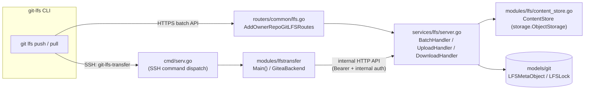
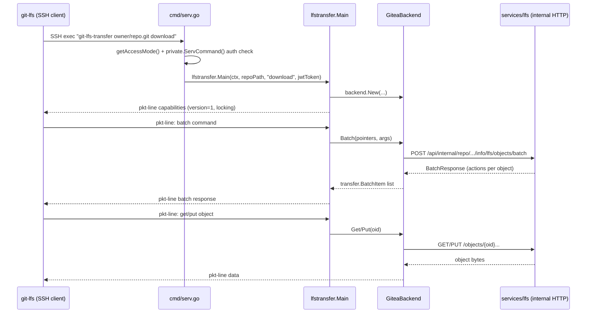

# Git LFS & Server-Side Hooks

Large binary files don't diff well and bloat the Git object database, so Gitea implements the [Git LFS](https://git-lfs.github.com) protocol to store them out-of-band, and it implements Git's server-side hook mechanism to intercept and validate every push before it is accepted. Both features rely on the [Git Module](git-module.md) covered previously.

## Git LFS Architecture

Gitea's LFS support spans three layers:

| Layer | Package | Responsibility |
|---|---|---|
| **Core LFS primitives** | `modules/lfs/` | Pointer file parsing/generation, content-addressable storage, HTTP client for mirroring/pulling from upstream LFS servers |
| **HTTP LFS server** | `services/lfs/` | Implements the [Git LFS HTTP Batch API](https://github.com/git-lfs/git-lfs/blob/main/docs/api/batch.md) — batch, upload, download, verify, and file locking endpoints |
| **SSH LFS transfer** | `modules/lfstransfer/` | Implements the `git-lfs-transfer` pure-SSH protocol, letting `git-lfs` push/pull over SSH without any HTTP round-trip |



### Pointer Files

Git LFS works by committing small **pointer files** into the Git tree in place of the real content; the actual bytes live in a separate content-addressable store. `modules/lfs/pointer.go` implements the spec:

```go
// modules/lfs/pointer.go
const (
    MetaFileMaxSize    = 1024 // spec: pointer file must be < 1024 bytes
    MetaFileIdentifier = "version https://git-lfs.github.com/spec/v1"
    MetaFileOidPrefix  = "oid sha256:"
)

func (p Pointer) StringContent() string {
    return fmt.Sprintf("%s\n%s%s\nsize %d\n", MetaFileIdentifier, MetaFileOidPrefix, p.Oid, p.Size)
}
```

A pointer file therefore looks like:

```
version https://git-lfs.github.com/spec/v1
oid sha256:e3b0c44298fc1c149afbf4c8996fb92427ae41e4649b934ca495991b7852b855
size 1234
```

`Pointer.RelativePath()` maps the 64-character SHA-256 `Oid` to a sharded storage path (`<oid[0:2]>/<oid[2:4]>/<remaining oid>`), matching how content is actually laid out on disk/object storage:

```go
func (p Pointer) RelativePath() string {
    if len(p.Oid) < 5 { return p.Oid }
    return path.Join(p.Oid[0:2], p.Oid[2:4], p.Oid[4:])
}
```

`GeneratePointer` computes a `Pointer` from arbitrary content by SHA-256 hashing it while counting bytes — used both when scanning existing repositories and when the LFS server ingests a new upload.

### Scanning a Repository for LFS Objects

`modules/lfs/pointer_scanner_{gogit,nogogit}.go` walk an entire repository looking for blobs that are valid LFS pointer files (e.g. during a migration or `LFS_START_SERVER` first-time reconciliation). The `nogogit` implementation is a nice illustration of composing the catfile-batch pipeline described in [Git Module](git-module.md#the-catfile-batch-protocol) into a **4-stage streaming pipeline** of separate `git` subprocesses connected by OS pipes:

```go
// modules/lfs/pointer_scanner_nogogit.go
// 1. Run batch-check on all objects in the repository
wg.Go(func() error { return pipeline.CatFileBatchCheckAllObjects(ctx, cmd1AllObjs, repo.Path) })
// 2. From the provided objects restrict to blobs <=1k (pointer files are always tiny)
wg.Go(func() error { return pipeline.BlobsLessThan1024FromCatFileBatchCheck(cmd1AllObjsStdout, cmd3BatchContentIn) })
// 3. Take the shas of the blobs and batch read them
wg.Go(func() error { return pipeline.CatFileBatch(ctx, cmd3BatchContent, repo.Path) })
// 4. Check if each file is a valid LFS pointer, emit PointerBlob on a channel
wg.Go(func() error { return createPointerResultsFromCatFileBatch(cmd3BatchContentOut, pointerChan) })
```

This avoids ever loading the full repository object graph into memory: it streams `git cat-file --batch-check --batch-all-objects` output through a size filter (≤ 1024 bytes, since that's the pointer file size limit) into a second `git cat-file --batch` process that fetches only the candidate blobs' actual content, checking each one against `ReadPointerFromBuffer`.

### Content Store

`modules/lfs/content_store.go`'s `ContentStore` wraps Gitea's generic `storage.ObjectStorage` abstraction (local disk, S3, MinIO, Azure — see [Configuration](../04-configuration/README.md)) and adds LFS-specific integrity checks:

```go
// modules/lfs/content_store.go
func (s *ContentStore) Put(pointer Pointer, r io.Reader) error {
    p := pointer.RelativePath()
    wrappedRd := newHashingReader(pointer.Size, pointer.Oid, r) // verifies size+hash while streaming
    written, err := s.Save(p, wrappedRd, pointer.Size)
    ...
    if written != pointer.Size { err = ErrSizeMismatch }
    if err != nil {
        _ = s.Delete(p) // clean up partial/corrupt upload
    }
    return err
}
```

The `hashingReader` computes a running SHA-256 as bytes flow through `io.Copy`, and returns `ErrHashMismatch`/`ErrSizeMismatch` if the actual content doesn't match the pointer's claimed `Oid`/`Size` — this is what prevents a malicious or buggy client from uploading content that doesn't match its advertised hash. `ContentStore.Verify()` re-checks stored file size against the pointer without re-hashing (a cheap sanity check), while `Exists()` is a plain existence check used by the batch API to decide whether an upload is actually necessary.

## HTTP LFS Server (`services/lfs/`)

`services/lfs/server.go` implements the [Batch API](https://github.com/git-lfs/git-lfs/blob/main/docs/api/batch.md) that `git-lfs` speaks over HTTPS. Routes are registered in `routers/common/lfs.go` and shared between the public web router and Gitea's internal API router (since SSH LFS transfer proxies through the same handlers — see below):

```go
// routers/common/lfs.go
func AddOwnerRepoGitLFSRoutes(m *web.Router, middlewares ...any) {
    m.Group("/{username}/{reponame}/info/lfs", func() {
        m.Post("/objects/batch", lfs.CheckAcceptMediaType, lfs.BatchHandler)
        m.Put("/objects/{oid}/{size}", lfs.UploadHandler)
        m.Get("/objects/{oid}/{filename}", lfs.DownloadHandler)
        m.Get("/objects/{oid}", lfs.DownloadHandler)
        m.Post("/verify", lfs.CheckAcceptMediaType, lfs.VerifyHandler)
        m.Group("/locks", func() {
            m.Get("/", lfs.GetListLockHandler)
            m.Post("/", lfs.PostLockHandler)
            m.Post("/verify", lfs.VerifyLockHandler)
            m.Post("/{lid}/unlock", lfs.UnLockHandler)
        }, lfs.CheckAcceptMediaType)
    }, ...)
}
```

| Endpoint | Handler | Purpose |
|---|---|---|
| `POST /info/lfs/objects/batch` | `BatchHandler` | Client sends a list of `{oid, size}` objects + `operation` (`upload`/`download`); server responds with per-object `actions` (signed upload/download URLs) or errors |
| `PUT /info/lfs/objects/{oid}/{size}` | `UploadHandler` | Streams object bytes into the `ContentStore`, validates against the pointer, then creates/links an `LFSMetaObject` DB row |
| `GET /info/lfs/objects/{oid}[/{filename}]` | `DownloadHandler` | Streams object bytes back, with HTTP `Range` support for resumable downloads |
| `POST /info/lfs/verify` | `VerifyHandler` | Confirms an object exists and matches the claimed size (used by clients after an out-of-band/multipart upload) |
| `GET/POST /info/lfs/locks*` | `locks.go` handlers | File locking API — prevents concurrent edits to non-mergeable binary files |

### Batch Handler Walkthrough

`BatchHandler` (`services/lfs/server.go`) is the heart of the protocol:

1. Decode the `BatchRequest` JSON body and validate `Operation` is `upload` or `download`.
2. Resolve and authorize the target repository (`getAuthenticatedRepository`), enforcing write access for uploads.
3. Enforce `setting.LFS.MaxBatchSize` (object count) and, per-object, `setting.LFS.MaxFileSize`.
4. For each requested `Pointer`, check `contentStore.Exists()` and look up any existing `LFSMetaObject` DB row (`git_model.GetLFSMetaObjectByOid`).
5. Build an `ObjectResponse` per object, including a `Link` (`actions.upload`/`actions.download`) constructed by `requestContext.UploadLink`/`DownloadLink`, which simply point back at this same repo's `/info/lfs/objects/{oid}[/{size}]` — Gitea acts as both LFS "batch server" and the actual storage backend.

A defensive nuance worth calling out (visible directly in the code) is around auto-linking: if an object's bytes already exist in the shared `ContentStore` (e.g. uploaded via a different repo) but there's no `LFSMetaObject` linking it to *this* repo yet, the handler deliberately treats it as **not existing** rather than silently granting access:

```go
// services/lfs/server.go (BatchHandler)
if exists && meta == nil {
    // Do not auto-link cross-repo objects based on token scope alone (deploy-key/single-repo tokens);
    // require the client to re-upload (hash-verified) bytes to prove possession.
    exists = false
}
```

### Authentication

LFS HTTP requests are authorized via a short-lived JWT (`Claims{RepoID, Op, UserID}`, HS256-signed with `setting.LFS.JWTSecretBytes`, expiring after `setting.LFS.HTTPAuthExpiry`, default 24h):

```go
// services/lfs/server.go
func GetLFSAuthTokenWithBearer(opts AuthTokenOptions) (string, error) {
    claims := Claims{
        RegisteredClaims: jwt.RegisteredClaims{ExpiresAt: ..., NotBefore: ...},
        RepoID: opts.RepoID, Op: opts.Op, UserID: opts.UserID,
    }
    token := jwt.NewWithClaims(jwt.SigningMethodHS256, claims)
    tokenString, err := token.SignedString(setting.LFS.JWTSecretBytes)
    return "Bearer " + tokenString, err
}
```

These tokens are minted by the SSH `git-lfs-authenticate`/`git-lfs-transfer` commands (see below) and by internal repo-migration code, then verified by `parseToken`/`handleLFSToken` in `server.go` alongside the normal HTTP Basic-Auth and personal access token paths (`authenticate`).

### Locking

`services/lfs/locks.go` implements Git LFS's [file locking API](https://github.com/git-lfs/git-lfs/blob/main/docs/api/locking.md), backed by `models/git.LFSLock`. Locking exists because binary files (images, models, etc.) can't be usefully three-way-merged, so LFS lets a user claim exclusive intent-to-edit on a path; `GetListLockHandler`, `PostLockHandler`, `VerifyLockHandler`, and `UnLockHandler` expose list/create/verify/delete operations, each authenticated and scoped to the target repository.

## SSH-Based LFS Transfer (`modules/lfstransfer/`)

Git LFS also defines a **pure-SSH transfer protocol** (`git-lfs-transfer`, from the [`charmbracelet/git-lfs-transfer`](https://github.com/charmbracelet/git-lfs-transfer) library) that avoids the HTTPS round-trip entirely — everything happens over the same SSH connection used for `git-upload-pack`/`git-receive-pack`. Gitea implements the server side of this protocol as an adapter that re-uses the *same* HTTP LFS server internally.

### Entry Point: `cmd/serv.go`

When a user connects over SSH, `cmd/serv.go`'s `runServ` parses the `SSH_ORIGINAL_COMMAND` and recognizes two LFS-related verbs (defined in `modules/git/cmdverb.go`):

```go
// modules/git/cmdverb.go
const (
    CmdVerbLfsAuthenticate = "git-lfs-authenticate"
    CmdVerbLfsTransfer     = "git-lfs-transfer"
    CmdSubVerbLfsUpload   = "upload"
    CmdSubVerbLfsDownload = "download"
)
```

- **`git-lfs-authenticate <repo> <upload|download>`** — the *classic* fallback: Gitea just mints a JWT bearer token and prints a small JSON blob (`{"header": {"Authorization": "Bearer ..."}, "href": "https://.../info/lfs"}`) that the git-lfs client then uses to speak the regular HTTPS batch API.
- **`git-lfs-transfer <repo> <upload|download>`** — the modern pure-SSH path: instead of handing back an HTTP URL, Gitea itself becomes the protocol endpoint over stdin/stdout for the rest of the SSH session.

```go
// cmd/serv.go
if verb == git.CmdVerbLfsTransfer {
    token, err := lfs.GetLFSAuthTokenWithBearer(lfs.AuthTokenOptions{Op: lfsVerb, UserID: results.UserID, RepoID: results.RepoID})
    if err != nil { return err }
    return lfstransfer.Main(ctx, repoPath, lfsVerb, token)
}

if verb == git.CmdVerbLfsAuthenticate {
    url := fmt.Sprintf("%s%s/%s.git/info/lfs", setting.AppURL, url.PathEscape(results.OwnerName), url.PathEscape(results.RepoName))
    token, err := lfs.GetLFSAuthTokenWithBearer(lfs.AuthTokenOptions{Op: lfsVerb, UserID: results.UserID, RepoID: results.RepoID})
    ...
    // writes {"header": {"Authorization": token}, "href": url} to stdout
}
```

Access control for both verbs is enforced *before* either code path runs, via `getAccessMode` in `cmd/serv.go`, which maps `upload` → `AccessModeWrite` and `download` → `AccessModeRead`, and via server settings: `setting.LFS.StartServer` must be enabled for any LFS-over-SSH, and `setting.LFS.AllowPureSSH` must additionally be enabled for the `git-lfs-transfer` (non-authenticate) path.

### Protocol Adapter: `modules/lfstransfer/`

`lfstransfer.Main` (`modules/lfstransfer/main.go`) wires up the third-party `transfer.Processor` state machine against stdin/stdout using the pkt-line framing Git protocols use, advertises capabilities, and dispatches to upload or download processing:

```go
// modules/lfstransfer/main.go
func Main(ctx context.Context, repo, verb, token string) error {
    logger := newLogger()
    pktline := transfer.NewPktline(os.Stdin, os.Stdout, logger)
    giteaBackend, err := backend.New(ctx, repo, verb, token, logger)
    ...
    for _, cap := range backend.Capabilities { pktline.WritePacketText(cap) } // "version=1", "locking"
    pktline.WriteFlush()
    p := transfer.NewProcessor(pktline, giteaBackend, logger)
    switch verb {
    case "upload":   return p.ProcessCommands(transfer.UploadOperation)
    case "download": return p.ProcessCommands(transfer.DownloadOperation)
    }
}
```

`modules/lfstransfer/backend/backend.go`'s `GiteaBackend` implements the library's `transfer.Backend` interface by translating each SSH-protocol command into an **internal HTTP call to Gitea's own LFS server** (`services/lfs`), authenticated with both the per-request LFS JWT and Gitea's `InternalToken`:

```go
// modules/lfstransfer/backend/backend.go
func New(ctx context.Context, repo, op, token string, logger transfer.Logger) (transfer.Backend, error) {
    server, err := url.Parse(setting.LocalURL)
    server = server.JoinPath("api/internal/repo", repo, "info/lfs")
    return &GiteaBackend{ctx: ctx, server: server, op: op, authToken: token,
        internalAuth: "Bearer " + setting.InternalToken, logger: logger}, nil
}

func (g *GiteaBackend) Batch(_ string, pointers []transfer.BatchItem, args transfer.Args) ([]transfer.BatchItem, error) {
    reqBody := lfs.BatchRequest{Operation: g.op, Objects: ...}
    req := newInternalRequestLFS(g.ctx, g.server.JoinPath("objects/batch").String(), http.MethodPost, headers, bodyBytes)
    resp, err := req.Response()
    ...
}
```

In other words: **SSH LFS transfer is a protocol translation layer, not a separate storage/authorization implementation** — every `Batch`/`Upload`/`Download` call funnels through the exact same `BatchHandler`/`UploadHandler`/`DownloadHandler` code discussed above, just reached via an internal loopback HTTP request instead of a public one. `modules/lfstransfer/backend/lock.go` similarly implements `transfer.LockBackend` by calling the `/locks` internal endpoints.



## Server-Side Git Hooks

Git invokes shell-executable "hook" scripts at specific points in the push lifecycle. Gitea uses `pre-receive`, `update`, `post-receive`, and (for AGit flow) `proc-receive` to enforce branch protection, run CI, run push validations, and update its own database in response to pushes.

### Hook Registration: `modules/gitrepo/hooks.go`

Every repository managed by Gitea gets its hooks installed by `CreateDelegateHooks`, which is called whenever a repository is created, migrated, forked, or has its hooks re-synced. Rather than writing a single hook script per repo, Gitea uses a **delegation pattern**: the actual `.git/hooks/<name>` script is a small shell wrapper that iterates and executes every script inside a companion `<name>.d/` directory:

```go
// modules/gitrepo/hooks.go — pre-receive/post-receive template
data=$(cat)
exitcodes=""
hookname=$(basename $0)
GIT_DIR=${GIT_DIR:-$(dirname $0)/..}
for hook in ${GIT_DIR}/hooks/${hookname}.d/*; do
  test -x "${hook}" && test -f "${hook}" || continue
  echo "${data}" | "${hook}"
  exitcodes="${exitcodes} $?"
done
for i in ${exitcodes}; do
  [ ${i} -eq 0 ] || exit ${i}
done
```

Inside `<name>.d/`, Gitea writes its own script named `gitea`, which simply re-invokes the Gitea binary's `hook` subcommand:

```go
// modules/gitrepo/hooks.go — gitea's own hook script
%s hook --config=%s pre-receive
```

This delegation design means **administrators can drop their own custom hook scripts** into `<repo>/hooks/<name>.d/` alongside Gitea's `gitea` script without needing to touch or replace Gitea's own hook logic — all scripts in the directory run in sequence, and any non-zero exit code aborts the push.

`CheckDelegateHooks` (used by `gitea doctor`/admin panel repository health checks) verifies both the dispatcher script and the `gitea` delegate script are present, up to date, and executable, flagging drift for repair.

The lower-level `modules/git/hook.go` provides the generic `Hook` type (`Name`, `IsActive`, `Content`, `Sample`) used for **editable per-repository custom hooks** in the web UI (repository Settings → Hooks, admin-only or owner-only depending on config) — `GetHook`/`ListHooks`/`Hook.Update()` read/write the `<name>.d/<name>` file directly.

### Hook Dispatch: `cmd/hook.go`

The `gitea hook <name>` CLI subcommand (registered in `newHookCommand`) is what the delegated `gitea` script above actually invokes. It exists as four subcommands mapping 1:1 to Git's hook points:

| Subcommand | Git hook | When it runs | What it does |
|---|---|---|---|
| `hook pre-receive` | `pre-receive` | Before any refs are updated | Reads `oldCommitID newCommitID refFullName` lines from stdin, batches them (`hookBatchSize = 500`), and calls the internal API `private.HookPreReceive` to authorize each ref update |
| `hook update` | `update` | Once per ref, right after `pre-receive` | Kept mostly for backward compatibility; only rejects `refs/pull/*` updates |
| `hook post-receive` | `post-receive` | After refs are updated | Runs `git update-server-info`, then calls `private.HookPostReceive` to sync branches to Gitea's DB, trigger webhooks/Actions, and print any "create a pull request" hints |
| `hook proc-receive` | `proc-receive` (git ≥ 2.29) | Replaces `update`+`post-receive` for AGit-flow pushes (`refs/for/...`) | Speaks Git's raw pkt-line protocol directly to negotiate and process AGit pull-request-via-push refs |

All four subcommands short-circuit immediately if `repo_module.EnvIsInternal` is set (meaning the git command was invoked by Gitea itself, e.g. during a merge or migration, not by an external push) and, unless `setting.OnlyAllowPushIfGiteaEnvironmentSet` is `false`, they refuse to run at all if the `SSH_ORIGINAL_COMMAND`/Gitea environment variables are missing — this prevents someone from bypassing Gitea's permission checks by pushing directly to the bare repository on disk (e.g. via a shared filesystem) without going through `gitea serv`.

```go
// cmd/hook.go — runHookPreReceive (abridged)
hookOptions := private.HookOptions{
    UserID: userID,
    GitPushOptions: pushOptions(),
    PullRequestID: prID,
    DeployKeyID: deployKeyID,
    ActionsTaskID: actionsTaskID,
    IsWiki: isWiki,
}
scanner := bufio.NewScanner(os.Stdin)
for scanner.Scan() {
    oldCommitID, newCommitID, refFullName, ok := parseGitHookCommitRefLine(scanner.Text())
    ...
    // batches up to hookBatchSize refs, then:
    extra := private.HookPreReceive(ctx, username, reponame, hookOptions)
    if extra.HasError() { return fail(ctx, extra.UserMsg, "HookPreReceive(batch) failed: %v", extra.Error) }
}
```

`fail()` is important here: writing to `os.Stderr` with an `error:` prefix causes Git to relay the message straight back to the pushing client's terminal (`remote: error: ...`), which is how branch-protection rejections and similar validation failures are surfaced to end users during `git push`.

### Push Validation Logic: `routers/private/hook_pre_receive.go`

The CLI's `hook pre-receive` command is just a thin stdin-batching client; the actual authorization/validation logic lives behind Gitea's **internal private API** in `routers/private/hook_pre_receive.go`, invoked over loopback HTTP (see `modules/private`). `HookPreReceive` iterates every ref being pushed and dispatches by ref type:

```go
// routers/private/hook_pre_receive.go
for i := range opts.OldCommitIDs {
    refFullName := opts.RefFullNames[i]
    switch {
    case refFullName.IsBranch():
        preReceiveBranch(ourCtx, oldCommitID, newCommitID, refFullName)
    case refFullName.IsTag():
        preReceiveTag(ourCtx, refFullName)
    case git.DefaultFeatures().SupportProcReceive && refFullName.IsFor():
        preReceiveFor(ourCtx, refFullName) // AGit refs/for/<branch>
    default:
        ourCtx.assertCanWriteRef(refFullName)
    }
    if ctx.Written() { return } // stop at first rejection
}
```

`preReceiveBranch` is the most elaborate check: it confirms the pusher can write to the ref (`assertCanWriteRef`, which also allows PR-maintainer-write-to-fork-branch semantics via `issues_model.CanMaintainerWriteToBranch`), refuses deletion of the repository's default branch, loads any matching `ProtectedBranch` rule (`git_model.GetFirstMatchProtectedBranchRule`), and — if the branch is protected — enforces (among other rules visible in the file) that the branch cannot be deleted and that force-pushes are rejected unless explicitly allowed by the protection rule.

### Post-Receive Side Effects

`routers/private/hook_post_receive.go`'s `HookPostReceive` runs *after* Git has already accepted the push (so it cannot reject it), and is responsible for keeping Gitea's own state consistent with the new repository content:

- `hookPostReceiveCollectPushUpdates` filters pushed refs down to branches/tags only (ignoring `refs/notes`, `refs/changes`, etc., to avoid unbounded work).
- `hookPostReceiveSyncDatabaseBranches` marks deleted branches as deleted in the DB (`git_model.MarkBranchAsDeleted`), refreshes pull-request head references (`pull_service.UpdatePullsRefs`), and re-syncs branch/commit metadata into Gitea's `branch` table (`repo_service.SyncBranchesToDB`) by opening the repo via `gitrepo.RepositoryFromRequestContextOrOpen` and reading commits back out through the very same `Repository`/`Commit` abstractions from [Git Module](git-module.md#key-abstractions).
- Beyond what's shown above, post-receive is also where webhook delivery, push-based CI/Actions triggering, and "create a pull request" hints (printed back to the pusher's terminal via `hookPrintResult`) are kicked off.

### AGit / `proc-receive`

For repositories with `git.DefaultFeatures().SupportProcReceive` (Git ≥ 2.29), `cmd/hook.go`'s `runHookProcReceive` speaks Git's raw **pkt-line protocol** directly over stdin/stdout (implemented locally in `cmd/hook.go` via `readPktLine`/`writeDataPktLine`/`writeFlushPktLine`, rather than reusing the `gitcmd` package) to negotiate protocol version/capabilities and process `refs/for/<branch>` pushes — this is what powers ["AGit Flow"](https://about.gitea.com/) (creating/updating a pull request purely by pushing to a magic ref, without a separate PR-creation API call). When `proc-receive` is active, **all** ref updates are deferred to it and checked with `preReceiveFor` in the private API rather than the branch/tag-specific paths.

## Related Pages

- [Git Module](git-module.md) — the dual gogit/nogogit backend and catfile-batch protocol that both LFS scanning and hook post-processing build on
- [Core Modules Overview](README.md)
- [Configuration](../04-configuration/README.md) — `[server]` LFS settings (`LFS_START_SERVER`, `LFS_ALLOW_PURE_SSH`, `LFS_JWT_SECRET`, `LFS_MAX_FILE_SIZE`, etc.) and `[lfs]` storage backend settings
- [Git Operations & Server-Side Hooks](../10-git-integration/git-operations-and-hooks.md) — a full end-to-end sequence diagram of a `git push` over SSH (client → `modules/ssh` → `cmd/serv.go` → internal API → `git-receive-pack` → hooks), building on the hook-registration and dispatch mechanics described above
- [GitRepo & Repository Access](../10-git-integration/gitrepo-and-repository-access.md) — the `modules/gitrepo` abstraction referenced above as `CreateDelegateHooks`'/`CheckDelegateHooks`' home package
