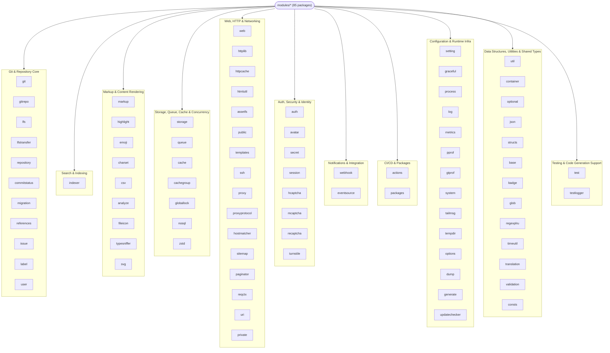

# Modules Catalog (Full)

Gitea's `modules/` directory contains **85 top-level packages** (plus their sub-packages)
that provide shared, dependency-light building blocks used throughout `models/`,
`services/`, and `routers/`. Unlike `services/`, code in `modules/` generally does **not**
depend on the database layer directly (a few exceptions accept `*xorm.Engine`/DB handles as
parameters rather than importing `models/` — e.g. `modules/queue`, `modules/cache` are pure
infrastructure, while packages like `modules/repository`, `modules/issue`, `modules/user` sit
one level up and *are* allowed limited `models/` imports for cross-cutting helpers).

This page complements the four topic-specific deep-dive pages already in this section —
[Git Module](git-module.md), [Search & Indexing](indexers.md),
[Git LFS & Server-Side Hooks](lfs-and-hooks.md), and
[Markup Rendering Engines](markup-engines.md) — plus the infra-focused pages
[Storage, Queue & Caching](storage-queue-cache.md) and
[Notifications, Mailer & Webhooks](notify-mailer-webhook.md), by giving a single,
scannable inventory of **every** package under `modules/*`, grouped by responsibility.

## Grouping Legend

| Group | Description |
|---|---|
| **Git & Repository Core** | Git object access, LFS, repository/gitrepo helpers, hooks, code intelligence |
| **Search & Indexing** | Full-text/code/issue search backends and shared indexing plumbing |
| **Markup & Content Rendering** | Markup renderers, syntax highlighting, emoji, charset/encoding, file icons, CSV |
| **Storage, Queue, Cache & Concurrency** | Object storage backends, async job queues, caching, distributed locks, NoSQL clients |
| **Web, HTTP & Networking** | HTTP client/server helpers, proxying, SSH, URL/host matching, sitemaps, web routing primitives |
| **Auth, Security & Identity** | Authentication backends, secrets, captcha providers, password/2FA, avatars |
| **Notifications & Integration** | Webhooks, mailer-adjacent event types, SSE, third-party CI status |
| **CI/CD & Packages** | Actions/workflow parsing, package registry metadata |
| **Configuration & Runtime Infra** | Settings loader, graceful shutdown/restart, process management, logging, profiling, metrics |
| **Data Structures, Utilities & Shared Types** | Generic containers, string/time/validation helpers, public API structs, translation |
| **Testing & Code Generation Support** | Test helpers, fixture/test loggers, codegen tooling |

## Full Catalog Table

| # | Package (`modules/…`) | Group | Responsibility |
|---|---|---|---|
| 1 | `actions` | CI/CD & Packages | Shared Actions/CI helpers: artifact naming, workflow YAML parsing, job/commit-status mapping, GitHub Actions-compatible types |
| 2 | `analyze` | Markup & Content Rendering | Programming-language detection (`go-enry` wrapper) and vendored-path detection used by code search/stats |
| 3 | `assetfs` | Web, HTTP & Networking | Layered asset filesystem abstraction (embedded `bindata` vs on-disk `public/`) used to serve frontend assets |
| 4 | `auth` | Auth, Security & Identity | Umbrella package + sub-packages for HTTP auth, OpenID, PAM, password hashing/complexity, WebAuthn |
| 5 | `avatar` | Auth, Security & Identity | Avatar image generation/resize and deterministic identicon fallback (`identicon` sub-package) |
| 6 | `badge` | Data Structures, Utilities & Shared Types | SVG badge generation (e.g. repo stars/build-status badges) with glyph-width tables for text layout |
| 7 | `base` | Data Structures, Utilities & Shared Types | Grab-bag of small helpers: natural (human-friendly) string sorting, misc formatting tools |
| 8 | `cache` | Storage, Queue, Cache & Concurrency | Cache abstraction over `go-chi/cache` (memory/two-queue LRU, Redis), request-scoped ephemeral cache, string cache helpers |
| 9 | `cachegroup` | Storage, Queue, Cache & Concurrency | Named cache-group constants used to namespace/invalidate related cache keys together |
| 10 | `charset` | Markup & Content Rendering | Charset/encoding detection and UTF-8 normalization, BOM handling, ambiguous/invisible Unicode character detection |
| 11 | `commitstatus` | Git & Repository Core | Shared commit-status types/state machine (pending/success/error/failure) used by Actions and external CI integrations |
| 12 | `consts` | Data Structures, Utilities & Shared Types | Small shared constants (e.g. asymmetric-key defaults) with no other natural home |
| 13 | `container` | Data Structures, Utilities & Shared Types | Generic collection helpers: `Set[T]`, slice filtering utilities |
| 14 | `csv` | Markup & Content Rendering | CSV/TSV parsing and streaming HTML table rendering for the CSV markup renderer |
| 15 | `dump` | Configuration & Runtime Infra | Implements `gitea dump` — bundles app data/config/repos/DB into a single archive for backup |
| 16 | `emoji` | Markup & Content Rendering | Emoji shortcode ↔ Unicode lookup tables and replacement logic used by markup post-processing |
| 17 | `eventsource` | Notifications & Integration | Minimal Server-Sent Events (SSE) implementation powering live notification-badge/toast updates |
| 18 | `fileicon` | Markup & Content Rendering | Maps file names/extensions to Material-icon-style SVG icons shown in repo file listings |
| 19 | `generate` | Configuration & Runtime Infra | One-shot secret/token generation helpers used by `gitea generate secret` and installer |
| 20 | `git` | Git & Repository Core | Core dual-backend (gogit/nogogit) Git object access layer — see [Git Module](git-module.md) |
| 21 | `gitrepo` | Git & Repository Core | Higher-level "open repository from request context" helpers layered on `modules/git`, used by web/API routers |
| 22 | `glob` | Data Structures, Utilities & Shared Types | Glob-pattern matching (gitignore-style) used for indexer include/exclude paths and protected-file patterns |
| 23 | `globallock` | Storage, Queue, Cache & Concurrency | Distributed mutual-exclusion locks (in-memory or Redis/`redsync`) for cross-node critical sections |
| 24 | `graceful` | Configuration & Runtime Infra | Graceful shutdown/restart/hot-reload manager (Unix socket-passing, Windows service, HTTP server lifecycle) |
| 25 | `gtprof` | Configuration & Runtime Infra | Lightweight tracing/profiling event API layered on Go's `runtime/trace`, used for perf diagnostics |
| 26 | `hcaptcha` | Auth, Security & Identity | hCaptcha verification client (registration/login bot protection) |
| 27 | `highlight` | Markup & Content Rendering | Syntax highlighting via Chroma, language-to-lexer mapping used by markdown/file-view renderers |
| 28 | `hostmatcher` | Web, HTTP & Networking | Host/IP allow-list matcher (CIDR, wildcard, builtin lists) used for webhook/migration SSRF protection |
| 29 | `htmlutil` | Web, HTTP & Networking | Small `html/template` helper utilities (safe attribute/HTML fragment construction) |
| 30 | `httpcache` | Web, HTTP & Networking | HTTP caching headers (`ETag`, `Last-Modified`, conditional GET) helpers for static/dynamic responses |
| 31 | `httplib` | Web, HTTP & Networking | HTTP request/response helpers: URL manipulation, `Content-Disposition` header building, file serving |
| 32 | `indexer` | Search & Indexing | Shared indexer plumbing: base `Indexer` interface, search-mode constants — see [Search & Indexing](indexers.md) |
| 33 | `issue` | Git & Repository Core | Issue-related domain helpers that sit above `models/issues` but below `services/issue` (e.g. template parsing) |
| 34 | `json` | Data Structures, Utilities & Shared Types | Thin JSON marshal/unmarshal wrapper allowing a pluggable underlying implementation (stdlib vs faster encoder) |
| 35 | `label` | Git & Repository Core | Issue/PR label color and default-label-set helpers |
| 36 | `lfs` | Git & Repository Core | Git LFS pointer files, content-addressable store, repo scanning — see [Git LFS & Server-Side Hooks](lfs-and-hooks.md) |
| 37 | `lfstransfer` | Git & Repository Core | SSH-native `git-lfs-transfer` protocol implementation (LFS over SSH, no HTTP round-trip) |
| 38 | `log` | Configuration & Runtime Infra | Gitea's own structured logging framework: loggers, writers (console/file/conn/smtp), colorization, level filtering |
| 39 | `markup` | Markup & Content Rendering | Pluggable markup renderer registry and rendering pipeline — see [Markup Rendering Engines](markup-engines.md) |
| 40 | `mcaptcha` | Auth, Security & Identity | mCaptcha (self-hosted proof-of-work captcha) verification client |
| 41 | `metrics` | Configuration & Runtime Infra | Prometheus metrics collectors (DB, queue, repo/user counts) exposed at `/metrics` |
| 42 | `migration` | Git & Repository Core | Shared interfaces/types for repository migration from external hosting providers (GitHub, GitLab, etc.) |
| 43 | `nosql` | Storage, Queue, Cache & Concurrency | Connection-string parsing and shared client management for Redis/LevelDB-family backends used by cache/queue |
| 44 | `optional` | Data Structures, Utilities & Shared Types | Generic `Option[T]` type for representing "unset vs explicitly zero-value" config/API fields |
| 45 | `options` | Configuration & Runtime Infra | Loader for the `options/` directory (license texts, gitignore templates, locale files, label sets) |
| 46 | `packages` | CI/CD & Packages | Package-registry format implementations (npm, NuGet, Cargo, Conda, Composer, RubyGems, Alpine, Chef, CRAN, Swift, Pub, Conan, etc.) |
| 47 | `paginator` | Web, HTTP & Networking | Generic pagination helper shared by web templates and API list endpoints |
| 48 | `pprof` | Configuration & Runtime Infra | Wires Go's `net/http/pprof` debug endpoints behind Gitea's own routing/config guard |
| 49 | `private` | Web, HTTP & Networking | Client-side types/helpers for calling Gitea's internal-only "private" API (used by hooks/`serv`/`actions` runner) |
| 50 | `process` | Configuration & Runtime Infra | Process manager tracking long-running goroutines/subprocesses for the admin "Monitoring" page and graceful shutdown |
| 51 | `proxy` | Web, HTTP & Networking | HTTP/SOCKS proxy configuration resolution for outbound requests (webhooks, mirrors, migrations) |
| 52 | `proxyprotocol` | Web, HTTP & Networking | PROXY protocol (v1/v2) listener wrapper for preserving real client IPs behind load balancers |
| 53 | `public` | Web, HTTP & Networking | Static asset serving from `public/` — dynamic (disk) and `bindata` (embedded) variants selected by build tag |
| 54 | `queue` | Storage, Queue, Cache & Concurrency | Generic async job queue abstraction (channel, LevelDB, Redis backends) with worker pools and batching |
| 55 | `recaptcha` | Auth, Security & Identity | Google reCAPTCHA verification client |
| 56 | `references` | Git & Repository Core | Parses issue/PR cross-references and "closes #123"-style keywords out of commit messages and comments |
| 57 | `regexplru` | Data Structures, Utilities & Shared Types | LRU cache of compiled regular expressions to avoid recompiling user-supplied patterns repeatedly |
| 58 | `repository` | Git & Repository Core | Repository-domain helper functions layered above `modules/git`/`gitrepo` (archive naming, size calc, template application) |
| 59 | `reqctx` | Web, HTTP & Networking | Per-request context helpers (request-scoped data bag) shared by web and API middlewares |
| 60 | `secret` | Auth, Security & Identity | Symmetric encryption/decryption helpers for secrets at rest (e.g. OAuth2 app secrets, 2FA recovery data) |
| 61 | `session` | Auth, Security & Identity | Session store configuration/adapters (cookie, file, DB, Redis) built on `gitea.com/go-chi/session` |
| 62 | `setting` | Configuration & Runtime Infra | Loads and parses `app.ini` into strongly-typed configuration structs consumed by every other package |
| 63 | `sitemap` | Web, HTTP & Networking | XML sitemap generation for SEO (repositories, users, explore pages) |
| 64 | `ssh` | Web, HTTP & Networking | Built-in SSH server (when not using OpenSSH) handling Git-over-SSH and `git-lfs-transfer` connections |
| 65 | `storage` | Storage, Queue, Cache & Concurrency | Object storage abstraction (local disk, MinIO/S3, Azure Blob) — see [Storage, Queue & Caching](storage-queue-cache.md) |
| 66 | `structs` | Data Structures, Utilities & Shared Types | Public REST API request/response structs and webhook payload types shared with client SDKs |
| 67 | `svg` | Markup & Content Rendering | Inline SVG icon set loader/sanitizer used by templates (`svg "octicon-..."` template func) |
| 68 | `system` | Configuration & Runtime Infra | System-wide key/value settings persisted to the DB at runtime (distinct from static `app.ini` settings) |
| 69 | `tailmsg` | Configuration & Runtime Infra | In-memory ring buffer of recent log/trace messages exposed to admins for live tailing without a log file |
| 70 | `tempdir` | Configuration & Runtime Infra | Safe temporary-directory creation/cleanup helpers used by migration, dump, and archive generation |
| 71 | `templates` | Web, HTTP & Networking | HTML template loading/funcmap wiring (embedded vs on-disk, like `modules/public`) for the web UI |
| 72 | `test` | Testing & Code Generation Support | Shared test helper utilities (fixtures, HTTP test context builders) used across the test suite |
| 73 | `testlogger` | Testing & Code Generation Support | Test-scoped logger that routes Gitea's log output into `go test` output and detects goroutine leaks |
| 74 | `timeutil` | Data Structures, Utilities & Shared Types | Custom `TimeStamp` type, time formatting/parsing, "time ago" humanization |
| 75 | `translation` | Data Structures, Utilities & Shared Types | i18n/locale string lookup and pluralization used by templates and API error messages |
| 76 | `turnstile` | Auth, Security & Identity | Cloudflare Turnstile captcha verification client |
| 77 | `typesniffer` | Markup & Content Rendering | MIME/content-type sniffing from byte prefixes (text vs binary, image/svg/video detection) |
| 78 | `updatechecker` | Configuration & Runtime Infra | Periodic check against Gitea's release feed to notify admins of available updates |
| 79 | `uri` | Web, HTTP & Networking | URI/URL validation and normalization helpers distinct from the broader `httplib` package |
| 80 | `user` | Git & Repository Core | User-domain helper functions (avatar link resolution, display-name formatting) layered above `models/user` |
| 81 | `util` | Data Structures, Utilities & Shared Types | Large general-purpose utility grab-bag: slice/string helpers, error wrapping, filesystem helpers, `Iif`/pointer helpers |
| 82 | `validation` | Data Structures, Utilities & Shared Types | Struct-tag-driven validation rules (URLs, glob patterns, usernames) registered with the `go-playground/validator` binder |
| 83 | `web` | Web, HTTP & Networking | Core web routing/middleware framework (`web.Router`, form binding, content negotiation) underlying `routers/` |
| 84 | `webhook` | Notifications & Integration | Webhook event-type/event-struct definitions shared between `services/webhook` and payload builders — see [Notifications, Mailer & Webhooks](notify-mailer-webhook.md) |
| 85 | `zstd` | Storage, Queue, Cache & Concurrency | High-level API for reading/writing zstd-compressed data (used by Actions log/artifact storage) |

## Grouped Diagram

The Mermaid diagram below categorizes all 85 `modules/*` packages into the eleven
responsibility groups from the legend above.

## Cross-References

Packages that already have a dedicated deep-dive page in this section are called out below
rather than re-explained here:

| Package(s) | See |
|---|---|
| `git` | [Git Module](git-module.md) |
| `indexer` | [Search & Indexing](indexers.md) |
| `lfs`, `lfstransfer` | [Git LFS & Server-Side Hooks](lfs-and-hooks.md) |
| `markup`, `highlight`, `emoji`, `charset` | [Markup Rendering Engines](markup-engines.md) |
| `storage`, `queue`, `cache`, `globallock` | [Storage, Queue & Caching](storage-queue-cache.md) |
| `webhook`, `eventsource` | [Notifications, Mailer & Webhooks](notify-mailer-webhook.md) |
| `actions` | [Actions / CI-CD](../14-actions-ci/README.md) (see that section for the full `services/actions` and `routers` wiring) |
| `packages` | [Packages Registry](../15-packages-registry/README.md) (see that section for the full `services/packages` and `routers` wiring) |

## Related Pages

- [Core Modules Overview](README.md)
- [Git Module](git-module.md)
- [Search & Indexing](indexers.md)
- [Git LFS & Server-Side Hooks](lfs-and-hooks.md)
- [Markup Rendering Engines](markup-engines.md)
- [Storage, Queue & Caching](storage-queue-cache.md)
- [Notifications, Mailer & Webhooks](notify-mailer-webhook.md)
- [Frontend Build Pipeline](frontend-build.md)
