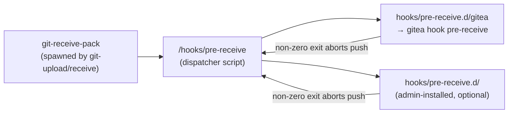

# Git Operations & Server-Side Hooks

This page traces a `git push` end-to-end through Gitea's SSH transport,
internal permission-check API, and server-side Git hook pipeline — tying
together `modules/ssh`, `cmd/serv.go`, `modules/gitrepo`, `cmd/hook.go`, and
the `routers/private/hook_*.go` handlers. The underlying dual-backend Git
engine and hook-*installation* mechanics are covered on
[Git Backends & Cat-File Batch Processes](git-backends-and-catfile.md) and
[GitRepo & Repository Access](gitrepo-and-repository-access.md); the fuller
LFS/hook narrative (including AGit `proc-receive`) lives on
[`09-core-modules/lfs-and-hooks.md`](../09-core-modules/lfs-and-hooks.md).
This page is the "how a push actually flows through the process boundaries"
reference.

## Why Hooks Exist

Git itself has no concept of permissions, branch protection, webhooks, or a
database. Gitea intercepts every push at the points Git natively calls
out to external hook scripts — `pre-receive` (before any ref is updated,
can reject the whole push), `update` (once per ref, legacy/compat only in
Gitea), `post-receive` (after refs are updated, cannot reject but can react),
and `proc-receive` (Git ≥ 2.29, used exclusively for AGit-flow
pull-request-via-push). Every one of these hook points, for every
Gitea-managed repository, delegates back into the single `gitea` binary via
the `gitea hook <name>` CLI subcommand.

## The Hook Installation Pattern (Delegation)

`modules/gitrepo.CreateDelegateHooks` (see
[GitRepo & Repository Access](gitrepo-and-repository-access.md)) writes two
layers of script into `<repo>/hooks/` for each of `pre-receive`, `update`,
`post-receive`, and `proc-receive`:

1. **The dispatcher script** at `<repo>/hooks/<name>` — a small POSIX shell
   script that iterates every executable file inside a sibling `<name>.d/`
   directory and runs it, aborting the push if any exits non-zero.
2. **Gitea's own delegate** at `<repo>/hooks/<name>.d/gitea` — a one-line
   script that re-invokes the Gitea binary: `%s hook --config=%s <name>`.



This delegation pattern lets administrators drop their own custom scripts
into `<name>.d/` (repository Settings → Hooks in the web UI, or directly on
disk) alongside Gitea's own `gitea` script, without ever needing to touch or
overwrite Gitea's hook logic. `CheckDelegateHooks` (used by `gitea doctor`
and the admin panel's repository-health checks) verifies both layers are
present, current, and executable, and flags drift for repair — see
[Backup, Restore & Doctor](../18-admin-guide/backup-restore-and-doctor.md).

## `git push` Over SSH, End to End

The most complete illustration of the whole pipeline is a `git push` arriving
over SSH, since it exercises the SSH server, the `gitea serv` permission
gate, the real `git-receive-pack` binary, and both the `pre-receive` and
`post-receive` hooks (and, for AGit-flow pushes, `proc-receive` instead of
`update`+`post-receive`).

```mermaid
sequenceDiagram
    autonumber
    participant Client as git push (client)
    participant SSH as modules/ssh\n(gliderlabs/ssh server)
    participant Serv as cmd/serv.go\n(gitea serv)
    participant API as routers/private\n(internal HTTP API)
    participant RecvPack as git-receive-pack\n(real git subprocess)
    participant PreHook as hooks/pre-receive\n(dispatcher → gitea hook pre-receive)
    participant PreAPI as routers/private\nHookPreReceive
    participant PostHook as hooks/post-receive\n(dispatcher → gitea hook post-receive)
    participant PostAPI as routers/private\nHookPostReceive
    participant DB as models / DB

    Client->>SSH: SSH connect + publickey auth\n("git-receive-pack 'owner/repo.git'")
    SSH->>SSH: publicKeyHandler: look up key, set\nctx.Permissions.giteaKeyID (NOT yet authorized)
    SSH->>Serv: sessionHandler spawns\n`gitea --config=... serv key-<id>`\n(SSH_ORIGINAL_COMMAND=git-receive-pack ...)
    Serv->>API: GET /internal/serv/command/<keyid>/<owner>/<repo>?mode=write&verb=git-receive-pack
    API->>DB: resolve key owner, repo, deploy key,\ncheck AccessMode >= write, org/team perms
    API-->>Serv: ServCommandResults {RepoID, UserID, OwnerName, RepoName, ...}
    Serv->>RecvPack: exec `git-receive-pack <repoPath>`\n(env: GITEA_PUSHER_ID, GITEA_REPO_ID, ...)
    Client->>RecvPack: negotiate refs, send packfile
    RecvPack->>PreHook: invoke pre-receive\n(stdin: "<old> <new> <refFullName>" per ref)
    PreHook->>PreAPI: POST /internal/hook/pre-receive/<owner>/<repo>\n(batched, up to 500 refs; HookOptions incl. GITEA_* env)
    PreAPI->>DB: per ref: assertCanWriteRef, branch protection\n(ProtectedBranch rules), force-push/deletion checks,\nAGit refs/for/* handling
    alt any ref rejected
        PreAPI-->>PreHook: 4xx + UserMsg
        PreHook-->>RecvPack: non-zero exit
        RecvPack-->>Client: "remote: error: <UserMsg>"\n(push aborted, no refs updated)
    else all refs authorized
        PreAPI-->>PreHook: 200 OK
        PreHook-->>RecvPack: exit 0
        RecvPack->>RecvPack: update refs (writes packed objects,\nupdates refs/heads/*, refs/tags/*)
        RecvPack->>PostHook: invoke post-receive\n(stdin: same "<old> <new> <ref>" lines)
        PostHook->>PostAPI: POST /internal/hook/post-receive/<owner>/<repo>
        PostAPI->>DB: SyncBranchesToDB, MarkBranchAsDeleted,\nUpdatePullsRefs, trigger webhooks/Actions
        PostAPI-->>PostHook: 200 OK + any "create a PR" hint text
        PostHook-->>RecvPack: exit 0
        RecvPack-->>Client: "remote: Create a pull request..."\n(via post-receive stdout) + push success
    end
```

### Step-by-step notes

1. **SSH authentication is public-key only.** `modules/ssh` (built on
   `gliderlabs/ssh`) never validates a *user/password*; `publicKeyHandler`
   only records the candidate key's DB ID into the connection's
   `Permissions.Extensions` map. The library re-verifies the key
   cryptographically before that value becomes trusted — Gitea's own code
   is careful to read the key ID back off the **verified** `gossh.ServerConn`
   rather than the pre-verification `ssh.Context`, specifically to avoid a
   key-confusion bug class (see the comment block at the top of
   `modules/ssh/ssh.go`).
2. **`sessionHandler` doesn't process Git protocol itself** — it shells out
   to a *second copy of the Gitea binary* (`gitea serv key-<id>`), piping
   the SSH channel's stdin/stdout/stderr straight through via `os/exec`.
   `SSH_ORIGINAL_COMMAND` (the raw command the SSH client asked to run,
   e.g. `git-receive-pack 'owner/repo.git'`) and `GIT_PROTOCOL` are forwarded
   as environment variables.
3. **`cmd/serv.go`'s `runServ`** parses the key ID out of `key-<id>`, then
   shell-splits `SSH_ORIGINAL_COMMAND` to recover the verb
   (`git-receive-pack`/`git-upload-pack`/`git-upload-archive`, or an LFS SSH
   verb) and the `owner/repo` path. `getAccessMode` maps the verb to the
   `perm.AccessMode` it requires (`git-receive-pack` → `AccessModeWrite`) —
   this mapping is itself a security control: a verb this function doesn't
   recognize is rejected outright rather than silently defaulting to "no
   access required".
4. **The actual authorization decision is made over HTTP, not locally.**
   `private.ServCommand` calls the internal API (`routers/private/serv.go`'s
   `ServCommand`), authenticated with a shared `setting.InternalToken`
   bearer secret rather than the SSH key — `cmd/serv.go` is a thin,
   unprivileged client of Gitea's own web process, which is where all model
   access (`repo_model`, `user_model`, `asymkey_model`) and permission
   checks actually happen. This is also where push-to-create (creating a
   repo on first push, if enabled) is handled.
5. **The real `git-receive-pack`/`git-upload-pack` binary is exec'd directly**
   by `cmd/serv.go`, with `command.Dir = setting.RepoRootPath` and a curated
   environment (`GITEA_REPO_IS_WIKI`, `GITEA_REPO_ID`, `GITEA_PUSHER_ID`,
   `GITEA_PUSHER_NAME`, `GITEA_PUSHER_EMAIL`, `GITEA_DEPLOY_KEY_ID`,
   `GITEA_KEY_ID`, `GITEA_PR_ID`, plus `gitcmd.CommonCmdServEnvs()`). These
   `GITEA_*` variables are how the *later* hook invocations (running as a
   child of `git-receive-pack`, with no HTTP request context at all) learn
   who is pushing and why.
6. **Git itself invokes `pre-receive`/`post-receive`** as ordinary child
   processes of `git-receive-pack`, following the delegation pattern above.
   Both ultimately run `gitea hook <name>`, which is a stdin-batching client
   (batches of `hookBatchSize = 500` refs) for the corresponding
   `routers/private/hook_*.go` HTTP endpoint — the same internal API
   mechanism used for the `serv` permission check.
7. **`fail()` (`cmd/serv.go`/`cmd/hook.go`) is the mechanism that surfaces
   errors to the end user's terminal.** Anything written to `os.Stderr`
   prefixed with `error:` is relayed by Git straight back to the pushing
   client as `remote: error: ...` — this is how a branch-protection
   rejection in `HookPreReceive` becomes a message the developer actually
   sees in their `git push` output.
8. **A safety net prevents hook bypass.** All four `gitea hook <name>`
   subcommands short-circuit immediately if `repo_module.EnvIsInternal` is
   set (meaning Gitea itself invoked git — e.g. during a merge, migration,
   or repository generation — where hooks should not re-run permission
   checks), and — unless `setting.OnlyAllowPushIfGiteaEnvironmentSet` is
   explicitly disabled — refuse to run at all if the `GITEA_*`/
   `SSH_ORIGINAL_COMMAND` environment is missing. This stops someone with
   raw filesystem access to the bare repository from pushing directly to
   disk and skipping Gitea's authorization checks entirely.

## HTTP(S) Pushes Follow the Same Hook Pipeline

A push over HTTP(S) (`git push https://gitea.example.com/owner/repo.git`)
diverges from the SSH flow only in *how the push request is authenticated
and how `git-receive-pack` gets invoked* — HTTP Basic Auth / token / session
cookie via the Smart HTTP git protocol handler in `routers/`, rather than an
SSH public key and `gitea serv`. Once `git-receive-pack` is running against
the target repository, the `pre-receive` → ref update → `post-receive`
sequence, the delegated hook scripts, and the internal `HookPreReceive`/
`HookPostReceive` API calls are **identical** to the SSH path described
above — this is precisely the point of centralizing hook logic behind
`gitea hook` and the internal API rather than duplicating validation per
transport.

## Pre-Receive: What Gets Checked

`routers/private/hook_pre_receive.go`'s `HookPreReceive` dispatches by ref
type for every ref in the batch, stopping at the first rejection:

| Ref kind | Check performed |
|---|---|
| `refs/heads/*` (branch) | `assertCanWriteRef` (including maintainer-write-to-fork-branch semantics for PRs), reject deleting the default branch, load any matching `ProtectedBranch` rule and enforce it (no force-push unless allowed, no deletion, required status checks/approvals as configured) |
| `refs/tags/*` (tag) | Tag-protection rule checks |
| `refs/for/*` (AGit) | Only when `git.DefaultFeatures().SupportProcReceive` — deferred to `proc-receive` instead; see [LFS & Server-Side Hooks](../09-core-modules/lfs-and-hooks.md#agit--proc-receive) |
| anything else | Generic `assertCanWriteRef` |

## Post-Receive: What Happens After Acceptance

`routers/private/hook_post_receive.go`'s `HookPostReceive` cannot reject the
push (Git has already committed the ref updates by this point) but is
responsible for reconciling Gitea's own state:

- Filters pushed refs down to branches/tags (`hookPostReceiveCollectPushUpdates`).
- Marks deleted branches as deleted in the DB, refreshes pull-request head
  refs, and re-syncs branch/commit metadata into the `branch` table
  (`hookPostReceiveSyncDatabaseBranches`) — opening the repo via
  `gitrepo.RepositoryFromRequestContextOrOpen` and reading commits back out
  through the `modules/git` `Repository`/`Commit` API.
- Triggers webhook delivery and Actions workflow runs for the push (see
  [Webhook Delivery Pipeline](../16-webhooks-integrations/webhook-delivery-pipeline.md)).
- Prints "create a pull request" hints back to the pusher's terminal.

## Related Pages

- [Git Backends & Cat-File Batch Processes](git-backends-and-catfile.md) —
  the `modules/git` engine underneath every `Repository`/`Commit` read in
  this pipeline
- [GitRepo & Repository Access](gitrepo-and-repository-access.md) —
  `CreateDelegateHooks`/`CheckDelegateHooks` and request-scoped repository
  handle caching used by `HookPostReceive`
- [Git Module](../09-core-modules/git-module.md) — full reference for the
  dual gogit/nogogit backends and the object-access primitives hooks read
  commits through
- [Git LFS & Server-Side Hooks](../09-core-modules/lfs-and-hooks.md) — the
  fuller hook-lifecycle write-up (hook registration internals, `cmd/hook.go`
  dispatch table, AGit/`proc-receive`) and the LFS architecture built on the
  same foundations
- [Webhook Delivery Pipeline](../16-webhooks-integrations/webhook-delivery-pipeline.md) —
  what `HookPostReceive` triggers once a push is accepted
- [Backup, Restore & Doctor](../18-admin-guide/backup-restore-and-doctor.md) —
  `gitea doctor`'s use of `CheckDelegateHooks` to detect hook drift
