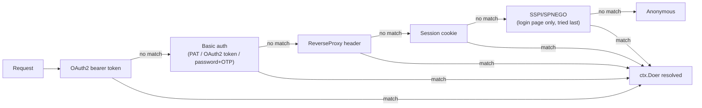

# Authentication

Documentation of Gitea's authentication methods, sessions, authorization model, and account
security mechanisms.

The deepest services-layer write-up of the `auth.Method` interface, the individual provider
implementations, and group-sync internals lives in **08 · Services**
([Authentication & Authorization](../08-services/auth-providers.md)). This section provides the
focused, topic-oriented companion pages for identity sources, permission resolution, tokens, and
two-factor/recovery flows — each re-verified directly against `services/auth`, `models/auth`,
`models/perm`, `models/unit`, and `services/oauth2_provider`.

## Section Contents

| Page | Description |
|---|---|
| [Authentication Sources](auth-sources.md) | Every identity provider Gitea supports (LDAP, SMTP, PAM, SSPI, OAuth2/goth, WebAuthn/Passkeys, internal DB), the `auth.Method` vs. `auth.Source` distinction, and the per-surface (Web UI / REST API / Package Registry) request-resolution chain with a Mermaid diagram |
| [Authorization Model](authorization-model.md) | The `AccessMode` enum, repository units (`models/unit`), and how `Permission` is computed per `(user, repo)` pair in `models/perm/access` — including team/org merging and the Actions-bot permission path |
| [Access Tokens & OAuth2 Applications](tokens-and-oauth-apps.md) | Personal Access Token storage/scopes, and Gitea acting as an OAuth2/OpenID Connect *provider* (`services/oauth2_provider`) — PKCE, JWT signing, grants, and the token/introspection/userinfo/JWKS endpoints |
| [Two-Factor Authentication & Account Recovery](two-factor-and-recovery.md) | TOTP (`pquerna/otp`) single-use enforcement, scratch/recovery tokens, WebAuthn/Passkey ceremonies (`go-webauthn/webauthn`), and the email-based password-reset flow's 2FA gating |
| [Authentication & Authorization (deep-dive)](../08-services/auth-providers.md) | Auth source types, the `auth.Method` interface contract, session/cookie handling, and the full group-sync (LDAP/OAuth2 → org/team) algorithm |

## Auth-Source Resolution Chain at a Glance

Every request is resolved by trying an ordered list of `auth.Method`s until one returns a user
(full detail, including per-surface differences, in
[Authentication Sources](auth-sources.md#per-request-authmethod-resolution-chain)):

## Where to Go Next

| If you want to... | Go to |
|---|---|
| See the User model backing accounts | [User & Organization Model](../05-database-models/user-organization-model.md) |
| See how permission checks gate a request | [Permissions Model](../05-database-models/permissions-model.md) |
| See how auth ties into request middleware | [Request Lifecycle](../02-architecture/request-lifecycle.md) |
| See API-level scope enforcement in context | [API Conventions & Swagger](../07-rest-api/api-conventions-and-swagger.md) |
