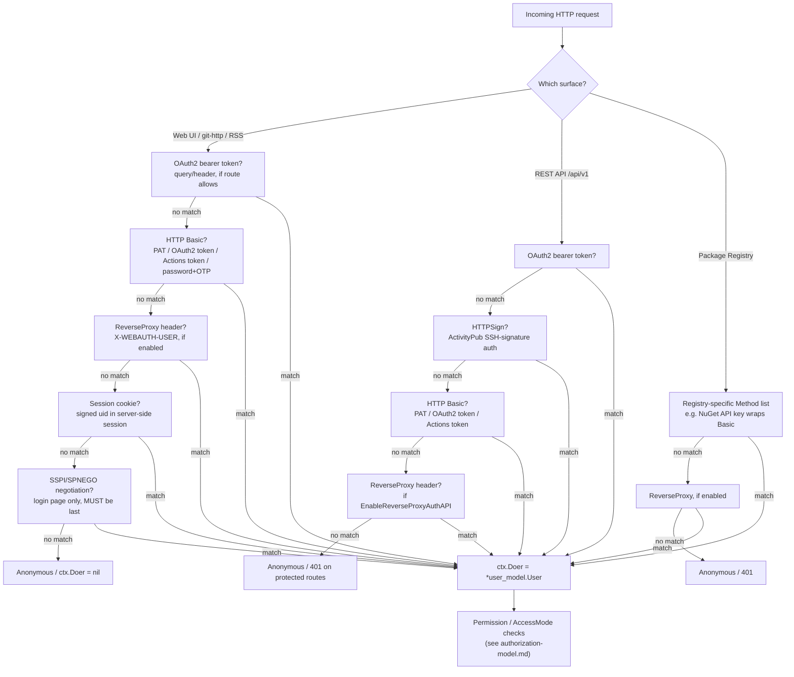

# Authentication Sources

This page catalogs every identity provider Gitea can authenticate against, and shows exactly
how an incoming request is resolved to a user identity. It is the focused, provider-oriented
companion to [Authentication & Authorization](../08-services/auth-providers.md), which is the
canonical deep-dive on the `auth.Method` interface, permission resolution, and access-token
scopes. Re-verified against `go.mod`, `services/auth`, `services/auth/source/*`, and
`models/auth/source.go`.

> Source roots: [`services/auth`](../../services/auth) (per-request `Method`s),
> [`services/auth/source/*`](../../services/auth/source) (configured login `Source`s),
> [`models/auth/source.go`](../../models/auth/source.go) (the generic `Source` DB record).

## Two Distinct Concepts

Gitea's authentication code has two related but distinct abstractions that share the word
"auth":

| Concept | Interface / Type | Answers | Examples |
|---|---|---|---|
| **`auth.Method`** | `services/auth/interface.go` `Method` | "Does *this HTTP request* carry valid credentials?" | `Session`, `Basic`, `OAuth2` (bearer), `ReverseProxy`, `SSPI`, `HTTPSign` |
| **`auth.Source`** | `models/auth/source.go` `Source` (admin-configured DB row) | "Is this `username`/`password` pair valid against *this backend*?" | LDAP, SMTP, PAM, OAuth2 (goth), SSPI (config only) |

`Basic` and the `/user/login` web form both call into the active `Source`s (via
`services/auth/signin.go`'s `UserSignIn`) to validate a password; `OAuth2`/`SSPI` `Method`s use
their own protocol instead of delegating to a `Source.Authenticate`.

## Identity Providers Present in `go.mod`

| Dependency | Provider(s) it backs | Package |
|---|---|---|
| `github.com/go-ldap/ldap/v3` | LDAP (`LDAP` bind-DN, `DLDAP` direct-bind) | `services/auth/source/ldap` |
| `github.com/markbates/goth` | OAuth2 / OpenID Connect (GitHub, GitLab, Google, Bitbucket, generic OIDC, Twitter, Discord, etc.) | `services/auth/source/oauth2` |
| `github.com/msteinert/pam/v2` | PAM (delegates to the host OS's PAM stack) | `services/auth/source/pam`, `modules/auth/pam` |
| `github.com/quasoft/websspi` | SSPI (Windows Integrated Auth / Kerberos / NTLM via SPNEGO) | `services/auth/source/sspi`, `services/auth/sspi.go` |
| `github.com/go-webauthn/webauthn` (+ `github.com/go-webauthn/x`) | WebAuthn / Passkeys (2FA and passwordless sign-in) | `modules/auth/webauthn`, `models/auth/webauthn.go` |
| `github.com/pquerna/otp` | TOTP 2FA | `models/auth/twofactor.go` |
| (built-in, no external dep) | Internal DB password auth (default) | `services/auth/source/db` |
| (built-in, no external dep) | SMTP AUTH (PLAIN/LOGIN/CRAM-MD5) | `services/auth/source/smtp` |
| (built-in, no external dep) | Reverse-proxy header trust (SSO gateways) | `services/auth/reverseproxy.go` |
| (built-in, no external dep) | HTTP Signatures for ActivityPub federation | `services/auth/httpsign.go` |
| `codeberg.org/gusted/mcaptcha`, `modules/recaptcha`, `modules/hcaptcha`, `modules/turnstile` | CAPTCHA providers gating registration/login forms (not authentication *sources* themselves, but part of the login surface's abuse controls) | `modules/captcha` |

Every provider in this table is covered below; none of the identity-provider dependencies in
`go.mod` are undocumented.

## Login Sources (`services/auth/source/*`)

| Source | Type constant | `PasswordAuthenticator`? | `SynchronizableSource`? | Notes |
|---|---|---|---|---|
| DB | `auth.Plain` | Yes | No | Default; validates against the local `bcrypt`/`pbkdf2`/`scrypt`/`argon2` password hash stored on `user.User` |
| LDAP (bind-DN) | `auth.LDAP` | Yes | Yes | Searches for the user with a service `BindDN`, then binds as the user to verify the password |
| LDAP (direct bind) | `auth.DLDAP` | Yes | Yes | Binds directly as `<UserDN template>` with the supplied password, no service bind account needed |
| SMTP | `auth.SMTP` | Yes | No | Opens a connection to `Host:Port` and performs SMTP AUTH with the given credentials |
| PAM | `auth.PAM` | Yes | No | Calls `pam.Auth(serviceName, userName, passwd)`; auto-creates users with a synthesized `<user>@<EmailDomain>` address |
| OAuth2 | `auth.OAuth2` | No (redirect-based) | Yes | Wraps a `goth.Provider`; the user authenticates on the external IdP's site, then Gitea's callback creates/links the local account |
| SSPI | `auth.SSPI` | No (its `Method` is `SSPI`, no password path) | No | Configuration consumed by the `SSPI` HTTP `Method`; Windows-only real implementation, POSIX stub otherwise |

Each `Source.Cfg` type self-registers a `Type` via `auth.RegisterTypeConfig` in its package's
`init()`, so the generic `models/auth/source.go` `Source` struct can deserialize the correct
concrete config when loaded from the `login_source` table.

### DB (`services/auth/source/db`)

The default and always-available source. No external service — passwords are hashed and stored
directly on the `User` record (see `modules/auth/password`). Registered automatically; cannot be
disabled or deleted from the login source list.

### LDAP (`services/auth/source/ldap`)

Two flavors sharing one `Source` struct (`source.go`), built on `github.com/go-ldap/ldap/v3`:

- **Bind-DN / search+bind (`LDAP`)** — connects and binds as a configured `BindDN`/`BindPassword`
  (encrypted at rest via `secret.EncryptSecret` in `Source.ToDB`), searches `UserBase` with
  `Filter` to find the user's DN, then re-binds as that DN with the user-supplied password to
  verify it. Supports separate `AdminFilter`/`RestrictedFilter` to auto-promote/restrict users
  based on LDAP attributes.
- **Direct bind (`DLDAP`)** — skips the search step and binds directly using a `UserDN` template
  (e.g. `uid=%s,ou=People,dc=example,dc=org`) substituted with the given username.

Both support SSH public-key and avatar attribute mapping, and group synchronization fields
(`GroupsEnabled`, `GroupDN`, `GroupFilter`, `GroupMemberUID`, `UserUID`, `GroupTeamMap`,
`GroupTeamMapRemoval`) — see the [Group Sync section](../08-services/auth-providers.md#group-sync--mapping-external-groups-to-teams)
of the services-layer page for the full sync algorithm. `source_authenticate.go` implements
`Authenticate`; `source_sync.go` implements the periodic `Sync` used by `services/auth/sync.go`'s
cron task to create/update/deactivate local users from LDAP search results in bulk.

### SMTP (`services/auth/source/smtp`)

Authenticates by opening a connection to `Host:Port` and performing SMTP AUTH (the `Auth` field
selects `PLAIN`, `LOGIN`, or `CRAM-MD5`) with the user's credentials — if the server accepts the
login, the identity is verified. Config includes `AllowedDomains` (restrict which email domains
may register/sign in via this source), `ForceSMTPS`/`SkipVerify` TLS controls, and
`HeloHostname`/`DisableHelo`. No group sync (SMTP servers don't expose group membership).

### PAM (`services/auth/source/pam`)

Delegates to the host operating system's PAM stack via `modules/auth/pam`
(`pam.Auth(serviceName, userName, passwd)`), with a `pam_stub.go` fallback that returns an error
on platforms built without cgo/PAM support. Configuration is just `ServiceName` (the PAM service
file, e.g. `system-auth` or `login`) and `EmailDomain` (used to synthesize an email address for
auto-created users, since PAM has no email attribute of its own).

### OAuth2 / OpenID Connect (`services/auth/source/oauth2`)

Configures an external OAuth2/OIDC identity provider via `github.com/markbates/goth`.
`providers.go` / `providers_base.go` / `providers_custom.go` / `providers_openid.go` /
`providers_simple.go` register/build `goth.Provider`s (GitHub, GitLab, Google, Bitbucket,
generic OpenID Connect, and many others goth supports). `source_callout.go` performs the
redirect ("callout") to the provider's authorization endpoint;
[`routers/web/auth/oauth.go`](../../routers/web/auth/oauth.go) handles the callback, token
exchange, account creation/linking, and admin/restricted-group derivation from group claims
(`getUserAdminAndRestrictedFromGroupClaims`). `source_sync.go` implements `Sync` to refresh
stored OAuth2 refresh tokens, disabling users whose grant was revoked upstream (`invalid_grant`).

This is distinct from Gitea acting as an **OAuth2 provider** for third-party apps — see
[Access Tokens & OAuth2 Applications](tokens-and-oauth-apps.md) for that side of the protocol.

### SSPI (`services/auth/source/sspi`)

A configuration-only `Source` (no `PasswordAuthenticator`/`Sync`) consumed by the `SSPI` HTTP
`Method` in `services/auth/sspi.go`. Implements Windows Integrated Authentication
(SPNEGO/Kerberos/NTLM negotiation) for domain-joined Windows clients, backed by
`sspiauth_windows.go` (real implementation using `quasoft/websspi`) and `sspiauth_posix.go` (a
stub that always fails, so non-Windows builds compile but never activate SSPI). Config fields
control `SeparatorReplacement` (character to replace domain separators with) and
`DefaultRealm`/domain-stripping behavior. See [`SSPI` below](#sspi-request-method) for the
request-time negotiation flow.

## WebAuthn / Passkeys as an Authentication Source

Unlike the sources above, WebAuthn is not a `models/auth/source.go` `Source` row — every user
manages their own set of `WebAuthnCredential`s (`models/auth/webauthn.go`), registered through
account security settings. It participates in authentication in two ways:

1. **Second factor** during password/LDAP/PAM/SMTP sign-in, alongside or instead of TOTP.
2. **Primary, passwordless sign-in** via **Passkeys** (`setting.Service.EnablePasskeyAuth`),
   using discoverable credentials (`WebAuthnPasskeyAssertion` / `WebAuthnPasskeyLogin` in
   `routers/web/auth/webauthn.go`) — no username is even submitted; the browser's platform
   authenticator resolves the credential's `userHandle` back to a Gitea user ID.

See [Two-Factor Authentication & Account Recovery](two-factor-and-recovery.md) for the full
WebAuthn ceremony details.

## Per-Request `auth.Method` Resolution Chain

While `Source`s answer "is this password correct", the **`auth.Method` chain** is what actually
inspects an incoming HTTP request and decides who (if anyone) is making it. Methods are combined
into an ordered `Group` (`services/auth/group.go`) and tried **in order**; the first `Method`
that returns a non-nil user wins (`AuthedMethod` is recorded for later checks like the WebAuthn
Basic-auth restriction). Order matters because some methods must run before others to avoid
being shadowed by a stale session, or must run last because a failed negotiation short-circuits
with an HTTP error.

### Web UI chain (`routers/web/web.go` → `newWebAuthMiddleware`)

```go
group := auth_service.NewGroup()
if allowOAuth2 {
    group.Add(&auth_service.OAuth2{})
}
if allowBasic {
    group.Add(&auth_service.Basic{})
}
if setting.Service.EnableReverseProxyAuth {
    // reverse-proxy should be before Session, otherwise the header
    // will be ignored if the user has already logged in
    group.Add(&auth_service.ReverseProxy{CreateSession: !isSessionless})
}
group.Add(&auth_service.Session{})
if enableSSPI {
    // it MUST be the last, see the comment of SSPI
    group.Add(&auth_service.SSPI{CreateSession: !isSessionless})
}
```

### REST API chain (`routers/api/v1/api.go` → `buildAuthGroup`)

```go
group := auth.NewGroup(
    &auth.OAuth2{},
    &auth.HTTPSign{},
    &auth.Basic{}, // FIXME: should be removed once basic auth in API isn't allowed
)
if setting.Service.EnableReverseProxyAuthAPI {
    group.Add(&auth.ReverseProxy{})
}
```

### Package Registry chain (`routers/api/packages/api.go`)

Each registry endpoint supplies its own `[]auth.Method{...}` list to `verifyAuth`
(e.g. NuGet's API-key method wrapping `Basic.VerifyAuthToken`), with `ReverseProxy` appended
automatically when `EnableReverseProxyAuth` is set.

### Resolution Diagram

The diagram below reflects the **actual, verified order** implemented in code for each surface
— note that the two request surfaces do *not* share one universal order; each is tuned to that
surface's supported credential types.



Within the `Basic` method itself, credential classification is also ordered (see
`services/auth/basic.go`): **1)** OAuth2 access token, **2)** Personal Access Token, **3)**
Actions task token, **4)** username/password fallback (only if `EnableBasicAuth`, and only after
2FA is satisfied — WebAuthn-enrolled accounts are rejected outright for Basic auth; TOTP-enrolled
accounts must supply `X-Gitea-OTP`).

### Request Methods Referenced Above {#sspi-request-method}

| Method | File | Behavior |
|---|---|---|
| `Session` | `services/auth/session.go` | Reads `uid` from the session store; `(nil, nil)` if absent |
| `Basic` | `services/auth/basic.go` | Parses `Authorization: Basic`; tries OAuth2 token → PAT → Actions token → password+OTP |
| `OAuth2` | `services/auth/oauth2.go` | Bearer token in header or `token=`/`access_token=` query param |
| `ReverseProxy` | `services/auth/reverseproxy.go` | Trusts `X-WEBAUTH-USER` (configurable) from an upstream SSO proxy; can auto-register and/or establish a session |
| `SSPI` | `services/auth/sspi.go` | Windows SPNEGO negotiation; only activates for `POST /user/login?auth_with_sspi=1`; must run last because a failed handshake returns `401` immediately |
| `HTTPSign` | `services/auth/httpsign.go` | HTTP Signature verification (SSH key or SSH certificate) for ActivityPub federation |

## Related Pages

- [Authentication & Authorization (deep-dive)](../08-services/auth-providers.md) — the
  `auth.Method` interface contract, `common.AuthShared` glue, and group-sync internals in full
- [Authorization Model](authorization-model.md) — what happens once `ctx.Doer` is known
- [Access Tokens & OAuth2 Applications](tokens-and-oauth-apps.md) — PATs, scopes, and Gitea as
  an OAuth2/OIDC *provider*
- [Two-Factor Authentication & Account Recovery](two-factor-and-recovery.md) — TOTP, WebAuthn,
  scratch tokens, password reset
