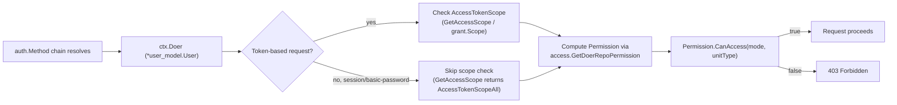

# Authorization Model

Authentication (covered in [Authentication Sources](auth-sources.md)) only establishes **who**
is making a request — it resolves `ctx.Doer`, a `*user_model.User`. Authorization is the
separate step that decides **what** that user (or an anonymous visitor) is allowed to do. This
page documents the core building blocks: [`models/perm`](../../models/perm) (the `AccessMode`
enum) and [`models/perm/access`](../../models/perm/access) (per-repository `Permission`
computation), plus [`models/unit`](../../models/unit) (the per-repository feature/unit system
that permissions are scoped to). Re-verified against the current contents of both packages.

> Source roots: [`models/perm/access_mode.go`](../../models/perm/access_mode.go),
> [`models/perm/access/repo_permission.go`](../../models/perm/access/repo_permission.go),
> [`models/perm/access/access.go`](../../models/perm/access/access.go),
> [`models/unit/unit.go`](../../models/unit/unit.go).

## `AccessMode` — the Ordered Permission Enum

[`models/perm/access_mode.go`](../../models/perm/access_mode.go) defines a simple ordered
integer enum. Because levels are ordered, every permission check reduces to `>=` comparison:

```go
type AccessMode int

const (
    AccessModeNone AccessMode = iota // 0: no access

    AccessModeRead  // 1: read access
    AccessModeWrite // 2: write access
    AccessModeAdmin // 3: admin access
    AccessModeOwner // 4: owner access
)
```

`ParseAccessMode(permission string, allowed ...AccessMode)` converts the user-facing strings
`"read"`/`"write"`/`"admin"` (used by collaborator-invite and team-permission forms) into an
`AccessMode`, optionally restricted to an `allowed` allow-list — `"owner"` deliberately cannot be
parsed from user input since it is derived, not assigned. `ToString()`/`LogString()` provide the
reverse mapping for templates and structured logs.

## Repository Units (`models/unit`)

A repository is not an all-or-nothing resource — it is decomposed into **units**, each
representing an optional feature area that can be independently enabled, disabled, and
permissioned. [`models/unit/unit.go`](../../models/unit/unit.go) defines the full catalog:

| `Type` | Name key | URI suffix | `MaxAccessMode()` | Priority |
|---|---|---|---|---|
| `TypeCode` (1) | `repo.code` | `/` | Owner | 0 |
| `TypeIssues` (2) | `repo.issues` | `/issues` | Owner | 1 |
| `TypePullRequests` (3) | `repo.pulls` | `/pulls` | Owner | 2 |
| `TypeReleases` (4) | `repo.releases` | `/releases` | Owner | 3 |
| `TypeWiki` (5) | `repo.wiki` | `/wiki` | Owner | 4 |
| `TypeExternalWiki` (6) | `repo.ext_wiki` | `/wiki` | **Read** (external link, no local write) | 102 |
| `TypeExternalTracker` (7) | `repo.ext_issues` | `/issues` | **Read** (external link, no local write) | 101 |
| `TypeProjects` (8) | `repo.projects` | `/projects` | Owner | 5 |
| `TypePackages` (9) | `repo.packages` | `/packages` | Owner | 6 |
| `TypeActions` (10) | `repo.actions` | `/actions` | Owner | 7 |

`Unit.MaxPerm()` caps `TypeExternalWiki`/`TypeExternalTracker` at `AccessModeRead` — Gitea only
*links out* to an externally-hosted wiki/tracker, so there is nothing to grant write access to
locally. All other units can go up to `AccessModeOwner`.

Predefined unit sets drive default repository configuration and are adjustable via
`app.ini`/`LoadUnitConfig()`:

- `AllRepoUnitTypes` — every unit that exists.
- `DefaultRepoUnits` — units enabled for a newly created repository (all except the two
  "external" units, which are mutually exclusive alternates to `TypeIssues`/`TypeWiki` and must
  be explicitly chosen).
- `DefaultForkRepoUnits` — a fork starts with only `TypeCode` + `TypePullRequests`.
- `DefaultMirrorRepoUnits` — mirrors get `Code`, `Issues`, `Releases`, `Wiki`, `Projects`,
  `Packages` (no `PullRequests`/`Actions`, since a plain mirror doesn't accept pushes or run CI
  by default).
- `DefaultTemplateRepoUnits` — units copied into repos generated from a template.
- `NotAllowedDefaultRepoUnits` — `TypeExternalWiki`/`TypeExternalTracker` can never be a
  *default*; they must be explicitly configured because they need a target URL.
- `DisabledRepoUnitsGet()`/`Set()` — instance-wide unit disabling (e.g. an admin turning off
  Packages instance-wide), backed by an `atomic.Pointer` to avoid a data race with queue workers
  reading the value concurrently with test mocking.

`FindUnitTypes(nameKeys ...string)` / `TypeFromKey(nameKey string)` resolve the `app.ini`
string keys (e.g. `repo.issues`) to `Type` values, collecting any unrecognized keys as
`invalidKeys` for a startup warning rather than a hard failure.

## `Permission` — Per-(User, Repository) Access Computation

[`models/perm/access/repo_permission.go`](../../models/perm/access/repo_permission.go) defines
`Permission`, the struct that aggregates every input needed to answer "can this user do `X` to
unit `Y` of this repo":

```go
type Permission struct {
    AccessMode perm_model.AccessMode

    units     []*repo_model.RepoUnit
    unitsMode map[unit.Type]perm_model.AccessMode

    everyoneAccessMode  map[unit.Type]perm_model.AccessMode // per-unit floor for every signed-in user
    anonymousAccessMode map[unit.Type]perm_model.AccessMode // per-unit floor for anonymous visitors
}
```

- **`AccessMode`** — the user's overall level (owner/collaborator/team-derived), used as the
  fallback for any unit that has no more specific override.
- **`unitsMode`** — per-unit overrides, e.g. a team might be granted `Write` on Issues but only
  `Read` on Code.
- **`everyoneAccessMode`** / **`anonymousAccessMode`** — minimum access every signed-in user (or
  even anonymous visitors) get for a specific unit on a public repository, e.g. a public repo
  with an open issue tracker that anyone can comment on regardless of collaborator status.
  Populated by `applyPublicAccessPermission`, which is a no-op when
  `setting.Repository.ForcePrivate` is set.

### Resolving the Effective Mode for a Unit

```go
func (p *Permission) UnitAccessMode(unitType unit.Type) perm_model.AccessMode {
    // if the units map contains the access mode, use it, but admin/owner mode could override it
    if m, ok := p.unitsMode[unitType]; ok {
        return util.Iif(p.AccessMode >= perm_model.AccessModeAdmin, p.AccessMode, m)
    }
    // if the units map does not contain the access mode, return the default access mode if the unit exists
    unitDefaultAccessMode := p.AccessMode
    unitDefaultAccessMode = max(unitDefaultAccessMode, p.anonymousAccessMode[unitType])
    unitDefaultAccessMode = max(unitDefaultAccessMode, p.everyoneAccessMode[unitType])
    hasUnit := slices.ContainsFunc(p.units, func(u *repo_model.RepoUnit) bool { return u.Type == unitType })
    return util.Iif(hasUnit, unitDefaultAccessMode, perm_model.AccessModeNone)
}

func (p *Permission) CanAccess(mode perm_model.AccessMode, unitType unit.Type) bool {
    return p.UnitAccessMode(unitType) >= mode
}
```

Convenience wrappers build on `CanAccess`: `CanRead`/`CanWrite` (fixed mode), `CanAccessAny`/
`CanReadAny` (any of several unit types — e.g. "can read code OR issues"), and
`CanReadIssuesOrPulls(isPull bool)`/`CanWriteIssuesOrPulls(isPull bool)` (dispatch to Issues vs.
Pull Requests unit based on a boolean, used throughout the issue/PR handlers which share code).
`IsOwner()`/`IsAdmin()` are simple threshold checks on the top-level `AccessMode`.

### Computing `Permission` — `GetIndividualUserRepoPermission`

This is the function that actually assembles a `Permission` for an explicit user identity:

```mermaid
flowchart TD
    Start["GetIndividualUserRepoPermission(ctx, repo, user)"] --> LoadUnits[repo.LoadUnits]
    LoadUnits --> AnonPriv{user == nil AND repo.IsPrivate?}
    AnonPriv -->|yes| NoneA[AccessMode = None, return]
    AnonPriv -->|no| CheckCollab[IsCollaborator lookup]
    CheckCollab --> OwnerVisible{Owner visible to doer\nOR isCollaborator?}
    OwnerVisible -->|no| NoneB[AccessMode = None, return]
    OwnerVisible -->|yes| AnonPub{user == nil?}
    AnonPub -->|yes| ReadAnon[AccessMode = Read, return]
    AnonPub -->|no| AdminOwner{user.IsAdmin OR user.ID == repo.OwnerID?}
    AdminOwner -->|yes| Owner[AccessMode = Owner, return]
    AdminOwner -->|no| CollabLevel["AccessMode = accessLevel(user, repo)\n(collaborator table lookup)"]
    CollabLevel --> IsOrg{repo.Owner is an Organization?}
    IsOrg -->|no| ReturnPerm[return Permission]
    IsOrg -->|yes| MinMode["AccessMode = max(AccessMode, minAccessMode)\nminAccessMode = Read if public repo & !user.IsRestricted else None"]
    MinMode --> Teams[organization.GetUserRepoTeams]
    Teams --> NoTeams{len(teams) == 0?}
    NoTeams -->|yes| ReturnPerm
    NoTeams -->|no| AdminTeam{any team.HasAdminAccess?}
    AdminTeam -->|yes| OwnerViaTeam[AccessMode = Owner, unitsMode = nil, return]
    AdminTeam -->|no| PerUnit["for each repo unit x team:\nunitsMode[u] = max(unitsMode[u], minAccessMode, team.UnitAccessModeEx(u))"]
    PerUnit --> ReturnPerm

    ReturnPerm --> Finalize["finalProcessRepoUnitPermission()\napplies anonymousAccessMode / everyoneAccessMode,\nprunes units with zero access"]
```

Key rules embedded in this flow:

- **Repo admins and owners always get `AccessModeOwner`** — `user.IsAdmin` (site admin) or
  `user.ID == repo.OwnerID` short-circuits everything else.
- **Organization visibility gate** — `organization.HasOrgOrUserVisible` prevents strangers from
  even seeing that a public repo exists under a private org/user, *unless* they are already a
  collaborator on that specific repo.
- **Team admin access is absolute** — if any team the user belongs to `HasAdminAccess()`, the
  user gets `AccessModeOwner` on the whole repo and `unitsMode` is cleared (no per-unit
  restriction can apply above owner).
- **Per-unit team merging** — otherwise, for every repo unit, the effective mode is the `max` of:
  the running `unitsMode[u]` (from a previous team in the loop, or from being a direct
  collaborator), the org's `minAccessMode` floor, and this team's own `UnitAccessModeEx(u)`. This
  means a user in multiple teams gets the **highest** access any of their teams grants per unit,
  not the lowest.
- **`finalProcessRepoUnitPermission`** runs as a `defer` in the caller, applying the "everyone"
  and "anonymous" floors from each unit's `EveryoneAccessMode`/`AnonymousAccessMode` fields (both
  short-circuited by `setting.Repository.ForcePrivate`), and pruning `perm.units` down to only
  units the user has *some* access path to (explicit `unitsMode`, or a public/everyone floor).

### Actions Bot Permission (`GetActionsUserRepoPermission`)

CI jobs run as a synthetic "Actions" user (`user_model.ActionsUserID`) whose effective permission
is **not** looked up the normal way — it is derived from the running `Task`'s computed token
permissions (`actions_model.ComputeTaskTokenPermissions`), clamped by the target repository's (or
its owner's) Actions configuration ceiling, and then unioned with a **read-only** floor equal to
whatever a normal anonymous/public-repo visitor could read (via `botPerm`) so that a repository
being public doesn't accidentally get *less* access than a stranger would have. Cross-repository
access (e.g. an Action in one repo checking out another) additionally requires
`checkSameOwnerCrossRepoAccess` (same owner, and not a fork PR) or explicit
`IsCollaborativeOwner` configuration on the target's Actions unit config.

`GetDoerRepoPermission(ctx, repo, user)` is the **single recommended entry point** — it detects
an Actions task user via `user_model.GetActionsUserTaskID` and dispatches to
`GetActionsUserRepoPermission`, otherwise falling through to
`GetIndividualUserRepoPermission`. Most request-path code should call `GetDoerRepoPermission`
rather than `GetIndividualUserRepoPermission` directly, unless it specifically needs to bypass
Actions-user resolution.

### Top-Level Helpers

| Function | Purpose |
|---|---|
| `AccessLevel(ctx, user, repo)` | Shorthand for `AccessLevelUnit(ctx, user, repo, unit.TypeCode)` — the repo's overall code access level |
| `AccessLevelUnit(ctx, user, repo, unitType)` | `GetIndividualUserRepoPermission(...).UnitAccessMode(unitType)` |
| `HasAccessUnit(ctx, user, repo, unitType, testMode)` | `testMode <= AccessLevelUnit(...)` |
| `IsUserRepoAdmin(ctx, repo, user)` | `true` for site admins, `AccessModeAdmin+`, or membership in an admin-access team |
| `IsUserRealRepoAdmin(ctx, repo, user)` | Narrower variant used for ownership-transfer style checks; does not consult team admin access |
| `CanBeAssigned(ctx, user, repo)` | Any unit write access, or read access to Pull Requests (matches the assignee-picker UI) |
| `HasAnyUnitAccess(ctx, userID, repo)` | See `Permission.HasAnyUnitAccess` — at least one unit readable, ignoring public/everyone floors |

## Where Authentication Feeds Into Authorization

The authentication chain (see [Authentication Sources](auth-sources.md)) resolves `ctx.Doer`; it
never itself decides whether that doer can perform an action. That decision always routes
through `Permission`/`AccessMode`, with one additional gate layered on top for
**token-authenticated** requests: the token's **scope** must also permit the operation. See
[Access Tokens & OAuth2 Applications](tokens-and-oauth-apps.md#scopes) for the scope catalog, and
the diagram below for how the two gates compose:



A token with `write:repository` scope still cannot write to a repository the user has no write
access to — scope is a ceiling on *what kinds of endpoints* a credential may call, while
`Permission` is the ceiling on *which resources* the underlying user account may act upon. Both
gates must pass.

## Related Pages

- [Authentication Sources](auth-sources.md) — how `ctx.Doer` is resolved in the first place
- [Access Tokens & OAuth2 Applications](tokens-and-oauth-apps.md) — the scope side of the
  two-gate model above
- [Permissions Model](../05-database-models/permissions-model.md) — the database-model-focused
  companion to this page, covering `RepoUnit`/collaborator/team persistence
- [Authentication & Authorization (deep-dive)](../08-services/auth-providers.md) — full
  services-layer write-up including the `auth.Method` interface itself
