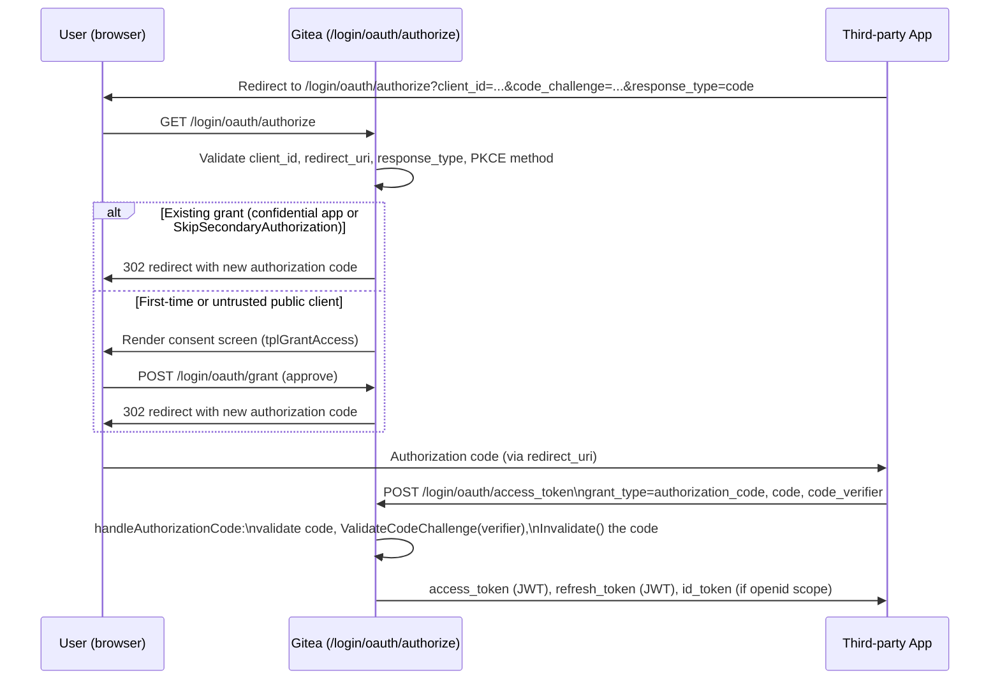

# Access Tokens & OAuth2 Applications

Gitea issues and validates two kinds of bearer credential: **Personal Access Tokens (PATs)** —
long-lived tokens a user creates for themselves — and **OAuth2 access/refresh/ID tokens** —
issued through a full OAuth2 Authorization Code (+ PKCE) flow to a registered
`OAuth2Application`, where Gitea itself acts as the **OAuth2/OpenID Connect provider**. This page
documents both, re-verified against
[`services/oauth2_provider`](../../services/oauth2_provider),
[`models/auth/oauth2.go`](../../models/auth/oauth2.go),
[`models/auth/access_token.go`](../../models/auth/access_token.go)/`access_token_scope.go`, and
the route handlers in [`routers/web/auth/oauth2_provider.go`](../../routers/web/auth/oauth2_provider.go).

> This is the *provider* side of OAuth2 (Gitea issuing tokens to third-party apps). For Gitea
> acting as an OAuth2 *client* against an external IdP (login via GitHub/Google/etc.), see
> [Authentication Sources](auth-sources.md#oauth2--openid-connect-servicesauthsourceoauth2).

## Personal Access Tokens (PATs)

Modeled by `AccessToken` in [`models/auth/access_token.go`](../../models/auth/access_token.go):

```go
type AccessToken struct {
    ID             int64 `xorm:"pk autoincr"`
    UID            int64 `xorm:"INDEX"`
    Name           string
    Token          string `xorm:"-"`            // only available at creation time
    TokenHash      string `xorm:"UNIQUE"`        // sha256+salt of token, persisted
    TokenSalt      string
    TokenLastEight string `xorm:"INDEX token_last_eight"` // fast index lookup
    Scope          AccessTokenScope

    CreatedUnix       timeutil.TimeStamp `xorm:"INDEX created"`
    UpdatedUnix       timeutil.TimeStamp `xorm:"INDEX updated"`
    HasRecentActivity bool               `xorm:"-"` // derived: used within last 7 days
    HasUsed           bool               `xorm:"-"` // derived: UpdatedUnix > CreatedUnix
}
```

Tokens are **never stored in plaintext**. `NewAccessToken` generates 20 random bytes
(`util.CryptoRandomBytes`), hex-encodes them as the plaintext token, and stores only:

- `TokenLastEight` — the last 8 hex characters, used purely as a fast pre-filter index (not a
  security boundary).
- `TokenHash` — `HashToken(token, salt)`, a PBKDF2-SHA256 hash (10,000 iterations, 50-byte
  output, defined in `models/auth/twofactor.go`'s shared `HashToken` helper) with a random
  per-token `TokenSalt`.

`GetAccessTokenBySHA(ctx, token)` looks up candidates by `TokenLastEight`, then does a
constant-time comparison (`crypto/subtle.ConstantTimeCompare`) of the computed hash against each
candidate's `TokenHash` — this defeats timing attacks that might otherwise leak the hash byte by
byte. An optional LRU cache (`successfulAccessTokenCache`, sized by
`setting.SuccessfulTokensCacheSize`) short-circuits repeated hashing for hot tokens by caching
`token → id`, re-verifying existence against the DB on each hit (so a deleted token is evicted
lazily rather than trusted from cache indefinitely).

### Lifecycle

| Function | Purpose |
|---|---|
| `NewAccessToken(ctx, t)` | Generates and inserts a new PAT; `t.Token` holds the plaintext only in-memory for this one response |
| `AccessTokenByNameExists(ctx, token)` | Enforces unique token names per user before creation |
| `GetAccessTokenBySHA(ctx, token)` | Resolves a presented token string back to its DB row (used by `Basic.Verify`/`OAuth2.Verify`) |
| `UpdateAccessToken(ctx, t)` | Full-column update (e.g. bumping `UpdatedUnix` on use) |
| `DeleteAccessTokenByID(ctx, id, userID)` | Scoped delete — always filtered by owning `userID` so one user cannot revoke another's token by ID guessing |

`AfterLoad()` (an XORM hook) computes the transient `HasUsed`/`HasRecentActivity` fields whenever
a token is loaded, purely for display in account-settings UI (never persisted).

## Scopes {#scopes}

[`models/auth/access_token_scope.go`](../../models/auth/access_token_scope.go) models scopes as
a bitmap internally, but represents them publicly as comma-separated, category-based strings:

| Category | Read scope | Write scope |
|---|---|---|
| ActivityPub | `read:activitypub` | `write:activitypub` |
| Admin | `read:admin` | `write:admin` |
| Misc | `read:misc` | `write:misc` |
| Notification | `read:notification` | `write:notification` |
| Organization | `read:organization` | `write:organization` |
| Package | `read:package` | `write:package` |
| Issue | `read:issue` | `write:issue` |
| Repository | `read:repository` | `write:repository` |
| User | `read:user` | `write:user` |

Plus two special values: `all` (unrestricted — every category's write bit) and `public-only`
(orthogonal restriction flag, not a category — see below). A write bit always implies its
matching read bit (`write:repository` grants `read:repository` for free) via a bitwise-OR
applied when the write constant is defined.

- **`AccessTokenScopePublicOnly`** further restricts a token to public repositories/organizations
  *regardless* of what other scopes it was granted — enforced explicitly, e.g. in the packages
  API (`routers/api/packages/api.go`), which rejects access to non-public package owners for
  public-only tokens. `Scope.PublicOnly()` checks for this bit; `AccessToken.DisplayPublicOnly()`
  surfaces it for the settings UI.
- **Empty/absent scope defaults to `all`** — since Gitea 1.22, a PAT with no explicit scope
  string grants full API access, matching pre-scope-system behavior; scoping down is opt-in.
- **`Scope.Normalize()`** deduplicates and canonicalizes a raw comma-joined scope string,
  rejecting unrecognized scope names.

### Scope Enforcement Points

Two independent checks are combined for any token-authenticated request:

1. **Route/endpoint scope requirement** — API route middlewares (`reqToken`/`tokenRequiresScopes`
   in `routers/api/v1`, and the packages API's own `tokenRequiresScope`) check whether the
   resolved scope (from `GetAccessScope(store)` for PATs, or `grant.Scope` for OAuth2 tokens)
   contains the category/verb the endpoint declares it needs.
2. **Resource-level `Permission`/`AccessMode`** — see
   [Authorization Model](authorization-model.md) — scope never *grants* access to a resource the
   underlying user account itself cannot access; it can only *further restrict* what an
   otherwise-permitted user's credential may be used for.

`GetAccessScope(store)` (in `services/auth`) derives the effective scope for the current request:
Basic/session logins get `AccessTokenScopeAll` (no additional restriction beyond the account's
own permissions), Actions task tokens get no general API scope (enforced through a completely
separate Actions-specific permission path — see
[Authorization Model](authorization-model.md#actions-bot-permission-getactionsuserrepopermission)),
and PAT/OAuth2-token requests get the token's/grant's own scope.

## OAuth2 Applications — Gitea as a Provider

[`models/auth/oauth2.go`](../../models/auth/oauth2.go) models the RFC 6749 client:

```go
type OAuth2Application struct {
    ID           int64 `xorm:"pk autoincr"`
    UID          int64 `xorm:"INDEX"` // 0 for instance-wide "builtin" applications
    Name         string
    ClientID     string `xorm:"unique"`
    ClientSecret string

    ConfidentialClient         bool     `xorm:"NOT NULL DEFAULT TRUE"`
    SkipSecondaryAuthorization bool     `xorm:"NOT NULL DEFAULT FALSE"`
    RedirectURIs               []string `xorm:"redirect_uris JSON TEXT"`
    CreatedUnix                timeutil.TimeStamp `xorm:"INDEX created"`
    UpdatedUnix                timeutil.TimeStamp `xorm:"INDEX updated"`
}
```

- **`ConfidentialClient`** distinguishes RFC 6749 §2.1 client types — public clients (e.g. CLI
  tools, mobile apps) that cannot keep a secret must instead use **PKCE** (see below).
- **`SkipSecondaryAuthorization`** lets a trusted first-party app (e.g. Gitea's own official
  integrations) skip the "Authorize this application?" consent screen on repeat logins.
- **Builtin applications** — `BuiltinApplications()` hardcodes fixed `ClientID`s for
  `git-credential-oauth`, Git Credential Manager, and `tea`, each pre-registered with
  `http(s)://127.0.0.1` redirect URIs; `Init(ctx)` reconciles the DB against
  `setting.OAuth2.DefaultApplications` on startup — adding, and removing, builtin app rows to
  match the configured list without touching user-created `OAuth2Application`s.

### Authorization Code Flow with PKCE

`OAuth2AuthorizationCode` (short-lived, 10-minute validity per RFC 6749 §4.1.2) is generated by
`OAuth2Grant.GenerateNewAuthorizationCode(ctx, redirectURI, codeChallenge, codeChallengeMethod)`
and stores the PKCE challenge alongside the code:

```go
type OAuth2AuthorizationCode struct {
    Grant               *OAuth2Grant
    Code                string `xorm:"INDEX unique"`
    RedirectURI         string
    ValidUntil          timeutil.TimeStamp
    CodeChallenge       string
    CodeChallengeMethod string
}
```

`requiresCodeVerifier()` reports whether a `code_verifier` must be presented at the token
exchange step. `ValidateCodeChallenge(verifier)` recomputes the expected challenge via
`deriveCodeChallenge(method, verifier)` (supporting `S256` — SHA-256 then base64url — and
`plain`) and compares it to the stored `CodeChallenge` with `crypto/subtle.ConstantTimeCompare`.
`Invalidate(ctx)` deletes the code row once consumed, and any attempt to redeem an already-used
code returns `ErrOAuth2AuthorizationCodeInvalidated`.

`AuthorizeOAuth` (`routers/web/auth/oauth2_provider.go`) — the `/login/oauth/authorize` handler —
enforces PKCE server-side:

- `CodeChallengeMethod` of `S256` or `plain` is accepted and stashed in the session.
- An **empty** `CodeChallengeMethod` is only permitted for `ConfidentialClient` apps — RFC 8252
  §8.1/RFC 7636 §4.4.1 require public (non-confidential) clients to use PKCE, so this path
  returns `invalid_request` for a public client that omits it.
- Any other value is rejected as `invalid_request` ("unsupported code challenge method").

If the user already granted this application access (`app.GetGrantByUserID`) and the app is
confidential or has `SkipSecondaryAuthorization`, a new code is minted and the browser is
redirected immediately — otherwise the consent (`tplGrantAccess`) page is shown, and
`GrantApplicationOAuth` handles the user's approval POST.



### Token Issuance (`services/oauth2_provider`)

`NewAccessTokenResponse(ctx, grant, serverKey, clientKey)` in
[`services/oauth2_provider/access_token.go`](../../services/oauth2_provider/access_token.go)
issues the actual tokens once a code (or refresh token) has been validated by
`handleAuthorizationCode`/`handleRefreshToken` in `routers/web/auth/oauth2_provider.go`:

- **Access token** — a signed JWT `Token{GrantID, Kind: KindAccessToken, RegisteredClaims{ExpiresAt}}`
  with lifetime `setting.OAuth2.AccessTokenExpirationTime`.
- **Refresh token** — `Token{GrantID, Counter, Kind: KindRefreshToken}`; `Counter` is copied from
  the grant's current counter. If `setting.OAuth2.InvalidateRefreshTokens` is enabled,
  `grant.IncreaseCounter(ctx)` bumps the grant's counter on every access-token issuance, and a
  refresh token presenting a stale counter is rejected — this makes each refresh token
  effectively single-use, detecting token theft/replay
  (`ErrOAuth2GrantStaleCounter`).
- **ID token** (OpenID Connect) — only when the grant's scope contains `openid`. `OIDCToken`
  (`services/oauth2_provider/token.go`) embeds standard claims plus optional `profile`/`email`/
  `groups` claims, populated only if those respective scopes were also granted. The `groups`
  claim is populated by `GetOAuthGroupsForUser`, which returns `"<org>"` and `"<org>:<team>"`
  strings for every organization/team the user belongs to (restricted to public organizations
  only if the token's `AccessTokenScope` includes `public-only`).

Both `Token` and `OIDCToken` are signed JWTs (`github.com/golang-jwt/jwt/v5`) using a
`JWTSigningKey` abstraction (`services/oauth2_provider/jwtsigningkey.go`) supporting HMAC
(symmetric, for opaque access/refresh tokens) and RSA/ECDSA/EdDSA (asymmetric, for OIDC ID
tokens verifiable by third parties via the `/login/oauth/keys` JWKS endpoint —
`OIDCKeys` handler — built from `ToJWK()` on each key type).

`GrantAdditionalScopes(grantScopes string)` filters the raw space-separated OIDC scope string
down to only the scopes that map to Gitea's `AccessTokenScope` categories (dropping the
"general information" scopes `openid`/`profile`/`email`/`groups`, which control ID-token claim
content rather than API access) — an empty result after filtering means unrestricted (`all`)
access, matching PAT scope defaults.

### `OAuth2Grant` — the Persisted Consent Record

```go
func (grant *OAuth2Grant) ScopeContains(scope string) bool
func (grant *OAuth2Grant) SetNonce(ctx context.Context, nonce string) error
func GetOAuth2GrantByID(ctx context.Context, id int64) (*OAuth2Grant, error)
func GetOAuth2GrantsByUserID(ctx context.Context, uid int64) ([]*OAuth2Grant, error)
func RevokeOAuth2Grant(ctx context.Context, grantID, userID int64) error
```

One `OAuth2Grant` row exists per `(application, user)` pair, recording the granted `Scope`
string, the replay-detection `Counter`, and (for OIDC) the last `Nonce` seen — re-authorizing
updates the nonce on the existing grant rather than creating a duplicate. Users manage their own
grants (and can `RevokeOAuth2Grant`) from account security settings; revoking immediately
invalidates all access/refresh tokens tied to that grant since token validation re-loads the
grant by ID on every use.

### Related Endpoints

| Route handler | Purpose |
|---|---|
| `AuthorizeOAuth` | `/login/oauth/authorize` — starts the authorization code flow, PKCE validation, consent screen |
| `GrantApplicationOAuth` | `/login/oauth/grant` — processes the user's consent approval |
| `AccessTokenOAuth` | `/login/oauth/access_token` — token endpoint; dispatches to `handleAuthorizationCode` or `handleRefreshToken` based on `grant_type` |
| `InfoOAuth` | `/login/oauth/userinfo` — OIDC userinfo endpoint; requires the request to have been authenticated via the `OAuth2` bearer `Method` specifically |
| `IntrospectOAuth` | `/login/oauth/introspect` — RFC 7662 token introspection (confidential-client-authenticated) |
| `OIDCWellKnown` | `/.well-known/openid-configuration` — OIDC discovery document |
| `OIDCKeys` | `/login/oauth/keys` — JWKS endpoint publishing verification keys for asymmetric signing |

## Related Pages

- [Authentication Sources](auth-sources.md) — how a request's bearer token/PAT is *recognized*
  by `Basic`/`OAuth2` `auth.Method`s before scope enforcement even begins
- [Authorization Model](authorization-model.md) — how the resolved scope and the resolved
  `Permission` combine to gate a request
- [Two-Factor Authentication & Account Recovery](two-factor-and-recovery.md) — 2FA requirements
  that gate the username/password fallback inside `Basic`, and the consent/session model 2FA
  itself relies on
- [Authentication & Authorization (deep-dive)](../08-services/auth-providers.md) — broader
  services-layer context including auth chains and group sync
