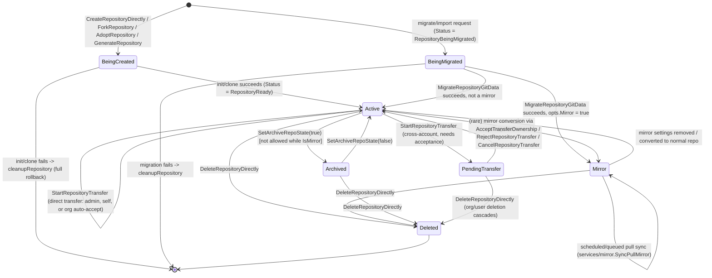

# Repository Lifecycle

This page walks through every way a `Repository` row comes into existence, how it transitions
between states, and how it eventually stops existing — backed by `services/repository` (create,
fork, adopt, migrate, transfer, archive/unarchive, delete) and `services/migrations`
(third-party import orchestration). For the entity's columns and satellite tables (mirrors,
releases, forks, wiki, units), see [Repository Model](../05-database-models/repository-model.md).

## Overview of Entry Points

| Entry point | Service function | Typical caller |
|---|---|---|
| Create new (empty or auto-initialized) repo | `repository.CreateRepositoryDirectly` (`services/repository/create.go`) | `POST /repos` API, "New Repository" web form |
| Fork an existing repo | `repository.ForkRepository` (`services/repository/fork.go`) | "Fork" button, `POST /repos/{owner}/{repo}/forks` |
| Adopt an existing on-disk bare repo not yet tracked in the DB | `repository.AdoptRepository` (`services/repository/adopt.go`) | Admin "unadopted repositories" panel |
| Generate from a template repository | `repository.GenerateRepository` (`services/repository/generate.go`) | "Use this template" button |
| Migrate/clone from an external Git host (optionally as a mirror) | `repository.CreateRepositoryDirectly` (status `RepositoryBeingMigrated`) + `repository.MigrateRepositoryGitData` (`services/repository/migrate.go`), driven by `services/migrations` | "Migrate/New Migration" web form, `POST /repos/migrate` |
| Transfer ownership | `repository.StartRepositoryTransfer` / `AcceptTransferOwnership` (`services/repository/transfer.go`) | Repo settings → "Transfer Ownership" |
| Archive / unarchive | `repo_model.SetArchiveRepoState` via `routers/web/repo/setting` handlers | Repo settings → "Archive/Unarchive this repository" |
| Delete | `repository.DeleteRepositoryDirectly` (`services/repository/delete.go`) | Repo settings → "Delete this repository", `DELETE /repos/{owner}/{repo}` |

All of the "create-like" paths (`CreateRepositoryDirectly`, `ForkRepository`,
`AdoptRepository`, `GenerateRepository`, and the migration create step) funnel through a shared
private helper, `createRepositoryInDB` (in `services/repository/repository.go`), inside a
`db.WithTx` transaction. That helper:

1. Verifies name legality/uniqueness (`repo_model.IsUsableRepoName`, checks for existing rows).
2. Inserts the `Repository` row and the default set of `RepoUnit`s (`unit.DefaultRepoUnits`,
   or `unit.DefaultForkRepoUnits` for forks).
3. Bumps `Owner.NumRepos`, grants org "include all repositories" teams and admin-collaborator
   access to `doer`, sets up default watch (if `setting.Service.AutoWatchNewRepos`), and copies
   any default webhooks (`webhook.CopyDefaultWebhooksToRepo`).

If anything after the DB transaction fails (git init, clone, label init, etc.), a `defer`
guard calls `cleanupRepository`, which invokes `DeleteRepositoryDirectly` to fully undo the
partially-created repository — this is why creation failures never leave orphaned DB rows or
half-initialized git directories under normal operation.

## Create — `CreateRepositoryDirectly`

`services/repository/create.go`:

1. **Authorization** — `doer.CanCreateRepoIn(owner)` checks `owner.MaxRepoCreation` limits.
2. **Validation** — issue-label template existence, object format (`sha1`/`sha256`).
3. **DB insert** — `createRepositoryInDB` inside a transaction.
4. **Mirror short-circuit** — if `opts.IsMirror`, the function returns immediately after the DB
   insert; the actual git clone happens later via `MigrateRepositoryGitData` (mirrors are always
   created through the migration path, never through plain "New Repository").
5. **On-disk init** (`initRepository`) — `gitrepo.InitRepository` (bare git init) +
   `gitrepo.CreateDelegateHooks` (installs Gitea's server-side hooks), then if `AutoInit` is set:
   clones to a temp dir, renders README/`.gitignore`/`LICENSE` templates
   (`options.Readme`/`options.Gitignore`/`repo_module.GetLicense`, with `${Name}`,
   `${CloneURL.SSH}`, etc. expanded via `modules/templates/vars`), commits, and pushes back.
   Finally sets the default branch and calls `repo_module.SyncRepoBranches` +
   `repo_module.UpdateRepoSize`.
6. **Label initialization** (`repo_module.InitializeLabels`) if an issue-label template was
   requested.
7. **Post-create git housekeeping** (`updateGitRepoAfterCreate`) — `CheckDaemonExportOK` (writes
   `git-daemon-export-ok` based on repo visibility for the `git://` protocol) and
   `git update-server-info` (refreshes dumb-HTTP transport metadata).

## Fork — `ForkRepository`

`services/repository/fork.go`:

- Blocks if the doer is blocked by the base repo's owner, or the owner has hit
  `MaxRepoCreation`, or a fork already exists for that owner (`ErrForkAlreadyExist`).
- Creates the DB row with `IsFork: true`, `ForkID: <base repo ID>`,
  `Status: RepositoryBeingMigrated` (a fork is briefly "being migrated" while its git data is
  copied), and increments `NumForks` on the base repo (`IncrementRepoForkNum`) — all inside the
  same transaction as `createRepositoryInDB`, along with `git_model.CopyLFS` to copy LFS
  pointers.
- Clones the base repository's git data (`gitrepo.Clone`, optionally `SingleBranch`), re-runs
  `updateGitRepoAfterCreate`, recreates hooks, and syncs branches/releases from the freshly
  cloned git data (`SyncRepoBranchesWithRepo`, `SyncReleasesWithTags`).
- Copies language stats and license detection from the base repo, then flips
  `Status` back to `RepositoryReady` and fires `notify_service.ForkRepository`.
- `ConvertForkToNormalRepository` detaches a fork (clears `IsFork`/`ForkID`, decrements the base
  repo's `NumForks`) without touching git data — used when a base repo is deleted or an admin
  "un-forks" a repository.

## Migrate (and Mirror-on-Migrate) — `MigrateRepositoryGitData`

`services/repository/migrate.go`, invoked by `services/migrations` after
`CreateRepositoryDirectly` has created the placeholder DB row with
`Status: RepositoryBeingMigrated`:

1. Deletes any stale directory at the target path, then clones from the source with
   `--mirror` semantics (`git.CloneRepoOptions{Mirror: true}`) so all refs (branches, tags, and
   for mirrors, subsequent updates) are captured; `gitrepo.WriteCommitGraph` speeds up later log
   operations.
2. If `opts.Wiki`, clones the source's wiki (`<url>.wiki.git` convention, resolved by
   `repo_module.WikiRemoteURL`) the same way via `cloneWiki`.
3. Detects emptiness, resolves the default branch from the remote `HEAD`, and syncs
   branches/releases into the DB (`SyncRepoBranchesWithRepo`, `SyncReleasesWithTags` — skipped
   for releases if the caller requested a separate release-migration pass).
4. If `opts.LFS`, walks the repo for LFS pointers missing content and downloads them
   (`repo_module.StoreMissingLfsObjectsInRepository`) via an LFS client built from the source
   endpoint.
5. **Branch point — mirror vs. one-shot migration:**
   - **If `opts.Mirror`:** inserts a `repo_model.Mirror` row (`Interval` from
     `setting.Mirror.DefaultInterval` or the caller-supplied `MirrorInterval`, `EnablePrune:
     true`, `LFS`/`LFSEndpoint` if applicable), computes `NextUpdateUnix`, sets
     `Repository.IsMirror = true`, and adds a `remote.<name>.fetch` refspec for tags so future
     `git remote update` calls keep tags in sync. The repository keeps its `origin` remote
     pointing at the source — this is what the pull-mirror sync cron later fetches from.
   - **Else (plain migration):** calls `CleanUpMigrateInfo`, which installs hooks (for the repo
     and, if present, its wiki), removes the `origin` remote (a migrated repo is standalone —
     there is nothing to keep syncing), and calls `UpdateRepository` to persist final state.
6. Optionally enables the `Releases`/`Wiki` repo units if content for them was imported.
7. On success the caller (in `services/migrations`) flips `Status` to `RepositoryReady`; on
   failure, the placeholder repository is cleaned up the same way as any other failed creation.

## Adopt an Existing Directory — `AdoptRepository`

`services/repository/adopt.go` handles the admin-only workflow for git directories that exist
on disk (e.g. restored from backup, or manually placed) but have no corresponding DB row:

- `ListUnadoptedRepositories` scans owners' storage directories and diffs them against known
  DB repositories to build the "unadopted repositories" admin list.
- `AdoptRepository` creates the DB row exactly like `CreateRepositoryDirectly` would (via
  `createRepositoryInDB`), but skips git-init/clone — instead it verifies the directory really
  exists and is non-empty, installs hooks, detects/sets the default branch, and syncs
  branches/tags/releases from the pre-existing git data.
- `DeleteUnadoptedRepository` is the inverse admin action: removes an unadopted directory from
  disk without ever creating a DB row.

## Transfer Ownership — `StartRepositoryTransfer` / `AcceptTransferOwnership`

`services/repository/transfer.go`:

- `StartRepositoryTransfer` acquires a per-repo global lock (`globallock.Lock` on
  `repo_working_<id>`) and requires `repo.Status == RepositoryReady`
  (`TestRepositoryReadyForTransfer`).
- **Direct transfer** (no acceptance needed) happens when the doer is a site admin, transfers a
  repo back to themselves, or the destination is an org the doer can already create repos in
  (`organization.CanCreateOrgRepo`) — `transferOwnership` runs immediately: moves git data on
  disk, updates `OwnerID`/`OwnerName`, re-recalculates collaborator access, and reassigns
  org-team repository links.
- **Pending transfer** (the common cross-account case) instead grants the recipient read access
  as a collaborator, sets `Status = RepositoryPendingTransfer`, and records a
  `repo_model.RepoTransfer` row; `notify_service.RepoPendingTransfer` notifies users who can
  accept/reject. The recipient later calls `AcceptTransferOwnership` (runs `transferOwnership`)
  or `RejectRepositoryTransfer` (clears the pending state, restores `RepositoryReady`).
- `CancelRepositoryTransfer` lets the *sender* abort a still-pending transfer.
- While `Status == RepositoryPendingTransfer`, most write operations on the repo are blocked —
  it is neither fully "ready" nor "being migrated".

## Archive / Unarchive

Archiving is a simple boolean flag flip with lifecycle-wide consequences — it does **not** move
or delete any data. `routers/web/repo/setting/setting.go`'s `handleSettingsPostArchive` /
`handleSettingsPostUnarchive` handlers call `repo_model.SetArchiveRepoState(ctx, repo,
isArchived)` (`models/repo/archiver.go`), which sets `IsArchived` and stamps/clears
`ArchivedUnix`. Archiving is rejected for mirrors
(`repo.settings.archive.error_ismirror`) since a mirror's whole purpose is continued write
activity from upstream.

Once `IsArchived` is true, `Repository.MustNotBeArchived()` and numerous call sites across the
codebase (issue/PR creation, wiki edits, release creation, git push over HTTP/SSH, the API
`reqRepoWriter` gate in `routers/api/v1/api.go`) reject write operations — the repository becomes
effectively **read-only** while remaining fully browsable, clonable, and searchable.
Un-archiving (`SetArchiveRepoState(..., false)`) restores normal read/write behavior and
re-registers any Actions cron schedules that were suspended while archived.

## Delete — `DeleteRepositoryDirectly`

`services/repository/delete.go` performs a single large transaction that removes essentially
every row referencing the `RepoID` across the schema: access/collaboration records, issues,
comments, PRs, labels, milestones, commit statuses, branches/protected branches/tags, LFS locks,
language stats, license detections, mirrors and push-mirrors, notifications, releases, repo
units, stars/watches, webhooks (and their hook tasks), secrets, the full Actions object graph
(runs/jobs/tasks/artifacts/runners/schedules), and project links. Deploy keys are removed first
(`asymkey_service.DeleteRepoDeployKeys`), and if any were removed, `authorized_keys` is
rewritten after commit. Packages linked to the repo are unlinked (not deleted — packages can
outlive their originating repo). Only **after** the DB transaction commits does it remove
on-disk artifacts (git directory, wiki git directory, archives, LFS objects, attachments,
avatar) and queued log files, so a rolled-back transaction never leaves the repository without
its files. `DeleteOwnerRepositoriesDirectly` simply calls this in a loop for every repository
owned by a user/org being deleted.

## Lifecycle State Diagram

> **Note on `RepositoryBroken` (status value `3`):** a repository can also land in this status
> (see [Repository Model](../05-database-models/repository-model.md#the-repository-struct))
> when its git data is found to be unusable, e.g. after a failed adoption check or a doctor-run
> integrity failure; it is treated as permanently empty/unusable but is *not* automatically
> deleted — an administrator must intervene (fix the git data out-of-band, or delete the
> repository).

## Pull & Push Mirroring — `services/mirror`

A repository created with `opts.Mirror = true` (via the migrate path above) keeps an active
`repo_model.Mirror` row and is continuously kept up to date by the mirror subsystem in
`services/mirror`. This is a distinct concern from *migration* (a one-time import): mirroring is
an ongoing background sync.

### Sync scheduling

- The cron task registered by `cron.registerUpdateMirrorTask`-style setup calls
  `mirror.Update(ctx, pullLimit, pushLimit)` (`services/mirror/mirror.go`), which iterates all
  due pull mirrors via `repo_model.MirrorsIterate` (rows where `next_update_unix <= now`) and all
  due push mirrors via `repo_model.PushMirrorsIterate` (rows where `last_update + interval <=
  now`, joined against `repository` to skip archived repos), pushing each into an in-memory,
  de-duplicating work queue (`queue.CreateUniqueQueue("mirror", ...)` in `services/mirror/queue.go`).
- `AddPullMirrorToQueue(repoID)` / `AddPushMirrorToQueue(mirrorID)` let other code paths
  (e.g. a manual "Synchronize Now" button, or `SyncOnCommit` push-mirrors right after a push is
  received) enqueue an immediate sync without waiting for the cron sweep.
- The queue's worker (`queueHandler` → `doMirrorSync`) dispatches by `SyncRequest.Type` to
  `SyncPullMirror` or `SyncPushMirror`.

### Pull mirrors (`mirror_pull.go`)

`SyncPullMirror(ctx, repoID)`:

1. Takes a per-repo lock (`repo_pull_mirror_<id>`) so concurrent syncs of the same repo never
   overlap.
2. Loads the `Mirror` row and re-validates the remote URL against SSRF allow/block rules on
   every sync (hosts can rebind between syncs).
3. Runs `git remote update`-equivalent fetch logic (`runSync`), pruning broken refs
   (`pruneBrokenReferences`) and tolerating a documented set of recoverable transient git errors
   (`checkRecoverableSyncError` — e.g. "cannot lock ref ... but expected", broken reference
   resolution) without failing the whole sync.
4. On success, reschedules (`Mirror.ScheduleNextUpdate()`, updates `LastSyncUnix`), then walks
   the fetch results to fire the same notifications a live push would generate
   (`notify_service.SyncPushCommits`, `SyncCreateRef`, `SyncDeleteRef`) so activity feeds,
   webhooks, and Actions triggers behave identically for mirror-driven and user-driven updates.
5. Handles the edge case of a mirror created against an originally-empty upstream that has since
   gained content (`checkAndUpdateEmptyRepository`), and re-queues the repository for license
   detection (`AddRepoToLicenseUpdaterQueue`).
6. `UpdateAddress` lets an admin change the pull mirror's remote URL, re-pointing both the code
   remote and (if present) the wiki remote.

### Push mirrors (`mirror_push.go`)

Push mirrors are configured per-repository (a repo can have many `PushMirror` rows) and push
the **local** repository outward:

- `AddPushMirrorRemote` / `RemovePushMirrorRemote` manage the underlying git remote and its
  `push` refspecs (`+refs/heads/*:refs/heads/*`, `+refs/tags/*:refs/tags/*`) for both the code
  repo and, if present, the wiki repo.
- `SyncPushMirror(ctx, mirrorID)` loads the `PushMirror` row, optionally uploads any LFS objects
  the remote is missing (`pushAllLFSObjects`, batched via the LFS batch API), then force-pushes
  with `--mirror` semantics (`gitrepo.PushToExternal(..., Mirror: true)`) through
  `runPushSync`. Errors are sanitized to strip credentials from URLs before being persisted to
  `PushMirror.LastError` (surfaced in the settings UI).
- `syncPushMirrorWithSyncOnCommit` is invoked from the post-receive/push path for any push
  mirror configured with `SyncOnCommit = true`, giving near-real-time mirroring instead of
  waiting for the next interval-based sweep.

### Where mirrors intersect with the rest of the lifecycle

- A repository's `IsMirror` flag gates several safety checks: mirrors cannot be archived
  (`repo.settings.archive.error_ismirror`), and several settings-page mirror controls are hidden
  entirely when `setting.Mirror.Enabled` is false or the repo is archived
  (`routers/web/repo/setting/setting.go`).
- Deleting a mirror repository (`DeleteRepositoryDirectly`) deletes its `Mirror` and
  `PushMirror` rows like any other satellite table — the remote upstream/downstream repositories
  are never touched.
