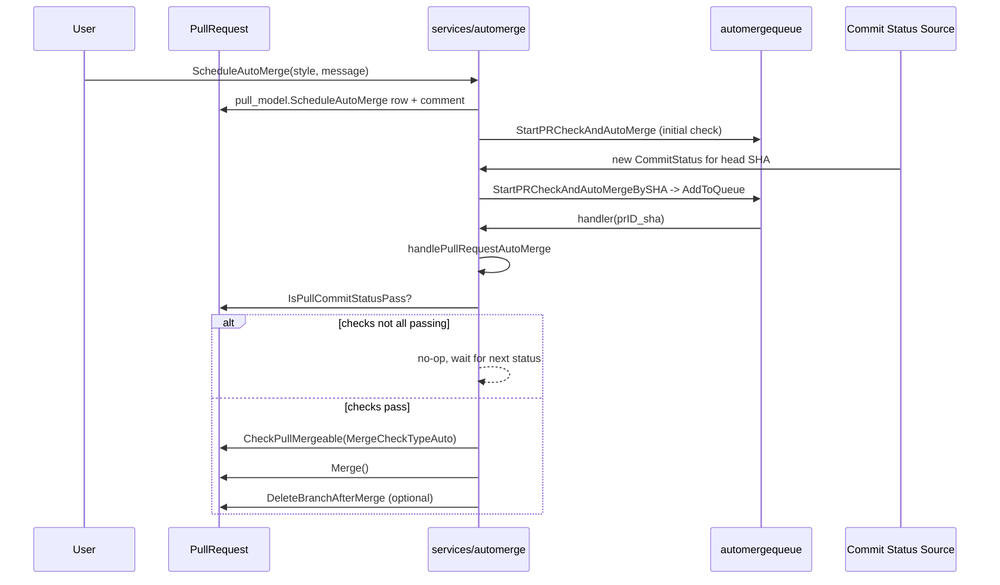

# Branch Protection & Merge

This page documents how Gitea decides whether a pull request is allowed to merge: the
`ProtectedBranch` rule engine (`models/git/protected_branch.go`), the merge-check pipeline
(`services/pull`), and the two ways a merge can be triggered without a human clicking "Merge" at
that exact moment — auto-merge (`services/automerge`) and the check queue that feeds it
(`services/automergequeue`).

Source: `models/git/protected_branch*.go`, `services/pull/{check,merge,review}.go`,
`services/automerge/automerge.go`, `services/automergequeue/automergequeue.go`.

## The `ProtectedBranch` Rule

A repository can have zero or more `ProtectedBranch` rows (`models/git/protected_branch.go`),
each matching either a plain branch name or a glob pattern (`RuleName`) against a `Priority`
order — `GetFirstMatchProtectedBranchRule(ctx, repoID, branchName)` returns the highest-priority
rule whose `Match(branchName)` succeeds, or `nil` if the branch is unprotected.

```go
type ProtectedBranch struct {
    ID       int64
    RepoID   int64
    RuleName string // branch name or glob, matched via Match()
    Priority int64

    CanPush                       bool     // allow direct push at all
    EnableWhitelist               bool     // if false, anyone with Code write access can push
    WhitelistUserIDs, WhitelistTeamIDs []int64

    CanForcePush                  bool
    EnableForcePushAllowlist      bool
    ForcePushAllowlistUserIDs, ForcePushAllowlistTeamIDs []int64
    ForcePushAllowlistDeployKeys  bool

    EnableMergeWhitelist          bool     // if false, anyone with Code write access can merge
    MergeWhitelistUserIDs, MergeWhitelistTeamIDs []int64

    EnableStatusCheck             bool
    StatusCheckContexts           []string // required CI contexts, e.g. "ci/build"

    EnableApprovalsWhitelist      bool     // restrict who counts as an "official" reviewer
    ApprovalsWhitelistUserIDs, ApprovalsWhitelistTeamIDs []int64
    RequiredApprovals             int64

    BlockOnRejectedReviews        bool     // any official "Request Changes" blocks merge
    BlockOnOfficialReviewRequests bool     // any pending official review request blocks merge
    BlockOnOutdatedBranch         bool     // head must not be behind base
    DismissStaleApprovals         bool     // new pushes dismiss prior approvals
    IgnoreStaleApprovals          bool     // stale approvals don't count toward RequiredApprovals

    RequireSignedCommits          bool

    ProtectedFilePatterns, UnprotectedFilePatterns string // glob lists, ';' separated

    EnableBypassAllowlist         bool     // who can force-merge past all the above
    BypassAllowlistUserIDs, BypassAllowlistTeamIDs []int64
    BlockAdminMergeOverride       bool     // if true, even repo admins can't bypass
}
```

Key helper methods/functions on `ProtectedBranch` (all in `models/git/protected_branch.go`):

| Function | Purpose |
|---|---|
| `Match(branchName)` | Plain-name (case-insensitive) or glob match, whichever `RuleName` implies |
| `CanUserPush(ctx, user)` | Direct-push permission: whitelist membership, or write access if whitelist disabled |
| `CanUserForcePush(ctx, user)` | Force-push permission — extends `CanUserPush`, checked against its own allowlist |
| `IsUserMergeWhitelisted(ctx, pb, userID, perm)` | Merge permission: whitelist membership, or write access if whitelist disabled |
| `IsUserOfficialReviewer(ctx, pb, user)` | Whether a review from this user counts toward `RequiredApprovals` |
| `CanBypassBranchProtection(ctx, pb, user, isRepoAdmin)` | Force-merge permission: repo admin (unless `BlockAdminMergeOverride`), or bypass-allowlist member |
| `GetProtectedFilePatterns()` / `GetUnprotectedFilePatterns()` | Parsed `glob.Glob` slices from the semicolon-separated pattern strings |
| `MergeBlockedByProtectedFiles(changedFiles)` | True if any changed file matches a protected pattern and isn't excluded by an unprotected pattern |

## The Merge-Check Pipeline — `services/pull`

### `CheckPullMergeable` (`services/pull/check.go`)

This is the single entry point every merge path goes through — the "Merge" button, the API merge
endpoint, and scheduled auto-merge all call it before touching git:

```go
func CheckPullMergeable(stdCtx context.Context, doer *user_model.User, perm *access_model.Permission,
    pr *issues_model.PullRequest, mergeCheckType MergeCheckType, mergeStyle repo_model.MergeStyle,
    forceMerge bool) error
```

Inside a DB transaction, in order:

1. `pr.HasMerged` → `ErrHasMerged`.
2. Issue closed → `ErrIsClosed`.
3. `IsUserAllowedToMerge` (doer has write access, or is on the branch's merge whitelist) →
   otherwise `ErrNoPermissionToMerge`.
4. If `mergeCheckType == MergeCheckTypeManually` (the "mark as manually merged" button), **all
   further checks are skipped** — the rest of this function only applies to real merges.
5. Work-in-progress title prefix (`WIP:`, `[WIP]`, …) → `ErrIsWorkInProgress`.
6. Not `IsStatusMergeable()` and not empty → `ErrNotMergeableState` (still conflict-checking, or a
   real conflict was found by the background checker).
7. `IsChecking()` → `ErrIsChecking`.
8. **`CheckPullBranchProtections`** (see below) — the branch-protection gate itself.
9. `checkSigningRequirements` — enforces `RequireSignedCommits` against the chosen merge style.
10. `IssueNoDependenciesLeft` → `ErrDependenciesLeft` if the issue still has open blocking
    dependencies.

### `CheckPullBranchProtections` (`services/pull/merge.go`)

```go
func CheckPullBranchProtections(ctx context.Context, pr *issues_model.PullRequest,
    skipProtectedFilesCheck bool) (err error)
```

1. Loads the first matching `ProtectedBranch` for `pr.BaseBranch`; if none, the PR is unconditionally
   mergeable (unprotected branch) and the function returns `nil` immediately.
2. `IsPullCommitStatusPass` (`services/pull/commit_status.go`) aggregates the latest `CommitStatus`
   rows for the head commit, restricted to `StatusCheckContexts` if `EnableStatusCheck` is set, via
   `git_model.CalcCommitStatus` — anything less than all-success fails with `ErrNotReadyToMerge`
   wrapping `"Not all required status checks successful"`.
3. `issues_model.HasEnoughApprovals(ctx, pb, pr)` — `true` if `RequiredApprovals == 0`, otherwise
   counts `Review` rows with `Type=Approve, Official=true, Dismissed=false` (and `Stale=false` too
   if `IgnoreStaleApprovals`) and compares against `RequiredApprovals`.
4. `issues_model.MergeBlockedByRejectedReview` — if `BlockOnRejectedReviews`, any official,
   non-dismissed `Reject` review blocks merge.
5. `issues_model.MergeBlockedByOfficialReviewRequests` — if `BlockOnOfficialReviewRequests`, any
   pending official review request (`Type=Request, Official=true`) blocks merge.
6. `issues_model.MergeBlockedByOutdatedBranch` — if `BlockOnOutdatedBranch`, `pr.CommitsBehind > 0`
   blocks merge.
7. Unless `skipProtectedFilesCheck`, `pb.MergeBlockedByProtectedFiles(pr.ChangedProtectedFiles)`
   blocks merge if the PR touches a protected path.

Every failure in steps 2–7 is `util.ErrorWrap(ErrNotReadyToMerge, "<reason>")` — the caller can
`errors.Is(err, ErrNotReadyToMerge)` to distinguish "not ready yet" from a hard permission error.

### Force-Merge and Auto-Merge Bypass (back in `CheckPullMergeable`)

When `CheckPullBranchProtections` returns `ErrNotReadyToMerge`, `CheckPullMergeable` gives it one
more chance to be waived, in order:

- **`mergeCheckType == MergeCheckTypeAuto`** (a scheduled auto-merge check) unconditionally clears
  the error — the reasoning is that auto-merge already re-validates commit status separately
  (`handlePullRequestAutoMerge` calls `IsPullCommitStatusPass` itself), and any remaining protection
  failure at this exact instant is expected to resolve as more checks complete.
- **`forceMerge == true`** (the doer clicked "Force Merge"): computed via
  `access_model.IsUserRepoAdmin` + `git_model.CanBypassBranchProtection(ctx, pb, doer, isRepoAdmin)`.
  A non-admin can still bypass if they're on `BypassAllowlistUserIDs`/`TeamIDs`; an admin can be
  *blocked* from bypassing if `BlockAdminMergeOverride` is set.

If neither applies, the original `ErrNotReadyToMerge` is returned and the merge is refused.

### Signed-Commit Requirements — `checkSigningRequirements`

`RequireSignedCommits` is checked differently depending on `mergeStyle`, because different merge
strategies produce commits differently:

| Merge style | What gets verified |
|---|---|
| `fast-forward-only` | No new commit is created — only the user's existing head commits must already be signed/verified (`asymkey_service.AllHeadCommitsVerified`) |
| `merge` | Both: the user's head commits must be verified, **and** Gitea's own signing key must be configured to sign the merge commit |
| `rebase`, `rebase-merge`, `squash` | Gitea rewrites/creates every resulting commit, so only Gitea's own signing capability is checked — the original commits' signatures don't matter post-rewrite |

An unsatisfied requirement returns `ErrHeadCommitsNotAllVerified` or a signing-configuration error,
which surfaces to the pushing/merging user through the same error-wrapping path as other merge
checks.

## Scheduled Auto-Merge — `services/automerge` + `services/automergequeue`

Auto-merge lets a user schedule "merge this PR automatically once its checks pass" without staying
on the page. It is a **separate, decoupled subsystem** from the main check pipeline:

```go
// services/automergequeue/automergequeue.go
var AutoMergeQueue *queue.WorkerPoolQueue[string]
var AddToQueue = func(pr *issues_model.PullRequest, sha string) { ... } // pushes "<prID>_<sha>"
func StartPRCheckAndAutoMerge(ctx context.Context, pull *issues_model.PullRequest)
```

`services/automerge/automerge.go` owns the queue's `handler`:

1. **`ScheduleAutoMerge(ctx, doer, pull, style, message, deleteBranchAfterMerge)`** — inside a
   transaction, writes a `pull_model.ScheduleAutoMerge` row and posts a
   `CommentTypePRScheduledToAutoMerge` comment; on success, calls
   `automergequeue.StartPRCheckAndAutoMerge` to kick off an immediate check.
2. **`RemoveScheduledAutoMerge(ctx, doer, pull)`** — deletes the scheduled row and posts a
   `CommentTypePRUnScheduledToAutoMerge` comment.
3. **`StartPRCheckAndAutoMergeBySHA(ctx, sha, repo)`** — called whenever a commit status is
   reported for `sha` (see commit-status webhook/API handlers); resolves which open, non-merged
   PRs have that SHA as their head (via `refs/pull/<n>/head` matching, `git.PullPrefix`) and enqueues
   each one via `automergequeue.AddToQueue`. This is what actually re-triggers the check every time
   CI reports a new status, not just once at schedule time.
4. **`handler(items ...string)`** parses each `"<prID>_<sha>"` item and calls
   `handlePullRequestAutoMerge(pullID, sha)`.
5. **`handlePullRequestAutoMerge`**:
   - Re-loads the PR and confirms a `ScheduledPullRequestMerge` row still exists (the user may have
     cancelled it) — if not, no-op.
   - Confirms `sha` still matches the PR's current head commit — if the head moved on since this
     item was queued, this is a stale check for an old commit, so it no-ops (a fresh item for the
     new head will already be in flight).
   - Confirms the head branch/ref still exists (handles both `PullRequestFlowGithub` and the AGit
     flow, `refs/pull/<n>/head`).
   - `pull_service.IsPullCommitStatusPass(ctx, pr)` — if not all checks pass yet, no-op (it'll be
     retried on the next status update).
   - Loads the `doer` who originally scheduled the auto-merge and their `Permission` on the base
     repo, then calls `CheckPullMergeable(ctx, doer, &perm, pr, MergeCheckTypeAuto, style, false)` —
     this is the point where `MergeCheckTypeAuto` waives any lingering `ErrNotReadyToMerge` from
     branch protection, as described above. If it fails with `ErrNotReadyToMerge` for a reason
     *other* than protection (e.g. the scheduler no longer has permission), it stays failed and the
     PR page is expected to surface the stale-schedule error on next view.
   - `pull_service.Merge(ctx, pr, doer, style, "", message, true)` performs the actual merge.
   - `pull_service.ShouldDeleteBranchAfterMerge` + `repo_service.DeleteBranchAfterMerge` clean up the
     head branch if the scheduler asked for it.



## Manual Merge (Marking as Merged Without Gitea Performing It)

`MergedManually` (`services/pull/merge.go`) supports repositories that allow recording a PR as
merged when the merge actually happened outside Gitea's control (e.g. squash-merged via a git push
directly to the base branch):

1. Verifies the merge style `manually-merged` is allowed for the unit.
2. Validates the supplied commit ID belongs to `pr.BaseBranch` (`baseGitRepo.IsCommitInBranch`).
3. Calls `SetMerged` with `PullRequestStatusManuallyMerged`, which — inside a transaction — marks
   `HasMerged=true`, clears `ConflictedFiles`, closes the issue, deletes any scheduled auto-merge
   row, and updates repository/milestone counters.
4. Sends `notify_service.MergePullRequest` and posts cross-reference "closes" comments.

Because `CheckPullMergeable` short-circuits all branch-protection/status/review checks when
`mergeCheckType == MergeCheckTypeManually`, this path is intentionally exempt from the protection
gate — it is documenting a merge that already happened, not performing one.

## Related Pages

- [Issue Tracking Workflow](issue-tracking-workflow.md)
- [Code Review & Comments](code-review-and-comments.md)
- [Issues & Pull Requests Model](../05-database-models/issues-and-pulls-model.md)
