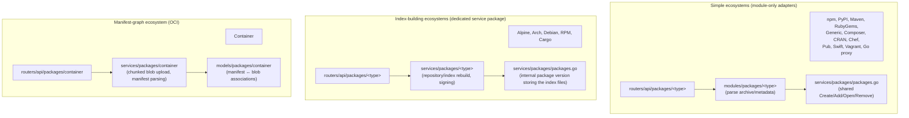

# Protocol Adapters

Every one of the [22+ package ecosystems](supported-ecosystems.md) shares the same five
database tables ([Database Schema](database-schema.md)) and the same low-level storage/hashing
primitives ([Shared Infrastructure](shared-infrastructure.md)). What actually differs between
`npm publish`, `cargo publish`, `docker push`, and `apt-get install` is the **wire protocol** —
the specific HTTP paths, request/response bodies, and index-file formats each native client
already expects. This page documents the adapter layer that translates each of those protocols
into calls against the shared services/models, and calls out the ecosystems that need
additional service-layer machinery beyond a simple upload/download.

> For the full route-by-route endpoint reference (HTTP verbs, paths, and auth), see
> [Packages & Actions API](../07-rest-api/packages-and-actions-api.md#packages-registry-api-routersapipackages)
> in the REST API section — this page focuses on *how the adapters are implemented*, not on
> enumerating every path.

## Anatomy of an Adapter

A protocol adapter is composed of up to three packages that mirror the general
[Services](../08-services/README.md) / [Web Routers](../06-web-routers/README.md) split used
throughout Gitea:

| Layer | Package | Responsibility |
|-------|---------|-----------------|
| Router | `routers/api/packages/<type>` | Speaks the wire protocol: parses the ecosystem's specific request shape (multipart form, JSON body, OData/Atom XML, sparse-index paths, ...), writes the expected response shape |
| Module | `modules/packages/<type>` | Pure, HTTP/DB-free functions that parse the ecosystem's archive/metadata format (`ParsePackage`, `ParsePackageMetaData`, `ParseManifestMetadata`, ...) and validate names/versions |
| Service | `services/packages/<type>` (only for ecosystems that need index/repository regeneration or signing — see below) | Orchestrates multi-file index rebuilds, GPG signing, and other stateful operations too heavyweight for a router handler |

Simple ecosystems (npm, PyPI, Maven, RubyGems, Generic, Composer, CRAN, Chef, Pub, Swift,
Vagrant, Go proxy) only need the first two layers — their router handlers call straight into
the shared `services/packages/packages.go` helpers (`CreatePackageAndAddFile`,
`AddFileToExistingPackage`, `OpenFileForDownload`, ...) documented in
[Package Upload/Download Flow](package-flow.md). Ecosystems whose *native protocol* requires
Gitea to generate and serve a repository-wide index (Alpine, Arch, Debian, RPM, Cargo) or to
model multi-blob manifests (Container/OCI) get a dedicated `services/packages/<type>` package.



## Index-Rebuilding Adapters

Alpine, Arch, Debian, RPM, and Cargo don't just store an uploaded file — their native clients
expect to `GET` a **repository-wide index** (an `APKINDEX.tar.gz`, a `packages.db`, a
`Packages`/`Release` file set, a `repodata/` directory, or a Cargo sparse-index JSON-lines
file) that lists every package currently published under that owner. Gitea builds these index
files on the fly and stores them as the files of a single **internal, hidden package version**
(`PackageVersion.IsInternal = true`) created via the shared
`services/packages.GetOrCreateInternalPackageVersion` helper — reusing the exact same
`Package`/`PackageVersion`/`PackageFile`/`PackageBlob` tables as any other package, just marked
so it never shows up in the package list UI.

### Common shape: `GetOrCreateRepositoryVersion` / `BuildAllRepositoryFiles` / `BuildSpecificRepositoryFiles`

Alpine (`services/packages/alpine/repository.go`), Debian (`services/packages/debian/repository.go`),
RPM (`services/packages/rpm/repository.go`), and Arch (`services/packages/arch/repository.go`)
all expose the same three-function pattern:

```go
// GetOrCreateRepositoryVersion gets or creates the internal repository package
func GetOrCreateRepositoryVersion(ctx context.Context, ownerID int64) (*packages_model.PackageVersion, error) {
    return packages_service.GetOrCreateInternalPackageVersion(ctx, ownerID, packages_model.TypeDebian,
        debian_module.RepositoryPackage, debian_module.RepositoryVersion)
}

// BuildAllRepositoryFiles (re)builds all repository files for every available distributions,
// components and architectures
func BuildAllRepositoryFiles(ctx context.Context, ownerID int64) error { ... }

// BuildSpecificRepositoryFiles builds index files for one distribution/component/architecture
// (or one repository/architecture for Alpine/Arch, one repo group for RPM) — called after a
// single upload/delete instead of rebuilding everything
func BuildSpecificRepositoryFiles(ctx context.Context, ownerID int64, /* ecosystem-specific dims */) error { ... }
```

`BuildAllRepositoryFiles` is invoked from the CLI/admin `doctor`-style regeneration paths and
after settings changes; `BuildSpecificRepositoryFiles` is invoked by the router handler
immediately after a package upload or delete so the index reflects the change without a full
rebuild of every distribution/architecture combination.

Each rebuild follows the same three steps, illustrated here with Debian's
`buildRepositoryFiles`:

1. **Delete stale index files** for the given dimension key (e.g.
   `distribution|component|architecture` for Debian, or the repository/architecture pair for
   Alpine/Arch) if there are no packages left matching it.
2. **Stream-generate the index** using a `packages_module.HashedBuffer` fanned out through
   `io.MultiWriter` to multiple compressed encodings simultaneously — Debian writes plain,
   gzip, *and* xz variants of `Packages` in a single pass over the package list:

   ```go
   packagesContent, _ := packages_module.NewHashedBuffer()
   packagesGzipContent, _ := packages_module.NewHashedBuffer()
   gzw := gzip.NewWriter(packagesGzipContent)
   packagesXzContent, _ := packages_module.NewHashedBuffer()
   xzw, _ := xz.NewWriter(packagesXzContent)
   w := io.MultiWriter(packagesContent, gzw, xzw)
   // ... write each package's Debian control stanza + Filename/Size/checksums to w ...
   ```

3. **Persist as files on the internal version** via
   `packages_service.AddFileToPackageVersionInternal`, with `OverwriteExisting: true` so a
   rebuild replaces the previous index file's blob rather than erroring on
   `ErrDuplicatePackageFile`.

### Repository signing (GPG)

Alpine, Arch, Debian, and RPM repositories are consumed by clients (`apk`, `pacman`, `apt`,
`dnf`/`yum`) that verify a **detached or clearsigned GPG signature** over the index before
trusting it. All four ecosystems implement the identical `GetOrCreateKeyPair` pattern:

```go
// GetOrCreateKeyPair gets or creates the PGP keys used to sign repository files
func GetOrCreateKeyPair(ctx context.Context, ownerID int64) (string, string, error) {
    priv, err := user_model.GetSetting(ctx, ownerID, debian_module.SettingKeyPrivate)
    pub, err := user_model.GetSetting(ctx, ownerID, debian_module.SettingKeyPublic)
    if priv == "" || pub == "" {
        priv, pub, err = generateKeypair() // openpgp.NewEntity + armor.Encode
        user_model.SetUserSetting(ctx, ownerID, debian_module.SettingKeyPrivate, priv)
        user_model.SetUserSetting(ctx, ownerID, debian_module.SettingKeyPublic, pub)
    }
    return priv, pub, nil
}
```

The keypair is generated once per owner (user or organization) on first use via
`github.com/ProtonMail/go-crypto/openpgp`, stored as user settings (`SettingKeyPrivate` /
`SettingKeyPublic`, per-ecosystem setting keys so a single owner can have independent Alpine,
Arch, Debian, and RPM signing keys), and never rotated automatically. The **public** key is
served back to clients at a well-known repo path (e.g. `GET /alpine/key`, `GET
/arch/repository.key`) so they can trust future signed indices; the router layer, not the
service layer, exposes that endpoint.

Debian additionally produces three signed artifacts per distribution — `Release` (plain),
`Release.gpg` (detached signature via `openpgp.ArmoredDetachSign`), and `InRelease`
(clearsigned via `openpgp.clearsign.Encode`) — matching the [Debian repository
format](https://wiki.debian.org/DebianRepository/Format#A.22Release.22_files) so both older
`apt` (which wants a separate `.gpg` file) and newer `apt` (which prefers the single
clearsigned `InRelease`) are satisfied by the same rebuild pass. RPM signs its `repomd.xml`
similarly; Arch signs each per-architecture `packages.db` archive.

### Cargo: sparse index over a Git repository, not a flat file

Cargo is the one index-building ecosystem that does **not** store its index as
`PackageFile` rows on an internal version. Instead, `services/packages/cargo/index.go`
maintains the index as commits in a dedicated **Gitea repository** named `_cargo-index` inside
the owning user/organization, reusing `services/repository/files` (the same code path that
backs the web-based file-edit API) to create/update files:

```go
const IndexRepositoryName = "_cargo-index"

func BuildPackagePath(name string) string {
    switch len(name) {
    case 1: return path.Join("1", name)
    case 2: return path.Join("2", name)
    case 3: return path.Join("3", string(name[0]), name)
    default: return path.Join(name[0:2], name[2:4], name)
    }
}

func RebuildIndex(ctx context.Context, doer, owner *user_model.User) error { /* rewrites every package's index file */ }
func UpdatePackageIndexIfExists(ctx context.Context, doer, owner *user_model.User, packageID int64) error { /* incremental */ }
func BuildPackageIndex(ctx context.Context, p *packages_model.Package) (*bytes.Buffer, error) { /* one crate's newline-delimited JSON entries */ }
```

`BuildPackagePath` implements Cargo's documented sharding scheme for the sparse index (1- and
2-character names get their own top-level bucket; 3+ character names are sharded by their
first four characters) so index file counts per directory stay bounded, mirroring the same
motivation as [`KeyToRelativePath`](shared-infrastructure.md#sharded-key-layout) for blob
storage — just applied to a Git tree instead of object storage. Each crate's index entry is one
line of JSON per published version (`IndexVersionEntry`), appended/rewritten by
`BuildPackageIndex`. `InitializeIndexRepository` provisions the `_cargo-index` repository (and
its `config.json`, served by `BuildConfig`, which tells `cargo` clients the `dl` download
endpoint and whether the registry requires auth) the first time an owner publishes a crate.

## Manifest-Graph Adapter: Container (OCI)

The container registry is architecturally the most complex adapter because the Docker
Registry HTTP API v2 / OCI Distribution Spec models a package as a **graph** of content-addressed
blobs (layers + config) referenced by a **manifest**, with support for chunked/resumable blob
uploads — a shape the other four `PackageFile`-per-artifact ecosystems don't need.

### Chunked blob upload (`services/packages/container/blob_uploader.go`)

OCI clients (`docker push`, `podman push`) push large layers across multiple `PATCH` requests
rather than one big `PUT`. `BlobUploader` bridges this streaming upload to Gitea's blob model:

```go
// BlobUploader handles chunked blob uploads
type BlobUploader struct {
    *packages_model.PackageBlobUpload
    *packages_module.MultiHasher
    file    *os.File
    reading bool
}

func NewBlobUploader(ctx context.Context, id string) (*BlobUploader, error) {
    model, err := packages_model.GetBlobUploadByID(ctx, id)
    hash := packages_module.NewMultiHasher()
    if len(model.HashStateBytes) != 0 {
        hash.UnmarshalBinary(model.HashStateBytes) // resume hashing from a previous PATCH
    }
    // opens (or creates) a temp file under AppDataTempDir("package-upload") keyed by upload id
}
```

Each `PATCH /v2/<name>/blobs/uploads/<uuid>` request:

1. Loads the in-progress `PackageBlobUpload` row (see
   [Database Schema — supporting tables](database-schema.md#supporting-tables)) and its
   serialized `MultiHasher` state.
2. Appends the new chunk to a temp file on disk **and** feeds it through the resumed hasher —
   so the whole blob is never buffered in memory and never re-hashed from the start.
3. Persists the updated `BytesReceived` and `HashStateBytes` back onto the row so the *next*
   `PATCH` (which may hit a different Gitea process behind a load balancer, since state lives
   in the DB/temp-dir rather than in-memory) can resume correctly.
4. On the final request (`PUT` with no body, or a `PATCH` immediately followed by finalize),
   the accumulated file and its now-complete `MultiHasher` sums are handed to the same
   `packages_service.NewPackageBlob` / `GetOrInsertBlob` path used by every other ecosystem,
   so container blobs still fully participate in cross-ecosystem content-addressable
   deduplication ([Shared Infrastructure](shared-infrastructure.md)).

`errWriteAfterRead` and `errOffsetMismatch` guard against protocol violations (a client trying
to write after the uploader has already started being read back, or resuming at the wrong byte
offset relative to what the model believes has been received).

### Manifest parsing (`services/packages/container/common.go`)

`ParseManifestMetadata` is called when a client `PUT`s a manifest (`PUT
/v2/<name>/manifests/<reference>`). It decodes the OCI/Docker manifest JSON, looks up the
**config blob** the manifest references by digest (via `models/packages/container`'s
`GetContainerBlob`, one of the ecosystem-specific model extensions described in
[Database Schema](database-schema.md#ecosystem-specific-model-packages)), opens that blob from
the `ContentStore`, and hands it to `modules/packages/container.ParseImageConfig` to extract
image metadata (platform, created-by history, labels) that gets stored as the version's
`MetadataJSON`:

```go
func ParseManifestMetadata(ctx context.Context, rd io.Reader, ownerID int64, imageName string) (*v1.Manifest, *packages_model.PackageFileDescriptor, *container_module.Metadata, error) {
    var manifest v1.Manifest
    json.NewDecoder(rd).Decode(&manifest)
    configDescriptor, _ := container_service.GetContainerBlob(ctx, &container_service.BlobSearchOptions{
        OwnerID: ownerID, Image: imageName, Digest: manifest.Config.Digest.String(),
    })
    configReader, _ := packages.NewContentStore().OpenBlob(packages.BlobHash256Key(configDescriptor.Blob.HashSHA256))
    return &manifest, configDescriptor, container_module.ParseImageConfig(manifest.Config.MediaType, configReader), nil
}
```

This is also where the OCI adapter diverges from the generic upload flow documented in
[Package Upload/Download Flow](package-flow.md): a manifest doesn't carry its own content
directly — it's a pointer to blobs that were already uploaded in prior requests — so
`services/packages/container` must resolve those references before it can build a
`PackageFileCreationInfo` and hand off to the shared `AddFileToPackageVersionInternal`/
`CreatePackageAndAddFile` helpers.

### Auth: Bearer token exchange (`routers/api/packages/auth.go`)

Container (and Conan) clients authenticate via a Docker-Registry-style token exchange rather
than sending Basic/OAuth2 credentials on every request. `packages.Auth{}` (registered in
`CommonRoutes()`/`ContainerRoutes()`'s `verifyAuth` list alongside `OAuth2{}`, `Basic{}`,
`nuget.Auth{}`, and `chef.Auth{}`) verifies the short-lived Bearer token minted by
`services/packages/auth.go`'s `CreateAuthorizationToken`/`ParseAuthorizationToken`, resolving
it back to a `*user_model.User` — including special-cased **ghost user** (anonymous/public
pull, gated by `Auth.AllowGhostUser`) and **Actions user** (CI-triggered pushes) identities
that don't correspond to a real login. See [Supported Ecosystems —
Authentication](supported-ecosystems.md#authentication) for how this fits alongside the other
ecosystems' auth quirks, and [Packages & Actions API](../07-rest-api/packages-and-actions-api.md)
for the full route mounting/middleware chain (`verifyAuth`, `reqPackageAccess`) shared by every
ecosystem including Container.

### Cleanup (`services/packages/container/cleanup.go`)

Because manifests reference blobs rather than owning them exclusively, container image cleanup
(`Cleanup`, `ShouldBeSkipped`) must additionally guard against deleting a manifest whose blobs
are still referenced by another (e.g. shared base-image layers across tags), on top of the
generic [deferred-delete blob cleanup](package-flow.md#deletion-flow) every ecosystem shares.

## Related Pages

- [Supported Ecosystems](supported-ecosystems.md) — the full ecosystem reference table and
  where each one's router/module code lives.
- [Package Upload/Download Flow](package-flow.md) — the generic upload/download/delete
  sequence every simple adapter relies on.
- [Shared Infrastructure](shared-infrastructure.md) — content-addressable storage, hashing, and
  bounded file lists reused by every adapter, including the index-building and manifest-graph
  ones documented here.
- [Database Schema](database-schema.md) — the shared tables plus the ecosystem-specific model
  extensions (`models/packages/container`, `models/packages/debian`, `models/packages/rpm`, …)
  referenced above.
- [Packages & Actions API](../07-rest-api/packages-and-actions-api.md) — the full HTTP route
  reference, mounting, and authentication middleware chain for `/api/packages` and `/v2`.
