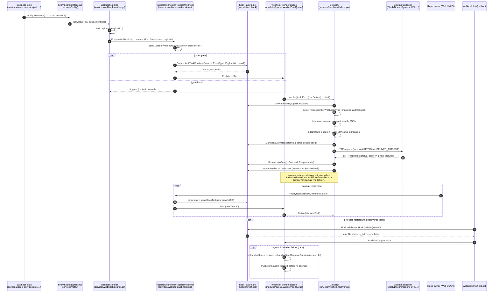

# Webhook Delivery Pipeline

This page traces the full lifecycle of an **outgoing webhook** delivery: from a domain event
firing somewhere in business logic, through payload construction, queuing, HTTP delivery, and
the retry/backoff behavior that keeps deliveries resilient to slow or failing endpoints. It is
verified against `services/webhook/`, `models/webhook/`, `modules/webhook/`, and `modules/queue/`.

> For the full fan-out architecture (webhooks are one of several notification consumers,
> alongside e-mail, the in-app inbox, and Actions), see
> [Notifications, Mailer & Webhooks](../09-core-modules/notify-mailer-webhook.md). This page
> focuses specifically on the webhook branch of that pipeline and goes one level deeper on
> delivery/retry mechanics.

## Pipeline overview

```
domain event                 payload                 HookTask row          HTTP delivery
(issue opened,      -->     construction     -->     created &      -->    (Deliver, with
 push received, ...)     (api.Payloader)             enqueued              signing headers)
      |                         |                        |                        |
      v                         v                        v                        v
notify.NewIssue(...)   IssuePayload{...}      webhook_model.CreateHookTask   webhookHTTPClient.Do()
webhookNotifier              (JSON)            + hookQueue.Push(task.ID)     -> record response
```

1. **Event trigger** — business-logic code (`services/issue`, `services/pull`,
   `services/repository`, `services/release`, `services/mailer`, `services/actions/notifier.go`
   for Actions events, etc.) calls a `notify.XXX(...)` dispatch function right after the
   relevant DB transaction commits (see
   [Notifications, Mailer & Webhooks](../09-core-modules/notify-mailer-webhook.md#the-notifynotifiable--notifier-pattern)).
2. **Fan-out** — `services/notify/notify.go` loops over every registered `notify.Notifier` and
   calls the matching method. `webhookNotifier` (`services/webhook/notifier.go`) is one of these
   registered notifiers.
3. **Payload construction** — the notifier method builds the canonical Gitea/Gogs-format
   `api.Payloader` (a struct in `modules/structs/hook.go`, e.g. `*api.IssuePayload`,
   `*api.PushPayload`) and calls `webhook.PrepareWebhooks(ctx, source, event, payload)`.
4. **Webhook matching & gating** — `PrepareWebhooks` collects every candidate `Webhook` row
   (repo-level, owner/org-level, and admin-defined system webhooks) and, for each, calls
   `PrepareWebhook`, which gates the delivery before it is even queued.
5. **`HookTask` creation & enqueue** — a gated-through event is serialized to JSON
   (`p.JSONPayload()`) and persisted as a `webhook_model.HookTask` row (`PayloadVersion: 2`,
   i.e. holding the original Gitea-format payload, not yet transformed for the target service),
   then the task's ID is pushed onto the `webhook_sender` queue.
6. **Delivery** — a queue worker (`handler` in `services/webhook/webhook.go`) pops task IDs,
   loads the `HookTask`, and calls `Deliver(ctx, task)` (`services/webhook/deliver.go`), which
   performs the type-specific payload transformation, signs the request, sends it over HTTP,
   and records the outcome back onto the `HookTask` and `Webhook` rows.

## Step 1–3: event trigger → payload construction

Every notifiable domain event has a corresponding method on the `notify.Notifier` interface
(`services/notify/notifier.go`). `webhookNotifier` (embedding `notify.NullNotifier` so it only
needs to override the events it cares about) implements the subset relevant to webhooks:

```go
// services/webhook/notifier.go
func init() {
    notify_service.RegisterNotifier(NewNotifier())
}

type webhookNotifier struct {
    notify_service.NullNotifier
}

func (m *webhookNotifier) ForkRepository(ctx context.Context, doer *user_model.User, oldRepo, repo *repo_model.Repository) {
    oldPermission, _ := access_model.GetDoerRepoPermission(ctx, oldRepo, doer)
    permission, _ := access_model.GetDoerRepoPermission(ctx, repo, doer)

    _ = PrepareWebhooks(ctx, EventSource{Repository: oldRepo}, webhook_module.HookEventFork, &api.ForkPayload{
        Forkee: convert.ToRepo(ctx, oldRepo, oldPermission),
        Repo:   convert.ToRepo(ctx, repo, permission),
        Sender: convert.ToUser(ctx, doer, nil),
    })
}
```

Each handler is responsible for:

- Resolving the `EventSource` — the `*repo_model.Repository` and/or `*user_model.User` (owner)
  whose configured webhooks should be considered.
- Choosing the `webhook_module.HookEventType` that best describes the event (see
  [Webhook Event Types & Payloads](webhook-event-types-and-payloads.md) for the full
  vocabulary).
- Building the canonical `api.Payloader` value with all the data a receiver needs — repository,
  sender, and event-specific fields (issue, PR, commits, release, ...) via `services/convert`
  helpers (`convert.ToRepo`, `convert.ToUser`, `convert.ToAPIIssue`, etc.).

This construction happens **synchronously**, in the same goroutine as the calling business
logic and the `notify.notifiers[]` fan-out loop — it must be fast and must not itself perform
network I/O, since a slow webhook-payload build would block every other notifier (mailer,
in-app inbox, Actions) as well as the original HTTP/git request.

## Step 4: webhook matching & gating (`PrepareWebhooks` / `PrepareWebhook`)

`PrepareWebhooks` (`services/webhook/webhook.go`) assembles the full candidate list of
`Webhook` rows for an event source:

```go
func PrepareWebhooks(ctx context.Context, source EventSource, event webhook_module.HookEventType, p api.Payloader) error {
    owner := source.Owner
    var ws []*webhook_model.Webhook

    if source.Repository != nil {
        repoHooks, _ := db.Find[webhook_model.Webhook](ctx, webhook_model.ListWebhookOptions{
            RepoID: source.Repository.ID, IsActive: optional.Some(true),
        })
        ws = append(ws, repoHooks...)
        owner = source.Repository.MustOwner(ctx)
    }
    if owner != nil {
        ownerHooks, _ := db.Find[webhook_model.Webhook](ctx, webhook_model.ListWebhookOptions{
            OwnerID: owner.ID, IsActive: optional.Some(true),
        })
        ws = append(ws, ownerHooks...)
    }
    systemHooks, _ := webhook_model.GetSystemWebhooks(ctx, optional.Some(true))
    ws = append(ws, systemHooks...)

    for _, w := range ws {
        if err := PrepareWebhook(ctx, w, event, p); err != nil {
            return err
        }
    }
    return nil
}
```

Three webhook "scopes" are unioned together for a single event: **repository** webhooks,
**owner** webhooks (the user or organization that owns the repository — organization-wide
webhooks apply to every repo in the org), and **system** webhooks (admin-configured, apply to
*every* repository/user on the instance, flagged by `Webhook.IsSystemWebhook`). Only
`IsActive` webhooks are considered.

For each candidate webhook, `PrepareWebhook` applies four independent gates before a
`HookTask` is even created:

| Gate | Check | Effect if it fails |
|---|---|---|
| Global kill switch | `setting.DisableWebhooks` (`[webhook]` config or `GITEA_DISABLE_WEBHOOKS` env in restricted environments) | No webhooks fire instance-wide, silently |
| Event subscription | `w.HasEvent(event)` — checks the webhook's `SendEverything`/`PushOnly`/`ChooseEvents` + per-event bitmap (see [Webhook Event Types & Payloads](webhook-event-types-and-payloads.md)) | Delivery skipped for *this* webhook only |
| Empty push suppression | For `*api.PushPayload` events on non-Gitea/Gogs webhook types (Slack, Discord, ...), a push with zero commits (e.g. a tag-only push) is dropped — integration-oriented webhook types (Gitea/Gogs) still receive it, since CI systems may care about ref-only pushes | Delivery skipped for chat-oriented webhook types |
| Branch filter | `checkBranchFilter(w.BranchFilter, ref)` — a glob (`gitea.dev/modules/glob`) matched against the payload's ref, only applicable to ref-bearing payloads (push/create/delete) | Delivery skipped for this webhook only |

A webhook that passes all four gates gets a `HookTask` row created and its `payload` embedded
as `PayloadContent` (`PayloadVersion: 2` — the *original* Gitea-format payload; type-specific
reshaping is deferred to delivery time so that a webhook's target-type/meta can be edited after
creation without needing to regenerate historical payload data):

```go
task, err := webhook_model.CreateHookTask(ctx, &webhook_model.HookTask{
    HookID:         w.ID,
    PayloadContent: string(payload),
    EventType:      event,
    PayloadVersion: 2,
})
...
return enqueueHookTask(task.ID)
```

`CreateHookTask` stamps a fresh UUID (`gouuid.New().String()`) used later as the
`X-Gitea-Delivery` header, and a `Delivered` timestamp placeholder. `enqueueHookTask` pushes
only the integer `task.ID` — not the payload itself — onto the queue, keeping queue messages
small; the worker re-loads the full row from the DB when it processes the ID.

`PrepareTestWebhook` is a sibling function used by the "Test Delivery" button/API
(`TestHook` in `routers/api/v1/repo/hook.go`) — it **bypasses** the event-subscription and
branch-filter gates (though it still respects `setting.DisableWebhooks`) so connectivity can be
verified even for webhooks that wouldn't otherwise match the synthesized test push event.

## Step 5–6: the sending queue and `Deliver`

### Queue setup

`webhook.Init()` (`services/webhook/deliver.go`, called during application start-up) creates
the `hookQueue`, a `queue.WorkerPoolQueue[int64]` named `webhook_sender`:

```go
func Init() error {
    timeout := time.Duration(setting.Webhook.DeliverTimeout) * time.Second
    allowedHostMatcher := hostmatcher.ParseHostMatchList("security.ALLOWED_HOST_LIST", setting.Webhook.AllowedHostList)

    webhookHTTPClient = &http.Client{
        Timeout: timeout,
        Transport: hostmatcher.NewHTTPTransport("webhook", allowedHostMatcher, nil,
            webhookProxy(allowedHostMatcher), setting.Webhook.ProxyURLFixed,
            &tls.Config{InsecureSkipVerify: setting.Webhook.SkipTLSVerify}),
    }

    hookQueue = queue.CreateUniqueQueue(graceful.GetManager().ShutdownContext(), "webhook_sender", handler)
    go graceful.GetManager().RunWithCancel(hookQueue)
    go graceful.GetManager().RunWithShutdownContext(populateWebhookSendingQueue)
    return nil
}
```

Key configuration (`[webhook]` section, `modules/setting/webhook.go`):

| Setting | Default | Purpose |
|---|---|---|
| `QUEUE_LENGTH` | 1000 | In-memory buffer size backing the queue |
| `DELIVER_TIMEOUT` | 5s | HTTP client timeout for a single delivery attempt |
| `SKIP_TLS_VERIFY` | false | Disable TLS certificate verification (self-signed endpoints) |
| `ALLOWED_HOST_LIST` | inherits `security.ALLOWED_HOST_LIST` | Restricts which hosts a webhook URL may resolve to (SSRF protection) |
| `PROXY_URL` / `PROXY_HOSTS` | empty | Route webhook requests for matching hosts through an HTTP(S) proxy |
| `PAGING_NUM` | 10 | Page size for the delivery-history UI |

It being a **`Unique`** queue means a given `int64` task ID can only be present once at a time —
if the same task ID is somehow pushed twice before being processed, the second push is a no-op
(`queue.ErrAlreadyInQueue`, swallowed by `enqueueHookTask`).

`populateWebhookSendingQueue` runs once at start-up in the background: it walks
`webhook_model.FindUndeliveredHookTaskIDs` in pages of 100 (ordered by ID) and re-enqueues every
task that was created but never marked delivered — this is what makes delivery **durable across
restarts**: a `HookTask` row surviving a crash/redeploy between "created" and "delivered" is
guaranteed to be retried once the process comes back up.

### The queue worker (`handler`)

```go
func handler(items ...int64) []int64 {
    ctx := graceful.GetManager().HammerContext()
    for _, taskID := range items {
        task, err := webhook_model.GetHookTaskByID(ctx, taskID)
        if err != nil { ... continue }
        if task.IsDelivered {
            continue // already delivered in the meantime
        }
        if err := Deliver(ctx, task); err != nil {
            log.Error("Unable to deliver webhook task[%d]: %v", task.ID, err)
        }
    }
    return nil
}
```

The worker pool (`modules/queue`, generic `WorkerPoolQueue[T]`) dynamically scales the number of
concurrent worker goroutines up to `[queue].WORKERS`/`MAX_WORKERS`-style limits (see
[Storage, Queue & Caching](../09-core-modules/storage-queue-cache.md)), batching multiple task
IDs into a single `handler` call when the queue is under load.

### `Deliver`: payload transformation, signing, and the HTTP call

`Deliver(ctx, t)` (`services/webhook/deliver.go`) is where the generic Gitea-format
`HookTask.PayloadContent` becomes an actual outbound HTTP request:

1. Load the parent `Webhook` row by `t.HookID`.
2. Look up a type-specific `Requester` in the `webhookRequesters` map (populated by each
   webhook type's `init()` calling `RegisterWebhookRequester`, e.g.
   `RegisterWebhookRequester(webhook_module.SLACK, newSlackRequest)`). If none is registered for
   `w.Type`, or the task's `PayloadVersion == 1` (a legacy pre-typed-payload row), fall back to
   `newDefaultRequest`, which sends the raw Gitea/Gogs JSON (or form-encoded) body unchanged.
3. Record the outgoing request (`URL`, method, headers, body) onto `t.RequestInfo` for the
   delivery-history UI, and attach the `Authorization` header from
   `w.HeaderAuthorization()` (an optionally-configured static header, stored encrypted via
   `secret.EncryptSecret`/`SetHeaderAuthorization` and redacted as `"******"` in the stored
   request log).
4. **Idempotent delivery guard**: `webhook_model.MarkTaskDelivered(ctx, t)` does a conditional
   `UPDATE ... WHERE is_delivered = false` — if another worker already claimed this task (e.g.
   after a queue re-push race), the update affects zero rows and `Deliver` returns early without
   sending a duplicate request.
5. Execute the HTTP request via the shared `webhookHTTPClient` (SSRF-guarded `Transport`,
   proxy-aware, TLS-verification configurable, request timeout enforced).
6. On response, `t.IsSucceed = resp.StatusCode/100 == 2` (any 2xx is success), the response
   status/headers are recorded, and the body is captured up to a 1 MiB cap
   (`util.ReadWithLimit`) to keep `hook_task.response_content` bounded.
7. In a deferred block: persist the final `HookTask` state (`UpdateHookTask`) and update the
   parent `Webhook.LastStatus` (`HookStatusSucceed`/`HookStatusFail`) — this is what drives the
   green/red status indicator shown next to each webhook in the settings UI.
8. A `recover()` guard wraps the whole function — a panic inside a type-specific `Requester`
   (a third-party integration bug) is logged and does not crash the delivery worker goroutine.

### Signing & identification headers

`addDefaultHeaders` computes two HMAC signatures over the raw payload bytes using the webhook's
`Secret`, then stamps a set of headers — deliberately including GitHub- and Gogs-compatible
aliases so a receiver written for either of those services also works unmodified with Gitea:

| Header | Meaning |
|---|---|
| `X-Gitea-Delivery` / `X-Gogs-Delivery` / `X-GitHub-Delivery` | The `HookTask.UUID` — unique per delivery attempt, useful for receiver-side deduplication |
| `X-Gitea-Event` / `X-Gogs-Event` / `X-GitHub-Event` | Normalized event name, e.g. `issues`, `pull_request` (collapses sub-events like `issue_assign` into their parent) |
| `X-Gitea-Event-Type` | The precise `HookEventType`, e.g. `pull_request_review_approved` |
| `X-Gitea-Signature` / `X-Gogs-Signature` | HMAC-SHA256 hex digest of the body |
| `X-Hub-Signature` | HMAC-SHA1, GitHub-style `sha1=<hex>` |
| `X-Hub-Signature-256` | HMAC-SHA256, GitHub-style `sha256=<hex>` |
| `X-Gitea-Hook-Installation-Target-Type` / `X-GitHub-Hook-Installation-Target-Type` | `system`, `repository`, `organization`, or `user` — derived from whether the webhook is a system hook, has a `RepoID`, or an `OwnerID` resolving to an org/user |

Receivers should verify at least one signature header against their configured webhook
`Secret` before trusting a delivery — Gitea does not require a secret, but strongly recommends
setting one for any webhook receiving sensitive event data.

## Retry & backoff behavior

Gitea's webhook delivery pipeline does **not** implement a classic "retry with exponential
backoff on HTTP 5xx" policy at the individual-delivery level — a `Deliver` call that fails (a
non-2xx response, a network error, or a `DELIVER_TIMEOUT` timeout) is recorded as
`IsSucceed = false` and is **not automatically retried**. This is a deliberate simplicity
trade-off: repo owners can inspect any failed delivery in the webhook's history and hit
**"Redeliver"**, which calls `ReplayHookTask`:

```go
// services/webhook/webhook.go
func ReplayHookTask(ctx context.Context, w *webhook_model.Webhook, uuid string) error {
    task, err := webhook_model.ReplayHookTask(ctx, w.ID, uuid)
    if err != nil {
        return err
    }
    return enqueueHookTask(task.ID)
}
```

`models/webhook.ReplayHookTask` copies the original task's `PayloadContent`/`EventType` into a
**brand-new** `HookTask` row (new UUID, `IsDelivered = false`) and the new row is pushed onto
`hookQueue` exactly like a fresh delivery — i.e. redelivery is "replay as a new delivery
attempt", not "resume/retry the old one".

Where *automatic* retry-like behavior does exist is one level below the delivery logic, in the
generic queue worker infrastructure (`modules/queue/workergroup.go`), and it is a resiliency
mechanism for the **queue itself**, not a per-HTTP-call retry policy:

- If the queue's `handler` function returns *unhandled* items (a batch where the handler could
  not process any item, e.g. because of a systemic problem — not a normal remote-server HTTP
  error, since `handler`/`Deliver` swallow those into the `HookTask` row and always return
  success to the queue), `doWorkerHandle` waits `unhandledItemRequeueDuration` (default **1
  second**) as a back-off pause, then re-`Push`es each unhandled item back onto the queue:

  ```go
  // modules/queue/workergroup.go
  unhandled := q.safeHandler(batch...)
  if len(unhandled) == len(batch) && unhandledItemRequeueDuration.Load() != 0 {
      log.Error("Queue %q failed to handle batch of %d items, backoff for a few seconds", q.GetName(), len(batch))
      select {
      case <-q.ctxRun.Done():
      case <-time.After(time.Duration(unhandledItemRequeueDuration.Load())):
      }
  }
  for _, item := range unhandled {
      if err := q.Push(item); err != nil {
          if !q.basePushForShutdown(item) {
              log.Error("Failed to requeue item for queue %q when calling handler: %v", q.GetName(), err)
          }
      }
  }
  ```

  Because the webhook `handler` never returns unhandled items for ordinary delivery
  failures (a failed HTTP delivery is still a "handled" outcome — it just recorded
  `IsSucceed = false`), this backoff path is effectively reserved for catastrophic failures
  such as the database being unreachable when `GetHookTaskByID`/`Deliver`'s bookkeeping calls
  fail outright.
- On graceful shutdown mid-flight, `basePushForShutdown` re-persists any in-flight items
  directly into the queue's durable backing store (LevelDB/Redis/etc., depending on
  `[queue]` configuration — see
  [Storage, Queue & Caching](../09-core-modules/storage-queue-cache.md)) so they are picked up
  again by `populateWebhookSendingQueue`-style recovery after restart, rather than lost.
- Cleanup of old delivery history (not retry, but related lifecycle) is handled separately by
  `webhook_model.CleanupHookTaskTable`, invoked from the periodic cron task described in
  [Admin Panel & Operations](../18-admin-guide/admin-panel-and-operations.md) — it deletes
  delivered `HookTask` rows either older than a configured age (`OlderThan`) or beyond a
  per-webhook retention count (`PerWebhook`), keeping the `hook_task` table from growing
  unbounded.

### Sequence diagram



## Related pages

* [Webhook Event Types & Payloads](webhook-event-types-and-payloads.md) — the full event
  vocabulary and payload schemas referenced by step 3 above
* [Third-Party Integrations](third-party-integrations.md) — OAuth2 app registration and other
  ways external systems integrate with Gitea beyond outgoing webhooks
* [Notifications, Mailer & Webhooks](../09-core-modules/notify-mailer-webhook.md) — the broader
  fan-out architecture (mailer, in-app inbox, Actions triggers) that webhooks are one branch of
* [Storage, Queue & Caching](../09-core-modules/storage-queue-cache.md) — the generic
  `WorkerPoolQueue` infrastructure and its configurable backing stores/worker scaling
* [Admin Panel & Operations](../18-admin-guide/admin-panel-and-operations.md) — the
  `hook_task` cleanup cron task and system webhook administration
* [REST API](../07-rest-api/README.md) — webhook management endpoints
  (`ListHooks`/`CreateHook`/`EditHook`/`DeleteHook`/`TestHook`)
