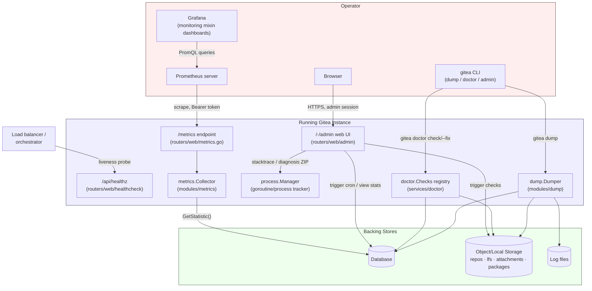

# Monitoring & Observability

Gitea exposes three complementary observability surfaces, each aimed at a
different consumer: a **Prometheus** `/metrics` endpoint for
dashboards/alerting, Go's built-in **`pprof`** profiling machinery
(surfaced both as raw stdlib profiles and as an admin-panel "download
everything" ZIP), and the **Grafana monitoring mixin** shipped under
`contrib/grafana-monitoring-mixin` that turns those metrics into
ready-made dashboards. A fourth, narrower surface — the `/api/healthz`
liveness probe — is covered in
[Events & Health Check](../06-web-routers/events-and-healthcheck.md) and is
only cross-referenced here.

## `/metrics` — the Prometheus Endpoint

### Enabling It

`/metrics` is registered conditionally in `routers/web/web.go`:

```go
if setting.Metrics.Enabled {
    prometheus.MustRegister(metrics.NewCollector())
    routes.Get("/metrics", append(mid, Metrics)...)
}
```

It is **off by default**. The `[metrics]` section of `app.ini`
(`modules/setting/metrics.go`) controls it:

```ini
[metrics]
ENABLED = false
TOKEN =
ENABLED_ISSUE_BY_LABEL = false
ENABLED_ISSUE_BY_REPOSITORY = false
```

| Setting | Effect |
|---|---|
| `ENABLED` | Master switch; when `false` the route is never registered at all (not even auth-gated — it's a 404). |
| `TOKEN` | If non-empty, every scrape must present `Authorization: Bearer <TOKEN>`; if empty, `/metrics` is served unauthenticated. |
| `ENABLED_ISSUE_BY_LABEL` | Emits the `gitea_issues_by_label{label="..."}` series (one series per label — can be high-cardinality on instances with many labels). |
| `ENABLED_ISSUE_BY_REPOSITORY` | Emits the `gitea_issues_by_repository{repository="owner/name"}` series (one series per repository — high-cardinality on large instances). |

Because unauthenticated Prometheus scraping exposes instance-wide counts
(users, repos, issues, etc. — not sensitive data, but still information
disclosure), setting `TOKEN` is recommended for any instance reachable
from outside a trusted network, and the two per-label/per-repository
breakdowns should generally stay disabled unless you specifically need
those dashboards, to avoid unbounded metric cardinality.

### Auth Enforcement (`routers/web/metrics.go`)

```go
func Metrics(resp http.ResponseWriter, req *http.Request) {
    if setting.Metrics.Token == "" {
        promhttp.Handler().ServeHTTP(resp, req)
        return
    }
    header := req.Header.Get("Authorization")
    if header == "" {
        http.Error(resp, "", http.StatusUnauthorized)
        return
    }
    got := []byte(header)
    want := []byte("Bearer " + setting.Metrics.Token)
    if subtle.ConstantTimeCompare(got, want) != 1 {
        http.Error(resp, "", http.StatusUnauthorized)
        return
    }
    promhttp.Handler().ServeHTTP(resp, req)
}
```

The comparison uses `crypto/subtle.ConstantTimeCompare` rather than `==`
specifically to avoid a timing side-channel that could let an attacker
brute-force the token byte-by-byte via response-time measurements. Note
this handler sits in the *unauthenticated* middleware chain
(`routes.Get("/metrics", append(mid, Metrics)...)`, registered before
`context.Contexter()` is even added to `mid`) — it does **not** go through
Gitea's normal session/API-token authentication, only this bearer-token
check.

### The Collector (`modules/metrics/collector.go`)

`Collector` implements `prometheus.Collector` (`Describe`/`Collect`) and
is registered once at startup with `prometheus.MustRegister`. Every scrape
triggers exactly one call to
`activities_model.GetStatistic(graceful.GetManager().ShutdownContext())`,
which runs a batch of `COUNT(*)`-style queries across the database — the
same statistics struct that backs the admin panel's
`/-/admin/monitor/stats` page (see
[Admin Panel & Operations](admin-panel-and-operations.md#monitor-cron-stats-queues--diagnostics)).
Because this is a live DB query on every scrape, keep Prometheus's
`scrape_interval` for this target reasonable (the upstream default
dashboards assume ~15s–1m) rather than scraping sub-second.

Exposed series, all under the `gitea_` namespace and all `Gauge`-typed
except `gitea_build_info` (a static `1` with informational labels):

| Metric | Labels | Source counter |
|---|---|---|
| `gitea_accesses` | — | `Counter.Access` |
| `gitea_attachments` | — | `Counter.Attachment` |
| `gitea_build_info` | `goarch`, `goos`, `goversion`, `version` | `runtime.GOARCH/GOOS/Version()`, `setting.AppVer` |
| `gitea_comments` | — | `Counter.Comment` |
| `gitea_follows` | — | `Counter.Follow` |
| `gitea_hooktasks` | — | `Counter.HookTask` |
| `gitea_issues` | — | `Counter.Issue` |
| `gitea_issues_open` / `gitea_issues_closed` | — | `Counter.IssueOpen` / `Counter.IssueClosed` |
| `gitea_issues_by_label` | `label` | `Counter.IssueByLabel[]` — only populated if `ENABLED_ISSUE_BY_LABEL` |
| `gitea_issues_by_repository` | `repository` (`owner/name`) | `Counter.IssueByRepository[]` — only populated if `ENABLED_ISSUE_BY_REPOSITORY` |
| `gitea_labels` | — | `Counter.Label` |
| `gitea_loginsources` | — | `Counter.AuthSource` |
| `gitea_milestones` | — | `Counter.Milestone` |
| `gitea_mirrors` | — | `Counter.Mirror` |
| `gitea_oauths` | — | `Counter.Oauth` |
| `gitea_organizations` | — | `Counter.Org` |
| `gitea_projects` | — | `Counter.Project` |
| `gitea_projects_boards` | — | `Counter.ProjectColumn` (metric name kept for backward compatibility with existing dashboards/alerts) |
| `gitea_publickeys` | — | `Counter.PublicKey` |
| `gitea_releases` | — | `Counter.Release` |
| `gitea_repositories` | — | `Counter.Repo` |
| `gitea_stars` | — | `Counter.Star` |
| `gitea_teams` | — | `Counter.Team` |
| `gitea_updatetasks` | — | `Counter.UpdateTask` |
| `gitea_users` | `state` (`active`/`inactive`) | `Counter.UsersActive` / `Counter.UsersNotActive` |
| `gitea_watches` | — | `Counter.Watch` |
| `gitea_webhooks` | — | `Counter.Webhook` |

These are the same series names the Grafana mixin's
`config.libsonnet` (`giteaStatMetrics`) references by name, so any custom
addition to the collector should be paired with a corresponding dashboard
panel if it's meant to be visualized. Beyond this application-level
collector, whichever Prometheus client library defaults `promhttp.Handler()`
also pulls in are exposed automatically — Go runtime metrics
(`go_goroutines`, `go_memstats_*`, `go_gc_duration_seconds`, etc.) and
process metrics (`process_cpu_seconds_total`, `process_resident_memory_bytes`),
which are why the Go-runtime panels on the shipped dashboards work without
any Gitea-specific code for them.

## `pprof` Profiling

Gitea does not mount the stdlib `net/http/pprof` handlers on a public
route. Instead, profiling is available through two admin-panel-gated
paths (both documented in depth in
[Admin Panel & Operations](admin-panel-and-operations.md#monitor-cron-stats-queues--diagnostics)):

- **`GET /-/admin/monitor/stacktrace`** — live goroutine listing via
  `process.GetManager().ProcessStacktraces(flat, noSystem)`
  (`modules/process/manager_stacktraces.go`), which layers Gitea's own
  process tracker (human-readable descriptions for long-running git
  commands, cron tasks, etc.) on top of raw goroutine dumps, rather than
  a bare `pprof.Lookup("goroutine")` dump. A specific tracked process can
  be cancelled directly from this page (`POST
  /-/admin/monitor/stacktrace/cancel/{pid}`).
- **`GET /-/admin/monitor/diagnosis`** — a single ZIP download
  (`routers/web/admin/diagnosis.go`) containing:
  - `goroutine-before.txt` — `pprof.Lookup("goroutine").WriteTo(f, 1)`
    captured immediately.
  - `cpu-profile.dat` — a genuine `pprof.StartCPUProfile`/
    `StopCPUProfile` sample, held open for a caller-chosen duration
    (`?seconds=N`, clamped 1–300s) so it can be opened directly with
    `go tool pprof cpu-profile.dat`.
  - `goroutine-after.txt` — a second goroutine dump taken once profiling
    stops, to diff against the first and spot goroutines that leaked
    during the profiled window.
  - `heap.dat` — `pprof.Lookup("heap").WriteTo(f, 0)`, analyzable with
    `go tool pprof heap.dat`.
  - `perftrace.txt` — the same slow-operation trace records shown on
    `/-/admin/monitor/perftrace`, rendered as plain timestamped text.

  This ZIP is the standard artifact to attach to a performance-related
  bug report, since it captures CPU, memory, and goroutine state from a
  single coherent moment in time without requiring shell access to the
  server.

Because `/-/admin/monitor/perftrace` can expose raw SQL text, it is hidden
from the admin UI entirely in production builds
(`ctx.Data["ShowAdminPerformanceTraceTab"] = !setting.IsProd` in
`stacktrace.go`'s `monitorTraceCommon`) — the diagnosis ZIP remains the
supported way to get equivalent data out of a production instance, since
the ZIP download itself is still admin-gated rather than being
world-readable.

## The Grafana Monitoring Mixin

`contrib/grafana-monitoring-mixin` is a [Jsonnet
mixin](https://github.com/monitoring-mixins/docs) — a portable,
version-controlled definition of Grafana dashboards (and, by mixin
convention, optionally alerts/recording rules) that compiles down to
plain dashboard JSON you import into Grafana yourself; Gitea does not
ship or manage a Grafana instance.

### Layout

| File | Purpose |
|---|---|
| `config.libsonnet` | Toggles (`showIssuesByRepository`, `showIssuesByLabel`, `showIssuesOpenClose`), the list of "simple stat" metrics to render as single-value panels (`giteaStatMetrics`), and a label→color map (`issueLabels`) for consistent issue-label graph coloring. |
| `dashboards/overview.libsonnet` | The actual dashboard definition — panels built from the `gitea_*` series above. |
| `mixin.libsonnet` | Entry point that assembles `config` + `dashboards` into the mixin object the tooling expects. |
| `jsonnetfile.json` / `jsonnetfile.lock.json` | `jsonnet-bundler` dependency manifest (pulls in `grafonnet`, the Grafana dashboard-building Jsonnet library). |
| `Makefile` | `make` target that runs `jb install` then `jsonnet` to render `dashboards/*.libsonnet` into importable JSON under `dashboards_out/`. |

### Building Dashboards from the Mixin

```bash
cd contrib/grafana-monitoring-mixin
go install github.com/jsonnet-bundler/jsonnet-bundler/cmd/jb@latest
go install github.com/google/go-jsonnet/cmd/jsonnet@latest
make
```

The resulting `dashboards_out/*.json` files are imported directly into
Grafana (**Dashboards → Import**) once a Prometheus data source scraping
your instance's `/metrics` endpoint is configured. `config.libsonnet`'s
`showIssuesByRepository`/`showIssuesByLabel` flags must match the
corresponding `ENABLED_ISSUE_BY_REPOSITORY`/`ENABLED_ISSUE_BY_LABEL`
`app.ini` settings — the panels are only meaningful if the underlying
series are actually being emitted. `dashboardRefresh: '1m'` and
`dashboardPeriod: 'now-1h'` in the same file are Grafana dashboard defaults
and can be freely edited before running `make` if a different refresh
cadence is desired.

## Comparison: `/metrics` vs. `/api/healthz`

| | `/metrics` | `/api/healthz` |
|---|---|---|
| Purpose | Time-series counters/gauges for dashboards & alerting | Binary liveness signal for load balancers/orchestrators |
| Format | Prometheus text exposition format | JSON (`{"status":"pass"}`) |
| Auth | Optional bearer token (`[metrics] TOKEN`) | None — always open |
| Cost per request | One DB statistics query + runtime metric collection | Effectively free |
| Enabled by | `[metrics] ENABLED = true` | Always registered |

See [Events & Health Check](../06-web-routers/events-and-healthcheck.md)
for the `/api/healthz` implementation and its pre-install variant.

## The Operator's Toolkit

The diagram below places every piece an operator reaches for — the CLI
subcommands, the `/admin` web UI, the `/metrics` scrape target, and the
Grafana mixin built on top of it — in relation to the running Gitea
process and its dependencies.



## Where to Go Next

| If you want to... | Go to |
|---|---|
| Trigger cron tasks, view queues, or download a diagnosis ZIP from a browser | [Admin Panel & Operations](admin-panel-and-operations.md) |
| Back up before making changes, or run integrity checks | [Backup, Restore & Doctor](backup-restore-and-doctor.md) |
| Configure `[metrics]` alongside the rest of `app.ini` | [Settings Catalog](../04-configuration/settings-catalog.md) |
| Understand the SSE/health-check routers in depth | [Events & Health Check](../06-web-routers/events-and-healthcheck.md) |
| Manage the instance from the CLI instead of the browser | [CLI & Admin Operations](../16-cli-admin/cli-commands.md) |
