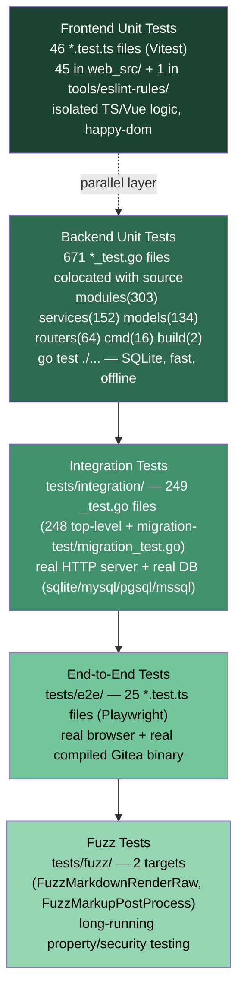

# Unit, Integration, E2E & Fuzz Testing

Gitea's test suite is layered into four tiers that trade off speed against realism: fast, isolated **backend unit tests**, database-backed **integration tests** run against a real HTTP server, browser-driven **end-to-end (e2e) tests** with Playwright, and continuous **fuzz testing** of security-sensitive parsers. A separate **frontend unit test** layer (Vitest) covers the TypeScript/Vue code. This page documents each layer, how to run it, and how test data (fixtures) is organized.

> All commands below were verified against this repository: `go test ./modules/util/...` passes, `pnpm exec vitest run <file>` passes, and `go test ./tests/fuzz/... -fuzz=FuzzMarkupPostProcess -fuzztime=10s` executes real fuzzing iterations (~20-40k execs/sec) against the Markdown/markup post-processing pipeline.

## The Test Pyramid



As you move down the pyramid, tests get slower and more expensive but exercise more of the real system: unit tests validate a single function/module in isolation; integration tests boot the actual Gitea web routes against a real database engine; e2e tests drive a real compiled Gitea binary through a real Chromium/Firefox browser; fuzz tests continuously hammer parsers with random/mutated input looking for crashes or panics. Layer widths are roughly proportional to file counts in this repository, verified with `find <dir> -name '*_test.go' -o -name '*.test.ts' | wc -l` for each tier: 671 backend unit test files vastly outnumber the 249 integration test files, which in turn outnumber the 25 e2e specs — the classic pyramid shape, with the 46 Vitest files forming a parallel, equally cheap layer alongside backend unit tests.

## 1. Backend Unit Tests

Backend unit tests are Go `*_test.go` files **colocated** with the code they test (e.g. `modules/util/string_test.go` next to `modules/util/string.go`). They are the bulk of Gitea's test coverage and run fully offline against SQLite.

### Structure

Most packages that touch the database provide a `main_test.go` with a `TestMain` that calls `unittest.MainTest`, defined in `models/unittest/testdb.go`:

```go
// models/organization/main_test.go
package organization_test

import (
	"testing"

	"gitea.dev/models/unittest"

	_ "gitea.dev/models"
	_ "gitea.dev/models/actions"
	_ "gitea.dev/models/activities"
	_ "gitea.dev/models/organization"
	_ "gitea.dev/models/repo"
	_ "gitea.dev/models/user"
)

func TestMain(m *testing.M) {
	unittest.MainTest(m)
}
```

`unittest.MainTest` (in `models/unittest/testdb.go`):

- Creates a temp work directory via `tempdir.OsTempDir("gitea-test")`.
- Calls `setting.SetupGiteaTestEnv()` to initialize paths/config for testing.
- Builds a fresh SQLite test database with `CreateTestEngine`, loading YAML fixtures from `models/fixtures/`.
- Registers a fast "dummy" password hasher so fixture passwords (`password`) validate quickly.
- Initializes cache, storage, and syncs `tests/gitea-repositories-meta` into the repo root.
- Runs `m.Run()` and returns its exit code.

Packages that need extra fixture files or setup/teardown hooks pass a `unittest.TestOptions{FixtureFiles: [...], SetUp: ..., TearDown: ...}`.

Individual test functions call `unittest.PrepareTestEnv(t)` at the top to reload fixtures and reset the repo directory between tests, keeping tests independent.

### `GITEA_TEST_LOG_SQL`

To debug SQL issued during unit tests, set `GITEA_TEST_LOG_SQL=1` (or `true`). This is read directly in `CreateTestEngine` (`models/unittest/testdb.go`):

```go
switch os.Getenv("GITEA_TEST_LOG_SQL") {
case "true", "1":
	x.ShowSQL(true)
}
```

```bash
GITEA_TEST_LOG_SQL=1 make test-backend
```

### Running backend unit tests

```bash
make test-backend
```

This expands to (see `Makefile`):

```makefile
GOTEST_FLAGS ?= -timeout 40m
GO_TEST_PACKAGES ?= $(filter-out \
    $(shell go list gitea.dev/models/migrations/...) \
    gitea.dev/tests/integration/migration-test \
    gitea.dev/tests gitea.dev/tests/integration, \
    $(shell go list ./... | grep -v /vendor/))

test-backend:
	go test $(GOTEST_FLAGS) -tags='$(TAGS)' $(GO_TEST_PACKAGES)
```

In other words: **every** Go package except `tests/integration`, `tests/integration/migration-test`, and `models/migrations/*` (which have their own dedicated targets, see below). Local runs default `GITEA_TEST_DATABASE` to `sqlite` unless `CI` is set (see the top of the `Makefile`), so unit tests never require an external database — anything under `models/` that needs DB access uses an isolated on-disk SQLite file per test binary run.

### Single-test selectors

```bash
# using go test directly
go test -run '^TestName$' ./modulepath/

# using the make "#" selector (dots are converted to "/" for subtests)
make test-backend#TestName
make test-backend#TestParent.TestSubtest
```

The Makefile rule behind the selector:

```makefile
test-backend\#%:
	go test $(GOTEST_FLAGS) -tags='$(TAGS)' -run $(subst .,/,$*) $(GO_TEST_PACKAGES)
```

### Coverage

```bash
make unit-test-coverage   # go test -cover -coverprofile coverage.out $(GO_TEST_PACKAGES)
make coverage             # merges coverage.out + integration.coverage.out into coverage.all
```

## 2. Integration Tests

Integration tests live in `tests/integration/` — **249 `_test.go` files** at last count (248 directly under `tests/integration/` plus `tests/integration/migration-test/migration_test.go`) — and exercise Gitea's real HTTP routes (`routers.NormalRoutes()`) against a real SQL database engine, using `net/http/httptest` to drive requests without actually opening a TCP socket.

### Test harness (`tests/integration/integration_test.go`)

```go
var testWebRoutes *web.Router

func testMain(m *testing.M) int {
	managerCtx, cancel := context.WithCancel(context.Background())
	graceful.InitManager(managerCtx)
	defer cancel()

	err := tests.InitIntegrationTest()
	if err != nil {
		return testlogger.MainErrorf("InitTest error: %v", err)
	}
	testWebRoutes = routers.NormalRoutes()

	err = unittest.InitFixtures(unittest.FixturesOptions{
		Dir: filepath.Join(setting.GetGiteaTestSourceRoot(), "models/fixtures/"),
	})
	// ...
	exitCode := m.Run()
	// cleanup indexer paths
	return exitCode
}

func TestMain(m *testing.M) {
	flag.Parse()
	if flag.Lookup("test.list").Value.String() != "" {
		os.Exit(m.Run()) // -test.list must skip DB init
	}
	os.Exit(testMain(m))
}
```

`tests.InitIntegrationTest()` (in `tests/test_utils.go`) wires everything together: writes a temporary `app.ini` from a template, resets/creates the test database (`unittest.ResetTestDatabase()`), initializes Git and storage, and calls `routers.InitWebInstalled(...)` to build the full router the same way the production binary does.

Requests are made with helpers such as `MakeRequest`, `NewRequestWithValues`, and a stateful `TestSession` (cookie jar) that supports `loginUser(t, "user2")` to simulate a logged-in browser session — no real network socket, but the full middleware/router/template stack executes.

### Choosing the database: `GITEA_TEST_DATABASE`

Integration tests are parameterized by the `GITEA_TEST_DATABASE` environment variable, which selects one of four `.ini.tmpl` templates in `tests/`:

| Value | Template | Notes |
|---|---|---|
| `sqlite` (default locally) | `tests/sqlite.ini.tmpl` | No external service needed; uses `level` queue for the issue indexer and `immediate` queues elsewhere |
| `mysql` | `tests/mysql.ini.tmpl` | Requires `TEST_MYSQL_HOST`, `TEST_MYSQL_DBNAME`, `TEST_MYSQL_USERNAME`, `TEST_MYSQL_PASSWORD` |
| `pgsql` | `tests/pgsql.ini.tmpl` | Requires `TEST_PGSQL_*` vars; also needs a MinIO container for object storage (`TEST_MINIO_ENDPOINT`) |
| `mssql` | `tests/mssql.ini.tmpl` | Requires `TEST_MSSQL_*` vars |

`modules/setting/testenv.go`'s `PrepareIntegrationTestConfig()` reads `GITEA_TEST_DATABASE` (defaulting to `sqlite` outside CI, and **erroring** if unset when `CI` is set), then renders the matching `.ini.tmpl` template by substituting `{{VAR_NAME}}` placeholders with environment variables (plus any `MAKEFILE_VARS` the Makefile forwarded) — for example `{{TEST_WORK_PATH}}` and `{{TEST_LOGGER}}`:

```go
func PrepareIntegrationTestConfig() error {
	testDatabase := os.Getenv("GITEA_TEST_DATABASE")
	if testDatabase == "" {
		if isInCI {
			return errors.New("GITEA_TEST_DATABASE environment variable not set")
		}
		testDatabase = "sqlite" // local dev default
	}
	// render tests/<db>.ini.tmpl -> tests/<db>.ini, substituting {{KEY}} placeholders
}
```

The rendered `.ini` is written next to the template (e.g. `tests/sqlite.ini`) and `GITEA_TEST_CONF` points the running process at it.

### Running integration tests

```bash
make test-integration
```

This compiles the integration package into a standalone test binary (so testify-style logging via `testlogger` doesn't flood verbose `go test -v` output) and executes it through `tools/test-integration.sh`:

```makefile
test-integration:
	go test $(GOTEST_FLAGS) -tags '$(TAGS)' -c gitea.dev/tests/integration -o ./test-integration-$(GITEA_TEST_DATABASE).test
	./tools/test-integration.sh ./test-integration-$(GITEA_TEST_DATABASE).test
```

`tools/test-integration.sh` runs the compiled binary directly, unless `TEST_SHARD`/`TEST_TOTAL_SHARDS` are set (used in CI to split the 249 test files across parallel workers by enumerating `-test.list='^Test'` and distributing test names round-robin — see the `pull-db-tests.yml` `test-pgsql-shard-1`/`test-pgsql-shard-2` jobs below for a concrete example with `total-shards: 2`).

### Single integration test selector

```bash
make test-integration#TestName
```

```makefile
test-integration\#%:
	go test $(GOTEST_FLAGS) -tags '$(TAGS)' -run $(subst .,/,$*) gitea.dev/tests/integration
```

> Note this path runs `go test -run` directly against the source package (not the pre-compiled binary), so it always runs sequentially and prints normal `go test` output.

### Running against MySQL / PostgreSQL / MSSQL

Each non-SQLite database requires a throwaway container plus matching `TEST_*` variables:

```bash
# MySQL
docker run -e "MYSQL_DATABASE=test" -e "MYSQL_ALLOW_EMPTY_PASSWORD=yes" -p 3306:3306 --rm --name mysql mysql:latest
GITEA_TEST_DATABASE=mysql TEST_MYSQL_HOST=localhost:3306 TEST_MYSQL_DBNAME=test \
  TEST_MYSQL_USERNAME=root TEST_MYSQL_PASSWORD='' make test-integration

# PostgreSQL (also needs MinIO for storage)
docker run -e "POSTGRES_DB=test" -e "POSTGRES_USER=postgres" -e "POSTGRES_PASSWORD=postgres" -p 5432:5432 --rm --name pgsql postgres:latest
docker run --rm -p 9000:9000 -e MINIO_ROOT_USER=123456 -e MINIO_ROOT_PASSWORD=12345678 --name minio bitnamilegacy/minio:2023.8.31
GITEA_TEST_DATABASE=pgsql TEST_MINIO_ENDPOINT=localhost:9000 TEST_PGSQL_HOST=localhost:5432 \
  TEST_PGSQL_DBNAME=postgres TEST_PGSQL_USERNAME=postgres TEST_PGSQL_PASSWORD=postgres make test-integration

# MSSQL
docker run -e "ACCEPT_EULA=Y" -e "MSSQL_PID=Standard" -e "SA_PASSWORD=MwantsaSecurePassword1" -p 1433:1433 --rm --name mssql microsoft/mssql-server-linux:latest
GITEA_TEST_DATABASE=mssql TEST_MSSQL_HOST=localhost:1433 TEST_MSSQL_DBNAME=gitea_test \
  TEST_MSSQL_USERNAME=sa TEST_MSSQL_PASSWORD=MwantsaSecurePassword1 make test-integration
```

> `unittest.ResetTestDatabase()` (in `models/unittest/testdb.go`) enforces safety: for SQLite the file path must end in `-test.db`, and for other engines the database name must contain the substring `test` — this prevents integration tests from ever running against a production-looking database by accident.

If you see errors about a mismatched schema version or SSH push failures after switching branches, do a clean rebuild first: `make clean build`.

### Migration tests

A related but separate target validates upgrading real historic database dumps through every registered migration:

```bash
make test-migration   # = migrations.integration.test + migrations.individual.test
```

- `migrations.integration.test` runs `tests/integration/migration-test/migration_test.go`, which restores compressed SQL dumps named `gitea-v<version>.<dbtype>.sql.gz` and replays all migrations in `models/migrations/` on top of them, asserting the schema converges correctly regardless of starting version.
- `migrations.individual.test` runs the per-migration Go tests under `models/migrations/*` (each migration package has its own `_test.go`), using isolated fixture folders under `models/migrations/fixtures/Test_<MigrationName>/` — e.g. `Test_AddIssueResourceIndexTable/`, `Test_RemoveInvalidLabels/`. Because these tests share one database, they run with `-p 1` (no package parallelism).

```bash
make migrations.individual.test#<migration_package_name>   # run a single migration's test package
```

## 3. Frontend Unit Tests (Vitest)

Frontend logic — utility functions, Vue components, small modules under `web_src/js/` — is unit tested with **Vitest**, configured in `vitest.config.ts`:

```ts
export default defineConfig({
  test: {
    include: [
      'web_src/**/*.test.ts',
      'tools/eslint-rules/**/*.test.ts',
    ],
    setupFiles: ['web_src/js/vitest.setup.ts'],
    environment: 'happy-dom',
    testTimeout: 20000,
    globals: true,
    isolate: false,
    sequence: { concurrent: true },
  },
  plugins: [stringPlugin(), vuePlugin()],
});
```

Tests live alongside the code they cover (46 files at last count — 45 under `web_src/` plus 1 under `tools/eslint-rules/`, both matched by the `vitest.config.ts` `include` globs above), e.g. `web_src/js/utils/string.test.ts`:

```ts
import {cutString} from './string.ts';

test('cutString', () => {
  let [before, after, ok] = cutString('a = b = c', '=');
  expect(before).toBe('a ');
  expect(after).toBe(' b = c');
  expect(ok).toBe(true);
});
```

Other notable suites: `web_src/js/svg.test.ts`, `web_src/js/markup/mermaid.test.ts`, `web_src/js/modules/fetch.test.ts`, `web_src/js/components/ActionRunView.test.ts`, `web_src/js/webcomponents/relative-time.test.ts`.

Running `pnpm exec vitest run web_src/js/utils/string.test.ts web_src/js/svg.test.ts` in this environment produced:

```
✓ web_src/js/utils/string.test.ts (1 test) 1ms
✓ web_src/js/svg.test.ts (3 tests) 8ms

Test Files  2 passed (2)
     Tests  4 passed (4)
```

### Running frontend unit tests

```bash
make test-frontend        # pnpm exec vitest (watch=false, runs the full suite once)

# single file or filter (path is a substring match)
pnpm exec vitest <path-filter>
pnpm exec vitest run web_src/js/utils/string.test.ts   # run once, no watch mode
```

## 4. End-to-End Tests (Playwright)

E2E tests in `tests/e2e/` (25 `*.test.ts` files at last count) drive a **real, compiled Gitea binary** through a **real browser** using [Playwright](https://playwright.dev/), configured in `playwright.config.ts`:

```ts
const timeoutFactor = Number(env.GITEA_TEST_E2E_TIMEOUT_FACTOR) || 1;
const timeout = 5000 * timeoutFactor;

export default defineConfig({
  workers: '50%',
  fullyParallel: true,
  testDir: './tests/e2e/',
  outputDir: './tests/e2e-output/',
  testMatch: /.*\.test\.ts/,
  timeout: 2 * timeout,
  expect: { timeout },
  use: {
    baseURL: env.GITEA_TEST_E2E_URL?.replace?.(/\/$/, ''),
    locale: 'en-US',
    actionTimeout: timeout,
    navigationTimeout: 2 * timeout,
  },
  projects: [
    { name: 'chromium', use: {...devices['Desktop Chrome'], permissions: ['clipboard-read', 'clipboard-write']} },
    { name: 'firefox', use: {...devices['Desktop Firefox']} },
  ],
});
```

### What `make test-e2e` actually does

```makefile
playwright: deps-frontend
	./tools/test-e2e.sh install

test-e2e: playwright frontend backend
	./tools/test-e2e.sh run $(GITEA_TEST_E2E_FLAGS)
```

`tools/test-e2e.sh` (bash) performs a full, isolated environment setup:

1. Detects whether Playwright browsers can run locally (Ubuntu/Debian host) or must run inside a **container** (`PLAYWRIGHT_MODE=container`, using the official `mcr.microsoft.com/playwright:v<version>-noble` image) — useful on macOS/other distros.
2. On `install`, installs Chromium + Firefox (with OS deps unless running on GitHub Actions, where they're preinstalled).
3. On `run`, creates an isolated `$WORK_DIR`, picks a free TCP port, and writes a throwaway `app.ini` (SQLite DB, `INSTALL_LOCK=true`, captcha disabled, a `markup.test-external` renderer for external-render tests, fast event-source polling).
4. Starts `./gitea web` in the background (`GITEA_TEST_E2E=true`), waits (up to 120s) for `curl` to get a response.
5. Creates an admin user via `./gitea admin user create --username e2e-admin --password password --admin`.
6. Exports `GITEA_TEST_E2E_URL`, `GITEA_TEST_E2E_USER`, `GITEA_TEST_E2E_PASSWORD`, `GITEA_TEST_E2E_DOMAIN`, `GITEA_TEST_E2E_EMAIL`, and `GITEA_TEST_E2E_TIMEOUT_FACTOR` (default `4` on CI, `1` locally).
7. Finally runs `pnpm exec playwright test "$@"`, tearing down the server/container on exit via a `trap cleanup EXIT`.

### Example e2e test (`tests/e2e/login.test.ts`)

```ts
import {env} from 'node:process';
import {test, expect} from '@playwright/test';
import {logout} from './utils.ts';

test('login form and logout', async ({page}) => {
  await page.goto('/user/login');
  await page.getByLabel('Username or Email Address').fill(env.GITEA_TEST_E2E_USER);
  await page.getByLabel('Password').fill(env.GITEA_TEST_E2E_PASSWORD);
  await page.getByRole('button', {name: 'Sign In'}).click();
  await expect(page.getByRole('link', {name: 'Sign In'})).toBeHidden();
  await logout(page);
});
```

`tests/e2e/utils.ts` provides API-driven fixtures for e2e specs (creating repos, orgs, teams, files, branches, starting stopwatches, etc.) via the real REST API (`apiCreateRepo`, `apiCreateOrg`, `apiCreateTeam`, ...), including retry-with-backoff logic for flaky `5xx` responses — so tests can set up state quickly via API calls and only use browser interactions for the behavior under test.

### Running e2e tests

```bash
make test-e2e
```

Run a single spec file by passing it through `GITEA_TEST_E2E_FLAGS` (forwarded as extra Playwright CLI args):

```bash
GITEA_TEST_E2E_FLAGS='tests/e2e/login.test.ts' make test-e2e
GITEA_TEST_E2E_FLAGS='--ui' make test-e2e         # interactive Playwright UI mode
```

| Variable | Description |
|---|---|
| `GITEA_TEST_E2E_DEBUG` | When set, show the Gitea server's stdout/stderr instead of redirecting to a log file |
| `GITEA_TEST_E2E_FLAGS` | Extra flags/paths passed straight to `playwright test`, e.g. a spec path or `--ui` |
| `GITEA_TEST_E2E_TIMEOUT_FACTOR` | Multiplier for all Playwright timeouts (default: `4` on CI, `1` locally) |
| `PLAYWRIGHT_MODE` | Force `local` or `container` execution mode (default: `auto`-detected) |
| `CONTAINER_RUNTIME` | `docker` or `podman`, used only in container mode |

## 5. Fuzz Tests

Gitea uses Go's native fuzzing (`testing.F`, `go test -fuzz=...`) to continuously exercise **security-sensitive parsing code** — currently the Markdown renderer and the generic markup post-processing pipeline, both prone to crashing on malformed/adversarial input.

`tests/fuzz/fuzz_test.go`:

```go
package fuzz

func newFuzzRenderContext() *markup.RenderContext {
	return markup.NewTestRenderContext("https://example.com/go-gitea/gitea",
		map[string]string{"user": "go-gitea", "repo": "gitea"})
}

func FuzzMarkdownRenderRaw(f *testing.F) {
	f.Fuzz(func(t *testing.T, data []byte) {
		setting.IsInTesting = true
		setting.AppURL = "http://localhost:3000/"
		markdown.RenderRaw(newFuzzRenderContext(), bytes.NewReader(data), io.Discard)
	})
}

func FuzzMarkupPostProcess(f *testing.F) {
	f.Fuzz(func(t *testing.T, data []byte) {
		setting.IsInTesting = true
		setting.AppURL = "http://localhost:3000/"
		markup.PostProcessDefault(newFuzzRenderContext(), bytes.NewReader(data), io.Discard)
	})
}
```

Both fuzz targets feed arbitrary byte slices into the renderer/post-processor and simply assert that nothing panics — Go's fuzzing engine automatically mutates inputs, tracks new code-coverage "interesting" cases, and persists crashers to `testdata/fuzz/<FuzzName>/` for regression replay.

### Running fuzz tests

Standard `go test` treats fuzz targets as regular (non-fuzzing) tests when run without `-fuzz`, executing them once with an empty input (useful as a smoke test / in CI):

```bash
go test ./tests/fuzz/...
```

To actually fuzz for a bounded duration (as verified in this environment):

```bash
go test ./tests/fuzz/... -fuzz=FuzzMarkupPostProcess -fuzztime=30s
```

Sample real output from running this locally:

```
warning: starting with empty corpus
fuzz: elapsed: 0s, execs: 0 (0/sec), new interesting: 0 (total: 0)
fuzz: elapsed: 3s, execs: 128035 (42664/sec), new interesting: 195 (total: 195)
fuzz: elapsed: 6s, execs: 187600 (19855/sec), new interesting: 205 (total: 205)
```

> Only one `-fuzz` target can run per invocation. If a crash is found, Go writes a minimal reproducer under `tests/fuzz/testdata/fuzz/<FuzzFunctionName>/` which is automatically replayed by future `go test` runs (even without `-fuzz`) so regressions stay fixed. Gitea's upstream CI/OSS-Fuzz infrastructure runs these targets continuously for much longer durations than local development.

## Test Fixtures

### Database fixtures — `models/fixtures/`

Both backend unit tests (`unittest.MainTest`) and integration tests (`unittest.InitFixtures`) load the same YAML fixture set from `models/fixtures/` — 78 files, one per table, e.g. `user.yml`, `repository.yml`, `issue.yml`, `pull_request.yml`, `action_run.yml`, `webhook.yml`. Each file is a YAML list of rows matching the corresponding Go struct's DB columns:

```yaml
# models/fixtures/user.yml
- # NOTE: this user (id=1) is the admin
  id: 1
  lower_name: user1
  name: user1
  email: user1@example.com
  passwd: ZogKvWdyEx:password
  passwd_hash_algo: dummy
  is_admin: true
  ...
```

> All fixture users share the password `password` (hashed with the fast `dummy` algorithm registered only in test mode). Fixtures are loaded fresh before each test via `unittest.PrepareTestEnv(t)` / `unittest.LoadFixtures()`, so tests can mutate rows freely without polluting later tests.

Supporting fixture data directories:

- `tests/gitea-repositories-meta/` — real bare Git repositories synced into the test work directory as `RepoRootPath` before each test run.
- `tests/gitea-lfs-meta/` — LFS object fixtures, copied into LFS storage by `PrepareLFSStorage`.
- `tests/testdata/` — misc. static test data (e.g. attachment/artifact blobs) referenced by `PrepareAttachmentsStorage` / `PrepareArtifactsStorage` in `tests/test_utils.go`.

### Migration fixtures — `models/migrations/fixtures/`

Each migration that needs before/after state has its own subdirectory named after the Go test function, containing per-table YAML files scoped to just what that migration touches, for example:

```
models/migrations/fixtures/
├── Test_AddCombinedIndexToIssueUser/
├── Test_AddIssueResourceIndexTable/
├── Test_RemoveInvalidLabels/
├── Test_StoreWebauthnCredentialIDAsBytes/
└── ... (16 total)
```

This keeps migration tests hermetic: only the exact rows relevant to that migration are loaded, instead of the full application fixture set.

## Continuous Integration

CI runs the backend test matrix via the GitHub Actions workflow **`.github/workflows/pull-db-tests.yml`** (`name: db-tests`), triggered on every `pull_request`. Every job depends on a `files-changed` reusable workflow and is gated by `if: needs.files-changed.outputs.backend == 'true'` (or, for `test-sqlite`, `... || needs.files-changed.outputs.actions == 'true'`), so purely-frontend/docs PRs skip the entire matrix. All six jobs run **in parallel**, each on its own `ubuntu-latest` runner with its own service containers — there is no single "run everything sequentially" CI step.

| Job | Database | Shards | Race detector | Also runs migrations? | Extra service containers |
|---|---|---|---|---|---|
| `test-pgsql-shard-1` | PostgreSQL 14 | 1 of 2 (`TEST_SHARD=1`, `TEST_TOTAL_SHARDS=2`) | Yes (`-race -timeout=40m`) | Yes (`run-migration: "true"`) | `ldap` (`gitea/test-openldap`), `minio` |
| `test-pgsql-shard-2` | PostgreSQL 14 | 2 of 2 | Yes | No | `ldap`, `minio` |
| `test-sqlite` | SQLite | none (full suite in one job) | **No** — intentionally disabled; the sqlite driver's generated Go is large and race-instrumented builds would be extremely slow | Yes, via a separate `GITEA_TEST_DATABASE=sqlite make test-migration` step | none |
| `test-unit` | N/A (backend unit tests only, not integration) | none | Yes, twice (`-race -timeout=20m`) — once plain, once with `TAGS=bindata gogit` | No | `elasticsearch`, `meilisearch`, `redis`, `minio`, Azurite emulator (`devstoreaccount1.azurite.local`) |
| `test-mysql` | MySQL 8.4 (bitnami image) | none | No | Yes (`GITEA_TEST_DATABASE=mysql make test-migration`) | `elasticsearch`, `smtpimap` (IMAP/SMTP test server) |
| `test-mssql` | MSSQL 2019 | none | No | Yes (`GITEA_TEST_DATABASE=mssql make test-migration`) | Azurite emulator |

Both `pgsql` shard jobs delegate their steps to the shared composite action `.github/actions/pgsql-shard/action.yml`, which takes `shard`, `total-shards`, and `run-migration` inputs and runs `make deps-backend`, `make backend` (`TAGS=bindata`), optionally `GITEA_TEST_DATABASE=pgsql make test-migration`, then `GITEA_TEST_DATABASE=pgsql make test-integration` with `GOTEST_FLAGS: -race -timeout=40m`, `TAGS: bindata gogit`, `TEST_LDAP: 1`, and the shard env vars — this is the concrete mechanism behind the `TEST_SHARD`/`TEST_TOTAL_SHARDS` sharding described above for `tools/test-integration.sh`. PostgreSQL is deliberately "the unlucky one" chosen to carry the `-race` cost for the integration suite (about 60% slower), while `test-sqlite` explicitly opts out of `-race` and `test-mysql`/`test-mssql` also run without it — so of the four DB engines, only `pgsql` runs the full integration suite under the race detector.

The `test-unit` job is the only job that runs `make test-backend` (true unit tests, not `tests/integration/`); it runs it **twice** — once with default tags and once with `TAGS=bindata gogit` (setting `GITEA_TEST_CI_SKIP_EXTERNAL=true` for the second run) — both under `-race`, then finishes with `make test-check` to catch stray files accidentally left in the source tree by the test run. `test-sqlite` also builds the backend with `TAGS=bindata gogit` before running `test-migration` and `test-integration`, and unsets `GOEXPERIMENT` (the repo otherwise builds with a Go experiment flag enabled) to keep the sqlite native-code build path standard.

Each DB job also validates schema upgrades via `make test-migration` against real historic dumps (`test-sqlite`, both `pgsql` via the shard-1 job, `test-mysql`, `test-mssql` all run it — `test-pgsql-shard-2` and `test-unit` do not, avoiding redundant migration runs). This is the CI-side trigger for the "Migration tests" behavior described above.

Two related but separate workflows complete the full CI picture: **`pull-e2e-tests.yml`** runs `make playwright` + `make test-e2e` (Playwright, gated on backend/frontend/e2e file changes), and **`pull-compliance.yml`**'s `frontend` job runs `make test-frontend` (Vitest) as part of its full frontend pipeline. See [GitHub Workflows & Actions](../build-cicd-deployment/github-workflows.md) for the complete workflow catalog, including `files-changed.yml`'s path-filter outputs and the composite actions (`go-setup`, `go-cache`, `pgsql-shard`) all of these jobs share.

You can reproduce the CI database-test workflow locally using the [Gitea Runner](https://gitea.com/gitea/runner) (resource-intensive; running every job is not recommended):

```bash
gitea-runner exec -W ./.github/workflows/pull-db-tests.yml --event=pull_request \
  --default-actions-url="https://github.com" -i catthehacker/ubuntu:runner-latest -l   # list jobs
gitea-runner exec -W ./.github/workflows/pull-db-tests.yml --event=pull_request \
  --default-actions-url="https://github.com" -i catthehacker/ubuntu:runner-latest -j <job_name>
```

## Choosing the Right Test Type

| Scenario | Preferred test type |
|---|---|
| Pure function / algorithm logic, no DB or HTTP | Backend unit test (`*_test.go` colocated) |
| Model/query behavior against real SQL semantics | Backend unit test using `unittest.MainTest` + fixtures |
| A new REST/web route, permission check, or multi-request flow | Integration test in `tests/integration/` |
| Schema change / new migration | Migration test under `models/migrations/<pkg>/*_test.go` + fixtures |
| Visual/interactive browser behavior (drag-and-drop, editor, live updates) | Playwright e2e test in `tests/e2e/` |
| Frontend TS/Vue utility or component logic | Vitest unit test (`*.test.ts` colocated in `web_src/`) |
| Parser/renderer robustness against malformed input | Fuzz target in `tests/fuzz/` |

> **Tip:** prefer the smallest test type that gives you confidence. Unit tests are cheap and should cover most logic branches; reserve integration and e2e tests for behavior that can only be validated through the real router/browser stack, and keep them fast (the Gitea contributing guidelines target sub-2s runtime for individual local integration/e2e tests where practical).

## See Also

- [Testing & Quality overview](README.md)
- [GitHub Workflows & Actions](../build-cicd-deployment/github-workflows.md) — the full `pull-db-tests.yml`/`pull-e2e-tests.yml`/`pull-compliance.yml` CI catalog, path-filter gating, and composite actions (`go-setup`, `pgsql-shard`, ...) referenced in the Continuous Integration section above
- [Actions / CI-CD architecture](../14-actions-ci/actions-architecture.md) — how Gitea Actions itself runs workflows, which the actions-related integration tests (`tests/integration/actions_*_test.go`) exercise heavily
- [Database Engine & Drivers](../05-database-models/db-engine-and-drivers.md) — details on the multi-DB abstraction that `GITEA_TEST_DATABASE` selects between
- [Migrations](../05-database-models/migrations.md) — the migration system validated by `make test-migration`
