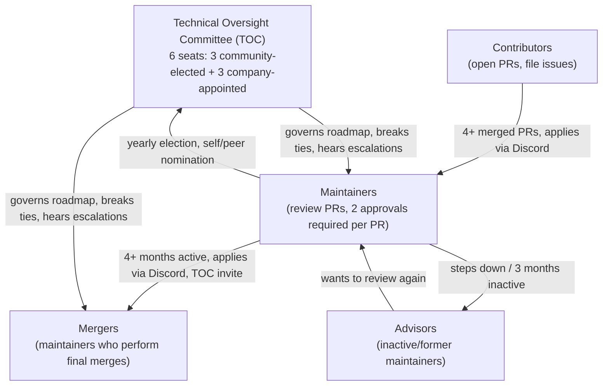

# Contribution Workflow & Governance

Gitea is a large, community-driven Go project accepting contributions through the
standard GitHub fork-and-pull-request model. This page summarizes the end-to-end
contribution workflow, the backend/frontend coding conventions enforced by CI, the
refactoring policy, the release process, and how the project is governed.

The canonical sources for this material live in the repository itself and should
always be consulted for the latest details:

| Topic | Source file |
|---|---|
| General contribution guide | [`CONTRIBUTING.md`](https://github.com/go-gitea/gitea/blob/main/CONTRIBUTING.md) |
| Setup and requirements | `docs/build-setup.md` |
| Development workflow | `docs/development.md` |
| Build from source | `docs/build-source.md` |
| Running the tests | `docs/testing.md` |
| Backend guidelines | `docs/guidelines-backend.md` |
| Frontend guidelines | `docs/guidelines-frontend.md` |
| Refactoring guidelines | `docs/guidelines-refactoring.md` |
| Release management | `docs/release-management.md` |
| Community governance | `docs/community-governance.md` |
| Issue templates | `.github/ISSUE_TEMPLATE/*.yaml` |
| PR template | `.github/pull_request_template.md` |

> [!NOTE]
> Gitea's own project documentation (this repository's `docs/` folder covers only
> *contributor* workflow docs). End-user/admin documentation lives in a separate
> repository at <https://gitea.com/gitea/docs>.

This page is the entry point for the [Contributing & Development](README.md)
section. Several topics below are summarized here and covered in full depth on
their own dedicated page:

| Topic | Summarized in | Full detail |
|---|---|---|
| AI-assisted contributions | [§ 1 → AI-assisted contributions](#ai-assisted-contributions) | [AI-Assisted Contributions](ai-assisted-contributions.md) |
| Backend guidelines | [§ 2](#2-backend-guidelines-summary) | [Backend Coding Conventions](backend-coding-conventions.md) |
| Frontend guidelines | [§ 3](#3-frontend-guidelines-summary) | [Frontend Coding Conventions](frontend-coding-conventions.md) |
| Governance & maintainer structure | [§ 7](#7-community-governance--maintainer-structure) | [Governance & Security](governance-and-security.md) (also covers `SECURITY.md`) |
| Issue/PR templates & bot automation | [§ 1 → Issues](#issues), [§ 5](#5-review-ci-and-merge-process) | [Issue & PR Templates and Automation](issue-pr-templates-and-automation.md) |

## 1. The Fork → Patch → Push → PR Workflow

Gitea follows the classic GitHub fork workflow. The high-level steps, drawn from
`docs/build-setup.md`, `docs/development.md`, and `CONTRIBUTING.md`, are:

1. **Fork** the repository at <https://github.com/go-gitea/gitea> on GitHub, then
   clone your fork locally and add the upstream repository as a remote so you can
   keep your fork in sync. See GitHub's
   [working with forks](https://docs.github.com/en/pull-requests/collaborating-with-pull-requests/working-with-forks)
   guide.
2. **Set up your environment**: install Go (the version pinned in `go.mod`),
   Node.js/pnpm (the version pinned in `package.json`), Make, and (optionally)
   Python via `uv` for template/YAML linting. Integration tests additionally
   require Git LFS.
3. **Discuss before large changes**: for anything beyond a small fix — new
   features, architecture changes — open an issue first and describe your design.
   Pull requests are not the place for architecture discussions; significant
   changes should go through a change-proposal discussion first to avoid wasted
   implementation effort.
4. **Branch and implement** your change in your fork. Keep the change focused —
   small, single-purpose PRs review and merge faster than large ones.
5. **Format and lint locally** before committing:
   ```bash
   make fmt          # auto-format Go, JS/TS, and other sources
   make lint         # run all linters (or make lint-backend / make lint-frontend)
   make lint-fix     # auto-fix what can be fixed
   ```
6. **Test locally**:
   ```bash
   make test              # unit tests
   make test-sqlite       # integration tests against SQLite
   ```
   See `docs/testing.md` for the full matrix of unit, integration, end-to-end, and
   migration tests.
7. **Push your branch** to your fork and **open a pull request** against `main`
   (release branches are for backports only).
8. **Follow the PR template** (`.github/pull_request_template.md`): use a
   [Conventional Commits](https://www.conventionalcommits.org/) title, describe the
   change, and link any issue it fixes with `Fixes #<issue>`.
9. **Respond to CI and review feedback**, iterate, and — once approved — a maintainer
   with merge rights merges the PR (all PRs are squash-merged, see
   [Review, CI, and Merge](#3-review-ci-and-merge) below).

### Contribution workflow diagram

```mermaid
flowchart LR
    A[Fork go-gitea/gitea] --> B[Clone fork + add upstream remote]
    B --> C[Create feature branch]
    C --> D["Discuss design<br/>(issue, for large changes)"]
    D --> E[Implement change]
    E --> F["make fmt / make lint<br/>make test"]
    F --> G[Push branch to fork]
    G --> H["Open Pull Request<br/>(Conventional Commits title)"]
    H --> I["CI checks:<br/>lint-backend, lint-frontend,<br/>unit tests, integration tests,<br/>swagger-check, checks"]
    I -->|fail| E
    I -->|pass| J["Maintainer review<br/>(2 approvals required)"]
    J -->|changes requested| E
    J -->|lgtm/done| K["Merge queue<br/>(reviewed/wait-merge)"]
    K --> L["Squash-merge to main<br/>by a merger"]
    L --> M["Backport bot creates<br/>backport PR if labeled"]
```



### Copyright header

New source files should carry the standard SPDX header:

```go
// Copyright <current year> The Gitea Authors. All rights reserved.
// SPDX-License-Identifier: MIT
```

Existing copyright headers should only be edited when the copyright author
actually changes.

### AI-assisted contributions

> [!NOTE]
> Full detail, including the machine-facing conventions in the repository's root
> `AGENTS.md`/`CLAUDE.md` files, is on the dedicated
> [AI-Assisted Contributions](ai-assisted-contributions.md) page.

Gitea explicitly allows AI-assisted contributions but requires responsible use:

- Review AI-generated code closely before marking a PR ready for review.
- Manually test changes and add automated tests where feasible.
- Only submit AI-assisted work you understand well enough to explain and defend
  during review.
- Disclose AI assistance clearly in the PR.
- Do **not** use AI to answer reviewer questions on your behalf — those questions
  are directed at you.
- Maintainers may close PRs/issues that fail to disclose AI assistance or that
  look like low-effort AI-generated content the author cannot explain.

### Issues

- Search existing issues before filing a new one.
- Issue types: `bug`, `security issue` (report privately to `security@gitea.io`,
  never on the public tracker), `feature`, `enhancement`, `refactoring`.
- Discuss significant design changes in an issue before implementing.
- Commenting on closed/merged issues or PRs is discouraged; open a new issue and
  link back to the old one for context instead.

Gitea ships two structured issue forms under `.github/ISSUE_TEMPLATE/`:

| Template | File | Auto-label |
|---|---|---|
| Bug Report | `bug-report.yaml` | `type/bug` |
| Feature Request | `feature-request.yaml` | `type/proposal` |

The bug report form requires a Gitea version and a description of what happened,
and reminds reporters to email `security@gitea.io` for security issues rather than
filing them publicly. The `.github/pull_request_template.md` file reminds
contributors to target `main`, use a Conventional Commits title, read
`CONTRIBUTING.md`, and route documentation changes to the separate
`gitea/docs` repository.

> [!NOTE]
> For the full enumeration of both issue forms, `.github/labeler.yml`, and the
> label/bot automation workflows (`pull-labeler.yml`, `giteabot.yml`,
> `giteabot-backport.yml`) that act on them, see
> [Issue & PR Templates and Automation](issue-pr-templates-and-automation.md).

## 2. Backend Guidelines Summary

> [!NOTE]
> Full detail: `docs/guidelines-backend.md`, reproduced in full on the dedicated
> [Backend Coding Conventions](backend-coding-conventions.md) page.

The backend is written in Go, uses
[chi](https://github.com/go-chi/chi) for HTTP routing, and [XORM](https://xorm.io/)
as its ORM.

### Package layout and layering rule

The backend is organized into top-level packages with a **strict one-directional
dependency rule** — this is the most important architectural constraint for backend
contributors:

```text
cmd → routers → services → models → modules
```

A package may import a package to its right in this chain, but **never the
reverse**. In particular:

- `modules` packages (e.g. `modules/setting`, `modules/git`) must have almost no
  dependencies and must **never** import `models` or `services`.
- `models` packages must not import `services` or `routers`.
- `services` tie `routers` and `models` together and may import both `models` and
  `modules`, but not `routers` or `cmd`.
- `routers` (split into `api`, `web`, `install`, `private`) may import `services`,
  `models`, and `modules`, but nothing that would create a cycle back up the chain.

| Package | Responsibility |
|---|---|
| `build` | Compile-time helper scripts |
| `cmd` | Subcommands: `web`, `serv`, `hooks`, `doctor`, admin utilities |
| `models` | XORM data structures & DB operations; minimal external deps (`models/db`, `models/fixtures`, `models/migrations`) |
| `modules` | Standalone, low-dependency functionality (`modules/setting`, `modules/git`, …) |
| `routers` | Request handlers: `api`, `web`, `install`, `private` |
| `services` | Business logic connecting routers and models |
| `templates` | Go HTML templates |
| `public` | Compiled frontend assets |
| `tests` | Integration/E2E test helpers |

Naming conventions:

- Top-level packages use the **plural** form: `services`, `models`, `routers`.
- Subpackages use the **singular** form: `services/user`, `models/repository`.
- When two layers use the same subpackage name, disambiguate with a snake_case
  import alias, e.g.:
  ```go
  import user_service "gitea.dev/services/user"
  ```

### Transactions and XORM pitfalls

- Wrap operations that must roll back together in `db.WithTx()` (or `db.WithTx2()`
  when a value must be returned) from `models/db/context.go`. Functions that
  participate in a transaction take a `context.Context` as their first parameter.
- Never call `x.Update(exemplar)` without an explicit `WHERE` — it updates every row.
- Partial table migrations must use `SyncWithOptions(IgnoreDrop...)`, not a plain
  `Sync`.
- Inserting rows with preset IDs needs `SET IDENTITY_INSERT` on MSSQL and a sequence
  update afterward on PostgreSQL.

### Go module hygiene

- PRs should only touch `go.mod`/`go.sum` if the change requires it; dedicated
  dependency-update PRs are the only other place these files change.
- Run `make tidy` after any `go.mod` edit.
- Any dependency bump must be justified in the PR description and verified against
  an existing upstream commit.

### API v1 conventions

- The API mirrors [the GitHub REST API](https://docs.github.com/en/rest) wherever
  reasonable; deviate only with good reason.
- New endpoints may be added for Gitea-only functionality; new fields may be added
  if they don't collide with an existing GitHub field name.
- Existing fields/response shapes should not be removed — flag breaking-change
  ideas in code comments for a hypothetical future API v2 instead.
- Request bodies and response bodies must be defined as structs in
  `modules/structs/` and registered in
  `routers/api/v1/swagger/options.go` (requests) or under
  `routers/api/v1/swagger/` (responses, by category).
- HTTP method conventions: `GET` → 200, `POST` → 201 + created object, `PUT` → 204
  no body (attach/assign), `PATCH` → 200 + changed object, `DELETE` → 204 no body.
- Edit endpoints must make every parameter optional except identifying parameters.
- List endpoints must support `page`/`limit` pagination and set the
  `X-Total-Count` header via `ctx.SetTotalCountHeader(...)`.

See also [API Conventions & Swagger](../07-rest-api/api-conventions-and-swagger.md)
for how this plays out in the actual router code.

## 3. Frontend Guidelines Summary

> [!NOTE]
> Full detail: `docs/guidelines-frontend.md`, reproduced in full (plus linter
> configuration detail) on the dedicated
> [Frontend Coding Conventions](frontend-coding-conventions.md) page.

The frontend combines
[Vue 3](https://vuejs.org/), [Fomantic-UI](https://fomantic-ui.com/) (jQuery-based,
**deprecated**, vendored with local patches), and [Tailwind CSS](https://tailwindcss.com/),
rendered on top of Go HTML templates.

Source layout:

| Path | Contents |
|---|---|
| `web_src/css/` | CSS styles |
| `web_src/js/` | JavaScript/TypeScript |
| `web_src/js/components/` | Vue components |
| `web_src/js/features/` | Feature modules wired up at page load |
| `templates/` | Go HTML templates |

Frontend dependencies are managed with [pnpm](https://pnpm.io/) (`package.json`,
`pnpm-lock.yaml`); the same dependency-hygiene rule as Go modules applies — bump
only what your PR needs, and reference an existing published version.

### Framework-mixing rules

- Approved stacks: **Vue 3**, **vanilla JavaScript**, **Fomantic-UI (jQuery,
  deprecated)**.
- Avoid combining Vue with Fomantic-UI JS behavior (Vue components may still reuse
  Fomantic-UI CSS classes purely for visual consistency).
- Use Go templates for simple/SEO-relevant pages; use Vue for complex, interactive
  UI.
- Gitea uses Vue 3 **without JSX** to keep markup and script separated.

> [!NOTE]
> Fomantic-UI is not fully accessibility-friendly. Gitea patches some ARIA
> behavior but this is ongoing work — prefer semantic HTML and verify
> keyboard/screen-reader behavior in new UI.

### Gitea-specific conventions

- Keep each feature in its own file/directory.
- Use kebab-case for HTML `id`s/classes (2–3 keywords ideally).
- Prefix classes to avoid collisions between frameworks.
- When overriding a framework's own class, create a *new* class name (or patch the
  framework source) rather than editing the framework's classes directly.
- Prefer semantic elements (`<button>`) over generic `<div>`s.
- Avoid `!important`; document any unavoidable use.
- Prefix custom DOM events with `ce-`.

### CSS conventions (enforced by Stylelint, `stylelint.config.ts`)

- Prefer Tailwind utility classes with the `tw-` prefix and `flex-*` layout helpers
  over per-child margins.
- Custom helper prefixes: `gt-` (general helpers) and `g-` (framework-level
  helpers) in `web_src/css/helpers.css` — use only when no Tailwind utility exists.
- Write template class attributes as one readable unit:
  ```html
  <div class="flex-text-inline {{if .IsFoo}}tw-hidden{{end}}"></div>
  ```
- The Stylelint config extends `stylelint-config-recommended` plus the
  `@stylistic/stylelint-plugin`, `stylelint-declaration-strict-value`,
  `stylelint-declaration-block-no-ignored-properties`, and
  `stylelint-value-no-unknown-custom-properties` plugins, and lints `.vue` files
  via `postcss-html`. Notable enforced rules include: double-quoted strings,
  lower-case hex colors/properties/units, 2-space indentation, no vendor
  prefixes (`selector-no-vendor-prefix`, `media-feature-name-no-vendor-prefix`),
  `word-break: break-word` disallowed, and strict color/`fill`/`stroke`/
  `font-weight` values (must reference CSS custom properties rather than literal
  colors) — see `scale-unlimited/declaration-strict-value` in
  `stylelint.config.ts`.

### TypeScript conventions (enforced by ESLint, `eslint.config.ts`)

- Use `import type` for type-only imports.
- Prefer `@ts-expect-error` over `@ts-ignore`.
- Use the non-null assertion `!` (rather than `?.`/`??`) when a value is known to
  always exist.
- Only mark a function `async` if it actually `await`s or returns a `Promise`.
  Avoid async event listeners; when unavoidable call `e.preventDefault()` before
  the first `await`. For an intentionally un-awaited call, assign it explicitly:
  `const _promise = asyncFoo();`.
- The ESLint flat config (`eslint.config.ts`) wires in
  `@typescript-eslint`, `eslint-plugin-import-x`, `eslint-plugin-unicorn`,
  `eslint-plugin-regexp`, `eslint-plugin-sonarjs`, `eslint-plugin-vue` /
  `eslint-plugin-vue-scoped-css`, `eslint-plugin-wc`, `eslint-plugin-playwright`,
  `@vitest/eslint-plugin`, `@stylistic/eslint-plugin`, and a custom Gitea rule
  (`gitea/unescaped-html-literal`, defined in
  `tools/eslint-rules/unescaped-html-literal.ts`) that guards against unescaped
  HTML in template literals (XSS prevention).
- It restricts direct use of certain globals in favor of Gitea's own wrappers,
  e.g.:
  ```ts
  const restrictedGlobals = [
    {name: 'localStorage', message: 'Use `modules/user-settings.ts` instead.'},
    {name: 'fetch', message: 'Use `modules/fetch.ts` instead.'},
  ];
  ```

### Data fetching, DOM, and visibility helpers

- Use the `GET`/`POST`/`PUT`/`PATCH`/`DELETE` wrappers from
  `web_src/js/modules/fetch.ts` instead of raw `fetch()`.
- Avoid `node.dataset` (camel-casing surprises); use `node.getAttribute` in new
  code, and never bind user-provided data directly onto DOM nodes.
- Show/hide elements with `v-if`/`v-show` in Vue, or with the `.tw-hidden` class
  plus the `showElem()`/`hideElem()`/`toggleElem()` helpers from
  `web_src/js/utils/dom.ts` in Go templates/plain JS.
- A UI component gallery is available in development mode at `/devtest`
  (e.g. `http://localhost:3000/devtest`); it is also exercised by the e2e tests.

See also [Frontend Architecture](../09-core-modules/frontend-build.md) and
[Frontend Features](../09-core-modules/frontend-features.md) for how these
conventions map onto the actual build pipeline.

## 4. Refactoring Guidelines

Full detail: `docs/guidelines-refactoring.md`. Gitea is long-lived and
accumulates legacy patterns, so refactors are welcomed but must be disciplined:

**Writing a refactoring PR**

- Address the root cause, not just the symptom — be forward-looking.
- Aim to reduce ambiguity/conflicts and improve maintainability.
- Explain the rationale in the PR description: why it's necessary, how it fixes
  the legacy issue, and its trade-offs.
- Keep the scope tight — preserve existing behavior where feasible, and don't
  bundle unrelated changes.
- Split large refactors into multiple, independently reviewable PRs.
- Include tests proving behavior is preserved.
- Schedule non-bugfix refactors early in a milestone so problems surface before a
  release, not during the freeze.
- Escalate disagreements about a refactor to the **Technical Oversight Committee
  (TOC)**.

**Reviewing and merging**

- Refactoring PRs should be short-lived (typically ≤ 7 days) with fast review
  cycles.
- A non-author core member may approve and merge a refactoring PR after 7 days if
  the TOC has raised no objection.
- Imperfect intermediate implementations are acceptable as long as the end state
  is an improvement.
- A brief regression caused by a necessary refactor is acceptable if fixed
  promptly.

## 5. Review, CI, and Merge Process

### Pull request format expectations

- Make small PRs — smaller PRs review and merge faster.
- Don't bundle unrelated changes (typo fixes, drive-by refactors) into an
  unrelated PR — split them out.
- Split big PRs into an incremental sequence.
- Allow edits by maintainers so they can finish the merge themselves.

### PR titles (Conventional Commits)

Because every PR is **squash-merged**, the PR title becomes the resulting commit
message, so it must follow Conventional Commits:

```text
type(scope)!: subject
```

`(scope)` is optional; a `!` immediately before the colon marks a breaking change
(`type!:` or `type(scope)!:`, never `type!(scope):`).

| Type | Meaning |
|---|---|
| `build` | Build system, packaging, or external dependency changes |
| `ci` | CI/CD configuration/scripts |
| `chore` | Maintenance changes with no production effect / no changelog entry |
| `docs` | Documentation-only changes |
| `feat` | Larger user-facing feature or new functionality |
| `enhance` | Small UX polish (wording, spacing, placeholders, small behavior tweaks) |
| `fix` | Bug fix, UX correction, or security-related dependency bump |
| `perf` | Performance improvements |
| `refactor` | Code change that neither fixes a bug nor adds a feature |
| `revert` | Reverts a previous change |
| `style` | Formatting-only changes (e.g. lint-driven edits) |
| `test` | Adding/correcting tests |

```text
fix(web): prevent avatar upload crash on empty file
feat(api): add pagination to repo hooks list
enhance(repo): improve diff toolbar spacing
ci(workflows): lint PR titles in CI
```

CI automatically applies a matching `type/…` label for `feat`, `enhance`, `fix`,
`docs`, and `test` prefixes and keeps it synced with title edits; other prefixes
require the merger to assign labels manually. Feature and non-trivial PRs should
also include **after** (and, for non-feature PRs, **before**) UI screenshots, and
must reference closed issues on separate lines:

```text
Fixes #123.
Closes #456.
```

### Breaking changes

A PR is breaking if it:

- Changes API output incompatibly for existing users,
- Removes a previously settable `app.ini` option, or
- Requires an admin to take manual action to restore old behavior.

(Adding new settings is *not* breaking; changing a default or replacing a setting
*is*.) Breaking PRs must include a rationale and a `BREAKING` section explaining
user impact and mitigation in plain language, e.g.:

```md
## :warning: BREAKING :warning:
```

### CI checks

Every PR runs through automated checks before it is reviewable/mergeable,
including (see `.github/workflows/`):

- `make lint-backend` / `make lint-frontend` (gofmt, golangci-lint, ESLint,
  Stylelint, template/YAML/actionlint checks)
- `make test` (Go unit tests) and frontend unit tests (Vitest)
- Integration tests across supported databases (SQLite/MySQL/PostgreSQL/MSSQL)
- `make swagger-check` (Swagger spec must match annotated routes)
- `make checks` (consistency checks: e.g. locale keys, generated files)

### Review and merge queue

- Once opened as non-draft, do **not** rebase/squash your branch — it makes
  incremental review harder; merge `main` into your branch only when actually
  needed (e.g. to resolve conflicts) to limit unnecessary CI reruns.
- **Two maintainer approvals** are required for merge (exception: after one week,
  refactoring and documentation-only PRs need only one approval).
- Once approved, the PR gets the `lgtm/done` label; any maintainer can then add
  `reviewed/wait-merge` to place it in the merge queue (ordered by creation date):
  <https://github.com/go-gitea/gitea/pulls?q=is%3Apr+label%3Areviewed%2Fwait-merge+sort%3Acreated-asc+is%3Aopen>
- A bot (`.github/workflows/giteabot.yml`) automates parts of this: creating
  backport PRs after merge, removing merged PRs from the queue, and keeping the
  oldest queued branch up to date.
- **Final call**: if a PR sits ≥ 7 days with no review, the author or any
  maintainer may mention the TOC for a "final call." After 7 more days with zero
  approval, the PR is closed as a polite refusal; with no objections, it can
  instead be merged with a single TOC approval.
- Mergers rewrite the PR title/description as needed to produce a clean squash
  commit message, remove false-positive co-authors, and assign final labels
  (including exactly one `type/…` label).

### Labels

| Prefix | Meaning | Set by |
|---|---|---|
| `modifies/…` | Codebase areas affected | CI (automatic) |
| `topic/…` | Conceptual Gitea component affected | Manually |
| `type/…` | Exactly one type: feature, refactoring, docs, bug, … | Manually (or CI for common Conventional Commit prefixes) |
| `issue/…` / `lgtm/…` | Context-specific issue/PR flags, e.g. `issue/not-a-bug`, `lgtm/need 2` | Manually |

## 6. Release Management & Versioning

Full detail: `docs/release-management.md`.

### Branching and versioning scheme

- `main` is the tip development branch.
- Each minor release gets a long-lived `release/vX.Y` branch (e.g.
  `release/v1.19`), tagged `vX.Y.0` for the initial binary release.
- Bug fixes land on `main` first, then are backported to the relevant
  `release/vX.Y` branch, producing patch tags like `vX.Y.1`, `vX.Y.2`, …
- All branches are protected: every PR to any branch needs two maintainer
  reviews and passing CI.

### Release cadence

- A major release ships roughly every 3–4 months: ~2–3 months of development
  followed by a ~1 month **release freeze** for stabilization.
- Example schedule: v1.26.0 (Apr 2026), v1.27.0 (Jun 2026), v1.28.0 (Sep 2026),
  v1.29.0 (Dec 2026).
- The release manager tags an `-rc0` in the first week of the release month; if no
  major issues surface, the final tag follows one to two weeks later.
- During the freeze, a release branch collects fixes backported from `main` while
  `main` keeps advancing; unfinished feature PRs move to the next milestone.

### Backports and frontports

The backport bot (<https://github.com/GiteaBot>) automatically opens a backport PR
after merge when the original PR:

- does **not** carry the `backport/manual` label, and
- carries a `backport/<version>` label.

`backport/manual` means either the author wants to backport it themselves, or an
automatic backport hit conflicts and needs manual resolution. Backport rules:

1. Before `-rc0`, backport as much as possible during the freeze.
2. After `-rc0`, backport only bug/security fixes and small enhancements — no
   large refactors.
3. New features are never backported.
4. Breaking changes are never backported, except when the change affects almost no
   users or the triggering component is explicitly experimental.

Backport PR titles follow `<original PR title> (#<original PR number>)`, and the
first lines of the summary read `Backport #<original PR number>`. Frontports
(porting a fix the other direction) follow the identical convention.

### End of life (EOL)

Only the current and immediately previous major release lines receive security
fixes; anything older should upgrade. `main` is always kept in a supportable
state.

### Release manager checklist (abridged)

1. Confirm all milestone issues/PRs are resolved; get agreement in the Discord
   `#maintainers` channel (or declare intent and wait several hours for
   objections).
2. For a major version: land a changelog PR on `main` (PRs labeled
   `changelog`), tag `vMAJOR.MINOR.0-dev`, push it, then branch
   `release/vMAJOR.MINOR` once CI finishes building the tag.
3. For a patch version: land the changelog PR on the `release/vMAJOR.MINOR`
   branch.
4. Tag `vMAJOR.MINOR.PATCH` (signed, `-s -F release.notes`) and push the tag; CI
   builds and publishes binaries automatically.
5. Frontport the changelog to `main` if needed, and update the version reference
   in `docs/config.yaml`.
6. Send the announcement PR to the [blog repository](https://gitea.com/gitea/blog),
   verify published assets on `dl.gitea.com`/GitHub releases, bump
   `dl.gitea.com/gitea/version.json`, merge the blog post, and announce in Discord
   `#announcements`.

## 7. Community Governance & Maintainer Structure

> [!NOTE]
> Full detail: `docs/community-governance.md`, reproduced in full — together with
> the `SECURITY.md` vulnerability-reporting process — on the dedicated
> [Governance & Security](governance-and-security.md) page.



### Roles

- **Maintainers** — listed in [`MAINTAINERS`](https://github.com/go-gitea/gitea/blob/main/MAINTAINERS).
  Every PR needs two maintainer/owner approvals (exception: after one week,
  refactor/docs-only PRs need one). To become a maintainer you should already be a
  contributor with at least four merged PRs; apply via the Discord `#develop`
  channel, or be invited by a maintainer team. Maintainers must enable 2FA and are
  encouraged to sign commits with GPG. Inactive maintainers (>3 months) may be
  moved to the **advisors** team by the owners/TOC; advisors can return to
  maintainer status when ready to review again.
- **Mergers** — maintainers who perform the final squash-merge of approved PRs.
  Responsibilities: merge from the queue in order once `lgtm/done` + no open
  discussions + no conflicts; rewrite the PR title/description into a clean commit
  message; assign the final `type/…` and other labels; help decide release
  timing. Becoming a merger requires being an existing maintainer, having
  participated actively for ≥ 4 months, and applying via the Discord
  `#maintainers` channel or being invited by the TOC. Repeated violations of the
  merge guidelines (>3 times/365 days) can suspend merging privileges for at
  least three months.
- **Technical Oversight Committee (TOC)** — replaced the old three-person "Owners"
  team in 2023. Six seats: three elected by the community (any maintainer not
  associated with the Gitea company is eligible) and three appointed by the Gitea
  company. Elections run yearly; elected members have two weeks to accept their
  seat, or the next-highest vote-getter is offered it. The TOC resolves
  escalated refactoring disputes, grants "final call" merges, sets the yearly
  roadmap, and receives $500/month compensation per community-elected member (from
  community funding sources such as OpenCollective, not the company) — company
  employees are not eligible for this compensation.

### Review, milestones, and commit-message rules

- A PR should only be assigned a milestone if it is realistically going to land in
  that version; PRs without a milestone are not merged.
- Reviewers should verify the PR matches its description, ensure tests/docs are
  complete, give actionable and specific feedback, and only approve once fully
  satisfied (explicitly flagging any "rubber-stamp" approval).
- Squash commit messages for `main`-targeted PRs follow:
  ```text
  $PR_TITLE ($PR_INDEX)

  $REWRITTEN_PR_SUMMARY
  ```
  and for backport PRs:
  ```text
  $PR_TITLE ($INITIAL_PR_INDEX) ($BACKPORT_PR_INDEX)

  $REWRITTEN_PR_SUMMARY
  ```
- Only genuine co-authors (real commit authorship beyond `Merge base branch…`
  commits) are kept in the final message; hedging language, hidden HTML comments,
  and unrelated content (e.g. bot-generated release notes) are stripped.

### Translation

All translations happen on [Crowdin](https://translate.gitea.com); only the
English source (`options/locale/locale_en-US.json`) is maintained directly in this
repository. Other locale files on `main` should not be hand-edited — they are
overwritten by the Crowdin sync once a language reaches ~25% translated coverage.
`go run build/backport-locale.go` can backport locale updates from `main` to a
release branch that missed a sync.

### Developer Certificate of Origin (DCO)

Opening a pull request is treated as agreement to the [DCO](https://github.com/go-gitea/gitea/blob/main/DCO)
and the [MIT license](https://github.com/go-gitea/gitea/blob/main/LICENSE) — no
extra action is required, though contributors may optionally sign off commits with
`git commit -s` (requires `user.name`/`user.email` to be configured) to add a
`Signed-off-by:` trailer automatically.

## Related Pages

- [AI-Assisted Contributions](ai-assisted-contributions.md)
- [Backend Coding Conventions](backend-coding-conventions.md)
- [Frontend Coding Conventions](frontend-coding-conventions.md)
- [Governance & Security](governance-and-security.md)
- [Issue & PR Templates and Automation](issue-pr-templates-and-automation.md)
- [Getting Started Overview](../03-getting-started/overview.md)
- [Installation & Build](../03-getting-started/installation-and-build.md)
- [Frontend Architecture](../09-core-modules/frontend-build.md)
- [Frontend Features](../09-core-modules/frontend-features.md)
- [REST API v1 Overview](../07-rest-api/api-v1-overview.md)
- [API Conventions & Swagger](../07-rest-api/api-conventions-and-swagger.md)
