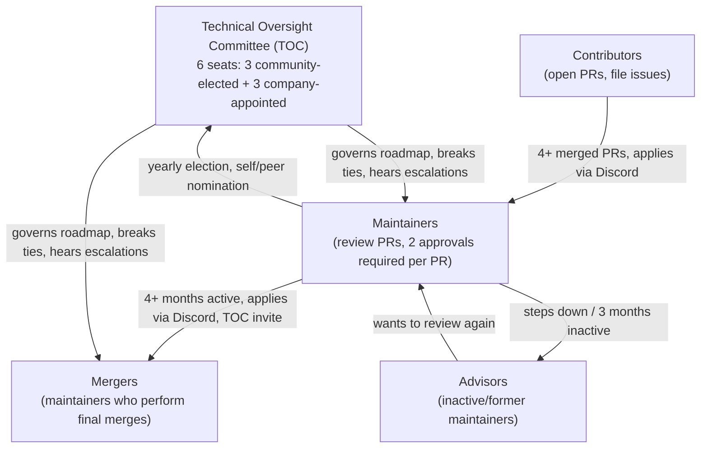

# Governance & Security

This page is the dedicated companion to the condensed
["Community Governance & Maintainer Structure"](contribution-workflow.md#7-community-governance--maintainer-structure)
section of [Contribution Workflow & Governance](contribution-workflow.md). It
reproduces the full detail of [`docs/community-governance.md`](../community-governance.md)
and adds the security-reporting process from
[`SECURITY.md`](https://github.com/go-gitea/gitea/blob/main/SECURITY.md), which
is not covered in the workflow page at all.

## 1. Code review process

### Milestones

A PR should only be assigned to a milestone if it will likely be merged into
the given version. PRs without a milestone may not be merged.

### Labels

Almost all labels used inside Gitea fall into one of these categories:

| Prefix | Meaning | Set by |
|---|---|---|
| `modifies/…` | Which parts of the codebase are affected | CI (automatic) |
| `topic/…` | The conceptual component of Gitea affected (issues, projects, authentication, …); a PR should ideally target one component | Manually |
| `type/…` | The type of an issue/PR (feature, refactoring, docs, bug, …) — exactly one should be set | Manually, or CI for recognized Conventional Commits prefixes |
| `issue/…` / `lgtm/…` | Context-specific flags, e.g. `issue/not-a-bug`, `lgtm/need 2` | Manually |

Every PR should carry every label that applies. Two things are managed
automatically: the count of pending required approvals, and whether all
backports are complete or a manual backport is still needed.

### Reviewing PRs

Maintainers are encouraged to review pull requests in areas where they have
expertise or particular interest. For reviewers:

- **Verification** — verify the PR accurately reflects the changes, and that
  tests/documentation are complete and aligned with the implementation.
- **Actionable feedback** — say what should change and why; distinguish
  required changes from optional suggestions.
- **Focus on the issue** — avoid comments about the contributor's abilities.
- **Request changes with a path forward** — if you block a PR, give a clear
  rationale and, where possible, a concrete path to resolution.
- **Approve deliberately** — only approve when fully satisfied with the
  current state; explicitly flag any "rubber-stamp" approval as such.

### Getting PRs merged

Changes to Gitea must be reviewed before acceptance, including changes from
owners and maintainers — the only exception is critical bugs that prevent
Gitea from compiling or starting.

- **Two maintainer approvals** are required for every PR (see the one-week
  exception for refactoring/docs-only PRs under
  [Review expectations](#review-expectations) below).
- Once satisfied, the PR gets the `lgtm/done` label.
- If a PR has `lgtm/done`, no open discussions, and no merge conflicts, any
  maintainer may add `reviewed/wait-merge`, which places it in the merge
  queue, ordered by creation date:
  <https://github.com/go-gitea/gitea/pulls?q=is%3Apr+label%3Areviewed%2Fwait-merge+sort%3Acreated-asc+is%3Aopen>

The [`giteabot.yml`](https://github.com/go-gitea/gitea/blob/main/.github/workflows/giteabot.yml)
workflow automates parts of this process:

- Creates a backport PR when needed after the initial PR merges.
- Removes the PR from the merge queue after it merges.
- Keeps the oldest branch in the merge queue up to date with `main`.

### Final call

If a PR has been ignored for more than 7 days with no comments or reviews, and
the author or any maintainer believes it will not survive a long wait (for
example a refactoring PR), they can send a "final call" to the TOC by
mentioning them in a comment.

- After another 7 days with zero approval, this is considered a polite
  refusal, and the PR is closed to avoid wasting further time.
- If there are no objections from maintainers, the PR can instead be merged
  with a single approval from the TOC (not the author).

Because closing is the default outcome of an unanswered final call, it should
be used cautiously.

### Commit messages

Mergers rewrite the PR title and first comment (the summary) as needed so the
resulting squash commit message is clear. Usually the PR description and
commit message body should not be empty, unless the title is already clear
enough or the description would duplicate code comments.

The final commit message:

- should match the code changes.
- should only keep true co-authors — false-positive co-authors must be
  removed (see [PR Co-authors](#pr-co-authors)).
- should not hedge (replace `hopefully, <x> won't happen anymore` with
  definite wording).
- should not contain hidden information such as `<!-- -->` comments or extra
  content after the description's `----` divider.
- should not contain unrelated content (e.g. Release Notes, Configuration)
  copied from a Renovate update PR.

#### PR Co-authors

A person counts as a PR co-author once they (co-)authored a commit that is
not simply a `Merge base branch into branch` commit. Mergers must remove
false-positive co-authors when writing the squash message; every true
co-author must remain in the final message.

#### Squash message format

For PRs targeting `main`:

```text
$PR_TITLE ($PR_INDEX)

$REWRITTEN_PR_SUMMARY
```

For backport PRs:

```text
$PR_TITLE ($INITIAL_PR_INDEX) ($BACKPORT_PR_INDEX)

$REWRITTEN_PR_SUMMARY
```

## 2. Contribution roles



### Maintainers

Maintainers are listed in [`MAINTAINERS`](https://github.com/go-gitea/gitea/blob/main/MAINTAINERS)
so every PR gets proper review.

#### Review expectations

- Every PR **must** be reviewed by at least two maintainers (or owners) before
  merge.
- **Exception:** after one week, refactoring PRs and documentation-only PRs
  need only one maintainer approval.
- Maintainers are expected to spend time on code reviews.

#### Becoming a maintainer

A maintainer should already be a Gitea contributor with at least four merged
PRs. To apply, use the [Discord](https://discord.gg/Gitea) `#develop` channel.
Maintainer teams may also directly invite contributors.

#### Stepping down, advisors, and inactivity

- If you cannot keep reviewing, apply to leave the maintainers team.
- You can join the [advisors team](https://github.com/orgs/go-gitea/teams/advisors);
  advisors who want to review again are welcome back as maintainers.
- If a maintainer is inactive for more than three months and has not left the
  team, owners may move them to the advisors team.

#### Account security

For security, maintainers should enable 2FA and sign commits with GPG when
possible:

- [Two-factor authentication](https://docs.github.com/en/authentication/securing-your-account-with-two-factor-authentication-2fa/configuring-two-factor-authentication)
- [Signing commits with GPG](https://docs.github.com/en/authentication/managing-commit-signature-verification/signing-commits)

Any account with write access — including bots and TOC members — **must** use
2FA.

### Mergers

Mergers are the maintainers who carry out the final merge of approved PRs.
Responsibilities:

- Merging PRs from the [merge queue](#getting-prs-merged) in order, once a PR
  has `lgtm/done`, no open discussions, and no merge conflicts.
- Rewriting the PR title and description prior to merge to produce a clear
  [commit message](#commit-messages). Mergers should edit the PR description
  but should **not** edit the actual commit message except to remove
  unnecessary information — so anyone reading the PR later can still see what
  actually changed.
- Assigning the correct labels (including `type/…`) needed for changelog and
  backport decisions.
- Agreeing, together with the owners, on when a release is ready (see
  [release management](../release-management.md)).
- Merging a PR also means the PR looks good to, and is approved by, the
  merger.

If a merger violates these merge guidelines more than 3 times in the past 365
days (e.g. merging with unresolved reviews without a TOC decision to ignore
the review, or merging with a garbage commit message), they may lose their
merging privileges for at least three months.

#### Becoming a merger

A merger must already be a Gitea maintainer. To apply, use the
[Discord](https://discord.gg/Gitea) `#maintainers` channel. The minimum
requirement is having participated actively in the community for at least
four months; the TOC may also invite a maintainer directly.

### Technical Oversight Committee (TOC)

The TOC replaced the previous three-person "Owners" team in 2023. It has six
seats: three elected by the community (any maintainer not associated with the
Gitea company is eligible) and three appointed by the Gitea company.

- Elections run yearly.
- Elected members have two weeks to accept their seat, or the next-highest
  vote-getter is offered it instead.
- The TOC resolves escalated refactoring disputes (see
  [Refactoring Guidelines](contribution-workflow.md#4-refactoring-guidelines)),
  grants "final call" merges, and sets the yearly roadmap.
- Community-elected TOC members are compensated $500/month from community
  funding sources (e.g. OpenCollective), not from the company. Gitea Ltd
  employees are **not** eligible for this compensation.

### Roadmap

Each year a roadmap is discussed with the entire Gitea maintainers team, with
feedback solicited from various stakeholders. TOC members review the roadmap
every year and work together on the project's direction. When a vote is
required for a proposal or other change, community-elected TOC member votes
count slightly more than company-elected TOC member votes, both avoiding ties
and keeping changes aligned with the mission statement and community opinion.

### Governance compensation

- Each community-elected TOC member is granted $500/month as compensation for
  their work.
- Any community release manager for a specific release or LTS is compensated
  $500 for the delivery of that release.
- These funds come from community sources such as OpenCollective, not
  directly from the company.
- Only non-company members are eligible; if a community TOC member also acts
  as release manager, they are only compensated once, for their TOC duties.
- Gitea Ltd employees are not eligible to receive OpenCollective funds unless
  reimbursed for a purchase made for the Gitea project itself.

## 3. Security reporting process (`SECURITY.md`)

Gitea's public issue tracker is **never** the right place to report a
security vulnerability. Per [`SECURITY.md`](https://github.com/go-gitea/gitea/blob/main/SECURITY.md):

> "If you discover a security issue, please bring it to their attention right
> away! ... Please **DO NOT** file a public issue, instead send your report
> privately to `security@gitea.io`."

Key facts from `SECURITY.md`:

- **Reporting channel**: email `security@gitea.io` — never the public issue
  tracker (this is the same rule reflected in `CONTRIBUTING.md`'s issue
  taxonomy, which carves out a dedicated `security issue` category specifically
  to keep such reports off the public tracker; see
  [Issues](contribution-workflow.md#issues)).
- **Encryption**: sensitive report bodies can be encrypted with the published
  Gitea Security PGP key (Key ID `6FCD2D5B`, RSA 4096-bit, User ID
  `Gitea Security <security@gitea.io>`) included in full in `SECURITY.md`.
  Confirm the key's expiry date in `SECURITY.md` before relying on it, since
  the key is time-limited and subject to periodic rotation.
- **Disclosure history**: previously disclosed vulnerabilities are listed at
  <https://about.gitea.com/security>.
- **Acknowledgement**: security reports are greatly appreciated; Gitea will
  publicly thank reporters unless they request to remain confidential.

### How this interacts with issue triage and release policy

The security-reporting channel is not an isolated rule — it connects to two
other governance mechanisms documented elsewhere in this repository:

- **Issue triage.** `CONTRIBUTING.md` defines `security issue` as a distinct
  issue category precisely so that anyone triaging the public tracker
  recognizes a misfiled report and can redirect it, rather than letting it sit
  publicly. See [Issues](contribution-workflow.md#issues).
- **Release/backport policy.** Security fixes follow the normal backport
  rules (see
  [Backports and frontports](contribution-workflow.md#backports-and-frontports))
  but remain eligible for backporting even *after* an `-rc0` freeze, unlike
  large refactors or new features, and only the current and immediately
  previous major release lines receive security fixes (see
  [End of life (EOL)](contribution-workflow.md#end-of-life-eol)).

For the full, scanner-triage-oriented walkthrough of this process — including
how to handle a Trivy/opengrep hit that turns out to be a genuine security
finding — see
[Vulnerability Disclosure Process](../../derived-docs/07-vulnerability-disclosure/reporting-process.md).

## Related Pages

- [Contribution Workflow & Governance](contribution-workflow.md)
- [Issue & PR Templates and Automation](issue-pr-templates-and-automation.md)
- [AI-Assisted Contributions](ai-assisted-contributions.md)
- [Vulnerability Disclosure Process](../../derived-docs/07-vulnerability-disclosure/reporting-process.md)
