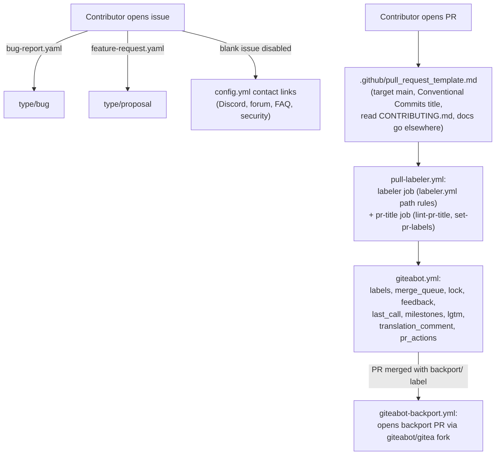

# Issue & PR Templates and Automation

This page is the dedicated deep-dive on the structured issue forms, the PR
template, and the label/bot automation that Gitea uses to keep the tracker
consistent. The condensed version lives in
[Contribution Workflow & Governance § 1](contribution-workflow.md#1-the-fork--patch--push--pr-workflow)
and [§ 5](contribution-workflow.md#5-review-ci-and-merge-process); this page
goes further and enumerates every relevant file under `.github/`.

## 1. Issue templates (`.github/ISSUE_TEMPLATE/`)

Gitea ships two structured issue forms plus a config file that disables
freeform/blank issues:

| File | Purpose | Auto-label |
|---|---|---|
| `bug-report.yaml` | Report something that behaves unexpectedly | `type/bug` |
| `feature-request.yaml` | Propose new functionality | `type/proposal` |
| `config.yml` | Disables blank issues; adds contact links | — |

### `bug-report.yaml`

The Bug Report form (`name: Bug Report`) requires:

- **Gitea Version** (`gitea-ver`, required text input).
- **What happened?** (`description`, required textarea) — what the reporter
  did, what they expected, and what happened instead, including logs if
  relevant.
- **How are you running Gitea?** (`environment`, optional textarea) — install
  method (binary, Docker, package), operating system, and database.

Its markdown preamble reminds reporters to:

- Email `security@gitea.io` instead of opening a public issue for security
  problems (see [Governance & Security § 3](governance-and-security.md#3-security-reporting-process-securitymd)).
- Ask setup/configuration questions on [Discord](https://discord.gg/Gitea) or
  the [forum](https://forum.gitea.com) rather than filing an issue.
- Search [existing issues](https://github.com/go-gitea/gitea/issues?q=is%3Aissue)
  first.

The form is auto-labeled `type/bug` on creation.

### `feature-request.yaml`

The Feature Request form (`name: Feature Request`) requires:

- **What problem would this solve?** (`problem`, required textarea).
- **What do you propose?** (`proposal`, required textarea).

Its markdown preamble reminds reporters to search existing issues first. The
form is auto-labeled `type/proposal` on creation, distinguishing it from
`type/bug` from the very first triage step — this is also the issue category
that corresponds to `CONTRIBUTING.md`'s "significant changes need a design
discussion first" rule (see
step 3, "Discuss before large changes", of
[The Fork → Patch → Push → PR Workflow](contribution-workflow.md#1-the-fork--patch--push--pr-workflow)).

### `config.yml`

Sets `blank_issues_enabled: false`, meaning every issue must go through one of
the two structured forms above, and adds contact links for scenarios that are
explicitly *not* meant to become GitHub issues:

| Link | Destination | Use case |
|---|---|---|
| Security Concern | `https://tinyurl.com/security-gitea` | Redirects security reports away from the public tracker |
| Discord Server | `https://discord.gg/Gitea` | Questions, configuration/deployment discussion |
| Discourse Forum | `https://forum.gitea.com` | Same, as an alternative to Discord |
| Frequently Asked Questions | `https://docs.gitea.com/help/faq` | Common questions |
| Crowdin Translations | `https://translate.gitea.com` | Where translation work actually happens (see [Translation](contribution-workflow.md#translation)) |

## 2. Pull request template (`.github/pull_request_template.md`)

The PR template is a short HTML-comment block (rendered as pre-filled
guidance, not visible text, in the PR description editor):

```markdown
<!--
Before submitting:
- Target the `main` branch; release branches are for backports only.
- Use a Conventional Commits title, e.g. `fix(repo): handle empty branch names`.
- Read the contributing guidelines: https://github.com/go-gitea/gitea/blob/main/CONTRIBUTING.md
- Documentation changes go to https://gitea.com/gitea/docs

Describe your change below and link any issue it fixes.
-->
```

It reinforces four rules that are each documented in depth elsewhere:

1. **Target `main`.** Release branches are for backports only — see
   [Branching and versioning scheme](contribution-workflow.md#branching-and-versioning-scheme).
2. **Conventional Commits title.** Because every PR is squash-merged, the
   title becomes the commit message — see
   [PR titles (Conventional Commits)](contribution-workflow.md#pr-titles-conventional-commits).
3. **Read `CONTRIBUTING.md`.**
4. **Route documentation changes elsewhere.** User/admin documentation lives
   in the separate [`gitea/docs`](https://gitea.com/gitea/docs) repository,
   not in this repository's own `docs/` folder (which — per `CONTRIBUTING.md` —
   covers only contributor-workflow material and is slated for eventual
   removal once configuration metadata moves into a YAML file in this repo).

## 3. Label automation

### `.github/labeler.yml`

Declarative, path-based auto-labeling rules consumed by
[`actions/labeler`](https://github.com/actions/labeler) (invoked from
`pull-labeler.yml`, below):

```yaml
docs-update-needed:
  - changed-files:
      - any-glob-to-any-file:
          - "custom/conf/app.example.ini"

topic/code-linting:
  - changed-files:
      - any-glob-to-any-file:
          - ".golangci.yml"
          - ".markdownlint.yaml"
          - ".spectral.yaml"
          - ".yamllint.yaml"
          - "eslint*.config.*"
          - "stylelint.config.*"
```

| Label | Applied when the PR touches |
|---|---|
| `docs-update-needed` | `custom/conf/app.example.ini` — a signal that the example config sample changed and the external `gitea/docs` repository likely needs a matching update. |
| `topic/code-linting` | Any linter config file (`.golangci.yml`, `.markdownlint.yaml`, `.spectral.yaml`, `.yamllint.yaml`, `eslint*.config.*`, `stylelint.config.*`). |

This is one instance of the `topic/…` label category described in
[Labels](governance-and-security.md#labels) — a `modifies/…`-style,
path-derived label, applied automatically by CI rather than manually by a
reviewer.

### `.github/workflows/pull-labeler.yml`

Two jobs, triggered on `pull_request_target` (`opened`, `synchronize`,
`reopened`, `edited`, `ready_for_review`):

1. **`labeler`** — runs `actions/labeler` with `sync-labels: true` against
   `.github/labeler.yml`, so path-based labels are added *and* removed as the
   file set in the PR changes.
2. **`pr-title`** (only once the PR leaves draft state) — checks out the
   **base** branch (never PR-head code, since `pull_request_target` runs with
   an elevated token) and:
   - Lints the PR title with `node ./tools/ci-tools.ts lint-pr-title` against
     the Conventional Commits grammar described in
     [PR titles (Conventional Commits)](contribution-workflow.md#pr-titles-conventional-commits).
   - Only if the title lints successfully, runs
     `node ./tools/ci-tools.ts set-pr-labels` to apply/sync the matching
     `type/…` label (`feat`→`type/enhancement`... see the exact mapping in
     [Labels](governance-and-security.md#labels)) via `GITHUB_TOKEN`.

The ordering is deliberate: an invalid title never reaches the label-sync
step, so a malformed Conventional Commits title cannot silently produce a
wrong or missing `type/…` label.

### `.github/workflows/giteabot.yml` (`giteabot`)

The primary maintainer-automation bot, running the
[`go-gitea/giteabot`](https://github.com/go-gitea/giteabot) action. It listens
to a wide event surface:

| Trigger | Purpose |
|---|---|
| `push` to `main` | Rerun merge-queue maintenance promptly so the oldest `reviewed/wait-merge` PR is updated against the new base without waiting for the schedule. |
| `pull_request_target` (`opened`, `synchronize`, `labeled`, `unlabeled`, `closed`, `review_requested`, `review_request_removed`) | Drives label maintenance, merge-queue maintenance, and label-triggered bot actions. Runs with `GITEABOT_TOKEN` so it can write labels/statuses/comments even on fork PRs — safe because the job only runs the pinned action and never checks out PR HEAD. |
| `pull_request_review` (`submitted`, `edited`, `dismissed`) | Keeps review-derived state (e.g. `lgtm/…` labels, status checks) in sync after approvals, edits, or dismissals. |
| `schedule` (`15 3 * * *`) | Daily backstop for queue cleanup and other housekeeping, even though `push`-to-`main` now triggers most of it promptly. |
| `workflow_dispatch` | Lets maintainers manually rerun selected non-backport checks while debugging. |

The default (and `workflow_dispatch` default) check list is:

```text
labels,merge_queue,lock,feedback,last_call,milestones,lgtm,translation_comment,pr_actions
```

Each of these checks maps onto a rule documented in
[Governance & Security](governance-and-security.md):

| Check | Governance rule it enforces |
|---|---|
| `labels` | Keeping `type/…`/`topic/…`/`modifies/…` labels correct as the PR evolves |
| `merge_queue` | [Getting PRs merged](governance-and-security.md#getting-prs-merged) — advancing/maintaining the `reviewed/wait-merge` queue |
| `lock` | [Issue locking](contribution-workflow.md#issues) — auto-locking closed/merged issues and PRs to discourage stale comments |
| `feedback` / `last_call` | [Final call](governance-and-security.md#final-call) — nudging or escalating stalled PRs |
| `milestones` | [Milestones](governance-and-security.md#milestones) — ensuring a PR isn't merged without a realistic milestone |
| `lgtm` | Applying/removing `lgtm/need N` and `lgtm/done` as approvals accumulate |
| `translation_comment` | Reminding contributors that locale files are Crowdin-managed (see [Translation](contribution-workflow.md#translation)) |
| `pr_actions` | Miscellaneous label-triggered bot actions (e.g. reacting to a `backport/…` label being applied) |

Permissions are scoped to `contents: read`, `issues: write`,
`pull-requests: write`, `statuses: write` — no `contents: write`, since the
bot only manages metadata, never pushes commits directly to protected
branches itself (backport PR creation is a separate, narrower workflow — see
below).

### `.github/workflows/giteabot-backport.yml` (`giteabot backport`)

A second, narrower workflow dedicated purely to
[backports](contribution-workflow.md#backports-and-frontports):

- Triggers on `push` to `main` and `workflow_dispatch`.
- Runs the same pinned `go-gitea/giteabot` action, but with `checks: backport`
  only and `gitea_fork: giteabot/gitea` — the bot pushes backport branches to
  its own fork (`giteabot/gitea`) before opening the backport PR against
  `go-gitea/gitea`, rather than pushing directly to the upstream repository.
- Uses `permissions: contents: read` at the workflow level; the actual
  backport-branch push happens through the bot's own `GITEABOT_TOKEN`
  credential passed into the action, not the workflow's default token.

This split — general maintenance (`giteabot.yml`) versus backport creation
(`giteabot-backport.yml`) — keeps the higher-privilege, cross-fork push
operation isolated to its own minimal workflow.

## 4. How it all fits together



## Related Pages

- [Contribution Workflow & Governance](contribution-workflow.md)
- [Governance & Security](governance-and-security.md)
- [AI-Assisted Contributions](ai-assisted-contributions.md)
- [Backend Coding Conventions](backend-coding-conventions.md)
- [Frontend Coding Conventions](frontend-coding-conventions.md)
