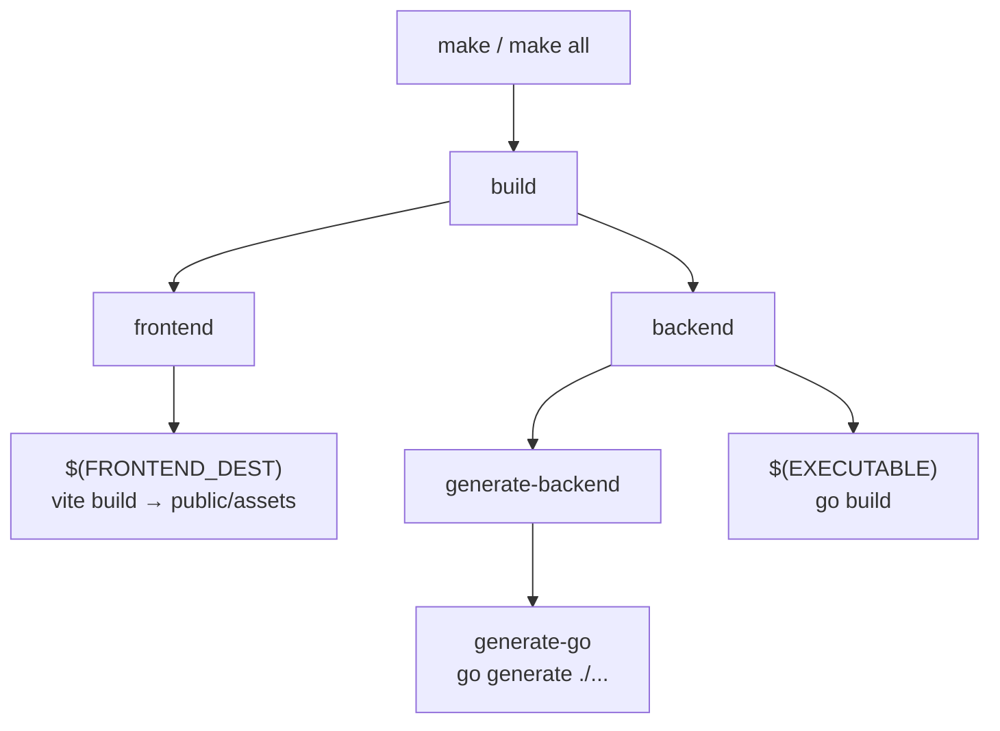

# Makefile & Build System

Gitea's entire local build, lint, test, and release pipeline is orchestrated through a single, large `Makefile` at the repository root (~680 lines). This page catalogs the key targets, explains the build-tag system, and covers cross-compilation via `xgo`.

> For a step-by-step build tutorial and a deep dive on individual build tags (`bindata`, `sqlite`, `pam`, `gogit`), see [Installation & Build](../03-getting-started/installation-and-build.md). This page focuses on the **full target catalog** and **release/cross-compile machinery**.

## Overview

Running `make help` prints an auto-generated list of targets (parsed from `## comment` suffixes in the Makefile itself):

```makefile
.PHONY: help
help: Makefile ## print Makefile help information.
	@awk 'BEGIN {FS = ":.*##"; ...} /^[0-9A-Za-z._-]+:.*?##/ { printf "  %-45s %s\n", $$1, $$2 }' Makefile
```

The default target is `all: build`, which in turn depends on `frontend` and `backend`.



## Key Variables

| Variable | Purpose |
|---|---|
| `GO` | Go binary to invoke (default `go`) |
| `GOEXPERIMENT` | Defaults to `jsonv2` (experimental Go JSON v2 library) |
| `TAGS` | Space-separated Go build tags, e.g. `bindata sqlite pam gogit` |
| `CGO_ENABLED` | Auto-set to `1` when `TAGS` contains `sqlite_mattn` or `pam` |
| `STATIC` | When set, adds `-extldflags "-static"` to `EXTLDFLAGS` |
| `EXECUTABLE` | Output binary name; `gitea.exe` on Windows, else `gitea` |
| `GITEA_VERSION` / `VERSION` | Computed from `git describe`, the `VERSION` file, or `GITHUB_REF_NAME` |
| `LDFLAGS` | Injects `main.Version` and `main.Tags` via `-X` linker flags |
| `LINUX_ARCHS` | Cross-compile target list for `release-linux`: `linux/amd64,linux/386,linux/arm-5,linux/arm-6,linux/arm64,linux/riscv64` |
| `XGO_VERSION` / `XGO_PACKAGE` | Pinned Go toolchain (`go-1.26.x`) and `xgo` cross-compiler package used for release binaries |
| `GITEA_TEST_DATABASE` | Defaults to `sqlite` for local `test-*` runs (not in CI) |

Tool versions are pinned as Makefile variables with `# renovate: datasource=go` comments so Renovate can auto-bump them, e.g.:

```makefile
GOLANGCI_LINT_PACKAGE ?= github.com/golangci/golangci-lint/v2/cmd/golangci-lint@v2.12.2 # renovate: datasource=go
SWAGGER_PACKAGE       ?= github.com/go-swagger/go-swagger/cmd/swagger@v0.35.0           # renovate: datasource=go
XGO_PACKAGE           ?= src.techknowlogick.com/xgo@v1.9.0                              # renovate: datasource=go
```

> **Note on `.NOTPARALLEL`:** The Makefile disables parallel target execution globally. This is intentional — `backend` must be able to build from a source tarball without Node.js/`frontend` having run first, so dependencies between targets are deliberately loose and must run in the declared order.

## Core Build Targets

| Target | Depends on | Description |
|---|---|---|
| `build` | `frontend`, `backend` | Builds everything |
| `frontend` | `$(FRONTEND_DEST)` | Runs `vite build`, producing `public/assets/.vite/manifest.json` and friends |
| `backend` | `generate-backend`, `$(EXECUTABLE)` | Runs `go generate` then compiles the Go binary |
| `generate` / `generate-backend` / `generate-go` | `$(TAGS_PREREQ)` | Runs `go generate ./...` with `CC=`, `GOOS=`, `GOARCH=`, `CGO_ENABLED=0` forced (host-independent codegen) |
| `vite` | `$(FRONTEND_DEST)` | Alias for building only Vite/frontend output |
| `svg` / `svg-check` | — | Regenerates `public/assets/img/svg` and `options/fileicon` from `tools/generate-svg.ts`; `svg-check` diffs the result against what's committed |
| `clean` | — | Removes the binary, `dist/`, `bindata.*` wildcards, `man/`, integration test artifacts |
| `clean-all` | `clean` | Also removes frontend build output and `node_modules` |
| `fmt` / `fmt-check` | — | Runs `golangci-lint fmt` plus a `sed`-based template-whitespace cleanup; `fmt-check` fails the build if `git diff` finds any changes |

The actual binary rule shows how `TAGS`, `LDFLAGS`, and `CGO` flags come together:

```makefile
$(EXECUTABLE): $(GO_SOURCES) $(TAGS_PREREQ)
ifneq ($(and $(STATIC),$(findstring pam,$(TAGS))),)
  $(error pam support set via TAGS does not support static builds)
endif
	CGO_ENABLED="$(CGO_ENABLED)" CGO_CFLAGS="$(CGO_CFLAGS)" $(GO) build $(GOFLAGS) $(EXTRA_GOFLAGS) \
	  -tags '$(TAGS)' -ldflags '-s -w $(EXTLDFLAGS) $(LDFLAGS)' -o $@
```

## Swagger / OpenAPI Generation

| Target | Description |
|---|---|
| `generate-swagger` | Runs `go-swagger generate spec` against `templates/swagger/v1_input.json`, writing `templates/swagger/v1_json.tmpl`. Excludes the `gitea.dev/sdk` package. Fails on any swagger tool warning. |
| `swagger-check` | Re-runs `generate-swagger` and fails if `git diff` on the spec is non-empty — used in CI to catch stale specs |
| `swagger-validate` | Temporarily rewrites `basePath` to start with `/` (spec uses a Go template placeholder), runs `swagger validate`, then reverts the rewrite. Fails on any `WARNING:` in the output |
| `generate-openapi3` | Runs `build/generate-openapi.go`, which converts the Swagger 2.0 spec into `templates/swagger/v1_openapi3_json.tmpl` |
| `openapi3-check` | Diffs the regenerated OpenAPI3 file against the committed one |

```makefile
$(SWAGGER_SPEC): $(GO_SOURCES) $(SWAGGER_SPEC_INPUT)
	@output="$$($(GO) run $(SWAGGER_PACKAGE) generate spec --enable-allof-compounding --skip-enum-desc \
	  --exclude "$(SWAGGER_EXCLUDE)" --input "$(SWAGGER_SPEC_INPUT)" --output './$(SWAGGER_SPEC)' 2>&1)" || { ... }
```

See [API Conventions & Swagger](../07-rest-api/api-conventions-and-swagger.md) for how these generated specs are consumed by the API layer.

## Checks: `checks`, `checks-frontend`, `checks-backend`

`make checks` is a fast "is my tree consistent" gate, distinct from `lint` (style/quality) below:

```makefile
checks: checks-frontend checks-backend        ## run various consistency checks
checks-frontend: lockfile-check svg-check     ## check frontend files
checks-backend: tidy-check swagger-check openapi3-check fmt-check swagger-validate security-check
```

| Sub-check | What it verifies |
|---|---|
| `lockfile-check` | `pnpm install --frozen-lockfile` then diffs `pnpm-lock.yaml` — catches lockfile drift vs. `package.json` |
| `svg-check` | Regenerates SVGs, `git add`s them, and diffs the staged result |
| `tidy-check` | Confirms `go.mod`/`go.sum` are tidy (no stray/missing deps) |
| `swagger-check` / `openapi3-check` | See above |
| `fmt-check` | Confirms `gofmt`/`golangci-lint fmt` + template whitespace cleanup produce no diff |
| `swagger-validate` | Confirms the swagger spec itself is structurally valid |
| `security-check` | Runs `govulncheck` (non-fatal — appended with `|| true`) |

## Lint Targets

`make lint` is the umbrella target that runs **every** linter category:

```makefile
lint: lint-frontend lint-backend lint-templates lint-swagger lint-spell lint-md lint-actions lint-json lint-yaml lint-shell
```

| Target | Tooling | Scope |
|---|---|---|
| `lint-js` / `lint-js-fix` | `eslint` (with `--concurrency`) + `vue-tsc` | `web_src/js`, `tools`, `*.ts`, `tests/e2e` |
| `lint-css` / `lint-css-fix` | `stylelint` | `web_src/css`, `web_src/js/components/*.vue` |
| `lint-go` / `lint-go-fix` | `tools/lint-go-all.go` wrapping `golangci-lint` | All Go packages (`GO_DIRS`) |
| `lint-editorconfig` | `editorconfig-checker` | `templates`, `.github/workflows`, locale JSON |
| `lint-swagger` | `spectral lint` | Generated swagger spec |
| `lint-md` / `lint-md-fix` | `markdownlint` | Root-level `*.md` |
| `lint-spell` / `lint-spell-fix` | `misspell` with `assets/misspellings.csv` dictionary | Go, web, templates, locale, docs |
| `lint-actions` | `actionlint` + `zizmor` (via `uv run`) | `.github` workflow/action YAML |
| `lint-shell` | `tools/lint-shell.sh` running `shellcheck` in a container | All `*.sh` files |
| `lint-templates` | `tools/lint-templates-svg.ts` + `djlint` (via `uv run`) | `templates/**/*.tmpl` |
| `lint-yaml` | `yamllint` (via `uv run`) | Whole repo |
| `lint-json` / `lint-json-fix` | `eslint -c eslint.json.config.ts` | JSON files |

`lint-frontend`, `lint-backend`, and their `-fix` variants are convenience aggregates (`lint-js + lint-css`, `lint-go + lint-editorconfig`). `lint-fix` runs all fixable linters at once.

## Watch Targets (Live Development)

| Target | Description |
|---|---|
| `watch` | Runs `tools/watch.sh`, which supervises both the frontend and backend watchers together (used by `make watch` for full-stack local dev) |
| `watch-frontend` | `NODE_ENV=development pnpm exec vite --logLevel $(FRONTEND_DEV_LOG_LEVEL)` — Vite dev server with HMR |
| `watch-backend` | `GITEA_RUN_MODE=dev go run air -c .air.toml` — uses [`air`](https://github.com/air-verse/air) to hot-reload the Go binary on source changes |

```makefile
watch-backend: ## watch backend files and continuously rebuild
	GITEA_RUN_MODE=dev $(GO) run $(AIR_PACKAGE) -c .air.toml
```

See [Running Gitea](../03-getting-started/running-gitea.md) for how these fit into a local dev workflow.

## Test Targets

| Target | Description |
|---|---|
| `test-backend` | `go test $(GOTEST_FLAGS) -tags='$(TAGS)' $(GO_TEST_PACKAGES)` — unit tests, excludes migration/integration packages |
| `test-frontend` | `pnpm exec vitest` |
| `test-backend#TestName` | Pattern-rule variant to run a single test by name (`test-backend\#%`) |
| `test-integration` / `test-integration#TestName` | Integration suite against `GITEA_TEST_DATABASE` (`sqlite`, `mysql`, `pgsql`, `mssql`) |
| `test-integration-compile` | Compiles (but doesn't run) integration tests — used to warm build caches |
| `test-migration` | Runs `migrations.integration.test` and `migrations.individual.test` |
| `test-e2e` | Depends on `playwright frontend backend`; runs Playwright browser tests |
| `test-check` | CI safety net — fails if `test-backend` left stray files in the source tree (`git status -s`) |

## `generate-*` Utility Targets

| Target | Description |
|---|---|
| `generate-gitignore` | Regenerates `.gitignore` files via `build/generate-gitignores.go` |
| `generate-images` | Regenerates PNG/ICO assets from SVG sources (`tools/generate-images.ts`) |
| `generate-codemirror-languages` | Regenerates the CodeMirror language list used by the code editor |
| `generate-manpage` | Builds the `gitea` binary if missing, then runs `gitea docs --man` to produce `man/man1/gitea.1.gz` |

## Build Tag System

Build tags (`TAGS ?=`) toggle optional compiled-in features and are passed straight through to `go build -tags`, `go generate -tags`, and the `xgo` cross-compile commands. Full explanations of each tag (`bindata`, `sqlite`/`sqlite_mattn`, `pam`, `gogit`) and CGO interactions live in [Installation & Build → Build Tags](../03-getting-started/installation-and-build.md#build-tags-tags). In short:

| Tag | Effect |
|---|---|
| `bindata` | Embeds frontend/templates/locale/migration assets into the binary via `go:embed`. Required for production/distribution builds. |
| `sqlite` / `sqlite_mattn` | Enables SQLite; `sqlite_mattn` uses the CGO-based driver and forces `CGO_ENABLED=1` |
| `pam` | Linux PAM auth support; forces CGO, incompatible with `STATIC=1` |
| `gogit` | Uses the pure-Go `go-git` backend instead of shelling out to `git` (mainly for Windows) |

The Makefile tracks the last-used `TAGS` value in `.make_evidence/tags` (`TAGS_EVIDENCE`) so that a change in `TAGS` between invocations forces `generate-go` to re-run even if no source files changed:

```makefile
.PHONY: $(TAGS_EVIDENCE)
$(TAGS_EVIDENCE):
	@mkdir -p $(MAKE_EVIDENCE_DIR)
	@echo "$(TAGS)" > $(TAGS_EVIDENCE)

ifneq "$(TAGS)" "$(shell cat $(TAGS_EVIDENCE) 2>/dev/null)"
TAGS_PREREQ := $(TAGS_EVIDENCE)
endif
```

## Cross-Compilation via `xgo`

Official release binaries are built with [`xgo`](https://github.com/techknowlogick/xgo) (`src.techknowlogick.com/xgo`), a Docker-based cross-compilation wrapper around the Go toolchain that supports CGO cross-compiling (important because SQLite/PAM support needs CGO). The pinned toolchain is `XGO_VERSION := go-1.26.x`.

The `release` target chains platform-specific sub-targets:

```makefile
release: frontend generate release-windows release-linux release-darwin release-freebsd release-copy release-compress vendor release-sources release-check
```

| Target | Platforms | Notes |
|---|---|---|
| `release-windows` | `windows/*` | Builds twice: once plain, once with `gogit` appended to `TAGS` (suffix `-gogit`) if `gogit` isn't already requested. Uses `-buildmode exe` and static linking (`-linkmode external -extldflags "-static"`) |
| `release-linux` | `$(LINUX_ARCHS)` = `linux/amd64,linux/386,linux/arm-5,linux/arm-6,linux/arm64,linux/riscv64` | `netgo osusergo` tags, static linking |
| `release-darwin` | `darwin-10.12/amd64,darwin-10.12/arm64` | No static linking (macOS doesn't support fully static binaries) |
| `release-freebsd` | `freebsd/amd64` | Same tag set as Linux |

Example `release-linux` rule:

```makefile
release-linux: | $(DIST_DIRS)
	CGO_CFLAGS="$(CGO_CFLAGS)" $(GO) run $(XGO_PACKAGE) -go $(XGO_VERSION) -dest $(DIST)/binaries \
	  -tags 'netgo osusergo $(TAGS)' -ldflags '-s -w -linkmode external -extldflags "-static" $(LDFLAGS)' \
	  -targets '$(LINUX_ARCHS)' -out gitea-$(VERSION) .
```

After the platform builds, the pipeline continues with:

- `release-copy` — flattens `dist/binaries/*` into `dist/release/`
- `release-compress` — compresses each artifact with `gxz` (xz compression, `-k -9`)
- `release-check` — SHA-256 checksums every artifact (`shasum -a 256` or `$(SHASUM)`)
- `release-sources` — builds a `gitea-src-$(VERSION).tar.gz` source tarball, excluding `.git`, `data`, `indexers`, `queues`, `log`, `node_modules`, the binary, `dist/`, `.make_evidence`, and `.air`

> **Note:** These `xgo`-based release targets are what powers [`release-nightly.yml`](github-workflows.md#release-workflows) and [`release-tag-rc.yml`](github-workflows.md#release-workflows) — the CI jobs simply run `make release` with `TAGS=bindata` on a self-hosted high-resource runner.

## Dependency & Update Targets

| Target | Description |
|---|---|
| `deps` | `deps-frontend deps-backend deps-tools deps-py` |
| `deps-backend` | `go mod download` |
| `deps-frontend` | Ensures `node_modules` (pnpm install) |
| `deps-tools` | Installs pinned tool binaries (`air`, `editorconfig-checker`, `golangci-lint`, `gxz`, `misspell`, `swagger`, `xgo`, …) in parallel via backgrounded `go install` calls |
| `deps-py` | Ensures the `.venv` (via `uv sync`) used by `zizmor`, `djlint`, `yamllint` |
| `update` / `update-go` / `update-js` / `update-py` | Bump dependencies (`go get -u`, `pnpm exec updates`, etc.) and re-lock |

## Related Pages

- [Installation & Build](../03-getting-started/installation-and-build.md) — end-to-end build walkthrough and build-tag deep dive
- [Docker & Packaging](docker-and-packaging.md) — how these Make targets are invoked inside Docker, Snapcraft, and Nix builds
- [GitHub Workflows](github-workflows.md) — how CI invokes these targets across pull-request and release pipelines
