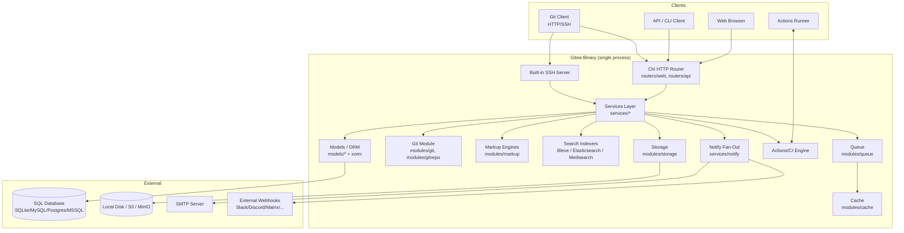
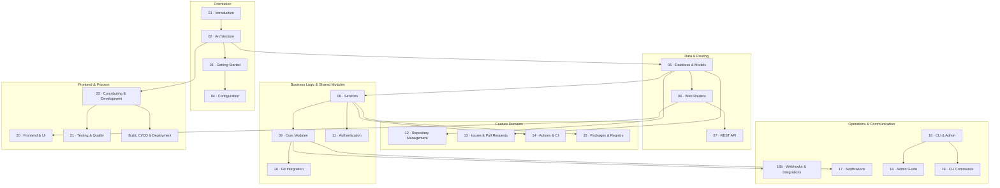

# Gitea Technical Documentation

Gitea is a lightweight, self-hosted Git service written in Go. It bundles a Git
HTTP/SSH server, a web UI, a REST API, a package registry supporting 22 ecosystems,
a built-in CI/CD system (Actions), issue tracking, pull requests, webhooks, and an
admin CLI — all inside a single static binary that can run against SQLite, MySQL,
PostgreSQL, or MSSQL.

This wiki documents Gitea's architecture, source-code layout, database models,
HTTP routing, REST API, internal services, package registry, CI/CD system,
frontend, and contributor workflow, based directly on the source in this
repository (`go-gitea/gitea`).

> **How this documentation was generated**
> This wiki was produced by systematically exploring the Gitea source tree —
> primarily `models/` (ORM entities and migrations), `modules/` (dependency-free
> shared libraries such as `git`, `markup`, `setting`, `storage`, `queue`, `cache`,
> `indexer`), `routers/` (HTTP route handlers for both the web UI and REST API),
> `services/` (business logic that orchestrates models and modules), `web_src/`
> (frontend JavaScript/Vue/CSS and the Vite build pipeline), and `tests/` (unit,
> integration, end-to-end, and fuzz test suites) — cross-referenced with the
> project's own contributor docs (`CONTRIBUTING.md`, `docs/*.md`) and configuration
> samples (`custom/conf/app.example.ini`). Every page links back to the concrete
> source files it describes so you can verify and go deeper.

## System Architecture at a Glance

## Documentation Map

The diagram below groups every numbered section by the architectural layer it documents, and
shows the primary cross-section reference relationships (not every link — see each section's own
"Where to Go Next" table for the complete set).

## Documentation Sections

| # | Section | Description |
|---|---------|-------------|
| 01 | [Introduction](01-introduction/README.md) | What Gitea is, history, features, project goals |
| 02 | [Architecture](02-architecture/README.md) | System architecture, request lifecycle, module dependency rules, deployment topologies |
| 03 | [Getting Started](03-getting-started/README.md) | Installing, building, configuring, and running Gitea |
| 04 | [Configuration](04-configuration/README.md) | `app.ini` settings reference |
| 05 | [Database & Models](05-database-models/README.md) | ORM entities, migrations, DB drivers, repository/user/issue domain model, supplementary models, fixtures |
| 06 | [Web Routers](06-web-routers/README.md) | HTTP routing layer for the server-rendered web UI, middleware chain, install/private routers, SSE & healthcheck |
| 07 | [REST API](07-rest-api/README.md) | Public REST API v1, conventions, Swagger, packages/Actions machine-to-machine API |
| 08 | [Services](08-services/README.md) | Business logic layer: auth, catalog of services packages (narrative + full 40-package inventory) |
| 09 | [Core Modules](09-core-modules/README.md) | Shared internal modules: git, markup, indexers, storage/queue/cache, notify/mailer/webhook, LFS/hooks, frontend build, full 85-package catalog |
| 10 | [Git Integration](10-git-integration/README.md) | Git backends & cat-file batch protocol, the `gitrepo` abstraction, and the push/hook sequence in depth |
| 11 | [Authentication](11-authentication/README.md) | Auth sources, authorization model, tokens & OAuth2 apps, two-factor & recovery |
| 12 | [Repository Management](12-repository-management/README.md) | Repository lifecycle (create/fork/mirror/transfer/delete), releases, wiki, projects |
| 13 | [Issues & Pull Requests](13-issues-pullrequests/README.md) | Issue tracking workflow, code review & comments, branch protection & merge |
| 14 | [Actions & CI](14-actions-ci/README.md) | Gitea Actions runner architecture and CI/CD workflows |
| 15 | [Packages & Registry](15-packages-registry/README.md) | Built-in package registry covering 22 ecosystems, protocol adapters |
| 16 | [CLI & Admin](16-cli-admin/README.md) | Command-line administration tooling, full command reference index, service management |
| 16b | [Webhooks & Integrations](16-webhooks-integrations/README.md) | Webhook delivery pipeline, event types & payloads, third-party integrations |
| 17 | [Notifications](17-notifications/README.md) | Notification delivery & UI notifications, email templates |
| 18 | [Admin Guide](18-admin-guide/README.md) | Admin panel & operations, backup/restore/doctor, monitoring & observability |
| 19 | [CLI Commands](19-cli-commands/README.md) | CLI subcommand reference (pointer to section 16) |
| 20 | [Frontend & UI](20-frontend-ui/README.md) | Go templates, JS/Vue components, `web_src/` directory map, asset pipeline |
| 21 | [Testing & Quality](21-testing-quality/README.md) | Unit, integration, e2e, and fuzz test strategy |
| 22 | [Contributing & Development](22-contributing-development/README.md) | Contribution workflow, coding conventions, AI policy, governance & security, issue/PR automation |

Additional standalone build/CI documentation lives under
[build-cicd-deployment/](build-cicd-deployment/README.md) (Makefile & build system,
Docker/packaging, GitHub Workflows).

## Section Contents

### 01 · [Introduction](01-introduction/README.md)
- [Introduction](01-introduction/README.md) — what Gitea is, history, features, feature-domain map, licensing/security

### 02 · [Architecture](02-architecture/README.md)
- [System Architecture](02-architecture/system-architecture.md)
- [Request Lifecycle](02-architecture/request-lifecycle.md)
- [Module Dependency Map](02-architecture/module-dependency-map.md)
- [Deployment Topologies](02-architecture/deployment-topologies.md)

### 03 · [Getting Started](03-getting-started/README.md)
- [Overview](03-getting-started/overview.md)
- [Installation and Build](03-getting-started/installation-and-build.md)
- [Configuration (`app.ini`)](03-getting-started/configuration-app-ini.md)
- [Running Gitea](03-getting-started/running-gitea.md)

### 04 · [Configuration](04-configuration/README.md)
- [Settings Catalog](04-configuration/settings-catalog.md)

### 05 · [Database & Models](05-database-models/README.md)
- [DB Engine and Drivers](05-database-models/db-engine-and-drivers.md)
- [Database Migrations](05-database-models/migrations.md)
- [Repository Model](05-database-models/repository-model.md)
- [Issues & Pull Requests Model](05-database-models/issues-and-pulls-model.md)
- [User & Organization Model](05-database-models/user-organization-model.md)
- [Permissions Model](05-database-models/permissions-model.md)
- [Supplementary Models](05-database-models/supplementary-models.md) — every remaining `models/*` package
- [Testing & Fixtures](05-database-models/testing-fixtures.md) — the fixture-based model test infrastructure

### 06 · [Web Routers](06-web-routers/README.md)
- [Route Organization](06-web-routers/route-organization.md)
- [Middleware Chain](06-web-routers/middleware-chain.md)
- [Web Router & Server-Rendered UI](06-web-routers/web-routes.md)
- [Install & Private Routers](06-web-routers/install-and-private.md)
- [Events & Healthcheck](06-web-routers/events-and-healthcheck.md)

### 07 · [REST API](07-rest-api/README.md)
- [REST API v1 Overview](07-rest-api/api-v1-overview.md)
- [API Conventions & Swagger](07-rest-api/api-conventions-and-swagger.md)
- [Packages & Actions API](07-rest-api/packages-and-actions-api.md)

### 08 · [Services](08-services/README.md)
- [Authentication & Authorization](08-services/auth-providers.md)
- [Services Catalog](08-services/services-catalog.md)
- [Services Catalog (Full)](08-services/services-catalog-full.md) — all 40 `services/*` subpackages

### 09 · [Core Modules](09-core-modules/README.md)
- [Modules Catalog (Full)](09-core-modules/modules-catalog-full.md) — all 85 `modules/*` packages
- [Git Module](09-core-modules/git-module.md)
- [Search & Indexing](09-core-modules/indexers.md)
- [Git LFS & Server-Side Hooks](09-core-modules/lfs-and-hooks.md)
- [Frontend Build Pipeline](09-core-modules/frontend-build.md)
- [Markup Rendering Engines](09-core-modules/markup-engines.md)
- [Storage, Queue & Caching](09-core-modules/storage-queue-cache.md)
- [Frontend Features & Islands of Interactivity](09-core-modules/frontend-features.md)
- [Notifications, Mailer & Webhooks](09-core-modules/notify-mailer-webhook.md)

### 10 · [Git Integration](10-git-integration/README.md)
- [Git Backends & Cat-File Batch Processes](10-git-integration/git-backends-and-catfile.md)
- [GitRepo & Repository Access](10-git-integration/gitrepo-and-repository-access.md)
- [Git Operations & Server-Side Hooks](10-git-integration/git-operations-and-hooks.md)
- Also see [Git Module](09-core-modules/git-module.md) and [Git LFS & Server-Side Hooks](09-core-modules/lfs-and-hooks.md) in Core Modules (canonical deep references)

### 11 · [Authentication](11-authentication/README.md)
- [Authentication Sources](11-authentication/auth-sources.md)
- [Authorization Model](11-authentication/authorization-model.md)
- [Access Tokens & OAuth2 Applications](11-authentication/tokens-and-oauth-apps.md)
- [Two-Factor Authentication & Account Recovery](11-authentication/two-factor-and-recovery.md)
- Also see [Authentication & Authorization](08-services/auth-providers.md) in Services (canonical deep reference)

### 12 · [Repository Management](12-repository-management/README.md)
- [Repository Lifecycle](12-repository-management/repository-lifecycle.md)
- [Releases, Wiki & Projects](12-repository-management/releases-wiki-projects.md)
- Also see [Repository Model](05-database-models/repository-model.md) in Database & Models

### 13 · [Issues & Pull Requests](13-issues-pullrequests/README.md)
- [Issue Tracking Workflow](13-issues-pullrequests/issue-tracking-workflow.md)
- [Code Review & Comments](13-issues-pullrequests/code-review-and-comments.md)
- [Branch Protection & Merge](13-issues-pullrequests/branch-protection-and-merge.md)
- Also see [Issues & Pull Requests Model](05-database-models/issues-and-pulls-model.md) in Database & Models

### 14 · [Actions & CI](14-actions-ci/README.md)
- [Actions Architecture](14-actions-ci/actions-architecture.md)

### 15 · [Packages & Registry](15-packages-registry/README.md)
- [Supported Ecosystems](15-packages-registry/supported-ecosystems.md)
- [Protocol Adapters](15-packages-registry/protocol-adapters.md)
- [Package Upload/Download Flow](15-packages-registry/package-flow.md)
- [Shared Infrastructure](15-packages-registry/shared-infrastructure.md)
- [Database Schema](15-packages-registry/database-schema.md)

### 16 · [CLI & Admin](16-cli-admin/README.md)
- [CLI & Admin Operations](16-cli-admin/cli-commands.md)
- [CLI Command Reference Index](16-cli-admin/cli-command-reference-index.md)
- [Running Gitea as a System Service](16-cli-admin/service-management.md)

### 16b · [Webhooks & Integrations](16-webhooks-integrations/README.md)
- [Webhook Delivery Pipeline](16-webhooks-integrations/webhook-delivery-pipeline.md)
- [Webhook Event Types & Payloads](16-webhooks-integrations/webhook-event-types-and-payloads.md)
- [Third-Party Integrations](16-webhooks-integrations/third-party-integrations.md)
- Also see [Notifications, Mailer & Webhooks](09-core-modules/notify-mailer-webhook.md) in Core Modules

### 17 · [Notifications](17-notifications/README.md)
- [Notification Delivery & UI Notifications](17-notifications/notification-delivery-and-uinotification.md)
- [Email Notification Templates](17-notifications/email-notification-templates.md)
- Also see [Notifications, Mailer & Webhooks](09-core-modules/notify-mailer-webhook.md) in Core Modules

### 18 · [Admin Guide](18-admin-guide/README.md)
- [Admin Panel & Operations](18-admin-guide/admin-panel-and-operations.md)
- [Backup, Restore & Doctor](18-admin-guide/backup-restore-and-doctor.md)
- [Monitoring & Observability](18-admin-guide/monitoring-and-observability.md)

### 19 · [CLI Commands](19-cli-commands/README.md)
- Covered by [CLI & Admin Operations](16-cli-admin/cli-commands.md) and [CLI Command Reference Index](16-cli-admin/cli-command-reference-index.md) in section 16

### 20 · [Frontend & UI](20-frontend-ui/README.md)
- [Go Templates & Views](20-frontend-ui/go-templates.md)
- [`web_src/` Directory Map](20-frontend-ui/web_src-directory-map.md)
- Related: [Frontend Build Pipeline](09-core-modules/frontend-build.md), [Frontend Features](09-core-modules/frontend-features.md)

### 21 · [Testing & Quality](21-testing-quality/README.md)
- [Unit, Integration, E2E & Fuzz Testing](21-testing-quality/unit-integration-e2e-fuzz.md)

### 22 · [Contributing & Development](22-contributing-development/README.md)
- [Contribution Workflow & Governance](22-contributing-development/contribution-workflow.md)
- [AI-Assisted Contributions](22-contributing-development/ai-assisted-contributions.md)
- [Backend Coding Conventions](22-contributing-development/backend-coding-conventions.md)
- [Frontend Coding Conventions](22-contributing-development/frontend-coding-conventions.md)
- [Governance & Security](22-contributing-development/governance-and-security.md)
- [Issue & PR Templates and Automation](22-contributing-development/issue-pr-templates-and-automation.md)

### Build, CI/CD & Deployment
- [Makefile & Build System](build-cicd-deployment/makefile-and-build.md)
- [Docker & Packaging](build-cicd-deployment/docker-and-packaging.md)
- [GitHub Workflows & Actions](build-cicd-deployment/github-workflows.md)

### Original Contributor Docs (carried over from the source repository's `docs/` folder)

These files pre-date this wiki and are referenced by [Contributing & Development](22-contributing-development/contribution-workflow.md):

- [Setup and requirements](build-setup.md)
- [Development workflow](development.md)
- [Build from source](build-source.md)
- [Testing](testing.md)
- [Backend development guidelines](guidelines-backend.md)
- [Frontend development guidelines](guidelines-frontend.md)
- [Refactoring guidelines](guidelines-refactoring.md)
- [Release management](release-management.md)
- [Community governance and review process](community-governance.md)

## How to Use This Wiki

- Start with [Introduction](01-introduction/README.md) if you are new to Gitea, then
  [Getting Started](03-getting-started/README.md) to install and run it locally.
- Read [Architecture](02-architecture/README.md) for the big picture before diving into
  any specific subsystem.
- Use the numbered sections in the left sidebar to jump directly to a subsystem
  (database, routers, API, services, core modules, packages, actions, etc.).
- Sections 10–19 that started as thin landing pages now carry their own dedicated,
  topic-focused pages (git internals, auth sources, repository lifecycle, issue/PR
  workflow, webhooks, notifications, admin operations, CLI reference) in addition to
  linking back to the deeper narrative coverage in **08 · Services**, **09 · Core
  Modules**, and **05 · Database & Models** where that coverage remains canonical —
  see each section's own README for the full page list and cross-links.
- [Contributing & Development](22-contributing-development/README.md) is the entry point
  for anyone planning to submit code back to the project.

> **Note on section relationships:** A handful of numbered sections deliberately avoid
> duplicating content that is already documented exhaustively elsewhere: **19 · CLI
> Commands** points to the CLI reference in **16 · CLI & Admin** rather than repeating
> it, and several 10–17 pages cross-link back to **08 · Services** / **09 · Core
> Modules** for the deepest technical reference on a shared topic (e.g., Git internals,
> auth providers, the notify/webhook fan-out). Each section's README explains exactly
> which pages are original to that section and which are pointers, so you always know
> where the authoritative version of a given explanation lives.
