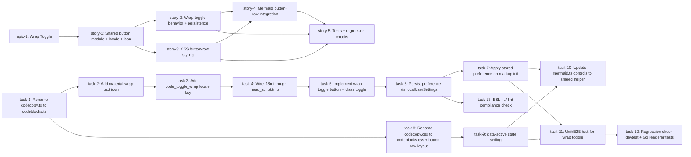

# JIRA Plan — PSMA-NEW: Wrap-Text Toggle for Markdown Inline Code Blocks

> Source: [go-gitea/gitea#35314](https://github.com/go-gitea/gitea/issues/35314) · Prior art: draft PR [go-gitea/gitea#35529](https://github.com/go-gitea/gitea/pull/35529)

## Dependency overview

| Issue | Depends on | Reason |
|-------|------------|--------|
| story-1 | epic-1 | Story belongs to the epic |
| story-2 | story-1 | Wrap-toggle behavior needs the shared button module, icon, and locale key to exist first |
| story-3 | story-1 | CSS button-row styling needs the renamed module structure (`codeblocks.ts`) to target the right class names |
| story-4 | story-2, story-3 | Mermaid integration needs both the working toggle behavior and its final CSS styling before it can reuse the helper |
| story-5 | story-2, story-3, story-4 | Tests validate the fully assembled feature, including Mermaid |
| task-1 | (none) | First step: rename module before any new code is added to it |
| task-2 | task-1 | New icon import added into the renamed module's SVG registration |
| task-3 | task-2 | Locale key added alongside icon so the button can reference both |
| task-4 | task-3 | `head_script.tmpl` needs the locale key to exist before exposing it via `window.config.i18n` |
| task-5 | task-4 | Button click behavior needs the i18n string wired for its label/tooltip |
| task-6 | task-5 | Persistence wraps the toggle behavior once the click handler exists |
| task-7 | task-6 | Applying stored preference on init needs the persistence read/write API in place |
| task-8 | task-1 | CSS rename follows the JS module rename to keep names aligned |
| task-9 | task-8 | Active/inactive button styling builds on the renamed CSS file |
| task-10 | task-7, task-9 | Mermaid's own control buttons switch to the shared helper only once both behavior (task-7) and styling (task-9) are finalized |
| task-11 | task-7, task-9 | Toggle + persistence + styling must exist before they can be tested |
| task-12 | task-11 | Regression checks (devtest template, Go renderer tests) run after the primary feature test passes |
| task-13 | task-6 | Lint compliance check runs once the `localUserSettings` persistence code (the ESLint-sensitive part) is written |

## Epic

- **Ref**: epic-1
- **Summary**: Add wrap-text toggle to Markdown inline code blocks
- **Depends on**: (none)
- **Description**: Implements go-gitea/gitea#35314. Adds a client-side "Toggle code wrap" button next to the existing copy-code button on every rendered Markdown code block, using the already-shipped `.code-overflow-wrap`/`.code-overflow-scroll` CSS classes, with a `localUserSettings`-backed persisted preference.

## Stories

### story-1: Shared code-block-button module, icon, and locale key
- **Summary**: Refactor `codecopy.ts` into a shared button-row module and add the new icon + locale string needed by the wrap toggle
- **Depends on**: (none — first story, only depends on epic)
- **Code touchpoints**: `web_src/js/markup/codecopy.ts` → `web_src/js/markup/codeblocks.ts`; `public/assets/img/svg/material-wrap-text.svg`; `web_src/svg/material-wrap-text.svg`; `web_src/js/svg.ts`; `options/locale/locale_en-US.json`; `templates/base/head_script.tmpl`
- **Acceptance criteria**: `makeCodeBlockButton()` helper exported and used by the existing copy button with no behavior change; new icon renders via `svg('material-wrap-text')`; `window.config.i18n.code_toggle_wrap` resolves to the new locale string.

#### Tasks
- **task-1**: Rename `web_src/js/markup/codecopy.ts` → `codeblocks.ts`, generalize `makeCodeCopyButton` into `makeCodeBlockButton`, update import in `web_src/js/markup/content.ts` | **Depends on**: (none) | `web_src/js/markup/codecopy.ts`, `web_src/js/markup/content.ts`
- **task-2**: Add `material-wrap-text.svg` under `public/assets/img/svg/` and `web_src/svg/`, register in `web_src/js/svg.ts` alongside existing `octicon-copy` entry | **Depends on**: task-1 | `web_src/js/svg.ts`
- **task-3**: Add `code_toggle_wrap` key to `options/locale/locale_en-US.json` near `copy_success` | **Depends on**: task-2 | `options/locale/locale_en-US.json`
- **task-4**: Expose `code_toggle_wrap` via `window.config.i18n` in `templates/base/head_script.tmpl` (pattern: `copy_success: {{ctx.Locale.Tr "copy_success"}}`) | **Depends on**: task-3 | `templates/base/head_script.tmpl`

### story-2: Wrap-toggle click behavior and persistence
- **Summary**: Implement the click handler that toggles `.code-overflow-wrap`/`.code-overflow-scroll` and persists the preference via `localUserSettings`
- **Depends on**: story-1
- **Code touchpoints**: `web_src/js/markup/codeblocks.ts`; `web_src/js/modules/user-settings.ts`; `web_src/js/markup/content.ts`
- **Acceptance criteria**: Clicking the button toggles classes on the closest `.code-block-container` with no page reload; preference persists across reload via `localUserSettings.getBoolean/setBoolean` (no raw `localStorage` calls).

#### Tasks
- **task-5**: Implement the wrap-toggle `<button>` and its click handler (class toggle on `.code-block-container`) in `codeblocks.ts`, wired via `content.ts`'s `initMarkupContent()` | **Depends on**: task-4 | `web_src/js/markup/codeblocks.ts`, `web_src/js/markup/content.ts`
- **task-6**: Persist the toggle state using `localUserSettings.getBoolean('wrap-markup-code')` / `setBoolean(...)` (replacing PR #35529's raw `localStorage` prototype) | **Depends on**: task-5 | `web_src/js/modules/user-settings.ts`, `web_src/js/markup/codeblocks.ts`
- **task-7**: On `initMarkupContent()` fan-out, read the stored preference and pre-apply the correct class to avoid flash-of-wrong-state | **Depends on**: task-6 | `web_src/js/markup/content.ts`

### story-3: Button-row CSS styling
- **Summary**: Rename/extend the copy-button CSS into a shared button-row stylesheet with active/inactive state styling
- **Depends on**: story-1
- **Code touchpoints**: `web_src/css/markup/codecopy.css` → `codeblocks.css`; `web_src/css/markup/content.css` (line 532, `.auto-hide-control` hover rule)
- **Acceptance criteria**: Copy and wrap buttons render in a consistent flex row; hover-to-reveal (`auto-hide-control`) behavior unchanged; toggle button visually indicates active/inactive wrap state.

#### Tasks
- **task-8**: Rename `web_src/css/markup/codecopy.css` → `codeblocks.css`, add `.code-block-buttons` flex container rules | **Depends on**: task-1 | `web_src/css/markup/codecopy.css`
- **task-9**: Add `[data-active="true"|"false"]` button state styling for the wrap toggle | **Depends on**: task-8 | `web_src/css/markup/codeblocks.css`

### story-4: Mermaid button-row integration
- **Summary**: Update Mermaid's own control buttons to use the shared button-row helper/styling for visual consistency
- **Depends on**: story-2, story-3
- **Code touchpoints**: `web_src/js/markup/mermaid.ts` (lines ~206–210)
- **Acceptance criteria**: Mermaid zoom-in/reset/zoom-out buttons render with the shared button styling; no change to pan/zoom/reset behavior.

#### Tasks
- **task-10**: Update `mermaid.ts` control button markup/creation to call the shared `makeCodeBlockButton()` helper from `codeblocks.ts` | **Depends on**: task-7, task-9 | `web_src/js/markup/mermaid.ts`

### story-5: Tests and regression validation
- **Summary**: Add/execute tests covering the new toggle and verify no regressions in existing code-block rendering
- **Depends on**: story-2, story-3, story-4
- **Code touchpoints**: frontend test (new, e.g. `web_src/js/markup/codeblocks.test.ts`), `modules/markup/markdown/markdown_test.go`, `templates/devtest/markup-render.tmpl`
- **Acceptance criteria**: All acceptance criteria in the PRD (§15) pass; ESLint restricted-globals check passes; `markdown_test.go:611` assertion on `code-overflow-scroll` output remains valid (server-side default unchanged); devtest page still renders both static wrap states correctly.

#### Tasks
- **task-11**: Add unit/E2E test for wrap-toggle click behavior and persistence | **Depends on**: task-7, task-9 | new test file under `web_src/js/markup/`
- **task-12**: Run regression check against `templates/devtest/markup-render.tmpl` and `modules/markup/markdown/markdown_test.go` to confirm server-side output and static demo page are unaffected | **Depends on**: task-11 | `templates/devtest/markup-render.tmpl`, `modules/markup/markdown/markdown_test.go`
- **task-13**: Run ESLint (`no-restricted-globals`) to confirm no raw `localStorage` usage was introduced | **Depends on**: task-6 | project-wide lint config (`tools/eslint-rules`)
